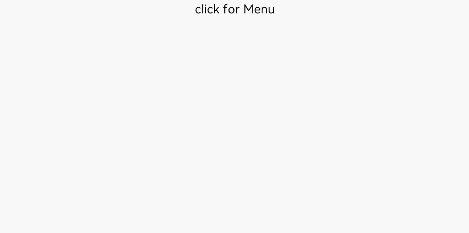
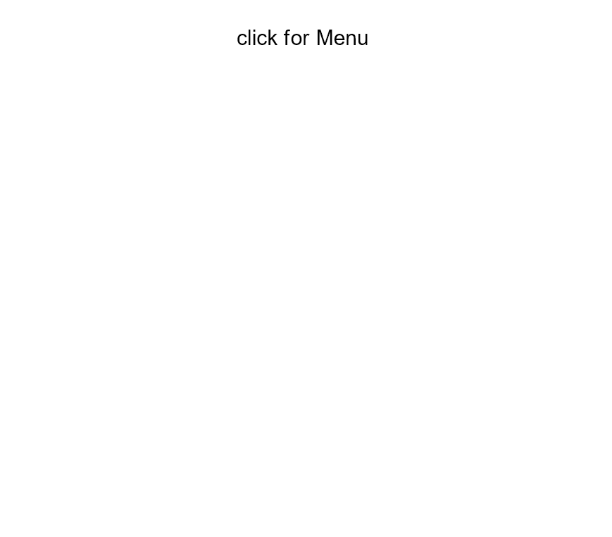

# Menu控制<a name="ZH-CN_TOPIC_0000001237715095"></a>

> **说明：** 
>从API Version 7开始支持。后续版本如有新增内容，则采用上角标单独标记该内容的起始版本。

## 权限列表<a name="section781125411508"></a>

无

## 属性<a name="section6820191711316"></a>

<table><thead align="left"><tr><th class="cellrowborder" valign="top" width="15.17%" id="mcps1.1.5.1.1"><p>名称</p>
</th>
<th class="cellrowborder" valign="top" width="19.950000000000003%" id="mcps1.1.5.1.2"><p>参数类型</p>
</th>
<th class="cellrowborder" valign="top" width="8.709999999999999%" id="mcps1.1.5.1.3"><p>默认值</p>
</th>
<th class="cellrowborder" valign="top" width="56.169999999999995%" id="mcps1.1.5.1.4"><p>描述</p>
</th>
</tr>
</thead>
<tbody><tr><td class="cellrowborder" valign="top" width="15.17%" headers="mcps1.1.5.1.1 "><p>bindMenu</p>
</td>
<td class="cellrowborder" valign="top" width="19.950000000000003%" headers="mcps1.1.5.1.2 "><p>Array&lt;<a href="#li430441812114">MenuItem</a>&gt; | <a href="../../toctopics/zh-cn_topic_0000001237475069.md#section2538145016250">CustomBuilder</a><sup><span>8+</span></sup></p>
</td>
<td class="cellrowborder" valign="top" width="8.709999999999999%" headers="mcps1.1.5.1.3 "><p>-</p>
</td>
<td class="cellrowborder" valign="top" width="56.169999999999995%" headers="mcps1.1.5.1.4 "><p>给组件绑定菜单，点击后弹出菜单。弹出菜单项支持文本和自定义两种功能。</p>
</td>
</tr>
</tbody>
</table>

-   <a name="li430441812114"></a>MenuItem

    <table><thead align="left"><tr><th class="cellrowborder" valign="top" width="12.379999999999999%" id="mcps1.1.4.1.1"><p>名称</p>
    </th>
    <th class="cellrowborder" valign="top" width="16.189999999999998%" id="mcps1.1.4.1.2"><p>类型</p>
    </th>
    <th class="cellrowborder" valign="top" width="71.43%" id="mcps1.1.4.1.3"><p>描述</p>
    </th>
    </tr>
    </thead>
    <tbody><tr><td class="cellrowborder" valign="top" width="12.379999999999999%" headers="mcps1.1.4.1.1 "><p>value</p>
    </td>
    <td class="cellrowborder" valign="top" width="16.189999999999998%" headers="mcps1.1.4.1.2 "><p>string</p>
    </td>
    <td class="cellrowborder" valign="top" width="71.43%" headers="mcps1.1.4.1.3 "><p>菜单项文本。</p>
    </td>
    </tr>
    <tr><td class="cellrowborder" valign="top" width="12.379999999999999%" headers="mcps1.1.4.1.1 "><p>action</p>
    </td>
    <td class="cellrowborder" valign="top" width="16.189999999999998%" headers="mcps1.1.4.1.2 "><p>() =&gt; void</p>
    </td>
    <td class="cellrowborder" valign="top" width="71.43%" headers="mcps1.1.4.1.3 "><p>点击菜单项的事件回调。</p>
    </td>
    </tr>
    </tbody>
    </table>


## 示例<a name="section3505155091512"></a>

```
@Entry
@Component
struct MenuExample {
  build() {
    Column() {
      Text('click for Menu')
    }
    .width('100%')
    .margin({ top: 5 })
    .bindMenu([
      {
        value: 'Menu1',
        action: () => {
          console.info('handle Menu1 select')
        }
      },
      {
        value: 'Menu2',
        action: () => {
          console.info('handle Menu2 select')
        }
      },
    ])
  }
}
```



```
import router from '@system.router';

@Entry
@Component
struct MenuExample {
  @Builder MenuBuilder() {
    Flex({ direction: FlexDirection.Column, justifyContent: FlexAlign.Center, alignItems: ItemAlign.Center }) {
      Text('text1')
        .fontSize(20)
        .width(100)
        .height(50)
        .textAlign(TextAlign.Center)

      Divider().height(10)

      Text('text2')
        .fontSize(20)
        .width(100)
        .height(50)
        .textAlign(TextAlign.Center)

      Divider().height(10)

      Button('Next')
        .fontSize(20)
        .width(100)
        .height(50)
        .onClick(() => {
          router.push({ uri: 'pages/details' })
        })

    }.width(100)
  }

  build() {
    Column() {
      Text('click for menu')
    }
    .width('100%')
    .margin({ top: 5 })
    .bindMenu(this.MenuBuilder)
  }
}
```



