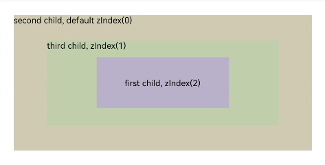

# Z序控制<a name="ZH-CN_TOPIC_0000001237475083"></a>

> **说明：** 
>从API Version 7开始支持。后续版本如有新增内容，则采用上角标单独标记该内容的起始版本。

## 权限列表<a name="section781125411508"></a>

无

## 属性<a name="section6820191711316"></a>

<table><thead align="left"><tr><th class="cellrowborder" valign="top" width="15.120000000000001%" id="mcps1.1.5.1.1"><p>名称</p>
</th>
<th class="cellrowborder" valign="top" width="14.829999999999998%" id="mcps1.1.5.1.2"><p>参数类型</p>
</th>
<th class="cellrowborder" valign="top" width="11.39%" id="mcps1.1.5.1.3"><p>默认值</p>
</th>
<th class="cellrowborder" valign="top" width="58.660000000000004%" id="mcps1.1.5.1.4"><p>描述</p>
</th>
</tr>
</thead>
<tbody><tr><td class="cellrowborder" valign="top" width="15.120000000000001%" headers="mcps1.1.5.1.1 "><p>zIndex</p>
</td>
<td class="cellrowborder" valign="top" width="14.829999999999998%" headers="mcps1.1.5.1.2 "><p>number</p>
</td>
<td class="cellrowborder" valign="top" width="11.39%" headers="mcps1.1.5.1.3 "><p>0</p>
</td>
<td class="cellrowborder" valign="top" width="58.660000000000004%" headers="mcps1.1.5.1.4 "><p>同一容器中兄弟组件显示层级关系，z值越大，显示层级越高。</p>
</td>
</tr>
</tbody>
</table>

## 示例<a name="section4278134412416"></a>

```
@Entry
@Component
struct ZIndexExample {
  build() {
    Column() {
      Stack() {
        // stack会重叠组件, 默认后定义的在最上面
        Text('first child, zIndex(2)')
          .size({width: '40%', height: '30%'}).backgroundColor(0xbbb2cb)
          .zIndex(2)
        // 默认值0
        Text('second child, default zIndex(0)')
          .size({width: '90%', height: '80%'}).backgroundColor(0xd2cab3).align(Alignment.TopStart)
        Text('third child, zIndex(1)')
          .size({width: '70%', height: '50%'}).backgroundColor(0xc1cbac).align(Alignment.TopStart)
          .zIndex(1)
      }
    }.width('100%').height(200)
  }
}
```



