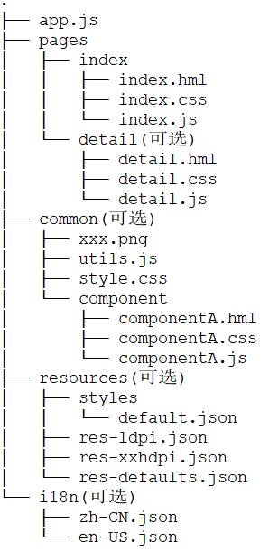

# 文件组织

## 目录结构

JS FA应用的JS模块(entry/src/main/js/module)的典型开发目录结构如下：

**图1** 目录结构

**图2** 多实例资源共享目录结构

目录结构中文件分类如下：

- .hml结尾的HML模板文件，这个文件用来描述当前页面的文件布局结构。

- .css结尾的CSS样式文件，这个文件用于描述页面样式。

- .js结尾的JS文件，这个文件用于处理页面和用户的交互。

各个文件夹的作用：

- app.js文件用于全局JavaScript逻辑和应用生命周期管理，详见[app.js](../ui/js-framework-js-file.md)说明。

- pages目录用于存放所有组件页面。

- common目录用于存放公共资源文件，比如：媒体资源，自定义组件和JS文件。

- resources目录用于存放资源配置文件，比如：多分辨率加载等配置文件，详见[资源限定与访问](../ui/js-framework-resource-restriction.md)章节。

- share目录用于配置多个实例共享的资源内容，比如：share中的图片和JSON文件可被default1和default2实例共享。

>  **说明：**
> - i18n和resources是开发保留文件夹，不可重命名。
>
> 
> - 如果share目录中的资源和实例(default)中的资源文件同名且目录一致时，实例中资源的优先级高于share中资源的优先级。
>
> 
> - share目录当前不支持i18n。
> 
> - 在使用DevEco Studio进行应用开发时，目录结构中的可选文件夹需要开发者根据实际情况自行创建。

## 文件访问规则

应用资源可通过绝对路径或相对路径的方式进行访问，本开发框架中绝对路径以"/"开头，相对路径以"./"或"../"。具体访问规则如下：

- 引用代码文件，推荐使用相对路径，比如：../common/utils.js。

- 引用资源文件，推荐使用绝对路径。比如：/common/xxx.png。

- 公共代码文件和资源文件推荐放在common下，通过以上两条规则进行访问。

- CSS样式文件中通过url()函数创建&lt;url&gt;数据类型，如：url(/common/xxx.png)。

>  **说明：**
> 当代码文件A需要引用代码文件B时：
> 
> - 如果代码文件A和文件B位于同一目录，则代码文件B引用资源文件时可使用相对路径，也可使用绝对路径。
> 
> - 如果代码文件A和文件B位于不同目录，则代码文件B引用资源文件时必须使用绝对路径。因为Webpack打包时，代码文件B的目录会发生变化。
>
> 
> - 在js文件中通过数据绑定的方式指定资源文件路径时，必须使用绝对路径。

## 媒体文件格式

**表1** 支持的图片格式

| 格式 | 支持的文件类型 |
| -------- | -------- |
| BMP | .bmp |
| GIF | .gif |
| JPEG | .jpg |
| PNG | .png |
| WebP | .webp |

**表2** 支持的视频格式

| 格式 | 支持的文件类型 |
| -------- | -------- |
| H.264&nbsp;AVC Baseline&nbsp;Profile&nbsp;(BP) | .3gp .mp4 |
