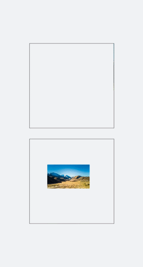

# background-position样式动画<a name="ZH-CN_TOPIC_0000001172006248"></a>

通过改变background-position属性（第一个值为X轴的位置，第二个值为Y轴的位置）移动背景图片位置，若背景图位置超出组件则超出部分的背景图不显示。

```
<!-- xxx.hml -->
<div class="container">
  <div class="content"></div>
  <div class="content1"></div>
</div>
```

```
/* xxx.css */
.container {
  background-color:#F1F3F5;
  display: flex;
  flex-direction: column;
  justify-content: center;
  align-items: center;
  width: 100%;
}
.content{
  width: 400px;
  height: 400px;
  background-image: url('common/images/bg-tv.jpg');
  background-size: 100%;
  background-repeat: no-repeat;
  animation: change 3s infinite;
  border: 1px solid black;
}
.content1{
  margin-top:50px;
  width: 400px;
  height: 400px;
  background-image: url('common/images/bg-tv.jpg');
  background-size: 50%;
  background-repeat: no-repeat;
  animation: change1 5s infinite;
  border: 1px solid black;
}
/* 背景图片移动出组件 */
@keyframes change{
  0%{
    background-position:0px top;
  }
  25%{
    background-position:400px top;
  }
  50%{
    background-position:0px top;
  }
  75%{
    background-position:0px bottom;
  }
  100%{
    background-position:0px top;
  }
}
/* 背景图片在组件内移动 */
@keyframes change1{
  0%{
    background-position:left top;
  }
  25%{
    background-position:50% 50%;
  }
  50%{
    background-position:right bottom;
  }
  100%{
    background-position:left top;;
  }
}
```



>  **说明：**
>background-position仅支持背景图片的移动，不支持背景颜色（background-color)。

