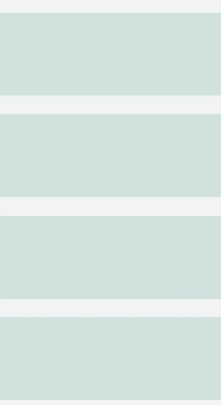
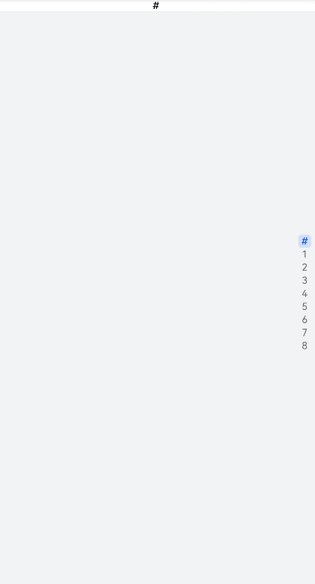
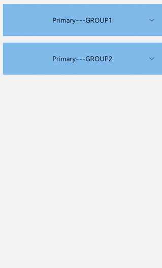

# List

List是用来显示列表的组件，包含一系列相同宽度的列表项，适合连续、多行地呈现同类数据。具体用法请参考[List API](../reference/arkui-js/js-components-container-list.md)。


## 创建List组件

在pages/index目录下的hml文件中创建一个List组件。

```
<!-- index.hml --><div class="container"> <list>    <list-item class="listItem"></list-item>   <list-item class="listItem"></list-item>   <list-item class="listItem"></list-item>   <list-item class="listItem"></list-item> </list></div>
```

```
/* xxx.css */
.container {
  flex-direction: column;
  align-items: center;
  background-color: #F1F3F5;
}
.listItem{
  height: 20%;
  background-color:#d2e0e0;
  margin-top: 20px;
}
```



>  **说明：**
> - &lt;list-item-group&gt;是&lt;list&gt;的子组件，实现列表分组功能，不能再嵌套&lt;list&gt;，可以嵌套&lt;list-item&gt;。
> 
> - &lt;list-item&gt;是&lt;list&gt;的子组件，展示列表的具体项。


## 添加滚动条

设置scrollbar属性为on即可在屏幕右侧生成滚动条，实现长列表或者屏幕滚动等效果。

```
<!-- index.hml --><div class="container">  <list class="listCss" scrollbar="on" >    <list-item class="listItem"></list-item>    <list-item class="listItem"></list-item>    <list-item class="listItem"></list-item>    <list-item class="listItem"></list-item>    <list-item class="listItem"></list-item>    <list-item class="listItem"></list-item> </list></div>
```

```
/* index.css */
.container {
  flex-direction: column;
  background-color: #F1F3F5;
}
.listItem{
  height: 20%;
  background-color:#d2e0e0;
  margin-top: 20px;
}
.listCss{
  height: 100%;
  scrollbar-color: #8e8b8b;
  scrollbar-width: 50px;
}
```


## 添加侧边索引栏

设置indexer属性为自定义索引时，索引栏会显示在列表右边界处，indexer属性设置为true,默认为字母索引表。

```
<!-- index.hml --><div class="container">   <list class="listCss"  indexer="{{['#','1','2','3','4','5','6','7','8']}}" >      <list-item class="listItem"  section="#" ></list-item>     </list></div>
```

```
/* index.css */.container{  flex-direction: column;
  background-color: #F1F3F5;
 } .listCss{  height: 100%;      flex-direction: column;  columns: 1}
```



>  **说明：**
> - indexer属性生效需要flex-direction属性配合设置为column，且columns属性设置为1。
> 
> - indexer可以自定义索引表，自定义时"\#"必须要存在。


## 实现列表折叠和展开

为List组件添加groupcollapse和groupexpand事件实现列表的折叠和展开。

```
<!-- index.hml -->
<div class="doc-page">
  <list style="width: 100%;" id="mylist">
    <list-item-group for="listgroup in list" id="{{listgroup.value}}" ongroupcollapse="collapse" ongroupexpand="expand">
      <list-item type="item" style="background-color:#FFF0F5;height:95px;">
        <div class="item-group-child">
          <text>One---{{listgroup.value}}</text>
        </div>
      </list-item>
      <list-item type="item" style="background-color: #87CEFA;height:145px;" primary="true">
        <div class="item-group-child">
          <text>Primary---{{listgroup.value}}</text>
        </div>
      </list-item>
    </list-item-group>
  </list>
</div>
```

```
/* index.css */
.doc-page {
  flex-direction: column;
  background-color: #F1F3F5;
}
list-item{
margin-top:30px;
}
.top-list-item {
  width:100%;
  background-color:#D4F2E7;
}
.item-group-child {
  justify-content: center;
  align-items: center;
  width:100%;
}
```

```
// xxx.js
import prompt from '@system.prompt';
export default {
  data: {
    direction: 'column',
    list: []
  },
  onInit() {
    this.list = []
    this.listAdd = []
    for (var i = 1; i <= 2; i++) {
      var dataItem = {
        value: 'GROUP' + i,
      };
        this.list.push(dataItem);
    }
  },
  collapse(e) {
    prompt.showToast({
      message: 'Close ' + e.groupid
    })
  },
  expand(e) {
    prompt.showToast({
    message: 'Open ' + e.groupid
    })
  }
}
```



>  **说明：**
> - groupcollapse和groupexpand事件仅支持list-item-group组件使用。


## 场景示例


在本场景中，开发者可以根据字母索引表查找对应联系人。


```
<!-- index.hml -->
```


```
<div class="doc-page"> 
  <text style="font-size: 35px; font-weight: 500; text-align: center; margin-top: 20px; margin-bottom: 20px;"> 
      <span>Contacts</span> 
  </text> 
  <list class="list" indexer="true"> 
    <list-item class="item" for="{{namelist}}" type="{{$item.section}}" section="{{$item.section}}"> 
      <div class="container"> 
        <div class="in-container"> 
          <text class="name">{{$item.name}}</text> 
          <text class="phone">18888888888</text> 
        </div> 
      </div> 
    </list-item> 
    <list-item type="end" class="item"> 
      <div style="align-items:center;justify-content:center;width:750px;"> 
        <text style="text-align: center;">Total: 10</text> 
      </div> 
    </list-item> 
  </list> 
</div>
```


```
/* index.css */
.doc-page {
  flex-direction: column;
  background-color: #F1F3F5;
}
.list {
  width: 100%;
  height: 100%;
}
.item {
  height: 120px;
  padding-left: 10%;
  border-top: 1px solid #dcdcdc;
}
.name {
  color: #000000;
  font-size: 39px;
}
.phone {
  color: black;
  font-size: 25px;
}
.container {
  flex-direction: row;
  align-items: center;
}
.in-container {
  flex-direction: column;
  justify-content: space-around;
}
```


```
// xxx.js
export default { 
   data: { 
     namelist:[{ 
       name: 'Zoey', 
       section:'Z' 
     },{ 
       name: 'Quin', 
       section:'Q' 
     },{ 
       name:'Sam', 
       section:'S' 
     },{ 
       name:'Leo', 
       section:'L' 
     },{ 
       name:'Zach', 
       section:'Z' 
     },{ 
       name:'Wade', 
       section:'W' 
     },{ 
       name:'Zoe', 
       section:'Z' 
     },{ 
        name:'Warren', 
        section:'W' 
     },{ 
        name:'Kyle', 
        section:'K' 
     },{ 
       name:'Zaneta', 
       section:'Z' 
     }] 
   }, 
   onInit() { 
   } 
 }
```


