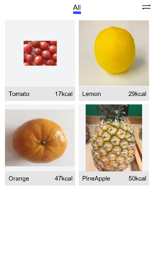
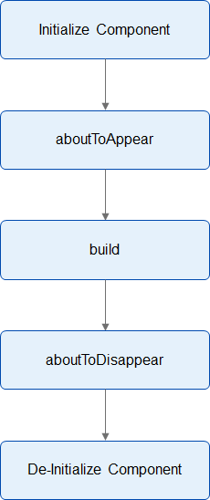
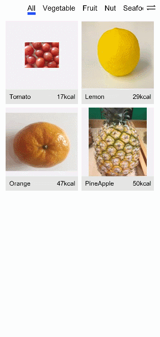

# 构建食物分类Grid布局

健康饮食应用在主页提供给用户两种食物显示方式：列表显示和网格显示。开发者将实现通过页签切换不同食物分类的网格布局。


1. 将Category枚举类型引入FoodCategoryList页面。
   ```
   import { Category, FoodData } from '../model/FoodData'
   ```

2. 创建FoodCategoryList和FoodCategory组件，其中FoodCategoryList作为新的页面入口组件，在入口组件调用initializeOnStartup方法。
   ```
   @Component
   struct FoodList {
     private foodItems: FoodData[]
     build() {
       ......
     }
   }
   
   @Component
   struct FoodCategory {
     private foodItems: FoodData[]
     build() {
       ......
     }
   }
   
   @Entry
   @Component
   struct FoodCategoryList {
     private foodItems: FoodData[] = initializeOnStartup()
     build() {
       ......
     }
   }
   ```

3. 在FoodCategoryList组件内创建showList成员变量，用于控制List布局和Grid布局的渲染切换。需要用到条件渲染语句if...else...。
   ```
   @Entry
   @Component
   struct FoodCategoryList {
     private foodItems: FoodData[] = initializeOnStartup()
     private showList: boolean = false
   
     build() {
       Stack() {
         if (this.showList) {
           FoodList({ foodItems: this.foodItems })
         } else {
           FoodCategory({ foodItems: this.foodItems })
         }
       }
     }
   }
   ```

4. 在页面右上角创建切换List/Grid布局的图标。设置Stack对齐方式为顶部尾部对齐TopEnd，创建Image组件，设置其点击事件，即showList取反。
   ```
   @Entry
   @Component
   struct FoodCategoryList {
     private foodItems: FoodData[] = initializeOnStartup()
     private showList: boolean = false
   
     build() {
       Stack({ alignContent: Alignment.TopEnd }) {
         if (this.showList) {
           FoodList({ foodItems: this.foodItems })
         } else {
           FoodCategory({ foodItems: this.foodItems })
         }
         Image($r('app.media.Switch'))
           .height(24)
           .width(24)
           .margin({ top: 15, right: 10 })
           .onClick(() => {
           this.showList = !this.showList
         })
       }.height('100%')
     }
   }
   ```

5. 添加\@State装饰器。点击右上角的switch标签后，页面没有任何变化，这是因为showList不是有状态数据，它的改变不会触发页面的刷新。需要为其添加\@State装饰器，使其成为状态数据，它的改变会引起其所在组件的重新渲染。
   ```
   @Entry
   @Component
   struct FoodCategoryList {
     private foodItems: FoodData[] = initializeOnStartup()
     @State private showList: boolean = false
   
     build() {
       Stack({ alignContent: Alignment.TopEnd }) {
         if (this.showList) {
           FoodList({ foodItems: this.foodItems })
         } else {
           FoodCategory({ foodItems: this.foodItems })
         }
         Image($r('app.media.Switch'))
           .height(24)
           .width(24)
           .margin({ top: 15, right: 10 })
           .onClick(() => {
           this.showList = !this.showList
         })
       }.height('100%')
     }
   }
   
   ```

   点击切换图标，FoodList组件出现，再次点击，FoodList组件消失。

   

6. 创建显示所有食物的页签（All）。在FoodCategory组件内创建Tabs组件和其子组件TabContent，设置tabBar为All。设置TabBars的宽度为280，布局模式为Scrollable，即超过总长度后可以滑动。Tabs是一种可以通过页签进行内容视图切换的容器组件，每个页签对应一个内容视图TabContent。
   ```
   @Component
   struct FoodCategory {
     private foodItems: FoodData[]
     build() {
       Stack() {
         Tabs() {
           TabContent() {}.tabBar('All')
         }
         .barWidth(280)
         .barMode(BarMode.Scrollable)
       }
     }
   }
   ```

   

7. 创建FoodGrid组件，作为TabContent的子组件。
   ```
   @Component
   struct FoodGrid {
     private foodItems: FoodData[]
     build() {}
   }
   
   @Component
   struct FoodCategory {
     private foodItems: FoodData[]
     build() {
       Stack() {
         Tabs() {
           TabContent() {
             FoodGrid({ foodItems: this.foodItems })
           }.tabBar('All')
         }
         .barWidth(280)
         .barMode(BarMode.Scrollable)
       }
     }
   }
   ```

8. 实现2 \* 6的网格布局（一共12个食物数据资源）。创建Grid组件，设置列数columnsTemplate('1fr 1fr')，行数rowsTemplate('1fr 1fr 1fr 1fr 1fr 1fr')，行间距和列间距rowsGap和columnsGap为8。创建Scroll组件，使其可以滑动。
   ```
   @Component
   struct FoodGrid {
     private foodItems: FoodData[]
     build() {
       Scroll() {
         Grid() {
           ForEach(this.foodItems, (item: FoodData) => {
             GridItem() {}
           }, (item: FoodData) => item.id.toString())
         }
         .rowsTemplate('1fr 1fr 1fr 1fr 1fr 1fr')
         .columnsTemplate('1fr 1fr')
         .columnsGap(8)
         .rowsGap(8)
       }
       .scrollBar(BarState.Off)
       .padding({left: 16, right: 16})
     }
   }
   ```

9. 创建FoodGridItem组件，展示食物图片、名称和卡路里，实现其UI布局，为GridItem的子组件。每个FoodGridItem高度为184，行间距为8，设置Grid总高度为(184 + 8) \* 6 - 8 = 1144。
   ```
   @Component
   struct FoodGridItem {
     private foodItem: FoodData
     build() {
       Column() {
         Row() {
           Image(this.foodItem.image)
             .objectFit(ImageFit.Contain)
             .height(152)
             .width('100%')
         }.backgroundColor('#FFf1f3f5')
         Flex({ justifyContent: FlexAlign.Start, alignItems: ItemAlign.Center }) {
           Text(this.foodItem.name)
             .fontSize(14)
             .flexGrow(1)
             .padding({ left: 8 })
           Text(this.foodItem.calories + 'kcal')
             .fontSize(14)
             .margin({ right: 6 })
         }
         .height(32)
         .width('100%')
         .backgroundColor('#FFe5e5e5')
       }
       .height(184)
       .width('100%')
     }
   }
   
   @Component
   struct FoodGrid {
     private foodItems: FoodData[]
     build() {
       Scroll() {
         Grid() {
           ForEach(this.foodItems, (item: FoodData) => {
             GridItem() {
               FoodGridItem({foodItem: item})
             }
           }, (item: FoodData) => item.id.toString())
         }
         .rowsTemplate('1fr 1fr 1fr 1fr 1fr 1fr')
         .columnsTemplate('1fr 1fr')
         .columnsGap(8)
         .rowsGap(8)
         .height(1144)
       }
       .scrollBar(BarState.Off)
       .padding({ left: 16, right: 16 })
     }
   }
   ```

   

10. 创建展示蔬菜（Category.Vegetable）、水果（Category.Fruit）、坚果（Category.Nut）、海鲜（Category.SeaFood）和甜品（Category.Dessert）分类的页签。
   ```
   @Component
   struct FoodCategory {
     private foodItems: FoodData[]
     build() {
       Stack() {
         Tabs() {
           TabContent() {
             FoodGrid({ foodItems: this.foodItems })
           }.tabBar('All')
   
           TabContent() {
             FoodGrid({ foodItems: this.foodItems.filter(item => (item.category === Category.Vegetable)) })
           }.tabBar('Vegetable')
   
           TabContent() {
             FoodGrid({ foodItems: this.foodItems.filter(item => (item.category === Category.Fruit)) })
           }.tabBar('Fruit')
   
           TabContent() {
             FoodGrid({ foodItems: this.foodItems.filter(item => (item.category === Category.Nut)) })
           }.tabBar('Nut')
   
           TabContent() {
             FoodGrid({ foodItems: this.foodItems.filter(item => (item.category === Category.Seafood)) })
           }.tabBar('Seafood')
   
           TabContent() {
             FoodGrid({ foodItems: this.foodItems.filter(item => (item.category === Category.Dessert)) })
           }.tabBar('Dessert')
         }
         .barWidth(280)
         .barMode(BarMode.Scrollable)
       }
     }
   }
   ```

11. 设置不同食物分类的Grid的行数和高度。因为不同分类的食物数量不同，所以不能用'1fr 1fr 1fr 1fr 1fr 1fr '常量来统一设置成6行。
   创建gridRowTemplate和HeightValue成员变量，通过成员变量设置Grid行数和高度。

   ```
   @Component
   struct FoodGrid {
     private foodItems: FoodData[]
     private gridRowTemplate : string = ''
     private heightValue: number
     build() {
       Scroll() {
         Grid() {
           ForEach(this.foodItems, (item: FoodData) => {
             GridItem() {
               FoodGridItem({foodItem: item})
             }
           }, (item: FoodData) => item.id.toString())
         }
         .rowsTemplate(this.gridRowTemplate)
         .columnsTemplate('1fr 1fr')
         .columnsGap(8)
         .rowsGap(8)
         .height(this.heightValue)
       }
       .scrollBar(BarState.Off)
       .padding({left: 16, right: 16})
     }
   }
   ```

   调用aboutToAppear接口计算行数（gridRowTemplate ）和高度（heightValue）。

   ```
   aboutToAppear() {
     var rows = Math.round(this.foodItems.length / 2);
     this.gridRowTemplate = '1fr '.repeat(rows);
     this.heightValue = rows * 192 - 8;
   }
   ```

   自定义组件提供了两个生命周期的回调接口aboutToAppear和aboutToDisappear。aboutToAppear的执行时机在创建自定义组件后，执行自定义组件build方法之前。aboutToDisappear在自定义组件的去初始化的时机执行。

   

   ```
   @Component
   struct FoodGrid {
     private foodItems: FoodData[]
     private gridRowTemplate : string = ''
     private heightValue: number
   
     aboutToAppear() {
       var rows = Math.round(this.foodItems.length / 2);
       this.gridRowTemplate = '1fr '.repeat(rows);
       this.heightValue = rows * 192 - 8;
     }
   
     build() {
       Scroll() {
         Grid() {
           ForEach(this.foodItems, (item: FoodData) => {
             GridItem() {
               FoodGridItem({foodItem: item})
             }
           }, (item: FoodData) => item.id.toString())
         }
         .rowsTemplate(this.gridRowTemplate)
         .columnsTemplate('1fr 1fr')
         .columnsGap(8)
         .rowsGap(8)
         .height(this.heightValue)
       }
       .scrollBar(BarState.Off)
       .padding({left: 16, right: 16})
     }
   }
   ```

   
