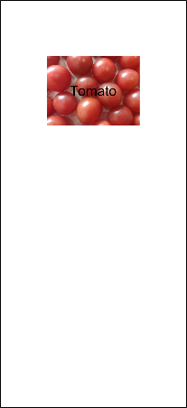
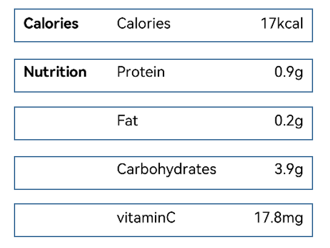

# 创建简单视图

在这一小节中，我们将开始食物详情页的开发，学习如何通过容器组件Stack、Flex和基本组件Image、Text，构建用户自定义组件，完成图文并茂的食物介绍。


## 构建Stack布局

1. 创建食物名称。
   删掉工程模板的build方法的代码，创建Stack组件，将Text组件放进Stack组件的花括号中，使其成为Stack组件的子组件。Stack组件为堆叠组件，可以包含一个或多个子组件，其特点是后一个子组件覆盖前一个子组件。
   ```
   @Entry
   @Component
   struct MyComponent {
     build() {
       Stack() {
           Text('Tomato')
               .fontSize(26)
               .fontWeight(500)
       }
     }
   }
   ```

   

2. 食物图片展示。
   创建Image组件，指定Image组件的url，Image组件和Text组件都是必选构造参数组件。为了让Text组件在Image组件上方显示，所以要先声明Image组件。图片资源放在resources下的rawfile文件夹内，引用rawfile下资源时使用`$rawfile('filename')`的形式，filename为rawfile目录下的文件相对路径。当前`$rawfile`仅支持Image控件引用图片资源。
   ```
   @Entry
   @Component
   struct MyComponent {
     build() {
       Stack() {
           Image($rawfile('Tomato.png'))
           Text('Tomato')
               .fontSize(26)
               .fontWeight(500)
       }
     }
   }
   ```

   

3. 通过资源访问图片。
   除指定图片路径外，也可以使用引用媒体资源符$r引用资源，需要遵循resources文件夹的资源限定词的规则。右键resources文件夹，点击New&gt;Resource Directory，选择Resource Type为Media（图片资源）。

   将Tomato.png放入media文件夹内。就可以通过`$r('app.type.name')`的形式引用应用资源，即`$r('app.media.Tomato')`。

   ```
   @Entry
   @Component
   struct MyComponent {
     build() {
       Stack() {
           Image($r('app.media.Tomato'))
               .objectFit(ImageFit.Contain)
               .height(357)
           Text('Tomato')
               .fontSize(26)
               .fontWeight(500)
       }
     }
   }
   ```

4. 设置Image宽高，并且将image的objectFit属性设置为ImageFit.Contain，即保持图片长宽比的情况下，使得图片完整地显示在边界内。
   如果Image填满了整个屏幕，原因如下：
   1. Image没有设置宽高。

   2. Image的objectFit默认属性是ImageFit.Cover，即在保持长宽比的情况下放大或缩小，使其填满整个显示边界。

   ```
   @Entry
   @Component
   struct MyComponent {
     build() {
       Stack() {
           Image($r('app.media.Tomato'))
               .objectFit(ImageFit.Contain)
               .height(357)
           Text('Tomato')
               .fontSize(26)
               .fontWeight(500)
       }
     }
   }
   ```

   

5. 设置食物图片和名称布局。设置Stack的对齐方式为底部起始端对齐，Stack默认为居中对齐。设置Stack构造参数alignContent为Alignment.BottomStart。其中Alignment和FontWeight一样，都是框架提供的内置枚举类型。
   ```
   @Entry
   @Component
   struct MyComponent {
     build() {
       Stack({ alignContent: Alignment.BottomStart }) {
           Image($r('app.media.Tomato'))
               .objectFit(ImageFit.Contain)
               .height(357)
            Text('Tomato')
               .fontSize(26)
               .fontWeight(500)
       }
     }
   }
   ```

   

6. 通过设置Stack的背景颜色来改变食物图片的背景颜色，设置颜色有两种方式：
   1. 通过框架提供的Color内置枚举值来设置，比如backgroundColor(Color.Red)，即设置背景颜色为红色。
   2. string类型参数，支持的颜色格式有：rgb、rgba和HEX颜色码。比如backgroundColor('\#0000FF')，即设置背景颜色为蓝色，backgroundColor('rgb(255, 255, 255)')，即设置背景颜色为白色。

   ```
   @Entry
   @Component
   struct MyComponent {
     build() {
       Stack({ alignContent: Alignment.BottomStart }) {
           Image($r('app.media.Tomato'))
               .objectFit(ImageFit.Contain)
               .height(357)
           Text('Tomato')
               .fontSize(26)
               .fontWeight(500)
       }
       .backgroundColor('#FFedf2f5')
     }
   }
   ```

   

7. 调整Text组件的外边距margin，使其距离左侧和底部有一定的距离。margin是简写属性，可以统一指定四个边的外边距，也可以分别指定。具体设置方式如下：
   1. 参数为Length时，即统一指定四个边的外边距，比如margin(20)，即上、右、下、左四个边的外边距都是20。
   2. 参数为{top?: Length, right?: Length, bottom?: Length, left?:Length}，即分别指定四个边的边距，比如margin({ left: 26, bottom: 17.4 })，即左边距为26，下边距为17.4。

   ```
   @Entry
   @Component
   struct MyComponent {
     build() {
       Stack({ alignContent: Alignment.BottomStart }) {
           Image($r('app.media.Tomato'))
               .objectFit(ImageFit.Contain)
               .height(357)
           Text('Tomato')
               .fontSize(26)
               .fontWeight(500)
               .margin({left: 26, bottom: 17.4})
       }
        .backgroundColor('#FFedf2f5')
     }
   }
   ```

   

8. 调整组件间的结构，语义化组件名称。创建页面入口组件为FoodDetail，在FoodDetail中创建Column，设置水平方向上居中对齐 alignItems(HorizontalAlign.Center)。MyComponent组件名改为FoodImageDisplay，为FoodDetail的子组件。
   Column是子组件竖直排列的容器组件，本质为线性布局，所以只能设置交叉轴方向的对齐。

   ```
   @Component
   struct FoodImageDisplay {
     build() {
       Stack({ alignContent: Alignment.BottomStart }) {
         Image($r('app.media.Tomato'))
           .objectFit(ImageFit.Contain)
         Text('Tomato')
           .fontSize(26)
           .fontWeight(500)
           .margin({ left: 26, bottom: 17.4 })
       }
       .height(357)
       .backgroundColor('#FFedf2f5')
     }
   }

   @Entry
   @Component
   struct FoodDetail {
     build() {
       Column() {
         FoodImageDisplay()
       }
       .alignItems(HorizontalAlign.Center)
     }
   }
   ```


## 构建Flex布局

开发者可以使用Flex弹性布局来构建食物的食物成分表，弹性布局在本场景的优势在于可以免去多余的宽高计算，通过比例来设置不同单元格的大小，更加灵活。

1. 创建ContentTable组件，使其成为页面入口组件FoodDetail的子组件。
   ```
   @Component
   struct FoodImageDisplay {
     build() {
       Stack({ alignContent: Alignment.BottomStart }) {
         Image($r('app.media.Tomato'))
           .objectFit(ImageFit.Contain)
           .height(357)
         Text('Tomato')
           .fontSize(26)
           .fontWeight(500)
           .margin({ left: 26, bottom: 17.4 })
       }
       .backgroundColor('#FFedf2f5')
     }
   }

   @Component
   struct ContentTable {
     build() {}
   }

   @Entry
   @Component
   struct FoodDetail {
     build() {
       Column() {
         FoodImageDisplay()
         ContentTable()
       }
       .alignItems(HorizontalAlign.Center)
     }
   }
   ```

2. 创建Flex组件展示Tomato两类成分。
   一类是热量Calories，包含卡路里（Calories）；一类是营养成分Nutrition，包含蛋白质（Protein）、脂肪（Fat）、碳水化合物（Carbohydrates）和维生素C（VitaminC）。

   先创建热量这一类。创建Flex组件，高度为280，上、右、左内边距为30，包含三个Text子组件分别代表类别名（Calories），含量名称（Calories）和含量数值（17kcal）。Flex组件默认为水平排列方式。

   已省略FoodImageDisplay代码，只针对ContentTable进行扩展。

   ```
   @Component
   struct ContentTable {
     build() {
       Flex() {
         Text('Calories')
           .fontSize(17.4)
           .fontWeight(FontWeight.Bold)
         Text('Calories')
           .fontSize(17.4)
         Text('17kcal')
           .fontSize(17.4)
       }
       .height(280)
       .padding({ top: 30, right: 30, left: 30 })
     }
   }

   @Entry
   @Component
   struct FoodDetail {
     build() {
       Column() {
         FoodImageDisplay()
         ContentTable()
       }
       .alignItems(HorizontalAlign.Center)
     }
   }
   ```

   

3. 调整布局，设置各部分占比。分类名占比（layoutWeight）为1，成分名和成分含量一共占比（layoutWeight）2。成分名和成分含量位于同一个Flex中，成分名占据所有剩余空间flexGrow(1)。
   ```
   @Component
   struct FoodImageDisplay {
     build() {
       Stack({ alignContent: Alignment.BottomStart }) {
         Image($m('Tomato.png'))
           .objectFit(ImageFit.Contain)
           .height(357)
         Text('Tomato')
           .fontSize(26)
           .fontWeight(500)
           .margin({ left: 26, bottom: 17.4 })
       }
       .backgroundColor('#FFedf2f5')
     }
   }

   @Component
   struct ContentTable {
     build() {
       Flex() {
         Text('Calories')
           .fontSize(17.4)
           .fontWeight(FontWeight.Bold)
           .layoutWeight(1)
         Flex() {
           Text('Calories')
             .fontSize(17.4)
             .flexGrow(1)
           Text('17kcal')
             .fontSize(17.4)
         }
         .layoutWeight(2)
       }
       .height(280)
       .padding({ top: 30, right: 30, left: 30 })
     }
   }

   @Entry
   @Component
   struct FoodDetail {
     build() {
       Column() {
         FoodImageDisplay()
         ContentTable()
       }
       .alignItems(HorizontalAlign.Center)
     }
   }
   ```

   

4. 仿照热量分类创建营养成分分类。营养成分部分（Nutrition）包含：蛋白质（Protein）、脂肪（Fat）、碳水化合物（Carbohydrates）和维生素C（VitaminC）四个成分，后三个成分在表格中省略分类名，用空格代替。
   设置外层Flex为竖直排列FlexDirection.Column， 在主轴方向（竖直方向）上等距排列FlexAlign.SpaceBetween，在交叉轴方向（水平轴方向）上首部对齐排列ItemAlign.Start。

   ```
   @Component
   struct ContentTable {
     build() {
       Flex({ direction: FlexDirection.Column, justifyContent: FlexAlign.SpaceBetween, alignItems: ItemAlign.Start }) {
         Flex() {
           Text('Calories')
             .fontSize(17.4)
             .fontWeight(FontWeight.Bold)
             .layoutWeight(1)
           Flex() {
             Text('Calories')
               .fontSize(17.4)
               .flexGrow(1)
             Text('17kcal')
               .fontSize(17.4)
           }
           .layoutWeight(2)
         }
         Flex() {
           Text('Nutrition')
             .fontSize(17.4)
             .fontWeight(FontWeight.Bold)
             .layoutWeight(1)
           Flex() {
             Text('Protein')
               .fontSize(17.4)
               .flexGrow(1)
             Text('0.9g')
               .fontSize(17.4)
           }
           .layoutWeight(2)
         }
         Flex() {
           Text(' ')
             .fontSize(17.4)
             .fontWeight(FontWeight.Bold)
             .layoutWeight(1)
           Flex() {
             Text('Fat')
               .fontSize(17.4)
               .flexGrow(1)
             Text('0.2g')
               .fontSize(17.4)
           }
           .layoutWeight(2)
         }
         Flex() {
           Text(' ')
             .fontSize(17.4)
             .fontWeight(FontWeight.Bold)
             .layoutWeight(1)
           Flex() {
             Text('Carbohydrates')
               .fontSize(17.4)
               .flexGrow(1)
             Text('3.9g')
               .fontSize(17.4)
           }
           .layoutWeight(2)
         }
         Flex() {
           Text(' ')
             .fontSize(17.4)
             .fontWeight(FontWeight.Bold)
             .layoutWeight(1)
           Flex() {
             Text('vitaminC')
               .fontSize(17.4)
               .flexGrow(1)
             Text('17.8mg')
               .fontSize(17.4)
           }
           .layoutWeight(2)
         }
       }
       .height(280)
       .padding({ top: 30, right: 30, left: 30 })
     }
   }

   @Entry
   @Component
   struct FoodDetail {
       build() {
           Column() {
               FoodImageDisplay()
               ContentTable()
           }
           .alignItems(HorizontalAlign.Center)
       }
   }
   ```

5. 使用自定义构造函数\@Builder简化代码。可以发现，每个成分表中的成分单元其实都是一样的UI结构。
   

   当前对每个成分单元都进行了声明，造成了代码的重复和冗余。可以使用\@Builder来构建自定义方法，抽象出相同的UI结构声明。\@Builder修饰的方法和Component的build方法都是为了声明一些UI渲染结构，遵循一样的eTS语法。开发者可以定义一个或者多个\@Builder修饰的方法，但Component的build方法必须只有一个。

   在ContentTable内声明\@Builder修饰的IngredientItem方法，用于声明分类名、成分名称和成分含量UI描述。

   ```
   @Component
   struct ContentTable {
     @Builder IngredientItem(title:string, name: string, value: string) {
       Flex() {
         Text(title)
           .fontSize(17.4)
           .fontWeight(FontWeight.Bold)
           .layoutWeight(1)
         Flex({ alignItems: ItemAlign.Center }) {
           Circle({width: 6, height: 6})
             .margin({right: 12})
             .fill(colorValue)
           Text(name)
             .fontSize(17.4)
             .flexGrow(1)
           Text(value)
             .fontSize(17.4)
         }
         .layoutWeight(2)
       }
     }
   }
   ```

   在ContentTable的build方法内调用IngredientItem接口，需要用this去调用该Component作用域内的方法，以此来区分全局的方法调用。

   ```
   @Component
   struct ContentTable {
     ......
     build() {
       Flex({ direction: FlexDirection.Column, justifyContent: FlexAlign.SpaceBetween, alignItems: ItemAlign.Start }) {
         this.IngredientItem('Calories', 'Calories', '17kcal')
         this.IngredientItem('Nutrition', 'Protein', '0.9g')
         this.IngredientItem('', 'Fat', '0.2g')
         this.IngredientItem('', 'Carbohydrates', '3.9g')
         this.IngredientItem('', 'VitaminC', '17.8mg')
       }
       .height(280)
       .padding({ top: 30, right: 30, left: 30 })
     }
   }
   ```

   ContentTable组件整体代码如下。

   ```
   @Component
   struct ContentTable {
     @Builder IngredientItem(title:string, name: string, value: string) {
       Flex() {
         Text(title)
           .fontSize(17.4)
           .fontWeight(FontWeight.Bold)
           .layoutWeight(1)
         Flex() {
           Text(name)
             .fontSize(17.4)
             .flexGrow(1)
           Text(value)
             .fontSize(17.4)
         }
         .layoutWeight(2)
       }
     }

     build() {
       Flex({ direction: FlexDirection.Column, justifyContent: FlexAlign.SpaceBetween, alignItems: ItemAlign.Start }) {
         this.IngredientItem('Calories', 'Calories', '17kcal')
         this.IngredientItem('Nutrition', 'Protein', '0.9g')
         this.IngredientItem('', 'Fat', '0.2g')
         this.IngredientItem('', 'Carbohydrates', '3.9g')
         this.IngredientItem('', 'VitaminC', '17.8mg')
       }
       .height(280)
       .padding({ top: 30, right: 30, left: 30 })
     }
   }

   @Entry
   @Component
   struct FoodDetail {
       build() {
           Column() {
               FoodImageDisplay()
               ContentTable()
           }
           .alignItems(HorizontalAlign.Center)
       }
   }
   ```

   

通过学习Stack布局和Flex布局已完成食物的图文展示和营养成分表，构建出第一个普通视图的食物详情页。在下一个章节中，将开发食物分类列表页，并完成食物分类列表页面和食物详情页面的跳转和数据传递，现在我们就进入下一个章节的学习吧。

## 相关实例

针对创建简单视图，有以下示例工程可供参考：

- [BuildCommonView:创建简单视图（eTS）（API8）](https://gitee.com/openharmony/app_samples/tree/master/ETSUI/BuildCommonView)

  本示例为构建了简单页面展示食物番茄的图片和营养信息，主要为了展示简单页面的Stack布局和Flex布局。
