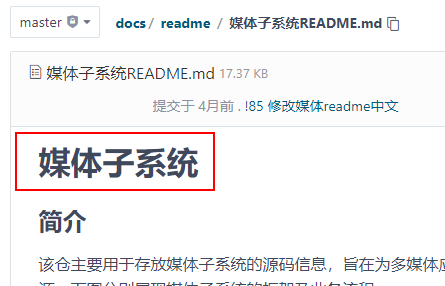
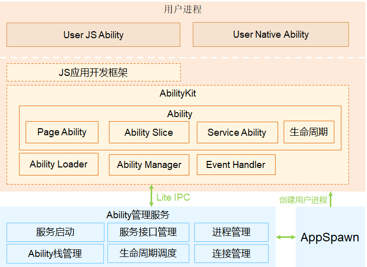

# xxx子系统/部件


【标题说明】根据当前Readme的类型，使用**子系统**或者**部件**。





## 简介


【写作要求】  **必选** ，**简介中包含2部分内容**：内容介绍、架构图介绍。

**内容介绍**：从以下几个方面介绍该子系统：出现背景（在整个OpenHarmony架构中的作用）、实现的功能、使用场景、支持的设备等。

**架构图**：使用架构图说明该子系统【部件】架构，对架构中的主要组成部分进行必要的解释说明

**如果本部件仓库只是子系统一部分，需要理解子系统相关概念，建议给出**：

**更多XXX子系统相关概念，请参考：xxx。(给出到子系统readme的链接)**


写作注意事项如下：


| 要求项 | 内容要求 |
| -------- | -------- |
| **A.1** | **用语要求** |
| A.1.1 | 行文风格：用语正式，避免口语化。 |
| A.1.2 | 合规要求：不能使用第三方知识产权特有概念等存在合规和法务风险的词汇。 |
| A.1.3 | 内容简洁：内容采用信息必备、最小化原则，旨在指导开发者在尽量短的时间完成操作。 |
| A.1.4 | 内容正确：文档的代码、需要设置的参数等需要跟产品实际情况实时保持一致。 |
| A.1.5 | 用语准确：应当确切，不能出现多义性的描述。 |
| A.1.6 | 用语一致：同一叫法，全文保持一致，术语与术语库保持一致，正文中缩略语首次出现要给出全称。 |
| A.1.7 | 用语具体：如表示数量或程度时，避免用笼统的“多”“少”“大”，建议用具体数字表示。 |
| **A.2** | **格式要求** |
| A.2.1 | 标点符号正确、句尾有符号结尾。 |
| A.2.2 | 内容尽量用项目列表或分类的方式清晰呈现。不要有单个项目列表；不要有多余空行。 |
| A.2.3 | 英文字母和中文字之间不要有空格。 |
| A.2.4 | 链接必须有效，具体，可直接跳转或下载。Gitee内部建议使用相对链接，避免使用绝对链接。 |
| A.2.5 | 如果是内容的辅助说明，请使用“说明”式样；如果提前申明事项，请使用“须知”式样，不用“注意”格式 |
| **A.3** | **表格** |
| A.3.1 | 表格有表注，表头风格一致，采用名词或名词词组形式。 |
| A.3.2 | 表格有表头，至少为2行2列，避免出现单行或单列表。 |
| A.3.3 | 表格无内容用“_”，不出现空白的单元格。 |
| **A.4** | **图形** |
| A.4.1 | 避免涉及宗教信仰类截图。 |
| A.4.2 | 图形有图注（不可直接粘贴图形），图注风格一致，采用名词或名词词组形式。 |
| A.4.3 | 图形应清晰可辩识，信息表达完整，易于阅读。如流程图不可缺少“开始”和“结束”。 |
| A.4.4 | 图形逻辑清晰，图文配合使用，切忌图文分离。 |
| A.4.5 | 图片的高度建议在640px左右，宽度不超过820px，一般为.png格式，图片的大小建议不超过150k。 |
| A.4.6 | 图形建议尽量不要用文字，中文图用中文，英文图用英文。 |


架构图参考如下，注意需要绘图的 **颜色，格式有规范要求**，请参照：

**图1** 子系统架构图




## 目录

【写作要求】  **必选** ，**明确本项目仓的代码**目录结构**以及对应目录的**功能描述

```undefined
/foundation/ace
├── frameworks         # 框架代码
│   └── lite
│       ├── examples  # 示例代码目录
│       ├── include   # 对外暴露头文件存放目录
│       ├── packages  # 框架JS实现存放目录
│       ├── src       # 源代码存放目录
│       ├── targets   # 各目标设备配置文件存放目录
│       └── tools     # 工具代码存放目录
├── interfaces         # 对外接口存放目录
│   └── innerkits     # 对内部子系统暴露的头文件存放目录
│       └── builtin   # JS应用框架对外暴露JS三方module API接口存放目录
```


## 约束

【写作要求】  **可选**，明确项目运行的特定条件，如特定的编程语言或特定的操作系统的特定版本。

| 要求项 | 内容要求 |
| -------- | -------- |
| D.1.1 | 明确功能限制或操作限制。 |
| D.1.2 | 约束对指导任务开发有影响或体验有感知，否则不用体现。 |
| D.1.3 | 容易出错的操作在步骤里描述，不在此体现。 |


## 编译构建/使用方法

【写作要求】  **可选** ，子系统Readme不需要提供，对于部件仓的Readme，根据实际情况，提供编译构建的说明。


## 说明


### 接口说明

【写作要求】 **可选**，描述本开发指导相关的接口有哪些，旨在要开发者在开发前有大体了解，提升开发效率。 **子系统readme无需提供**，仓库的readme根据需要判断是否提供，如果已经有API接口参考无需提供；写作要求见下：

| 要求项 | 内容要求 |
| -------- | -------- |
| J.1.1 | 不在本开发任务的接口无需提供。 |
| J.1.2 | 如果接口太多，可以提供主要的接口 |


### 使用说明

【写作要求】  **可选**， *子系统Readme中偏向于概念介绍；仓Readme偏向于具体功能介绍*；如果已经提供开发指南可直接链接到对应指南，无需再写使用说明。

写作要求见下，完成写作后，请逐项自检。

| 要求项 | 内容要求 |
| -------- | -------- |
| **F.1** | **如何写好步骤** |
| F.1.1 | 步骤完整：提供必需的步骤，顺利指导完成操作，无缺失。 |
| F.1.2 | 脉络清楚：文档逻辑清晰、合理。文档前面的概述、准备、操作围绕一条线描述，不能章节断裂或前后矛盾的现象。 |
| F.1.3 | 任务句式：标题或句子尽量使用“动词+名词”的句式表述动作。 |
| F.1.4 | 预防提前：操作过程中的限制、易错的、有潜在风险的，要提前描述。 |
| F.1.5 | 步骤清晰-1：无论步骤简单或复杂，都需要写步骤目的，即为什么做。 |
| F.1.6 | 步骤清晰-2：明确在什么环境下，使用什么工具，做什么操作，怎么做该操作。 |
| F.1.7 | 步骤具体：如果操作可选，要明确可选条件。 |
| F.1.8 | 在开发步骤执行完成后，及时明确操作正确的标准。 |
| **F.2** | **如何写好代码段** |
| F.2.1 | 代码涉及开发者拷贝的命令，必须用可编辑的报文呈现，避免截图，使用代码片段包裹样式 |
| F.2.2 | 代码中关键段，关键步骤要有注释说明。 |
| F.2.3 | 代码显示符合代码缩进要求。 |
| F.2.4 | 步骤涉及接口调用，清晰给出接口及其使用说明或示例代码，代码来源于具体实例。 |


## Changelog

【写作要求】  **可选**，当此readme所在的仓，在做版本升级或其他调整时，需要在changelog中维护变化信息【本次开源中，如果涉及升级更新的，需要提供】


## 相关仓

【写作要求】  **必选**。列出当前仓所在子系统的所有相关仓的链接，并加粗标识当前的仓

示例：

[内核子系统](https://gitee.com/openharmony/docs/blob/master/zh-cn/readme/%E5%86%85%E6%A0%B8%E5%AD%90%E7%B3%BB%E7%BB%9F.md)

[drivers\_liteos](https://gitee.com/openharmony/drivers_liteos/blob/master/README_zh.md)

[**kernel\_liteos\_a**](https://gitee.com/openharmony/kernel_liteos_a/blob/master/README_zh.md)