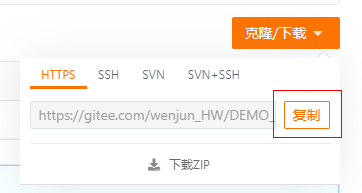
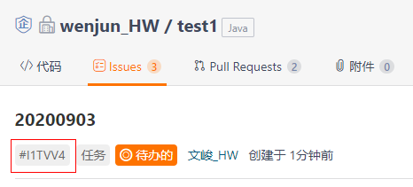
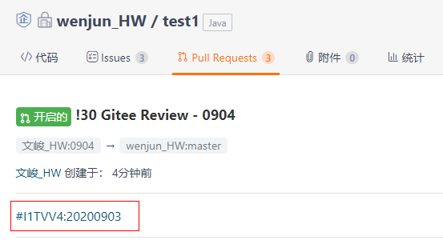

# 贡献流程<a name="ZH-CN_TOPIC_0000001052970939"></a>

-   [环境准备](#section124971410183614)
-   [代码下载](#section6125202333611)
-   [代码提交](#section338918220422)
-   [创建Pull Request（如已通过repo工具自动创建PR，则此步忽略）](#section28261522124316)
-   [门禁构建](#section981124754415)
-   [CI门户](#section8563257123985)
-   [代码审查](#section17823849145014)

## 环境准备<a name="section124971410183614"></a>

-   针对Git的安装、环境配置及使用方法，请参考码云帮助中心的Git知识大全：[https://gitee.com/help/categories/43](https://gitee.com/help/categories/43)
-   注册SSH公钥，请参考码云帮助中心的公钥管理：[https://gitee.com/help/articles/4191](https://gitee.com/help/articles/4191)
-   在开展Gitee的工作流之前，您需要先在OpenHarmony的代码托管平台上找到您感兴趣的Repository。

## 代码下载<a name="section6125202333611"></a>

### 从云上Fork代码分支<a name="section8365811818"></a>

1.  找到并打开对应Repository的首页。
2.  点击右上角的 Fork 按钮，按照指引，建立一个属于**个人**的云上Fork分支。

###  把Fork仓下载到本地<a name="section49051646201819"></a>

请按照以下的过程将Repository内的代码下载到您的在计算机上：

1.  **创建本地工作目录**：

    您需要创建本地工作目录，以便于本地代码的查找和管理

    ```
    mkdir ${your_working_dir}
    ```

2.  **复制远程仓库到本地**
    1.  **切换到本地路径**\*

        ```
        mkdir -p ${your_working_dir}
        cd ${your_working_dir}
        ```

    2.  **复制远程仓库到本地**
        -   您可以在仓库页面内复制远程仓库的拷贝地址，得到$remote\_link：

            **图 1**  复制远程仓库<a name="fig1772512534014"></a>  
            

        -   在本地电脑执行拷贝命令：

            ```
            git clone $remote_link
            ```


### 使用repo工具批量下载代码仓<a name="section15763252468"></a>

1.  下载码云repo工具\(可以参考码云帮助中心：[https://gitee.com/help/articles/4316](https://gitee.com/help/articles/4316)\)：

    ```
    curl https://gitee.com/oschina/repo/raw/fork_flow/repo-py3 > /usr/local/bin/repo
    chmod a+x /usr/local/bin/repo
    pip install -i https://pypi.tuna.tsinghua.edu.cn/simple requests
    ```

2.  下载\(注意没有repo branch参数\)：

    ```
    repo init -u https://gitee.com/openharmony/manifest.git -b master
    repo sync -c
    ```


## 代码提交<a name="section338918220422"></a>

### 单仓提交\(git clone场景\)<a name="section669715742719"></a>

1.  **拉分支**

    更新您的本地分支

    ```
    git remote add origin $remote_link
    git fetch origin
    git checkout master  
    git pull --rebase 
    ```

    基于远端master分支拉取本地调试分支

    ```
    git branch myfeature origin/master
    git checkout myfeature  
    ```

    然后在myfeature分支上编辑和修改代码。

2. **在本地工作目录提交变更**

   ```
   git add .
   git commit -sm  "xxxxxx"  // 提交信息包含signoff邮箱
   ```

   您可能会在前次提交的基础上，继续编辑构建并测试更多内容，可以使用commit --amend继续添加提交。

3.  **将变更推送到您的远端目录**

    准备进行审查（或只是建立工作的异地备份）时，将分支推到您的fork仓库:

    ```
    git push -f origin myfeature
    ```


### 多仓提交\(repo init/sync场景\)<a name="section6560046192910"></a>

1. 配置全局环境token码：

```
repo config --global repo.token {TOKEN}
```

token码在码云[个人设置→安全设置→私人令牌](https://gitee.com/profile/personal_access_tokens)中生成，例如

```
repo config --global repo.token 211XXXXXXXXXXXXXXXXXXXXXXXX
```

2. 在码云上任意一个此次要修改的仓下创建issue\(类似于gerrit的changeID功能，用来关联多个耦合仓修改\)，并记录下issue编号\(如下图中的issue编号是\#I1TVV4\)\(如果不涉及多个仓耦合修改，则此步骤不需要\)：



3. 在本地代码工作区新建分支，修改代码，并提交：

```
repo start branchname --all
```

修改代码后在此次修改的多个仓里执行：

```
git add .
git commit -sm "xxxxxx"
```

或者通过repo工具批量add/commit，在代码工程根目录下执行：

```
repo forall -c 'git add .'
repo forall -c 'git commit -sm "xxxxxx"'
```

4. PUSH代码\(注意：不支持repo upload\)：

配置push代码时是否直接生成PR，选择False是不直接生成，需要手动去fork仓里生成PR，选择True是push到fork仓的同时生成PR：

```
repo config repo.pullrequest {True/False}
```

例如选择push代码的时候同时生成PR，则执行：

```
repo config repo.pullrequest True
```

push代码：

```
repo push --br={BRANCH} --d={DEST_BRANCH} --content={PR_CONTENT}
```

BRANCH为本地分支，DEST\_BRANCH为目的分支\(即主干分支\)，一般是master，PR\_CONTENT为填写的PR描述，假设涉及多仓耦合提交，这里必须填写Issue编号，例如：

```
repo push --br="20200903" --d="master" --content="#I1TVV4"
```

在弹出的编辑页面将需要提交仓、分支、commit的注释符打开：


保存退出，repo会自动将本地分支推送到远端fork仓\(如果没有fork仓，系统会自动创建fork仓\)里，并自动生成PR：


同时自动将PR和Issue关联：



## 创建Pull Request（如已通过repo工具自动创建PR，则此步忽略）<a name="section28261522124316"></a>

访问您在码云上的fork仓页面，点击创建Pull Request按钮选择myfeature分支生成PR。

详细操作请参考码云帮助中心的开发协作指导：[https://gitee.com/help/articles/4128](https://gitee.com/help/articles/4128)

> **须知：** 
>**多个代码仓存在编译依赖时如何同时发起构建：**
>OS\(操作系统\)开发时，经常会遇到多个代码仓的修改具有编译依赖关系，需要同时构建、同时合入。为此码云平台将Issue作为具有编译依赖的多个代码仓提交PR的关联标识。具体操作如下：
>1.  在此次提交的任意一个代码仓上创建Issue。
>2.  将多个需要同时构建、同时合入的PR关联上述Issue，具体操作请参考码云帮助中心：[https://gitee.com/help/articles/4142](https://gitee.com/help/articles/4142)。
>3.  触发构建\(详见触发构建的操作帮助\)后，构建中心会识别关联了同一Issue的PR，同时下载构建，并在代码审核通过后，同时进行合并入代码库。

## 门禁构建<a name="section981124754415"></a>

### 创建Issue<a name="section979820334458"></a>

1.  找到并打开对应Repository的首页
2.  选择左上角的Issues页签，点击右侧新建Issue按钮，按照指引建立一个专属的任务，用于相关联的代码（开发特性/修改bug）执行CI门禁。

### 将Issue与PR关联<a name="section5470144853615"></a>

创建PR或编辑已有的PR时，描述框输入\#+I+五位Issue ID，即可将Issue与PR关联。

**约束：**

-   一个PR只允许关联一个Issue，关联多个Issue时无法触发CI。
-   相关特性开发或bug修复涉及多个代码仓联合修改时，多个PR可关联同一个Issue。
-   Issue关联的PR中，不允许存在已被合入或关闭的PR，否则无法触发CI。
-   若Issue已被合入或关闭的PR关联，则该Issue无法被重复使用，需重新创建Issue并进行OPEN的PR关联。

### 触发代码门禁<a name="section11163175420406"></a>

在PR中评论“start build“即可触发CI门禁。

多个PR关联同一个Issue时，在任一PR中评论“start build”均可触发该Issue的CI门禁。

门禁执行完成，会在该Issue关联的所有PR中自动评论门禁执行结果。

如果门禁通过，该Issue关联的所有PR均会自动标记“测试通过”。

## CI门户<a name="section8563257123985"></a>

OpenHarmony通过持续集成（CI，Continuous Integration）及时发现代码问题，确保代码质量可靠和功能稳定，包括：

- 代码门禁：开发者向OpenHarmony提交代码合入申请后，会触发门禁检查，例如静态检查、代码编译、功能测试等，门禁通过后才能合入代码。
- 每日构建：OpenHarmony的持续集成流水线每日自动执行，以便提前发现代码静态检查、编译、功能等方面的问题，及时修复问题，确保代码质量。

CI门户是为了便于开发者及时查看、分析每日构建和代码门禁的执行结果的一个可持续集成的门户。

示例：[CI门户入口](http://ci.openharmony.cn/)


## 代码审查<a name="section17823849145014"></a>

请参考码云帮助中心：[https://gitee.com/help/articles/4304](https://gitee.com/help/articles/4304)

**相关主题：[FAQ](FAQ.md)**
