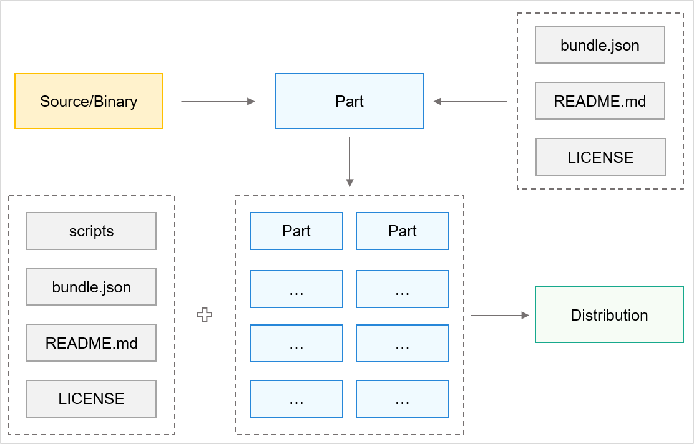

# HPM Part介绍

本章节将介绍OpenHarmony中的HPM Part相关概念，开发者可熟悉以下内容帮助进行HPM Part开发。

## Part介绍

### Part分类

Part是一个用于表示OpenHarmony分发单元的术语。大致分为两大类：

- **部件级Part**：用于描述模块、部件级别的Part，强调可复用性，分发的内容可以是源代码或二进制文件，通常部件级Part和一个代码仓对应，是代码仓的发布件。

- **发行版级Part**：用于描述某一款操作系统发行版的Part，是由一组依赖的Part清单及如何编译构建该发行版的脚本构成，发行版中包含了一个完整操作系统的各类部件（如驱动、内核、框架、应用），编译后生成的镜像可以用于设备的烧录。

### Part构成

一个Part中包含包说明和包内容两部分：

包说明文件包含内容如下：

  **表1** 包说明文件

| 文件名 | 含义 | 是否必须 | 
| -------- | -------- | -------- |
| bundle.json | 元数据声明文件 | 必须 | 
| README.md | 自述文件 | 必须 | 
| LICENSE | 许可协议文本文件 | 必须 | 
| CHANGEME.md | 变更日志文件 | 非必须 | 

包内容文件可以是以下任意内容：

- 被分发的部件的二进制文件

- 被分发的部件源代码文件

- 编译脚本文件

  **图1** 部件Part和发行版Part的关系
  

## HPM介绍

HPM是连接消费方和提供方的一个开放的协作平台，全称是OpenHarmony Package Manager（即包管理器），Part是HPM管理的对象。

通过构建统一的中央仓作为分发渠道，以Part作为载体，提供方发布Part，消费方下载使用Part，实现平台上的供需双方共赢。

- 提供方声明Part的属性，将内容发布到平台上。

- 消费方通过声明对Part指定版本的依赖，获取到所需的资源。

通过HPM完成提供方和消费方的需求匹配。

  **图2** HPM功能介绍
  

**HPM主要分为两部分：**

- **客户端的命令行工具：hpm-cli（发布在[@ohos/hpm-cli](https://www.npmjs.com/package/@ohos/hpm-cli)）**

  hpm-cli是一个跨平台包管理器命令行工具，包含一系列的命令（创建、编译、安装、打包、运行、发布等），开发者使用这些命令完成HPM Part的生命周期管理。

- **服务器端的资源仓库：[DevEco Marketplace](https://repo.harmonyos.com)**

  [DevEco Marketplace](https://repo.harmonyos.com)提供了Part的注册、存储和分类检索等功能，每一个Part都有一个页面显示它的自述文件、依赖关系、历史版本、变更记录、许可协议、下载量、源码仓库地址等信息，开发者可以向资源仓库中发布Part，参与OpenHarmony生态的建设。
