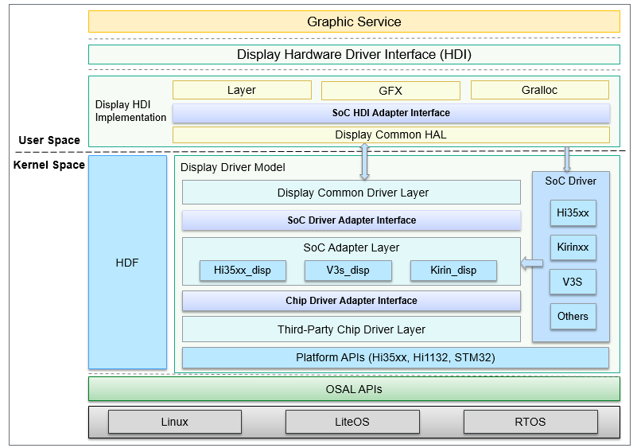
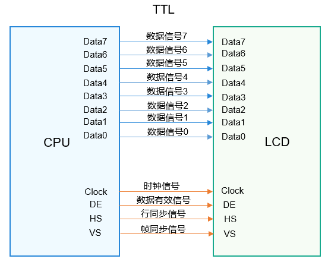

# LCD<a name="ZH-CN_TOPIC_0000001052857284"></a>

-   [概述](#section141575391542)
    -   [接口说明](#section14711163785519)

-   [开发指导](#section12394223125615)
    -   [开发步骤](#section515923045814)

-   [开发实例](#section7441155155813)

## 概述<a name="section141575391542"></a>

LCD（Liquid Crystal Display）液晶显示驱动，对LCD进行上电，并通过接口初始化LCD内部寄存器，使LCD正常工作。Display驱动模型基于HDF（ Hardware Driver Foundation）[驱动框架](drive-hdf-overview.md)开发，实现跨OS、跨平台，为LCD硬件提供上下电功能、发送初始化序列功能，使LCD进入正常的工作模式，显示芯片平台侧的图像数据，基于HDF驱动框架的Display驱动模型如[图1](#fig69138814229)。

**图 1**  基于HDF驱动框架的Display驱动模型<a name="fig69138814229"></a>  


-   **Display驱动模型介绍**

    Display驱动模型主要由平台驱动层、芯片平台适配层、LCD器件驱动层三部分组成。驱动模型基于HDF驱动框架开发，通过Platform层和OSAL层提供的接口，屏蔽内核形态的差异，使得器件驱动可以便利的迁移到不同OS及芯片平台。模型向上对接Display公共hal层，支撑HDI接口的实现，通过Display-HDI（Hardware Display Interface）对图形服务提供各类驱动能力接口。

    （1）Display平台驱动层：通过HDF提供的IOService数据通道，与公共Hal层对接，集中接收并处理各类上层调用指令；

    （2）SOC平台驱动适配层：借助此SOC适配层，实现Display驱动和SOC侧驱动解耦，主要完成芯片平台相关的参数配置，并传递平台驱动层的调用到器件驱动层；

    （3）LCD器件驱动层：在器件驱动层中，主要实现和器件自身强相关的驱动适配接口，例如发送初始化序列、上下电、背光设置等。

    基于Display驱动模型开发LCD驱动，可以借助平台提供的各种能力及接口，较大程度的降低器件驱动的开发周期和难度，提升开发效率。


### 接口说明<a name="section14711163785519"></a>

LCD接口通常可分为MIPI DSI接口、TTL接口和LVDS接口，常用的是MIPI DSI接口和TTL接口，下面对常用的MIPI DSI接口和TTL接口作简要介绍。

-   MIPI DSI接口

    **图 2**  MIPI DSI接口<a name="fig6936451331"></a>  
    

    MIPI DSI接口是MIPI（移动行业处理器接口）联盟定义的显示接口，主要用于移动终端显示屏接口，接口数据传输遵循MIPI协议，MIPI DSI接口为数据接口，传输图像数据，通常情况下MIPI DSI接口的控制信息以MIPI包形式通过MIPI DSI接口发送到对端IC，不需要额外的外设接口。

-   TTL接口

    **图 3**  TTL接口<a name="fig141611855635"></a>  
    

    TTL（Transistor Transistor Logic）即晶体管-晶体管逻辑，TTL电平信号由TTL器件产生，TTL器件是数字集成电路的一大门类，它采用双极型工艺制造，具有高速度、低功耗和品种多等特点。

    TTL接口是并行方式传输数据的接口，有数据信号、时钟信号和控制信号（行同步、帧同步、数据有效信号等），在控制信号控制下完成数据传输。通常TTL接口的LCD，内部寄存器读写需要额外的外设接口，比如SPI接口、I2C接口等。


## 开发指导<a name="section12394223125615"></a>

Display驱动模型基于HDF驱动框架、Platform接口及OSAL接口开发，可以做到不区分OS（LiteOS、Linux）和芯片平台（Hi35xx、Hi38xx、V3S等），为LCD器件提供统一的驱动模型。

### 开发步骤<a name="section515923045814"></a>

1.  添加LCD驱动相关的设备描述配置。
2.  在SOC平台驱动适配层中适配对应的芯片平台驱动。
3.  添加器件驱动，并在驱动入口函数Init中注册Panel驱动数据，驱动数据接口主要包括如下接口：
    -   LCD上下电

        根据LCD硬件连接，使用Platform接口层提供的GPIO操作接口操作对应LCD管脚，例如复位管脚、IOVCC管脚，上电时序参考LCD供应商提供的SPEC。

    -   发送初始化序列

        根据LCD硬件接口，使用Platform接口层提供的I2C、SPI、MIPI等接口，下载LCD初始化序列，初始化参数序列可以参考LCD供应商提供的SPEC。


4.  根据需求实现HDF框架其他接口，比如Release接口。
5.  根据需求使用HDF框架可创建其他设备节点，用于业务逻辑或者调试功能。

## 开发实例<a name="section7441155155813"></a>

添加设备描述配置：

```
/* Display驱动相关的设备描述配置 */
display :: host {
    hostName = "display_host";
    /* Display平台驱动设备描述 */
    device_hdf_disp :: device {
        device0 :: deviceNode {
            policy = 2;
            priority = 200;
            permission = 0660;
            moduleName = "HDF_DISP";
            serviceName = "hdf_disp";
        }
    }
    /* SOC适配层驱动设备描述 */
    device_hi35xx_disp :: device {
        device0 :: deviceNode {
            policy = 0;
            priority = 199;
            moduleName = "HI351XX_DISP";
        }
    }
    /* LCD器件驱动设备描述 */
    device_lcd :: device {
        device0 :: deviceNode {
            policy = 0;
            priority = 100;
            preload = 0;
            moduleName = "LCD_Sample";
        }
        device1 :: deviceNode {
            policy = 0;
            priority = 100;
            preload = 2;
            moduleName = "LCD_SampleXX";
        }
    }
}
```

SOC适配层驱动，以Hi35xx系列芯片为例，需要在本层驱动中适配MIPI等和芯片平台相关的配置，示例如下：

```
static int32_t MipiDsiInit(struct PanelInfo *info)
{
    int32_t ret;
    struct DevHandle *mipiHandle = NULL;
    struct MipiCfg cfg;

    mipiHandle = MipiDsiOpen(0);
    if (mipiHandle == NULL) {
        HDF_LOGE("%s: MipiDsiOpen failure", __func__);
        return HDF_FAILURE;
    }
    cfg.lane = info->mipi.lane;
    cfg.mode = info->mipi.mode;
    cfg.format = info->mipi.format;
    cfg.burstMode = info->mipi.burstMode;
    cfg.timing.xPixels = info->width;
    cfg.timing.hsaPixels = info->hsw;
    cfg.timing.hbpPixels = info->hbp;
    cfg.timing.hlinePixels = info->width + info->hbp + info->hfp + info->hsw;
    cfg.timing.vsaLines = info->vsw;
    cfg.timing.vbpLines = info->vbp;
    cfg.timing.vfpLines = info->vfp;
    cfg.timing.ylines = info->height;
    /* 0 : no care */
    cfg.timing.edpiCmdSize = 0;
    cfg.pixelClk = CalcPixelClk(info);
    cfg.phyDataRate = CalcDataRate(info);
    /* config mipi device */
    ret = MipiDsiSetCfg(mipiHandle, &cfg);
    if (ret != HDF_SUCCESS) {
        HDF_LOGE("%s:MipiDsiSetCfg failure", __func__);
    }
    MipiDsiClose(mipiHandle);
    HDF_LOGI("%s:pixelClk = %d, phyDataRate = %d\n", __func__,
        cfg.pixelClk, cfg.phyDataRate);
    return ret;
}
```

LCD器件驱动示例如下：

```
#define RESET_GPIO                5
#define MIPI_DSI0                 0
#define BLK_PWM1                  1
#define PWM_MAX_PERIOD            100000
/* backlight setting */
#define MIN_LEVEL                 0
#define MAX_LEVEL                 255
#define DEFAULT_LEVEL             100

#define WIDTH                     480
#define HEIGHT                    960
#define HORIZONTAL_BACK_PORCH     20
#define HORIZONTAL_FRONT_PORCH    20
#define HORIZONTAL_SYNC_WIDTH     10
#define VERTIACL_BACK_PORCH       14
#define VERTIACL_FRONT_PORCH      16
#define VERTIACL_SYNC_WIDTH       2
#define FRAME_RATE                60

/* Panel Info结构体结构体 */
struct PanelInfo {
    uint32_t width;
    uint32_t height;
    uint32_t hbp;
    uint32_t hfp;
    uint32_t hsw;
    uint32_t vbp;
    uint32_t vfp;
    uint32_t vsw;
    uint32_t frameRate;
    enum LcdIntfType intfType;
    enum IntfSync intfSync;
    struct MipiDsiDesc mipi;
    struct BlkDesc blk;
    struct PwmCfg pwm;
};

/* LCD屏的初始化序列 */
static uint8_t g_payLoad0[] = { 0xF0, 0x5A, 0x5A };
static uint8_t g_payLoad1[] = { 0xF1, 0xA5, 0xA5 };
static uint8_t g_payLoad2[] = { 0xB3, 0x03, 0x03, 0x03, 0x07, 0x05, 0x0D, 0x0F, 0x11, 0x13, 0x09, 0x0B };
static uint8_t g_payLoad3[] = { 0xB4, 0x03, 0x03, 0x03, 0x06, 0x04, 0x0C, 0x0E, 0x10, 0x12, 0x08, 0x0A };
static uint8_t g_payLoad4[] = { 0xB0, 0x54, 0x32, 0x23, 0x45, 0x44, 0x44, 0x44, 0x44, 0x60, 0x00, 0x60, 0x1C };
static uint8_t g_payLoad5[] = { 0xB1, 0x32, 0x84, 0x02, 0x87, 0x12, 0x00, 0x50, 0x1C };
static uint8_t g_payLoad6[] = { 0xB2, 0x73, 0x09, 0x08 };
static uint8_t g_payLoad7[] = { 0xB6, 0x5C, 0x5C, 0x05 };
static uint8_t g_payLoad8[] = { 0xB8, 0x23, 0x41, 0x32, 0x30, 0x03 };
static uint8_t g_payLoad9[] = { 0xBC, 0xD2, 0x0E, 0x63, 0x63, 0x5A, 0x32, 0x22, 0x14, 0x22, 0x03 };
static uint8_t g_payLoad10[] = { 0xb7, 0x41 };
static uint8_t g_payLoad11[] = { 0xC1, 0x0c, 0x10, 0x04, 0x0c, 0x10, 0x04 };
static uint8_t g_payLoad12[] = { 0xC2, 0x10, 0xE0 };
static uint8_t g_payLoad13[] = { 0xC3, 0x22, 0x11 };
static uint8_t g_payLoad14[] = { 0xD0, 0x07, 0xFF };
static uint8_t g_payLoad15[] = { 0xD2, 0x63, 0x0B, 0x08, 0x88 };
static uint8_t g_payLoad16[] = { 0xC6, 0x08, 0x15, 0xFF, 0x10, 0x16, 0x80, 0x60 };
static uint8_t g_payLoad17[] = { 0xc7, 0x04 };
static uint8_t g_payLoad18[] = {
    0xC8, 0x7C, 0x50, 0x3B, 0x2C, 0x25, 0x16, 0x1C, 0x08, 0x27, 0x2B, 0x2F, 0x52, 0x43, 0x4C, 0x40,
    0x3D, 0x30, 0x1E, 0x06, 0x7C, 0x50, 0x3B, 0x2C, 0x25, 0x16, 0x1C, 0x08, 0x27, 0x2B, 0x2F, 0x52,
    0x43, 0x4C, 0x40, 0x3D, 0x30, 0x1E, 0x06
};
static uint8_t g_payLoad19[] = { 0x11 };
static uint8_t g_payLoad20[] = { 0x29 };

struct DsiCmdDesc g_OnCmd[] = {
    { 0x29, 0, sizeof(g_payLoad0), g_payLoad0 },
    { 0x29, 0, sizeof(g_payLoad1), g_payLoad1 },
    { 0x29, 0, sizeof(g_payLoad2), g_payLoad2 },
    { 0x29, 0, sizeof(g_payLoad3), g_payLoad3 },
    { 0x29, 0, sizeof(g_payLoad4), g_payLoad4 },
    { 0x29, 0, sizeof(g_payLoad5), g_payLoad5 },
    { 0x29, 0, sizeof(g_payLoad6), g_payLoad6 },
    { 0x29, 0, sizeof(g_payLoad7), g_payLoad7 },
    { 0x29, 0, sizeof(g_payLoad8), g_payLoad8 },
    { 0x29, 0, sizeof(g_payLoad9), g_payLoad9 },
    { 0x23, 0, sizeof(g_payLoad10), g_payLoad10 },
    { 0x29, 0, sizeof(g_payLoad11), g_payLoad11 },
    { 0x29, 0, sizeof(g_payLoad12), g_payLoad12 },
    { 0x29, 0, sizeof(g_payLoad13), g_payLoad13 },
    { 0x29, 0, sizeof(g_payLoad14), g_payLoad14 },
    { 0x29, 0, sizeof(g_payLoad15), g_payLoad15 },
    { 0x29, 0, sizeof(g_payLoad16), g_payLoad16 },
    { 0x23, 0, sizeof(g_payLoad17), g_payLoad17 },
    { 0x29, 1, sizeof(g_payLoad18), g_payLoad18 },
    { 0x05, 120, sizeof(g_payLoad19), g_payLoad19 },
    { 0x05, 120, sizeof(g_payLoad20), g_payLoad20 },
};
static DevHandle g_mipiHandle = NULL;
static DevHandle g_pwmHandle = NULL;

/* 设置Reset Pin脚状态 */
static int32_t LcdResetOn(void)
{
    int32_t ret;
    ret = GpioSetDir(RESET_GPIO, GPIO_DIR_OUT);
    if (ret != HDF_SUCCESS) {
        HDF_LOGE("GpioSetDir failure, ret:%d", ret);
        return HDF_FAILURE;
    }
    ret = GpioWrite(RESET_GPIO, GPIO_VAL_HIGH);
    if (ret != HDF_SUCCESS) {
        HDF_LOGE("GpioWrite failure, ret:%d", ret);
        return HDF_FAILURE;
    }
    /* delay 20ms */
    OsalMSleep(20);
    return HDF_SUCCESS;
}

static int32_t SampleInit(void)
{
    /* 获取MIPI DSI设备操作句柄 */
    g_mipiHandle = MipiDsiOpen(MIPI_DSI0);
    if (g_mipiHandle == NULL) {
        HDF_LOGE("%s: MipiDsiOpen failure", __func__);
        return HDF_FAILURE;
    }
    return HDF_SUCCESS;
}

static int32_t SampleOn(void)
{
    int32_t ret;
    /* LCD上电序列 */
    ret = LcdResetOn();
    if (ret != HDF_SUCCESS) {
        HDF_LOGE("%s: LcdResetOn failure", __func__);
        return HDF_FAILURE;
    }
    if (g_mipiHandle == NULL) {
        HDF_LOGE("%s: g_mipiHandle is null", __func__);
        return HDF_FAILURE;
    }
    /* 使用mipi下发初始化序列 */
    int32_t count = sizeof(g_OnCmd) / sizeof(g_OnCmd[0]);
    int32_t i;
    for (i = 0; i < count; i++) {
        ret = MipiDsiTx(g_mipiHandle, &(g_OnCmd[i]));
        if (ret != HDF_SUCCESS) {
            HDF_LOGE("MipiDsiTx failure");
            return HDF_FAILURE;
        }
    }
    /* 将mipi切换到HS模式 */
    MipiDsiSetHsMode(g_mipiHandle);
    return HDF_SUCCESS;
}

/* PanelInfo结构体变量 */
static struct PanelInfo g_panelInfo = {
    .width = WIDTH,                     /* width */
    .height = HEIGHT,                   /* height */
    .hbp = HORIZONTAL_BACK_PORCH,       /* horizontal back porch */
    .hfp = HORIZONTAL_FRONT_PORCH,      /* horizontal front porch */
    .hsw = HORIZONTAL_SYNC_WIDTH,       /* horizontal sync width */
    .vbp = VERTIACL_BACK_PORCH,         /* vertiacl back porch */
    .vfp = VERTIACL_FRONT_PORCH,        /* vertiacl front porch */
    .vsw = VERTIACL_SYNC_WIDTH,         /* vertiacl sync width */
    .frameRate = FRAME_RATE,            /* frame rate */
    .intfType = MIPI_DSI,               /* panel interface type */
    .intfSync = OUTPUT_USER,            /* output timming type */
    /* mipi config info */
    .mipi = { DSI_2_LANES, DSI_VIDEO_MODE, VIDEO_BURST_MODE, FORMAT_RGB_24_BIT },
    /* backlight config info */
    .blk = { BLK_PWM, MIN_LEVEL, MAX_LEVEL, DEFAULT_LEVEL },
    .pwm = { BLK_PWM1, PWM_MAX_PERIOD },
};

/* 器件驱动需要适配的基础接口 */
static struct PanelData g_panelData = {
    .info = &g_panelInfo,
    .init = SampleInit,
    .on = SampleOn,
    .off = SampleOff,
    .setBacklight = SampleSetBacklight,
};

/* 器件驱动入口函数 */
int32_t SampleEntryInit(struct HdfDeviceObject *object)
{
    HDF_LOGI("%s: enter", __func__);
    if (object == NULL) {
        HDF_LOGE("%s: param is null!", __func__);
        return HDF_FAILURE;
    }
    /* 器件驱动接口注册，ops提供给平台驱动调用 */
    if (PanelDataRegister(&g_panelData) != HDF_SUCCESS) {
        HDF_LOGE("%s: PanelDataRegister error!", __func__);
        return HDF_FAILURE;
    }
    return HDF_SUCCESS;
}

struct HdfDriverEntry g_sampleDevEntry = {
    .moduleVersion = 1,
    .moduleName = "LCD_SAMPLE",
    .Init = SampleEntryInit,
};

HDF_INIT(g_sampleDevEntry);
```

