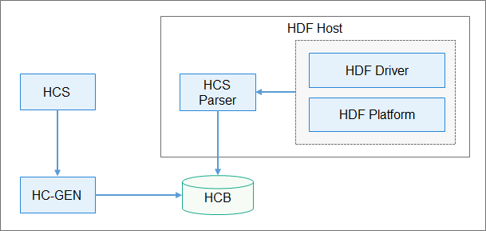

# 配置管理


## 配置概述

HCS（HDF Configuration Source）是HDF驱动框架的配置描述源码，内容以Key-Value为主要形式。它实现了配置代码与驱动代码解耦，便于开发者进行配置管理。

HC-GEN（HDF Configuration Generator）是HCS配置转换工具，可以将HDF配置文件转换为软件可读取的文件格式：

- 在弱性能环境中，转换为配置树源码或配置树宏定义，驱动可直接调用C代码或宏式APIs获取配置。

- 在高性能环境中，转换为HCB（HDF Configuration Binary）二进制文件，驱动可使用HDF框架提供的配置解析接口获取配置。

以下是使用HCB模式的典型应用场景：

  **图1** 配置使用流程图

  

HCS经过HC-GEN编译生成HCB文件，HDF驱动框架中的HCS Parser模块会从HCB文件中重建配置树，HDF驱动模块使用HCS Parser提供的配置读取接口获取配置内容。


## 配置语法

HCS的语法介绍如下：


### 关键字

HCS配置语法保留了以下关键字。

  **表1** HCS配置语法保留关键字

| 关键字 | 用途 | 说明 | 
| -------- | -------- | -------- |
| root | 配置根节点 | - | 
| include | 引用其他HCS配置文件 | - | 
| delete | 删除节点或属性 | 只能用于操作include导入的配置树 | 
| template | 定义模板节点 | - | 
| match_attr | 用于标记节点的匹配查找属性 | 解析配置时可以使用该属性的值查找到对应节点 | 


### 基本结构

HCS主要分为属性(Attribute)和节点(Node)两种结构。

**属性**

属性即最小的配置单元，是一个独立的配置项。语法如下：

  
```
  attribute_name = value;
```

- attribute_name 是**字母、数字、下划线**的组合且必须以字母或下划线开头，字母区分大小写。

- value的可用格式如下：

  - 数字常量，支持二进制、八进制、十进制、十六进制数，具体参考数据类型节。
  - 字符串，内容使用双引号("")引用。
  - 节点引用。

- attribute 必须以分号(;)结束且必须属于一个node。

**节点**

节点是一组属性的集合，语法如下：

  
```
  node_name {
      module = "sample";
      ...
  }
```

- node_name  是**字母、数字、下划线**的组合且必须以字母或下划线开头，字母区分大小写。

- 大括号后无需添加结束符“;”。

- root为保留关键字，用于声明配置表的根节点。每个配置表必须以root节点开始。

- root节点中必须包含module属性，其值应该为一个字符串，用于表征该配置所属模块。

- 节点中可以增加match_attr属性，其值为一个全局唯一的字符串。在解析配置时可以调用查找接口以该属性的值查找到包含该属性的节点。


### 数据类型

在属性定义中使用自动数据类型，不显式指定类型，属性支持的数据类型如下：

**整型**

  整型长度自动推断，根据实际数据长度给与最小空间占用的类型。
- 二进制，0b前缀，示例：0b1010。

- 八进制，0前缀，示例：0664。

- 十进制 ，无前缀，且支持有符号与无符号，示例：1024，+1024均合法。负值在读取时注意使用有符号数读取接口。

- 十六进制，0x前缀，示例：0xff00、0xFF。

**字符串**

字符串使用双引号("")表示。

**数组**

数组元素支持整型、字符串，不支持混合类型。整型数组中uint32_t uint64_t混用会向上转型为uint64_t 数组。整型数组与字符串数组示例如下：

  
```
attr_foo = [0x01, 0x02, 0x03, 0x04];
attr_bar = ["hello", "world"];
```

**bool类型**

bool类型中**true**表示真，**false**表示假。


### 预处理

**include**

用于导入其他HCS文件。语法示例如下：

  
```
#include "foo.hcs"
#include "../bar.hcs"
```

- 文件名必须使用双引号("")，不在同一目录使用相对路径引用。被include文件也必须是合法的HCS文件。

- 多个include，如果存在相同的节点，后者覆盖前者，其余的节点依次展开。


### 注释

支持两种注释风格。

- 单行注释。

    
  ```
  // comment
  ```

- 多行注释。

    
  ```
  /*
  comment
  */
  ```

  >  **说明：**
  > 多行注释不支持嵌套。


### 引用修改

引用修改可以实现修改另外任意一个节点的内容，语法为：

  
```
 node :& source_node
```

  上述语句表示node中的内容是对source_node节点内容的修改。示例如下：
  
```
root {
    module = "sample";
    foo {
        foo_ :& root.bar{
            attr = "foo";
        }
        foo1 :& foo2 {
            attr = 0x2;
        }
        foo2 {
            attr = 0x1;
        }
    }

    bar {
        attr = "bar";
    }
}
```

最终生成配置树为：

  
```
root {
    module = "sample";
    foo {
        foo2 {
            attr = 0x2;
        }
    }
    bar {
        attr = "foo";
    }
}
```

在以上示例中，可以看到foo.foo_节点通过引用将bar.attr属性的值修改为了"foo"，foo.foo1节点通过引用将foo.foo2.attr属性的值修改为了0x2。foo.foo_以及foo.foo1节点表示对目标节点内容的修改，其自身并不会存在最终生成的配置树中。

- 引用同级node，可以直接使用node名称，否则被引用的节点必须使用绝对路径，节点间使用“.”分隔，root表示根节点，格式为root开始的节点路径序列，例如root.foo.bar即为一个合法的绝对路径。

- 如果出现修改冲突（即多处修改同一个属性），编译器将提示warning，因为这种情况下只会生效某一个修改而导致最终结果不确定。


### 节点复制

节点复制可以实现在节点定义时从另一个节点先复制内容，用于定义内容相似的节点。语法为：

  
```
 node : source_node
```

上述语句表示在定义"node"节点时将另一个节点"source_node"的属性复制过来。示例如下：

  
```
root {
	module = "sample";
    foo {
        attr_0 = 0x0;
    }
    bar:foo {
        attr_1 = 0x1;
    }
}
```

上述代码的最终生成配置树为：

  
```
root {
    module = "sample";
    foo {
        attr_0 = 0x0;
    }
    bar {
        attr_1 = 0x1;
        attr_0 = 0x0;
    }
}
```

在上述示例中，编译后bar节点即包含attr_0属性也包含attr_1属性，在bar中对attr_0的修改不会影响到foo。

在foo和bar在同级node中可不指定foo的路径，否则需要使用绝对路径引用，参考[引用修改](#引用修改)。


### 删除

要对include导入的base配置树中不需要的节点或属性进行删除，可以使用delete关键字。下面的举例中sample1.hcs通过include导入了sample2.hcs中的配置内容，并使用delete删除了sample2.hcs中的attribute2属性和foo_2节点，示例如下：

  
```
// sample2.hcs
root {
    attr_1 = 0x1;
    attr_2 = 0x2;
    foo_2 {
        t = 0x1;
    }
}

// sample1.hcs
#include "sample2.hcs"
root {
    attr_2 = delete;
    foo_2 : delete {
    }
}
```

上述代码在生成过程中将会删除root.foo_2节点与attr_2，最终生成配置树为：

  
```
root {
    attr_1 = 0x1;
}
```

>  **说明：**
> 在同一个HCS文件中不允许使用delete，建议直接删除不需要的属性。


### 属性引用

为了在解析配置时快速定位到关联的节点，可以把节点作为属性的右值，通过读取属性查找到对应节点。语法为：

  
```
 attribute = &node；
```

上述语句表示attribute的值是一个节点node的引用，在解析时可以用这个attribute快速定位到node，便于关联和查询其他node。示例如下：

  
```
node1 {
    attributes;
}
node2 {
    attr_1 = &root.node1;
}
```

或

  
```
node2 {
    node1 {
        attributes;
    }
    attr_1 = &node1;
}
```


### 模板

模板的用途在于生成严格一致的node结构，以便对同类型node进行遍历和管理。

使用template关键字定义模板node，子node通过双冒号“::”声明继承关系。子节点可以改写或新增但不能删除template中的属性，子节点中没有定义的属性将使用template中的定义作为默认值。示例如下：

  
```
root {
    module = "sample";
    template foo {
        attr_1 = 0x1;
        attr_2 = 0x2;
    }

    bar :: foo {
    }

    bar_1 :: foo {
        attr_1 = 0x2;
    }
}
```

生成配置树如下：

  
```
root {
    module = "sample";
    bar {
        attr_1 = 0x1;
        attr_2 = 0x2;
    }
    bar_1 {
        attr_1 = 0x2;
        attr_2 = 0x2;
    }
}
```

在上述示例中，bar和bar_1节点继承了foo节点，生成配置树节点结构与foo保持了完全一致，只是属性的值不同。


## 配置生成

hc-gen是配置生成的工具，可以对HCS配置语法进行检查并把HCS源文件转化成HCB二进制文件。


### hc-gen介绍

hc-gen参数说明：

  
```
Usage: hc-gen [Options] [File]
options:
  -o <file>   output file name, default same as input
  -a          hcb align with four bytes
  -b          output binary output, default enable
  -t          output config in C language source file style
  -m          output config in macro source file style
  -i          output binary hex dump in C language source file style
  -p <prefix> prefix of generated symbol name
  -d          decompile hcb to hcs
  -V          show verbose info
  -v          show version
  -h          show this help message
```

生成.c/.h 配置文件方法：

  
```
hc-gen -o [OutputCFileName] -t [SourceHcsFileName]
```

生成HCB 配置文件方法：

  
```
hc-gen -o [OutputHcbFileName] -b [SourceHcsFileName]
```

生成宏定义配置文件方法：

  
```
hc-gen -o [OutputMacroFileName] -m [SourceHcsFileName]
```

反编译HCB文件为HCS方法：

  
```
hc-gen -o [OutputHcsFileName] -d [SourceHcbFileName]
```
