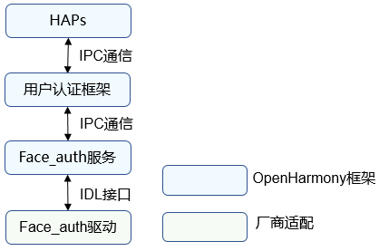
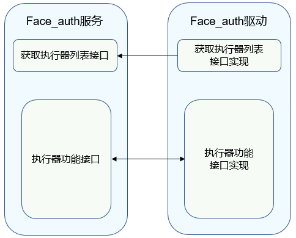

# Face_auth

## 概述

### 功能简介

人脸识别功能是端侧设备不可或缺的一部分，为设备提供一种用户认证能力，可应用于设备解锁、支付、应用登录等身份认证场景。它是基于人的脸部特征信息进行身份识别的一种生物特征识别技术，用摄像机或摄像头采集含有人脸的图像或视频流，并自动在图像中检测和跟踪人脸，进而对检测到的人脸进行脸部识别，通常也叫做人像识别、面部识别、人脸认证。人脸识别功能整体框架如图1。

基于HDF（Hardware Driver Foundation）驱动框架开发的Face_auth驱动，能够屏蔽硬件器件差异，为上层用户认证框架和Face_auth服务提供稳定的人脸识别基础能力接口，包括人脸识别执行器列表查询、执行器信息查询、指定人脸模板ID查询模板信息、用户认证框架和执行器间的人脸模板信息对账、人脸的录入，删除，认证和识别等。

**图1** 人脸识别功能整体框架



### 基本概念

用户认证框架与各基础认证服务组成的身份认证系统支持用户认证凭据设置、删除、认证等基础功能。系统支持用户身份认证，需要提供数据采集、处理、存储及比对能力。
- 执行器

  执行器是能够提供以上能力的处理模块，各基础认证服务提供执行器能力，被身份认证框架调度完成各项基础能力。

- 执行器安全等级

  执行器提供能力时运行环境所达到的安全级别，如操作运行在访问控制安全等级低于操作运行硬件可信执行环境的安全等级。

- 执行器角色

  - 全功能执行器：执行器可独立处理一次凭据注册和身份认证请求，即可提供用户认证数据采集、处理、储存及比对能力。

  - 采集器：执行器提供用户认证时的数据采集能力，需要和认证器配合完成用户认证。

  - 认证器：认证器提供用户认证时数据处理能力，读取存储的凭据模板与当前认证信息完成比对。

- 执行器类型

  同一种身份认证类型的不同认证方式会产生认证算法差异，设备器件差异也会导致算法差异，执行器根据支持的算法类型差异或对接的器件差异，会定义不同的执行器类型。

- 用户认证框架公钥 & 执行器公钥

  用户身份认证处理需要保证用户数据安全以及认证结果的准确性，用户认证框架与基础认证服务间的关键交互信息需要做数据完整性保护，各基础认证服务将提供的执行器能力对接到用户认证框架时，需要交换各自的公钥，其中：

    1）执行器通过用户认证框架公钥校验调度指令的准确性。

    2）执行器公钥可被用户认证框架用于校验认证结果的准确性，同时用于执行器交互认证时的校验交互信息的完整性。

- 认证凭据模板

  认证凭据是在用户设置认证凭据时由认证服务产生并存储，每个模板有一个ID，用于索引模板信息文件，在认证时读取模板信息并用于与当次认证过程中产生的认证数据做对比，完成身份认证。

- 执行器对账

  用户认证框架统一管理用户身份和凭据ID的映射关系，执行器对接到用户认证框架时，会读取用户身份认证框架内保存的该执行器的模板ID列表，执行器需要与自己维护的模板ID列表进行比对，并删除冗余信息。

### 运作机制

Face_auth驱动的主要工作是为上层用户认证框架和Face_auth服务提供稳定的人脸识别基础能力，保证设备上人脸识别功能可以正常运行。
开发者可基于HDF框架对不同芯片进行各自驱动的开发及HDI层接口的调用。

**图2** Face_auth服务和Face_auth驱动交互



### 约束与限制

- 要求设备上具备摄像器件，且人脸图像像素大于100*100。
- 要求设备上具有可信执行环境，人脸特征信息高强度加密保存在可信执行环境中。
- 对于面部特征相似的人、面部特征不断发育的儿童，人脸特征匹配率有所不同。如果对此担忧，可考虑其他认证方式。

## 开发指导

### 场景介绍

Face_auth驱动的主要工作是为上层用户认证框架和Face_auth服务提供稳定的人脸识别基础能力，保证设备上人脸识别功能可以正常运行。

### 接口说明

**表1** 接口功能介绍

| 接口名                                                       | 功能介绍                                                     |
| ------------------------------------------------------------ | ------------------------------------------------------------ |
| GetExecutorList(std::vector<sptr<IExecutor>>& executorList)  | 获取执行器列表。                                             |
| GetExecutorInfo(ExecutorInfo& info)                          | 获取执行器信息，包括执行器类型、执行器角色、认证类型、安全等级、执行器公钥等信息，用于向用户认证框架注册执行器。 |
| GetTemplateInfo(uint64_t templateId, TemplateInfo& info)     | 获取指定人脸模板ID的模板信息。                               |
| OnRegisterFinish(const std::vector<uint64_t>& templateIdList,<br/>        const std::vector<uint8_t>& frameworkPublicKey, const std::vector<uint8_t>& extraInfo) | 执行器注册成功后，获取用户认证框架的公钥信息；获取用户认证框架的人脸模板列表用于对账。 |
| Enroll(uint64_t scheduleId, const std::vector<uint8_t>& extraInfo,<br/>        const sptr<IExecutorCallback>& callbackObj) | 录入人脸模板。                                               |
| Authenticate(uint64_t scheduleId, const std::vector<uint64_t>& templateIdList,<br/>        const std::vector<uint8_t>& extraInfo, const sptr<IExecutorCallback>& callbackObj) | 认证人脸模板。                                               |
| Identify(uint64_t scheduleId, const std::vector<uint8_t>& extraInfo,<br/>        const sptr<IExecutorCallback>& callbackObj) | 识别人脸模板。                                               |
| Delete(const std::vector<uint64_t>& templateIdList)          | 删除人脸模板。                                               |
| Cancel(uint64_t scheduleId)                                  | 通过scheduleId取消指定录入、认证、识别操作。                 |
| SendCommand(int32_t commandId, const std::vector<uint8_t>& extraInfo,<br/>        const sptr<IExecutorCallback>& callbackObj) | 人脸认证服务向Face_auth驱动传递参数的通用接口。              |

**表2** 回调函数介绍

| 接口名                                                       | 功能介绍                 |
| ------------------------------------------------------------ | ------------------------ |
| IExecutorCallback::OnResult(int32_t code, const std::vector<uint8_t>& extraInfo) | 返回操作的最终结果。     |
| IExecutorCallback::OnAcquireInfo(int32_t code, const std::vector<uint8_t>& extraInfo) | 返回操作的过程交互信息。 |

### 开发步骤

以Hi3516DV300平台为例，我们提供了Face_auth驱动DEMO实例，以下是目录结构及各部分功能简介。

```undefined
// drivers/peripheral/face_auth
├── BUILD.gn # 编译脚本
├── bundle.json # 组件描述文件
└── hdi_service # Face_auth驱动实现
    ├── BUILD.gn # 编译脚本
    ├── include # 头文件
    └── src
        ├── executor_impl.cpp # 认证、录入等功能接口实现
        ├── face_auth_interface_driver.cpp # Face_auth驱动入口
        └── face_auth_interface_service.cpp # 获取执行器列表接口实现
```

下面结合DEMO实例介绍驱动开发的具体步骤。

1. 基于HDF驱动框架，按照驱动Driver Entry程序，完成Face_auth驱动开发，主要由Bind、Init、Release、Dispatch函数接口实现，详细代码参见[face_auth_interface_driver.cpp](https://gitee.com/openharmony/drivers_peripheral/blob/master/face_auth/hdi_service/src/face_auth_interface_driver.cpp)文件。

   ```c++
   // 通过自定义的HdfFaceAuthInterfaceHost对象包含ioService对象和真正的HDI Service实现IRemoteObject对象
   struct HdfFaceAuthInterfaceHost {
       struct IDeviceIoService ioService;
       OHOS::sptr<OHOS::IRemoteObject> stub;
   };
   
   // 服务接口调用响应接口
   static int32_t FaceAuthInterfaceDriverDispatch(struct HdfDeviceIoClient *client, int cmdId, struct HdfSBuf *data,
       struct HdfSBuf *reply)
   {
       IAM_LOGI("start");
       auto *hdfFaceAuthInterfaceHost = CONTAINER_OF(client->device->service,
           struct HdfFaceAuthInterfaceHost, ioService);
   
       OHOS::MessageParcel *dataParcel = nullptr;
       OHOS::MessageParcel *replyParcel = nullptr;
       OHOS::MessageOption option;
   
       if (SbufToParcel(data, &dataParcel) != HDF_SUCCESS) {
           IAM_LOGE("%{public}s:invalid data sbuf object to dispatch", __func__);
           return HDF_ERR_INVALID_PARAM;
       }
       if (SbufToParcel(reply, &replyParcel) != HDF_SUCCESS) {
           IAM_LOGE("%{public}s:invalid reply sbuf object to dispatch", __func__);
           return HDF_ERR_INVALID_PARAM;
       }
   
       return hdfFaceAuthInterfaceHost->stub->SendRequest(cmdId, *dataParcel, *replyParcel, option);
   }
   
   // 初始化接口
   int HdfFaceAuthInterfaceDriverInit(struct HdfDeviceObject *deviceObject)
   {
       IAM_LOGI("start");
       if (!HdfDeviceSetClass(deviceObject, DEVICE_CLASS_USERAUTH)) {
           IAM_LOGE("set face auth hdf class failed");
           return HDF_FAILURE;
       }
       return HDF_SUCCESS;
   }
   
   // Face_auth驱动对外提供的服务绑定到HDF框架
   int HdfFaceAuthInterfaceDriverBind(struct HdfDeviceObject *deviceObject)
   {
       IAM_LOGI("start");
       auto *hdfFaceAuthInterfaceHost = new (std::nothrow) HdfFaceAuthInterfaceHost;
       if (hdfFaceAuthInterfaceHost == nullptr) {
           IAM_LOGE("%{public}s: failed to create HdfFaceAuthInterfaceHost object", __func__);
           return HDF_FAILURE;
       }
   
       hdfFaceAuthInterfaceHost->ioService.Dispatch = FaceAuthInterfaceDriverDispatch;
       hdfFaceAuthInterfaceHost->ioService.Open = NULL;
       hdfFaceAuthInterfaceHost->ioService.Release = NULL;
   
       auto serviceImpl = IFaceAuthInterface::Get(true);
       if (serviceImpl == nullptr) {
           IAM_LOGE("%{public}s: failed to implement service", __func__);
           return HDF_FAILURE;
       }
   
       hdfFaceAuthInterfaceHost->stub = OHOS::HDI::ObjectCollector::GetInstance().GetOrNewObject(serviceImpl,
           IFaceAuthInterface::GetDescriptor());
       if (hdfFaceAuthInterfaceHost->stub == nullptr) {
           IAM_LOGE("%{public}s: failed to get stub object", __func__);
           return HDF_FAILURE;
       }
   
       deviceObject->service = &hdfFaceAuthInterfaceHost->ioService;
       IAM_LOGI("success");
       return HDF_SUCCESS;
   }
   
   // 释放Face_auth驱动中的资源
   void HdfFaceAuthInterfaceDriverRelease(struct HdfDeviceObject *deviceObject)
   {
       IAM_LOGI("start");
       auto *hdfFaceAuthInterfaceHost = CONTAINER_OF(deviceObject->service,
           struct HdfFaceAuthInterfaceHost, ioService);
       delete hdfFaceAuthInterfaceHost;
       IAM_LOGI("success");
   }
   
   // 注册Face_auth驱动入口数据结构体对象
   struct HdfDriverEntry g_faceAuthInterfaceDriverEntry = {
       .moduleVersion = 1,
       .moduleName = "faceauth_interface_service",
       .Bind = HdfFaceAuthInterfaceDriverBind,
       .Init = HdfFaceAuthInterfaceDriverInit,
       .Release = HdfFaceAuthInterfaceDriverRelease,
   };
   
   // 调用HDF_INIT将驱动入口注册到HDF框架中。在加载驱动时HDF框架会先调用Bind函数，再调用Init函数加载该驱动。当Init调用异常时，HDF框架会调用Release释放驱动资源并退出
   HDF_INIT(g_faceAuthInterfaceDriverEntry);
   ```

2. 实现获取执行器列表接口，详细代码参见[face_auth_interface_service.cpp](https://gitee.com/openharmony/drivers_peripheral/blob/master/face_auth/hdi_service/src/face_auth_interface_service.cpp)文件。

   ```c++
   // 执行器实现类
   class ExecutorImpl : public IExecutor {
   public:
       ExecutorImpl(struct ExecutorInfo executorInfo);
       virtual ~ExecutorImpl() {}
   
   private:
       struct ExecutorInfo executorInfo_; // 执行器信息
   };
   
   static constexpr uint16_t SENSOR_ID = 123; // 执行器sensorID
   static constexpr uint32_t EXECUTOR_TYPE = 123; // 执行器类型
   static constexpr size_t PUBLIC_KEY_LEN = 32; // 执行器32字节公钥
   
   // 创建HDI服务对象
   extern "C" IFaceAuthInterface *FaceAuthInterfaceImplGetInstance(void)
   {
       auto faceAuthInterfaceService = new (std::nothrow) FaceAuthInterfaceService();
       if (faceAuthInterfaceService == nullptr) {
           IAM_LOGE("faceAuthInterfaceService is nullptr");
           return nullptr;
       }
       return faceAuthInterfaceService;
   }
   
   // 获取执行器列表实现，创建执行器
   int32_t GetExecutorList(std::vector<sptr<IExecutor>>& executorList)
   {
       IAM_LOGI("interface mock start");
       executorList.clear();
       struct ExecutorInfo executorInfoExample = {
           .sensorId = SENSOR_ID,
           .executorType = EXECUTOR_TYPE,
           .executorRole = ExecutorRole::ALL_IN_ONE,
           .authType = AuthType::FACE,
           .esl = ExecutorSecureLevel::ESL0, // ExecutorSecureLevel标识执行器的安全等级，范围是ESL0~ESL3，其中ESL3标识的安全等级最高
           .publicKey = std::vector<uint8_t>(PUBLIC_KEY_LEN, 0), // 32字节公钥，算法是Ed25519
           .extraInfo = {},
       };
       auto executor = new (std::nothrow) ExecutorImpl(executorInfoExample);
       if (executor == nullptr) {
           IAM_LOGE("executor is nullptr");
           return HDF_FAILURE;
       }
       executorList.push_back(sptr<IExecutor>(executor));
       IAM_LOGI("interface mock success");
       return HDF_SUCCESS;
   }
   ```

3. 实现执行器每个功能接口，详细代码参见[executor_impl.cpp](https://gitee.com/openharmony/drivers_peripheral/blob/master/face_auth/hdi_service/src/executor_impl.cpp)文件。

   ```c++
   // 实现获取执行器信息接口
   int32_t GetExecutorInfo(ExecutorInfo& info)
   {
       IAM_LOGI("interface mock start");
       info = executorInfo_;
       IAM_LOGI("get executor information success");
       return HDF_SUCCESS;
   }
   
   // 实现获取指定模板ID的模板信息接口
   int32_t GetTemplateInfo(uint64_t templateId, TemplateInfo& info)
   {
       IAM_LOGI("interface mock start");
       static_cast<void>(templateId);
       info = {0};
       IAM_LOGI("get template information success");
       return HDF_SUCCESS;
   }
   
   // 实现执行器注册成功后，获取用户认证框架的公钥信息、获取用户认证框架的模板列表接口。将公钥信息保持，模板列表用于和本地的模板做对账
   int32_t OnRegisterFinish(const std::vector<uint64_t>& templateIdList,
       const std::vector<uint8_t>& frameworkPublicKey, const std::vector<uint8_t>& extraInfo)
   {
       IAM_LOGI("interface mock start");
       static_cast<void>(templateIdList);
       static_cast<void>(extraInfo);
       static_cast<void>(frameworkPublicKey);
       IAM_LOGI("register finish");
       return HDF_SUCCESS;
   }
   
   // 实现人脸录入接口
   int32_t Enroll(uint64_t scheduleId, const std::vector<uint8_t>& extraInfo,
       const sptr<IExecutorCallback>& callbackObj)
   {
       IAM_LOGI("interface mock start");
       static_cast<void>(scheduleId);
       static_cast<void>(extraInfo);
       IAM_LOGI("enroll, result is %{public}d", ResultCode::OPERATION_NOT_SUPPORT);
       int32_t ret = callbackObj->OnResult(ResultCode::OPERATION_NOT_SUPPORT, {});
       if (ret != ResultCode::SUCCESS) {
           IAM_LOGE("callback result is %{public}d", ret);
           return HDF_FAILURE;
       }
       return HDF_SUCCESS;
   }
   
   // 实现人脸认证接口
   int32_t Authenticate(uint64_t scheduleId, const std::vector<uint64_t>& templateIdList,
       const std::vector<uint8_t>& extraInfo, const sptr<IExecutorCallback>& callbackObj)
   {
       IAM_LOGI("interface mock start");
       static_cast<void>(scheduleId);
       static_cast<void>(templateIdList);
       static_cast<void>(extraInfo);
       IAM_LOGI("authenticate, result is %{public}d", ResultCode::NOT_ENROLLED);
       int32_t ret = callbackObj->OnResult(ResultCode::NOT_ENROLLED, {});
       if (ret != ResultCode::SUCCESS) {
           IAM_LOGE("callback result is %{public}d", ret);
           return HDF_FAILURE;
       }
       return HDF_SUCCESS;
   }
   
   // 实现人脸识别接口
   int32_t Identify(uint64_t scheduleId, const std::vector<uint8_t>& extraInfo,
       const sptr<IExecutorCallback>& callbackObj)
   {
       IAM_LOGI("interface mock start");
       static_cast<void>(scheduleId);
       static_cast<void>(extraInfo);
       IAM_LOGI("identify, result is %{public}d", ResultCode::OPERATION_NOT_SUPPORT);
       int32_t ret = callbackObj->OnResult(ResultCode::OPERATION_NOT_SUPPORT, {});
       if (ret != ResultCode::SUCCESS) {
           IAM_LOGE("callback result is %{public}d", ret);
           return HDF_FAILURE;
       }
       return HDF_SUCCESS;
   }
   
   // 实现删除人脸模板接口
   int32_t Delete(const std::vector<uint64_t>& templateIdList)
   {
       IAM_LOGI("interface mock start");
       static_cast<void>(templateIdList);
       IAM_LOGI("delete success");
       return HDF_SUCCESS;
   }
   
   // 实现通过scheduleId取消指定操作接口
   int32_t Cancel(uint64_t scheduleId)
   {
       IAM_LOGI("interface mock start");
       static_cast<void>(scheduleId);
       IAM_LOGI("cancel success");
       return HDF_SUCCESS;
   }
   
   // 实现人脸认证服务向Face_auth驱动传递参数的通用接口，当前需要实现冻结与解锁模板命令
   int32_t SendCommand(int32_t commandId, const std::vector<uint8_t>& extraInfo,
       const sptr<IExecutorCallback>& callbackObj)
   {
       IAM_LOGI("interface mock start");
       static_cast<void>(extraInfo);
       int32_t ret;
       switch (commandId) {
           case LOCK_TEMPLATE:
               IAM_LOGI("unlock template, result is %{public}d", ResultCode::SUCCESS);
               ret = callbackObj->OnResult(ResultCode::SUCCESS, {});
               if (ret != ResultCode::SUCCESS) {
                   IAM_LOGE("callback result is %{public}d", ret);
                   return HDF_FAILURE;
               }
               break;
           case UNLOCK_TEMPLATE:
               IAM_LOGI("unlock template, result is %{public}d", ResultCode::SUCCESS);
               ret = callbackObj->OnResult(ResultCode::SUCCESS, {});
               if (ret != ResultCode::SUCCESS) {
                   IAM_LOGE("callback result is %{public}d", ret);
                   return HDF_FAILURE;
               }
               break;
           default:
               IAM_LOGD("not support CommandId : %{public}d", commandId);
               ret = callbackObj->OnResult(ResultCode::GENERAL_ERROR, {});
               if (ret != ResultCode::SUCCESS) {
                   IAM_LOGE("callback result is %{public}d", ret);
                   return HDF_FAILURE;
               }
       }
       return HDF_SUCCESS;
   }
   ```
   
4. 用户身份认证框架支持多driver，当增加driver或者修改driver信息，需要修改如下文件中serviceName2Config。

   ```c++
   // base/user_iam/face_auth/services/src/face_auth_service.cpp
   void FaceAuthService::StartDriverManager()
   {
       IAM_LOGI("start");
       // 此处增加或修改driver服务名字和ID，driver服务名字和ID需要全局唯一
       const std::map<std::string, UserAuth::ServiceConfig> serviceName2Config = {
           {"face_auth_interface_service", {1, std::make_shared<FaceAuthDriverHdi>()}},
       };
       UserIAM::UserAuth::IDriverManager::GetInstance().Start(serviceName2Config);
   }
   ```

### 调测验证

驱动开发完成后，通过[用户认证API接口](../../application-dev/reference/apis/js-apis-useriam-userauth.md)开发JS应用，基于Hi3516DV300平台验证。认证和取消功能验证的JS测试代码如下：

```js
// API version 8
import userIAM_userAuth from '@ohos.userIAM.userAuth';
let auth = new userIAM_userAuth.UserAuth();

export default {
    getVersion() {
        console.info("start get version");
        let version = this.auth.getVersion();
        console.info("auth version = " + version);
    },

    startAuth() {
        console.info("start auth");
        this.auth.auth(null, userIAM_userAuth.UserAuthType.FACE, userIAM_userAuth.AuthTrustLevel.ATL1, {
            onResult: (result, extraInfo) => {
                try {
                    console.info("auth onResult result = " + result);
                    console.info("auth onResult extraInfo = " + JSON.stringify(extraInfo));
                    if (result == userIAM_userAuth.ResultCode.SUCCESS) {
                        // 此处添加认证成功逻辑
                    }  else {
                        // 此处添加认证失败逻辑
                    }
                } catch (e) {
                    console.info("auth onResult error = " + e);
                }
            },

            onAcquireInfo: (module, acquire, extraInfo) => {
                try {
                    console.info("auth onAcquireInfo module = " + module);
                    console.info("auth onAcquireInfo acquire = " + acquire);
                    console.info("auth onAcquireInfo extraInfo = " + JSON.stringify(extraInfo));
                } catch (e) {
                    console.info("auth onAcquireInfo error = " + e);
                }
            }
        });
    },

    cancelAuth() {
        console.info("start cancel auth");
        // contextId通过auth接口获取
        let contextId = auth.auth(null, userIAM_userAuth.UserAuthType.FACE, userIAM_userAuth.AuthTrustLevel.ATL1, {
            onResult: (result, extraInfo) => {
                console.info("auth onResult result = " + result);
            },

            onAcquireInfo: (module, acquire, extraInfo) => {
                console.info("auth onAcquireInfo module = " + module);
            }
        });
        let cancelCode = this.auth.cancel(contextId);
        if (cancelCode == userIAM_userAuth.ResultCode.SUCCESS) {
            console.info("cancel auth success");
        } else {
            console.error("cancel auth fail");
        }
    }
}
```

