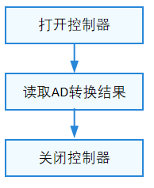

# ADC<a name="1"></a>

-   [概述](#section1)
-   [接口说明](#section2)
-   [使用指导](#section3)
    -   [使用流程](#section4)
    -   [打开ADC设备](#section5)
    -   [读取AD转换结果](#section6)
    -   [关闭ADC设备](#section7)

-   [使用实例](#section8)

## 概述<a name="section1"></a>

-   ADC（Analog to Digital Converter），即模拟-数字转换器，是一种将模拟信号转换成对应数字信号的设备。

-   ADC接口定义了完成ADC传输的通用方法集合，包括：
    -   ADC设备管理：打开或关闭ADC设备。
    -   ADC读取转换结果：读取AD转换结果。

    **图 1**  ADC物理连线示意图<a name="fig1"></a>  
    

## 接口说明<a name="section2"></a>

**表 1**  ADC驱动API接口功能介绍

<a name="table1"></a>

<table><thead align="left"><tr><th class="cellrowborder" valign="top" width="18.63%"><p>功能分类</p>
</th>
<th class="cellrowborder" valign="top" width="28.03%"><p>接口名</p>
</th>
<th class="cellrowborder" valign="top" width="53.339999999999996%"><p>描述</p>
</th>
</tr>
</thead>
<tbody><tr><td class="cellrowborder" bgcolor="#ffffff" rowspan="2" valign="top" width="18.63%"><p>ADC设备管理接口</p>
</td>
<td class="cellrowborder" valign="top" width="28.03%"><p>AdcOpen</p>
</td>
<td class="cellrowborder" valign="top" width="53.339999999999996%">打开ADC设备</p>
</td>
</tr>
<tr><td class="cellrowborder" valign="top"><p>AdcClose</p>
</td>
<td valign="top"><p>关闭ADC设备</p>
</td>
</tr>
<tr><td class="cellrowborder" bgcolor="#ffffff" valign="top" width="18.63%"><p>ADC读取转换结果接口</p>
</td>
<td class="cellrowborder" valign="top" width="28.03%"><p>AdcRead</p>
</td>
<td class="cellrowborder" valign="top" width="53.339999999999996%"><p>读取AD转换结果值</p>
</td>
</tr>
</table>

## 使用指导<a name="section3"></a>

### 使用流程<a name="section4"></a>

使用ADC设备的一般流程如[图2](#fig2)所示。

 **图 2**  ADC使用流程图<a name="fig2"></a>  
 

### 打开ADC设备<a name="section5"></a>

在进行AD转换之前，首先要调用AdcOpen打开ADC设备。

```c
DevHandle AdcOpen(int16_t number);
```

**表 2**  AdcOpen参数和返回值描述

<a name="table2"></a>

<table><thead align="left"><tr><th class="cellrowborder" valign="top" width="20.66%"><p>参数</strong></p>
</th>
<th class="cellrowborder" valign="top" width="79.34%"><p><strong>参数描述</strong></p>
</th>
</tr>
</thead>
<tbody><tr><td class="cellrowborder" valign="top" width="20.66%"><p>number</p>
</td>
<td class="cellrowborder" valign="top" width="79.34%"><p>ADC设备号</p>
</td>
</tr>
<tr><td class="cellrowborder" valign="top" width="20.66%"><p><strong>返回值</strong></p>
</td>
<td class="cellrowborder" valign="top" width="79.34%"><p><strong>返回值描述</strong></p>
</td>
</tr>
<tr><td class="cellrowborder" valign="top" width="20.66%"><p>NULL</p>
</td>
<td class="cellrowborder" valign="top" width="79.34%"><p>打开ADC设备失败</p>
</td>
</tr>
<tr><td class="cellrowborder" valign="top" width="20.66%"><p>设备句柄</p>
</td>
<td class="cellrowborder" valign="top" width="79.34%"><p>打开的ADC设备句柄</p>
</td>
</tr>
</tbody>
</table>

假设系统中存在2个ADC设备，编号从0到1，那么我们现在打开1号设备。

```c
DevHandle adcHandle = NULL;  /* ADC设备句柄 /

/* 打开ADC设备 */
adcHandle = AdcOpen(1);
if (adcHandle == NULL) {
    HDF_LOGE("AdcOpen: failed\n");
    return;
}
```

### 读取AD转换结果<a name="section6"></a>

```c
int32_t AdcRead(DevHandle handle, uint32_t channel, uint32_t *val);
```

**表 3**  AdcRead参数和返回值描述

<a name="table3"></a>

<table><thead align="left"><tr><th class="cellrowborder" valign="top" width="50%"><p><strong>参数</strong></p>
</th>
<th class="cellrowborder" valign="top" width="50%"><p><strong>参数描述</strong></p>
</th>
</tr>
</thead>
<tbody><tr><td class="cellrowborder" valign="top" width="50%"><p>handle</p>
</td>
<td class="cellrowborder" valign="top" width="50%"><p>ADC设备句柄</p>
</td>
</tr>
<tr><td class="cellrowborder" valign="top" width="50%"><p>channel</p>
</td>
<td class="cellrowborder"valign="top" width="50%"><p>ADC设备通道号</p>
</td>
</tr>
<tr><td class="cellrowborder" valign="top" width="50%"><p>val</p>
</td>
<td class="cellrowborder" valign="top" width="50%"><p>AD转换结果</p>
</td>
</tr>
<tr><td class="cellrowborder" valign="top" width="50%"><p><strong>返回值</strong></p>
</td>
<td class="cellrowborder" valign="top" width="50%"><p><strong>返回值描述</strong></p>
</td>
</tr>
<tr><td class="cellrowborder" valign="top" width="50%"><p>0</p>
</td>
<td class="cellrowborder" valign="top" width="50%"><p>读取成功</p>
</td>
</tr>
<tr><td class="cellrowborder" valign="top" width="50%"><p>负数</p>
</td>
<td class="cellrowborder" valign="top" width="50%"><p>读取失败</p>
</td>
</tr>
</tbody>
</table>

### 关闭ADC设备<a name="section7"></a>

ADC通信完成之后，需要关闭ADC设备。
```c
void AdcClose(DevHandle handle); 
```
**表 4**  AdcClose参数和返回值描述

<a name="table4"></a>

<table><thead align="left"><tr><th class="cellrowborder" valign="top" width="50%"><p>参数</p>
</th>
<th class="cellrowborder" valign="top" width="50%"><p>参数描述</p>
</th>
</tr>
</thead>
<tbody><tr><td class="cellrowborder" valign="top" width="50%"><p>handle</p>
</td>
<td class="cellrowborder" valign="top" width="50%"><p>ADC设备句柄</p>
</td>
</tr>
<tr><td class="cellrowborder" valign="top" width="50%"><p><strong>返回值</strong></p>
</td>
<td class="cellrowborder" valign="top" width="50%"><p><strong>返回值描述</strong></p>
</td>
</tr>
<tr><td class="cellrowborder" valign="top" width="50%"><p>无</p>
</td>
<td class="cellrowborder" valign="top" width="50%"><p>无</p>
</td>
</tr>
</tbody>
</table>

关闭ADC设备示例：

```c
AdcClose(adcHandle); /* 关闭ADC设备 */
```

## 使用实例<a name="section8"></a>

本例程以操作开发板上的ADC设备为例，详细展示ADC接口的完整使用流程。

本例拟对Hi3516DV300某开发板上ADC设备进行简单的读取操作，基本硬件信息如下：

-   SOC：hi3516dv300。

-   原理图信息：电位器挂接在0号ADC设备1通道下。

本例程对测试ADC进行连续读取操作，测试ADC功能是否正常。

示例如下：

```c
#include "adc_if.h"          /* ADC标准接口头文件 */
#include "hdf_log.h"         /* 标准日志打印头文件 */

/* 设备号0，通道号1 */ 
#define ADC_DEVICE_NUM 0
#define ADC_CHANNEL_NUM 1

/* ADC例程总入口 */ 
static int32_t TestCaseAdc(void)
{
    int32_t i;
    int32_t ret;
    DevHandle adcHandle;
    uint32_t Readbuf[30] = {0};

    /* 打开ADC设备 */ 
    adcHandle = AdcOpen(ADC_DEVICE_NUM);
    if (adcHandle == NULL) {
        HDF_LOGE("%s: Open ADC%u fail!", __func__, ADC_DEVICE_NUM);
        return -1;
    }

    /* 连续进行30次AD转换并读取转换结果 */ 
    for (i = 0; i < 30; i++) {
        ret = AdcRead(adcHandle, ADC_CHANNEL_NUM, &Readbuf[i]);
        if (ret != HDF_SUCCESS) {
            HDF_LOGE("%s: tp ADC write reg fail!:%d", __func__, ret);
            AdcClose(adcHandle);
            return -1;
        }
    }
    HDF_LOGI("%s: ADC read successful!", __func__);

    /* 访问完毕关闭ADC设备 */ 
    AdcClose(adcHandle);

    return 0;
}
```

