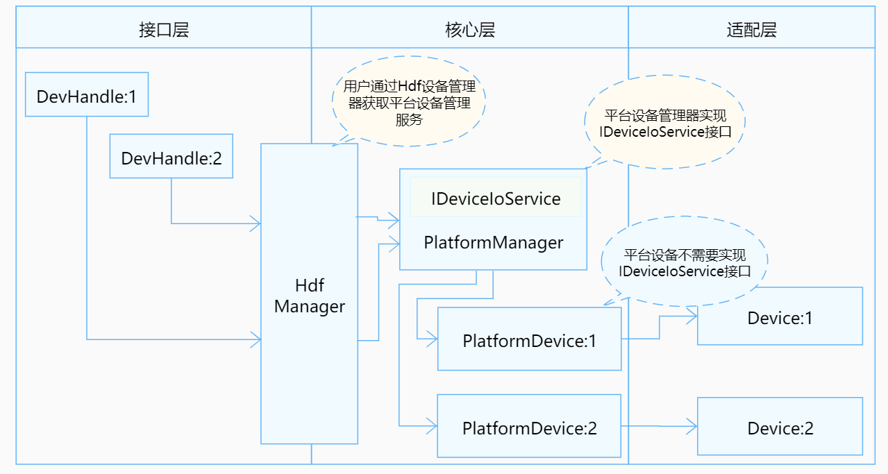

# ADC 

- [概述](#1)
- [开发步骤](#2)
- [开发实例](#3)

## 概述 <a name="1"></a>

ADC（Analog to Digital Converter），即模拟-数字转换器，是一种将模拟信号转换成对应数字信号的设备，在HDF框架中，ADC模块接口适配模式采用统一服务模式，这需要一个设备服务来作为ADC模块的管理器，统一处理外部访问，这会在配置文件中有所体现。统一服务模式适合于同类型设备对象较多的情况，如ADC可能同时具备十几个控制器，采用独立服务模式需要配置更多的设备节点，且服务会占据内存资源。



## 开发步骤 <a name="2"></a>

ADC模块适配的三个环节是配置属性文件，实例化驱动入口，以及实例化核心层接口函数。

1. **实例化驱动入口：**   
   
   - 实例化HdfDriverEntry结构体成员。
   - 调用HDF_INIT将HdfDriverEntry实例化对象注册到HDF框架中。
   
2. **配置属性文件：**   

   - 在device_info.hcs文件中添加deviceNode描述。
   - 【可选】添加adc_config.hcs器件属性文件。

3. **实例化ADC控制器对象：**   

   - 初始化AdcDevice成员。
   - 实例化AdcDevice成员AdcMethod，其定义和成员说明见下

4. **驱动调试：**
    - 【可选】针对新增驱动程序，建议验证驱动基本功能，例如挂载后的信息反馈，信号采集的成功与否等。

>  **说明：** 
> AdcMethod定义
> 
> ```c
> struct AdcMethod {
>   int32_t (*read)(struct AdcDevice *device, uint32_t channel, uint32_t *val);
>   int32_t (*start)(struct AdcDevice *device);
>   int32_t (*stop)(struct AdcDevice *device);
> };
> ```
> 
> 表1 AdcMethod结构体成员的回调函数功能说明
> 
> |函数成员|入参|出参|返回值|功能|
> |-|-|-|-|-|
> |read|**device**: 结构体指针，核心层ADC控制器;<br />**channel**：uint32_t，传入的通道号;|**val**：uint32_t指针，要传出的信号数据;|HDF_STATUS相关状态|读取ADC采样的信号数据|
> |stop  |**device**: 结构体指针，核心层ADC控制器;|无|HDF_STATUS相关状态|关闭ADC设备|
> |start |**device**: 结构体指针，核心层ADC控制器;|无|HDF_STATUS相关状态|开启ADC设备|


## 开发实例 <a name="3"></a>

接下来以 adc_hi35xx.c 为示例， 展示需要厂商提供哪些内容来完整实现设备功能

1. 驱动开发首先需要实例化驱动入口，驱动入口必须为HdfDriverEntry（在 hdf_device_desc.h 中定义）类型的全局变量，且moduleName要和device_info.hcs中保持一致。HDF框架会将所有加载的驱动的HdfDriverEntry对象首地址汇总，形成一个类似数组的段地址空间，方便上层调用。

    一般在加载驱动时HDF会先调用Bind函数，再调用Init函数加载该驱动。当Init调用异常时，HDF框架会调用Release释放驱动资源并退出。

- ADC驱动入口参考

    > ADC模块这种类型的控制器会出现很多个设备挂接的情况，因而在HDF框架中首先会为这类型的设备创建一个管理器对象，并同时对外发布一个管理器服务来统一处理外部访问。这样，用户需要打开某个设备时，会先获取到管理器服务，然后管理器服务根据用户指定参数查找到指定设备。
    >
    > ADC管理器服务的驱动由核心层实现，**厂商不需要关注这部分内容的实现，这个但在实现Init函数的时候需要调用核心层的AdcDeviceAdd函数，它会实现相应功能。**

    ```c
    static struct HdfDriverEntry g_hi35xxAdcDriverEntry = {
     .moduleVersion = 1,
     .Init = Hi35xxAdcInit,
     .Release = Hi35xxAdcRelease,
     .moduleName = "hi35xx_adc_driver",//【必要且与 HCS 里面的名字匹配】
    };
    HDF_INIT(g_hi35xxAdcDriverEntry);   //调用HDF_INIT将驱动入口注册到HDF框架中
    
    //核心层adc_core.c管理器服务的驱动入口
    struct HdfDriverEntry g_adcManagerEntry = {
     .moduleVersion = 1,
     .Init     = AdcManagerInit,
     .Release  = AdcManagerRelease,
     .moduleName = "HDF_PLATFORM_ADC_MANAGER",//这与device_info文件中device0对应
    };
    HDF_INIT(g_adcManagerEntry);
    ```

2. 完成驱动入口注册之后，下一步请在device_info.hcs文件中添加deviceNode信息，并在adc_config.hcs中配置器件属性。deviceNode信息与驱动入口注册相关，器件属性值对于厂商驱动的实现以及核心层AdcDevice相关成员的默认值或限制范围有密切关系。

    **统一服务模式**的特点是device_info文件中第一个设备节点必须为ADC管理器，其各项参数必须如下设置: 
    
    |成员名|值|
    |-|-|
    |moduleName | 固定为 HDF_PLATFORM_ADC_MANAGER|
    |serviceName| 无|
    |policy| 具体配置为0，不发布服务|
    |deviceMatchAttr| 没有使用，可忽略|
    
    **从第二个节点开始配置具体ADC控制器信息**，此节点并不表示某一路ADC控制器，而是代表一个资源性质设备，用于描述一类ADC控制器的信息。**本例只有一个ADC设备，如有多个设备，则需要在device_info文件增加deviceNode信息，以及在adc_config文件中增加对应的器件属性**。

- device_info.hcs 配置参考

    ```c
    root {
        device_info {
        platform :: host {
        device_adc :: device {
        device0 :: deviceNode {
            policy = 0;
            priority = 50;
            permission = 0644;
            moduleName = "HDF_PLATFORM_ADC_MANAGER";
            serviceName = "HDF_PLATFORM_ADC_MANAGER";
        }
        device1 :: deviceNode {
            policy = 0;         // 等于0，不需要发布服务
            priority = 55;      // 驱动启动优先级
            permission = 0644;  // 驱动创建设备节点权限
            moduleName = "hi35xx_adc_driver";        //【必要】用于指定驱动名称，需要与期望的驱动Entry中的moduleName一致；
            serviceName = "HI35XX_ADC_DRIVER";       //【必要】驱动对外发布服务的名称，必须唯一
            deviceMatchAttr = "hisilicon_hi35xx_adc";//【必要】用于配置控制器私有数据，要与adc_config.hcs中对应控制器保持一致
            }                                        // 具体的控制器信息在 adc_config.hcs 中
          }
        }
      }
    }
    ```

- adc_config.hcs 配置参考

    ```c
    root {
    platform {
        adc_config_hi35xx {
        match_attr = "hisilicon_hi35xx_adc";
        template adc_device {
            regBasePhy = 0x120e0000;//寄存器物理基地址
            regSize = 0x34;         //寄存器位宽
            deviceNum = 0;          //设备号
            validChannel = 0x1;     //有效通道
            dataWidth = 10;         //信号接收的数据位宽
            scanMode = 1;           //扫描模式
            delta = 0;              //delta参数
            deglitch = 0;            
            glitchSample = 5000;     
            rate = 20000;            
        }
        device_0 :: adc_device {
            deviceNum = 0;
            validChannel = 0x2;
        }
        }
    }
    }
    ```

3. 完成驱动入口注册之后，最后一步就是以核心层AdcDevice对象的初始化为核心，包括厂商自定义结构体（传递参数和数据），实例化AdcDevice成员AdcMethod（让用户可以通过接口来调用驱动底层函数），实现HdfDriverEntry成员函数（Bind，Init，Release）


- 自定义结构体参考
  
    > 从驱动的角度看，自定义结构体是参数和数据的载体，而且adc_config.hcs文件中的数值会被HDF读入通过DeviceResourceIface来初始化结构体成员，其中一些重要数值也会传递给核心层AdcDevice对象，例如设备号、总线号等。

    ```c
    struct Hi35xxAdcDevice {
        struct AdcDevice device;//【必要】是核心层控制对象，具体描述见下面
        volatile unsigned char *regBase;//【必要】寄存器基地址
        volatile unsigned char *pinCtrlBase;
        uint32_t regBasePhy;    //【必要】寄存器物理基地址
        uint32_t regSize;       //【必要】寄存器位宽
        uint32_t deviceNum;     //【必要】设备号
        uint32_t dataWidth;     //【必要】信号接收的数据位宽
        uint32_t validChannel;  //【必要】有效通道
        uint32_t scanMode;      //【必要】扫描模式
        uint32_t delta;
        uint32_t deglitch;
        uint32_t glitchSample;
        uint32_t rate;          //【必要】采样率
    };
    
    //AdcDevice是核心层控制器结构体，其中的成员在Init函数中会被赋值
    struct AdcDevice {
        const struct AdcMethod *ops;
        OsalSpinlock spin;
        uint32_t devNum;
        uint32_t chanNum;
        const struct AdcLockMethod *lockOps;
        void *priv;
    };
    ```


- **【重要】** AdcDevice成员回调函数结构体AdcMethod的实例化，AdcLockMethod回调函数结构体本例未实现，若要实例化，可参考I2C驱动开发，其他成员在Init函数中初始化

    ```c 
    static const struct AdcMethod g_method = {
        .read = Hi35xxAdcRead,
        .stop = Hi35xxAdcStop,
        .start = Hi35xxAdcStart,
    };
    ```

- **init函数参考**

    > **入参：** 
    >  HdfDeviceObject 是整个驱动对外暴露的接口参数，具备 HCS 配置文件的信息
    > 
    > **返回值：**
    > HDF_STATUS相关状态 （下表为部分展示，如需使用其他状态，可见//drivers/framework/include/utils/hdf_base.h中HDF_STATUS 定义）
    > 
    > |状态(值)|问题描述|
    > |:-|:-:|
    > |HDF_ERR_INVALID_OBJECT|控制器对象非法|
    > |HDF_ERR_INVALID_PARAM |参数非法|
    > |HDF_ERR_MALLOC_FAIL   |内存分配失败|
    > |HDF_ERR_IO            |I/O 错误|
    > |HDF_SUCCESS           |传输成功|
    > |HDF_FAILURE           |传输失败|
    > 
    > **函数说明：**
    > 初始化自定义结构体对象，初始化AdcDevice成员，调用核心层AdcDeviceAdd函数。
    
    ```c
    static int32_t Hi35xxAdcInit(struct HdfDeviceObject *device)
    {
        int32_t ret;
        struct DeviceResourceNode *childNode = NULL;
        ...
        //遍历、解析adc_config.hcs中的所有配置节点，并分别进行初始化，需要调用 Hi35xxAdcParseInit函数
        DEV_RES_NODE_FOR_EACH_CHILD_NODE(device->property, childNode) {
            ret = Hi35xxAdcParseInit(device, childNode);//函数定义见下
            ...
        }
        return ret;
    }
    
    static int32_t Hi35xxAdcParseInit(struct HdfDeviceObject *device, struct DeviceResourceNode *node)
    {
    int32_t ret;
    struct Hi35xxAdcDevice *hi35xx = NULL;    //【必要】自定义结构体对象
    (void)device;
    
    hi35xx = (struct Hi35xxAdcDevice *)OsalMemCalloc(sizeof(*hi35xx)); //【必要】内存分配
    ...
    ret = Hi35xxAdcReadDrs(hi35xx, node);     //【必要】将adc_config文件的默认值填充到结构体中
    ...
    hi35xx->regBase = OsalIoRemap(hi35xx->regBasePhy, hi35xx->regSize);//【必要】地址映射
    ...
    hi35xx->pinCtrlBase = OsalIoRemap(HI35XX_ADC_IO_CONFIG_BASE, HI35XX_ADC_IO_CONFIG_SIZE);
    ...
    Hi35xxAdcDeviceInit(hi35xx);              //【必要】ADC设备的初始化
    hi35xx->device.priv = (void *)node;       //【必要】存储设备属性
    hi35xx->device.devNum = hi35xx->deviceNum;//【必要】初始化AdcDevice成员
    hi35xx->device.ops = &g_method;           //【必要】AdcMethod的实例化对象的挂载
    ret = AdcDeviceAdd(&hi35xx->device);      //【必要且重要】调用此函数填充核心层结构体，返回成功信号后驱动才完全接入平台核心层 
    ...
    return HDF_SUCCESS;
    
    __ERR__:
    if (hi35xx != NULL) {                     //不成功的话，需要反向执行初始化相关函数
        if (hi35xx->regBase != NULL) {
        OsalIoUnmap((void *)hi35xx->regBase);
        hi35xx->regBase = NULL;
        }
        AdcDeviceRemove(&hi35xx->device);
        OsalMemFree(hi35xx);
    }
    return ret;
    }
    ```

- **Release 函数参考**

    > **入参：** 
    > HdfDeviceObject 是整个驱动对外暴露的接口参数，具备 HCS 配置文件的信息 
    > 
    > **返回值：**
    > 无
    > 
    > **函数说明：**
    > 释放内存和删除控制器，该函数需要在驱动入口结构体中赋值给 Release 接口， 当HDF框架调用Init函数初始化驱动失败时，可以调用 Release 释放驱动资源。所有强制转换获取相应对象的操作**前提**是在Init函数中具备对应赋值的操作。
    
    ```c
    static void Hi35xxAdcRelease(struct HdfDeviceObject *device)
    {
    const struct DeviceResourceNode *childNode = NULL;
    ...
    //遍历、解析adc_config.hcs中的所有配置节点，并分别进行release操作
    DEV_RES_NODE_FOR_EACH_CHILD_NODE(device->property, childNode) {
        Hi35xxAdcRemoveByNode(childNode);//函数定义见下
    }
    }
    
    static void Hi35xxAdcRemoveByNode(const struct DeviceResourceNode *node)
    {
    int32_t ret;
    int32_t deviceNum;
    struct AdcDevice *device = NULL;
    struct Hi35xxAdcDevice *hi35xx = NULL;
    struct DeviceResourceIface *drsOps = NULL;
    
    drsOps = DeviceResourceGetIfaceInstance(HDF_CONFIG_SOURCE);
    ...
    ret = drsOps->GetUint32(node, "deviceNum", (uint32_t *)&deviceNum, 0);
    ...
    //可以调用AdcDeviceGet函数通过设备的deviceNum获取AdcDevice对象， 以及调用AdcDeviceRemove函数来释放AdcDevice对象的内容
    device = AdcDeviceGet(deviceNum);
    if (device != NULL && device->priv == node) {
        AdcDevicePut(device);   
        AdcDeviceRemove(device);                  //【必要】主要是从管理器驱动那边移除AdcDevice对象
        hi35xx = (struct Hi35xxAdcDevice *)device;//【必要】通过强制转换获取自定义的对象并进行release操作
        OsalIoUnmap((void *)hi35xx->regBase);
        OsalMemFree(hi35xx);
    }
    return;
    }
    ```