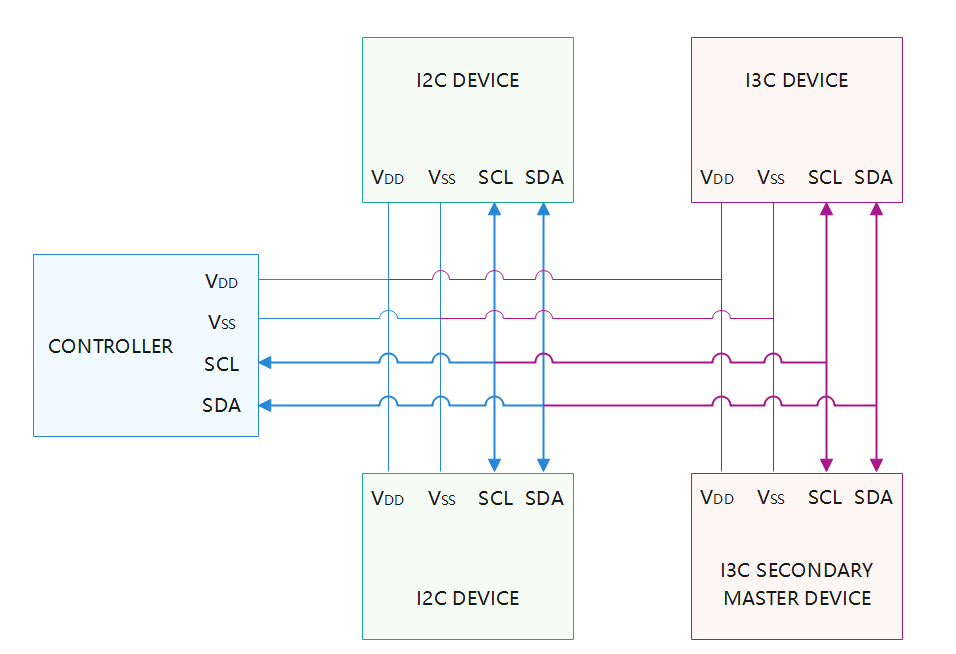
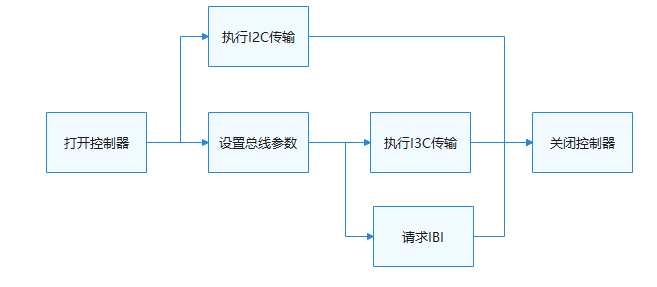

# I3C<a name="1"></a>

-   [概述](#section1)
-   [接口说明](#section2)
-   [使用指导](#section3)
    -   [使用流程](#section4)
    -   [打开I3C控制器](#section5)
    -   [进行I3C通信](#section6)
    -   [获取I3C控制器配置](#section7)
    -   [配置I3C控制器](#section8)
    -   [请求IBI（带内中断）](#section9)
    -   [释放IBI（带内中断）](#section10)
    -   [关闭I3C控制器](#section11)
    
-   [使用实例](#section12)

## 概述<a name="section1"></a>

- I3C（Improved Inter Integrated Circuit）总线是由MIPI Alliance开发的一种简单、低成本的双向二线制同步串行总线。
- I3C总线向下兼容传统的I2C设备，同时增加了带内中断（In-Bind Interrupt）功能，支持I3C设备进行热接入操作，弥补了I2C总线需要额外增加中断线来完成中断的不足。
- I3C总线上允许同时存在I2C设备、I3C从设备和I3C次级主设备。
-   I3C接口定义了完成I3C传输的通用方法集合，包括：

    -   I3C控制器管理：打开或关闭I3C控制器。
    -   I3C控制器配置：获取或配置I3C控制器参数。
    -   I3C消息传输：通过消息传输结构体数组进行自定义传输。
    -   I3C带内中断：请求或释放带内中断。
 -    I3C的物理连接如[图1](#fig1)所示：  
    **图 1**  I3C物理连线示意图<a name="fig1"></a>  
    

## 接口说明<a name="section2"></a>

**表 1**  I3C驱动API接口功能介绍

<a name="table1"></a>

<table><thead align="left"><tr><th class="cellrowborder" valign="top" width="18.63%"><p>功能分类</p>
</th>
<th class="cellrowborder" valign="top" width="28.03%"><p>接口名</p>
</th>
<th class="cellrowborder" valign="top" width="53.339999999999996%"><p>描述</p>
</th>
</tr>
</thead>
<tbody><tr><td class="cellrowborder" bgcolor="#ffffff" rowspan="2" valign="top" width="18.63%"><p>I3C控制器管理接口</p>
</td>
<td class="cellrowborder" valign="top" width="28.03%"><p>I3cOpen</p>
</td>
<td class="cellrowborder" valign="top" width="53.339999999999996%">打开I3C控制器</p>
</td>
</tr>
<tr><td class="cellrowborder" valign="top"><p>I3cClose</p>
</td>
<td class="cellrowborder" valign="top"><p>关闭I3C控制器</p>
</td>
</tr>
<tr><td class="cellrowborder" bgcolor="#ffffff" valign="top" width="18.63%"><p>I3c消息传输接口</p>
</td>
<td class="cellrowborder" valign="top" width="28.03%"><p>I3cTransfer</p>
</td>
<td class="cellrowborder" valign="top" width="53.339999999999996%"><p>自定义传输</p>
</td>
</tr>
<tr><td class="cellrowborder" bgcolor=ffffff rowspan="2" valign="top" width="18.63%"><p>I3C控制器配置接口</p>
</td>
<td class="cellrowborder" valign="top" width="28.03%"><p>I3cSetConfig</p>
</td>
<td class="cellrowborder"valign="top" width="53.339999999999996%">配置I3C控制器</p>
</td>
</tr>
<tr><td class="cellrowborder" valign="top"><p>I3cGetConfig</p>
</td>
<td class="cellrowborder" valign="top"><p>获取I3C控制器配置</p>
</td>
</tr>
<tr><td class="cellrowborder" bgcolor=ffffff rowspan="2" valign="top" width="18.63%"><p>I3C带内中断接口</p>
</td>
<td class="cellrowborder" valign="top" width="28.03%"><p>I3cRequestIbi</p>
</td>
<td class="cellrowborder" valign="top" width="53.339999999999996%">请求带内中断</p>
</td>
</tr>
<tr><td class="cellrowborder" valign="top"><p>I3cFreeIbi</p>
</td>
<td class="cellrowborder" valign="top"><p>释放带内中断</p>
</td>
</tr>
</table>


> **说明：** 
>本文涉及的所有接口，仅限内核态使用，不支持在用户态使用。

## 使用指导<a name="section3"></a>

### 使用流程<a name="section4"></a>

I3C的使用流程如[图2](#fig2)所示。

**图 2**  I3C使用流程图<a name="fig2"></a>  


### 打开I3C控制器<a name="section5"></a>

在进行I3C通信前，首先要调用I3cOpen打开I3C控制器。
```c
DevHandle I3cOpen(int16_t number);
```

**表 2**  I3cOpen参数和返回值描述

<a name="table2"></a>

<table><thead align="left"><tr><th class="cellrowborder" valign="top" width="20.66%"><p>参数</strong></p>
</th>
<th class="cellrowborder" valign="top" width="79.34%"><p><strong>参数描述</strong></p>
</th>
</tr>
</thead>
<tbody><tr><td class="cellrowborder" valign="top" width="20.66%"><p>number</p>
</td>
<td class="cellrowborder" valign="top" width="79.34%"><p>I3C控制器号</p>
</td>
</tr>
<tr><td class="cellrowborder" valign="top" width="20.66%"><p><strong>返回值</strong></p>
</td>
<td class="cellrowborder" valign="top" width="79.34%"><p><strong>返回值描述</strong></p>
</td>
</tr>
<tr><td class="cellrowborder" valign="top" width="20.66%"><p>NULL</p>
</td>
<td class="cellrowborder" valign="top" width="79.34%"><p>打开I3C控制器失败</p>
</td>
</tr>
<tr><td class="cellrowborder" valign="top" width="20.66%"><p>控制器句柄</p>
</td>
<td class="cellrowborder" valign="top" width="79.34%"><p>打开的I3C控制器句柄</p>
</td>
</tr>
</tbody>
</table>

假设系统中存在8个I3C控制器，编号从0到7，那么我们现在打开1号控制器：

```c
DevHandle i3cHandle = NULL;  /* I3C控制器句柄 /

/* 打开I3C控制器 */
i3cHandle = I3cOpen(1);
if (i3cHandle == NULL) {
    HDF_LOGE("I3cOpen: failed\n");
    return;
}
```

### 进行I3C通信<a name="section6"></a>

消息传输
```c
int32_t I3cTransfer(DevHandle handle, struct I3cMsg *msgs, int16_t count, enum TransMode mode);
```

**表 3**  I3cTransfer参数和返回值描述

<a name="table3"></a>

<table><thead align="left"><tr><th class="cellrowborder" valign="top" width="50%"><p><strong>参数</strong></p>
</th>
<th class="cellrowborder" valign="top" width="50%"><p><strong>参数描述</strong></p>
</th>
</tr>
</thead>
<tbody><tr><td class="cellrowborder" valign="top" width="50%"><p>handle</p>
</td>
<td class="cellrowborder" valign="top" width="50%"><p>I3C控制器句柄</p>
</td>
</tr>
<tr><td class="cellrowborder" valign="top" width="50%"><p>msgs</p>
</td>
<td class="cellrowborder" valign="top" width="50%"><p>待传输数据的消息结构体数组</p>
</td>
</tr>
<tr><td class="cellrowborder" valign="top" width="50%"><p>count</p>
</td>
<td class="cellrowborder" valign="top" width="50%"><p>消息数组长度</p>
</td>
</tr>
<tr><td class="cellrowborder" valign="top" width="50%"><p>mode</p>
</td>
<td class="cellrowborder" valign="top" width="50%"><p>传输模式，0：I2C模式；1：I3C模式；2：发送CCC（Common Command Code）</p>
</td>
</tr>
<tr><td class="cellrowborder" valign="top" width="50%"><p><strong>返回值</strong></p>
</td>
<td class="cellrowborder" valign="top" width="50%"><p><strong>返回值描述</strong></p>
</td>
</tr>
<tr><td class="cellrowborder" valign="top" width="50%"><p>正整数</p>
</td>
<td class="cellrowborder" valign="top" width="50%"><p>成功传输的消息结构体数目</p>
</td>
</tr>
<tr><td class="cellrowborder" valign="top" width="50%"><p>负数</p>
</td>
<td class="cellrowborder" valign="top" width="50%"><p>执行失败</p>
</td>
</tr>
</tbody>
</table>

I3C传输消息类型为I3cMsg，每个传输消息结构体表示一次读或写，通过一个消息数组，可以执行若干次的读写组合操作。

```c
int32_t ret;
uint8_t wbuff[2] = { 0x12, 0x13 };
uint8_t rbuff[2] = { 0 };
struct I3cMsg msgs[2]; /* 自定义传输的消息结构体数组 */
msgs[0].buf = wbuff;    /* 写入的数据 */
msgs[0].len = 2;        /* 写入数据长度为2 */
msgs[0].addr = 0x3F;    /* 写入设备地址为0x3F */
msgs[0].flags = 0;      /* 传输标记为0，默认为写 */
msgs[1].buf = rbuff;    /* 要读取的数据 */
msgs[1].len = 2;        /* 读取数据长度为2 */
msgs[1].addr = 0x3F;    /* 读取设备地址为0x3F */
msgs[1].flags = I3C_FLAG_READ /* I3C_FLAG_READ置位 */
/* 进行一次I2C模式自定义传输，传输的消息个数为2 */
ret = I3cTransfer(i3cHandle, msgs, 2, I2C_MODE);
if (ret != 2) {
    HDF_LOGE("I3cTransfer: failed, ret %d\n", ret);
    return;
}
```

> **注意：** 
>-   I3cMsg结构体中的设备地址不包含读写标志位，读写信息由flags成员变量的读写控制位传递。
>-   本函数不对消息结构体个数做限制，其最大个数度由具体I3C控制器决定。
>-   本函数不对每个消息结构体中的数据长度做限制，同样由具体I3C控制器决定。
>-   本函数可能会引起系统休眠，禁止在中断上下文调用。

### 获取I3C控制器配置<a name="section7"></a>

```c
int32_t I3cGetConfig(DevHandle handle, struct I3cConfig *config);
```

**表 4**  I3cGetConfig参数和返回值描述

<a name="table4"></a>

<table><thead align="left"><tr><th class="cellrowborder" valign="top" width="50%"><p><strong>参数</strong></p>
</th>
<th class="cellrowborder" valign="top" width="50%"><p><strong>参数描述</strong></p>
</th>
</tr>
</thead>
<tbody><tr><td class="cellrowborder" valign="top" width="50%"><p>handle</p>
</td>
<td class="cellrowborder" valign="top" width="50%"><p>I3C控制器句柄</p>
</td>
</tr>
<tr><td class="cellrowborder" valign="top" width="50%"><p>config</p>
</td>
<td class="cellrowborder" valign="top" width="50%"><p>I3C控制器配置</p>
</td>
</tr>
<tr><td class="cellrowborder" valign="top" width="50%"><p><strong>返回值</strong></p>
</td>
<td class="cellrowborder" valign="top" width="50%"><p><strong>返回值描述</strong></p>
</td>
</tr>
<tr><td class="cellrowborder" valign="top" width="50%"><p>0</p>
</td>
<td class="cellrowborder" valign="top" width="50%"><p>获取成功</p>
</td>
</tr>
<tr><td class="cellrowborder" valign="top" width="50%"><p>负数</p>
</td>
<td class="cellrowborder" valign="top" width="50%"><p>获取失败</p>
</td>
</tr>
</tbody>
</table>

### 配置I3C控制器<a name="section8"></a>

```c
int32_t I3cSetConfig(DevHandle handle, struct I3cConfig *config);
```

**表 5**  I3cSetConfig参数和返回值描述

<a name="table5"></a>

<table><thead align="left"><tr><th class="cellrowborder" valign="top" width="50%"><p><strong>参数</strong></p>
</th>
<th class="cellrowborder" valign="top" width="50%"><p><strong>参数描述</strong></p>
</th>
</tr>
</thead>
<tbody><tr><td class="cellrowborder" valign="top" width="50%"><p>handle</p>
</td>
<td class="cellrowborder" valign="top" width="50%"><p>I3C控制器句柄</p>
</td>
</tr>
<tr><td class="cellrowborder" valign="top" width="50%"><p>config</p>
</td>
<td class="cellrowborder" valign="top" width="50%"><p>I3C控制器配置</p>
</td>
</tr>
<tr><td class="cellrowborder" valign="top" width="50%"><p><strong>返回值</strong></p>
</td>
<td class="cellrowborder" valign="top" width="50%"><p><strong>返回值描述</strong></p>
</td>
</tr>
<tr><td class="cellrowborder" valign="top" width="50%"><p>0</p>
</td>
<td class="cellrowborder" valign="top" width="50%"><p>配置成功</p>
</td>
</tr>
<tr><td class="cellrowborder" valign="top" width="50%"><p>负数</p>
</td>
<td class="cellrowborder" valign="top" width="50%"><p>配置失败</p>
</td>
</tr>
</tbody>
</table>

### 请求IBI（带内中断）<a name="section9"></a>

```c
int32_t I3cRequestIbi(DevHandle handle, uint16_t addr, I3cIbiFunc func, uint32_t payload);
```

**表 6**  I3cRequestIbi参数和返回值描述

<a name="table6"></a>

<table><thead align="left"><tr><th class="cellrowborder" valign="top" width="50%"><p><strong>参数</strong></p>
</th>
<th class="cellrowborder" valign="top" width="50%"><p><strong>参数描述</strong></p>
</th>
</tr>
</thead>
<tbody><tr><td class="cellrowborder" valign="top" width="50%"><p>handle</p>
</td>
<td class="cellrowborder" valign="top" width="50%"><p>I3C控制器设备句柄</p>
</td>
</tr>
<tr><td class="cellrowborder" valign="top" width="50%"><p>addr</p>
</td>
<td class="cellrowborder" valign="top" width="50%"><p>I3C设备地址</p>
</td>
</tr>
<tr><td class="cellrowborder" valign="top" width="50%"><p>func</p>
</td>
<td class="cellrowborder" valign="top" width="50%"><p>IBI回调函数</p>
</td>
</tr>
<tr><td class="cellrowborder" valign="top" width="50%"><p>payload</p>
</td>
<td class="cellrowborder" valign="top" width="50%"><p>IBI有效载荷</p>
</td>
</tr>
<tr><td class="cellrowborder" valign="top" width="50%"><p><strong>返回值</strong></p>
</td>
<td class="cellrowborder" valign="top" width="50%"><p><strong>返回值描述</strong></p>
</td>
</tr>
<tr><td class="cellrowborder"valign="top" width="50%"><p>0</p>
</td>
<td class="cellrowborder" valign="top" width="50%"><p>请求成功</p>
</td>
</tr>
<tr><td class="cellrowborder" valign="top" width="50%"><p>负数</p>
</td>
<td class="cellrowborder" valign="top" width="50%"><p>请求失败</p>
</td>
</tr>
</tbody>
</table>

```c
static int32_t TestI3cIbiFunc(DevHandle handle, uint16_t addr, struct I3cIbiData data)
{
    (void)handle;
    (void)addr;
    HDF_LOGD("%s: %.16s", __func__, (char *)data.buf);

    return 0;
}

int32_t I3cTestRequestIbi(void)
{
    DevHandle i3cHandle = NULL;
    int32_t ret;

    /* 打开I3C控制器 */
    i3cHandle = I3cOpen(1);
    if (i3cHandle == NULL) {
        HDF_LOGE("I3cOpen: failed\n");
    return;
}
    ret = I3cRequestIbi(i3cHandle, 0x3F, TestI3cIbiFunc, 16);
    if (ret != 0) {
        HDF_LOGE("%s: Requset IBI failed!", __func__);
        return -1;
    }

    I3cClose(i3cHandle);
    HDF_LOGD("%s: Done", __func__);

    return 0;
}
```

### 释放IBI（带内中断）<a name="section10"></a>

```c
int32_t I3cFreeIbi(DevHandle handle, uint16_t addr);
```

**表 7**  I3cFreeIbi参数和返回值描述

<a name="table7"></a>

<table><thead align="left"><tr><th class="cellrowborder" valign="top" width="50%"><p><strong>参数</strong></p>
</th>
<th class="cellrowborder" valign="top" width="50%"><p><strong>参数描述</strong></p>
</th>
</tr>
</thead>
<tbody><tr><td class="cellrowborder" valign="top" width="50%"><p>handle</p>
</td>
<td class="cellrowborder" valign="top" width="50%"><p>I3C控制器设备句柄</p>
</td>
</tr>
<tr><td class="cellrowborder" valign="top" width="50%"><p>addr</p>
</td>
<td class="cellrowborder" valign="top" width="50%"><p>I3C设备地址</p>
</td>
</tr>
<tr><td class="cellrowborder" valign="top" width="50%"><p><strong>返回值</strong></p>
</td>
<td class="cellrowborder" valign="top" width="50%"><p><strong>返回值描述</strong></p>
</td>
</tr>
<tr><td class="cellrowborder" valign="top" width="50%"><p>0</p>
</td>
<td class="cellrowborder" valign="top" width="50%"><p>释放成功</p>
</td>
</tr>
<tr><td class="cellrowborder" valign="top" width="50%"><p>负数</p>
</td>
<td class="cellrowborder" valign="top" width="50%"><p>释放失败</p>
</td>
</tr>
</tbody>
</table>

```c
I3cFreeIbi(i3cHandle, 0x3F); /* 释放带内中断 */
```

### 关闭I3C控制器<a name="section11"></a>

I3C通信完成之后，需要关闭I3C控制器，关闭函数如下所示：
```c
void I3cClose(DevHandle handle); 
```

**表 4**  I3cClose参数和返回值描述

<a name="table4"></a>

<table><thead align="left"><tr><th class="cellrowborder" valign="top" width="50%"><p>参数</p>
</th>
<th class="cellrowborder" valign="top" width="50%"><p>参数描述</p>
</th>
</tr>
</thead>
<tbody><tr><td class="cellrowborder" valign="top" width="50%"><p>handle</p>
</td>
<td class="cellrowborder" valign="top" width="50%"><p>I3C控制器设备句柄</p>
</td>
</tr>
</tbody>
</table>


```c
I3cClose(i3cHandle); /* 关闭I3C控制器 */
```

## 使用实例<a name="section12"></a>

本例程以操作开发板上的I3C设备为例，详细展示I3C接口的完整使用流程。

由于Hi3516DV300系列SOC没有I3C控制器，本例拟在Hi3516DV300某开发板上对虚拟驱动进行简单的传输操作，基本硬件信息如下：

-   SOC：hi3516dv300。

-   虚拟：I3C地址为0x3f, 寄存器位宽为1字节。

-   原理图信息：虚拟I3C设备挂接在18号和19号I3C控制器下。

本例程进行简单的I3C传输，测试I3C通路是否正常。

示例如下：

```c
#include "i3c_if.h"          /* I3C标准接口头文件 */
#include "i3c_ccc.h"         /* I3C通用命令代码头文件 */
#include "hdf_log.h"         /* 标准日志打印头文件 */
#include "osal_io.h"         /* 标准IO读写接口头文件 */
#include "osal_time.h"       /* 标准延迟&睡眠接口头文件 */

/* 定义一个表示设备的结构体，存储信息 */
struct TestI3cDevice {
    uint16_t busNum;              /* I3C总线号 */ 
    uint16_t addr;                /* I3C设备地址 */ 
    uint16_t regLen;              /* 寄存器字节宽度 */ 
    DevHandle i3cHandle;          /* I3C控制器句柄 */ 
};

/* 基于I3cTransfer方法封装一个寄存器读写的辅助函数， 通过flag表示读或写 */
static int TestI3cReadWrite(struct TestI3cDevice *testDevice, unsigned int regAddr,
    unsigned char *regData, unsigned int dataLen, uint8_t flag)
{
    int index = 0;
    unsigned char regBuf[4] = {0};
    struct I3cMsg msgs[2] = {0};

    /* 单双字节寄存器长度适配 */
    if (testDevice->regLen == 1) { 
        regBuf[index++] = regAddr & 0xFF;
    } else {
        regBuf[index++] = (regAddr >> 8) & 0xFF;
        regBuf[index++] = regAddr & 0xFF;
    }

    /* 填充I3cMsg消息结构 */ 
    msgs[0].addr = testDevice->addr;
    msgs[0].flags = 0; /* 标记为0，表示写入 */ 
    msgs[0].len = testDevice->regLen;
    msgs[0].buf = regBuf;

    msgs[1].addr = testDevice->addr;
    msgs[1].flags = (flag == 1) ? I3C_FLAG_READ : 0; /* 添加读标记位，表示读取 */ 
    msgs[1].len = dataLen;
    msgs[1].buf = regData;

    if (I3cTransfer(testDevice->i3cHandle, msgs, 2, I2C_MODE) != 2) {
        HDF_LOGE("%s: i3c read err", __func__);
        return HDF_FAILURE;
    }
    return HDF_SUCCESS;
}

/* 寄存器读函数 */ 
static inline int TestI3cReadReg(struct TestI3cDevice *testDevice, unsigned int regAddr,
    unsigned char *regData, unsigned int dataLen)
{
    return TestI3cReadWrite(testDevice, regAddr, regData, dataLen, 1);
}

/* 寄存器写函数 */ 
static inline int TestI3cWriteReg(struct TestI3cDevice *testDevice, unsigned int regAddr,
    unsigned char *regData, unsigned int dataLen)
{
    return TestI3cReadWrite(testDevice, regAddr, regData, dataLen, 0);
}

/* I3C例程总入口 */ 
static int32_t TestCaseI3c(void)
{
    int32_t i;
    int32_t ret;
    unsigned char bufWrite[7] = { 0xFF, 0xFF, 0xFF, 0xFF, 0xA, 0xB, 0xC };
    unsigned char bufRead[7] = {0};
    static struct TestI3cDevice testDevice;

    /* 设备信息初始化 */ 
    testDevice.busNum = 18;
    testDevice.addr = 0x3F;
    testDevice.regLen = 1;
    testDevice.i3cHandle = NULL;

    /* 打开I3C控制器 */ 
    testDevice.i3cHandle = I3cOpen(testDevice.busNum);
    if (testDevice.i3cHandle == NULL) {
        HDF_LOGE("%s: Open I3c:%u fail!", __func__, testDevice.busNum);
        return -1;
    }

    /* 向地址为0x3F的设备连续写7字节数据 */ 
    ret = TestI3cWriteReg(&testDevice, 0x3F, bufWrite, 7);
    if (ret != HDF_SUCCESS) {
        HDF_LOGE("%s: test i3c write reg fail!:%d", __func__, ret);
        I3cClose(testDevice.i3cHandle);
        return -1;
    }
    OsalMSleep(10);

    /* 从地址为0x3F的设备连续读7字节数据 */ 
    ret = TestI3cReadReg(&testDevice, 0x3F, bufRead, 7);
    if (ret != HDF_SUCCESS) {
        HDF_LOGE("%s: test i3c read reg fail!:%d", __func__, ret);
        I3cClose(testDevice.i3cHandle);
        return -1;
    }
    HDF_LOGI("%s: test i3c write&read reg success!", __func__);

    /* 访问完毕关闭I3C控制器 */ 
    I3cClose(testDevice.i3cHandle);

    return 0;
}
```