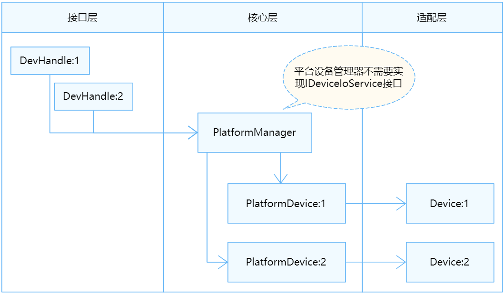
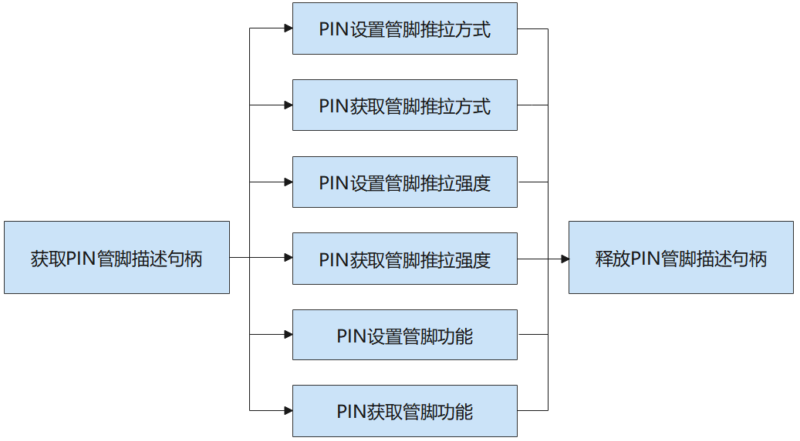

#  PIN

## 概述<a name="section1"></a>

### 功能简介<a name="section2"></a>

PIN即管脚控制器，用于统一管理各SoC厂商管脚资源，对外提供管脚复用功能：包括管脚推拉方式、管脚推拉强度以及管脚功能。
PIN接口定义了操作PIN管脚的通用方法集合，包括：
-   获取/释放管脚描述句柄: 传入管脚名与链表中每个控制器下管脚名进行匹配，匹配则会获取一个管脚描述句柄，操作完PIN管脚后释放该管脚描述句柄。
-   设置/获取管脚推拉方式：推拉方式可以是上拉、下拉以及悬空。
-   设置/获取管脚推拉强度：用户可根据实际设置管脚推拉强度大小。
-   设置/获取管脚功能：通过管脚功能名设置/获取管脚功能，实现管脚复用。

### 基本概念<a name="section3"></a>
PIN是一个软件层面的概念，目的是为了统一各SoC厂商PIN管脚管理，对外提供管脚复用功能，配置PIN管脚的电气特性。

- SoC（System on Chip）

  系统级芯片，也有称作片上系统，通常是面向特定用途将微处理器、模拟IP核、数字IP核和存储器集成在单一芯片的标准产品。

- 管脚复用

  由于芯片自身的引脚数量有限，无法满足日益增多的外接需求。此时可以通过软件层面的寄存器设置，让引脚工作在不同的状态，从而实现相同引脚完成不同功能的目的。

### 运作机制<a name="section4"></a>

在HDF框架中，PIN模块暂不支持用户态，所以不需要发布服务。接口适配模式采用无服务模式，用于不需要在用户态提供API的设备类型。对于没有用户态和内核区分的OS系统，其关联方式是DevHandle直接指向设备对象内核态地址（DevHandle是一个void类型指针）。

PIN模块各分层作用：
- 接口层提供获取PIN管脚、设置PIN管脚推拉方式、获取PIN管脚推拉方式、设置PIN管脚推拉强度、获取PIN管脚推拉强度、设置PIN管脚功能、获取PIN管脚功能、释放PIN管脚的接口。
- 核心层主要提供PIN管脚资源匹配，PIN管脚控制器的添加、移除以及管理的能力，通过钩子函数与适配层交互。
- 适配层主要是将钩子函数的功能实例化，实现具体的功能。

**图 1**  PIN无服务模式<a name="fig14423182615525"></a> 


### 约束与限制<a name="section5"></a>

 PIN模块目前仅支持轻量和小型系统内核（LiteOS）。

 ## 使用指导<a name="section6"></a>

 ### 场景介绍<a name="section7"></a>

  PIN模块仅是一个软件层面的概念，主要工作是管脚资源管理。使用复用管脚时，通过设置管脚功能、设置管脚推拉方式、设置管脚推拉强度来适配指定场景的需求。

### 接口说明<a name="section8"></a>

PIN模块提供的主要接口如[表1](#table1)所示，更多关于接口的介绍请参考对应的API接口文档。

**表 1**  PIN驱动API接口功能介绍
<a name="table1"></a>

| **接口名**                                                   | **描述**         |
| ------------------------------------------------------------ | ---------------- |
| DevHandle PinGet(const char *pinName);                       | 获取管脚描述句柄 |
| void PinPut(DevHandle handle);                               | 释放管脚描述句柄 |
| int32_t PinSetPull(DevHandle handle, enum PinPullType pullType); | 设置管脚推拉方式 |
| int32_t PinGetPull(DevHandle handle, enum PinPullType *pullType); | 获取管脚推拉方式 |
| int32_t PinSetStrength(DevHandle handle, uint32_t strength); | 设置管脚推拉强度 |
| int32_t PinGetStrength(DevHandle handle, uint32_t *strength); | 获取管脚推拉强度 |
| int32_t PinSetFunc(DevHandle handle, const char *funcName);  | 设置管脚功能 |
| int32_t PinGetFunc(DevHandle handle, const char **funcName); | 获取管脚功能 |

> **说明：**<br>
>本文涉及的所有接口，仅限内核态使用，不支持在用户态使用。

### 开发步骤<a name="section9"></a>

使用PIN设备的一般流程如[图2](#fig2)所示。

 **图 2**  PIN使用流程图<a name="fig2"></a>  
 

#### 获取PIN管脚描述句柄

在使用PIN进行管脚操作时，首先要调用PinGet获取管脚描述句柄，该函数会返回匹配传入管脚名的管脚描述句柄。

```
DevHandle PinGet(const char *pinName);
```

**表 2**  PinGet参数和描述

<a name="table2"></a>

| 参数       | 描述                |
| ---------- | ----------------------- |
| pinName    | 管脚名                  |
| **返回值** | **描述**          |
| NULL       | 获取PIN管脚描述句柄失败 |
| handle     | PIN管脚描述句柄         |

假设PIN需要操作的管脚名为P18，获取其管脚描述句柄的示例如下：

```
DevHandle handle = NULL;               /* PIN管脚描述句柄  */
char pinName = "P18";                  /* PIN管脚号 */
handle = PinGet(pinName);
if (handle == NULL) {
    HDF_LOGE("PinGet: get handle failed!\n");
    return;
}
```

#### PIN设置管脚推拉方式

PIN设置管脚推拉方式的函数如下所示：

```
int32_t PinSetPull(DevHandle handle, enum PinPullType pullType);
```

**表 3**  参数和描述

<a name="table3"></a>

| 参数       | 描述                |
| ---------- | ----------------------- |
| handle     | PIN管脚描述句柄         |
| pullType   | PIN管脚推拉方式         |
| **返回值** | **描述**          |
| 0          | PIN设置管脚推拉方式成功 |
| 负数       | PIN设置管脚推拉方式失败 |

假设PIN要设置的管脚推拉方式为上拉，其实例如下：

```
int32_t ret;
enum PinPullType pullTypeNum;
/* PIN设置管脚推拉方式 */
pullTypeNum = 1;
ret = PinSetPull(handle, pullTypeNum);
if (ret != HDF_SUCCESS) {
    HDF_LOGE("PinSetPull: failed, ret %d\n", ret);
    return ret;
}
```

#### PIN获取管脚推拉方式

PIN获取管脚推拉方式的函数如下所示：

```
int32_t PinGetPull(DevHandle handle, enum PinPullType *pullType);
```

**表 4**  PinGetPull参数和描述

<a name="table4"></a>

| 参数       | 描述                  |
| ---------- | ------------------------- |
| handle     | PIN管脚描述句柄           |
| pullType   | 接收PIN管脚推拉方式的指针 |
| **返回值** | **描述**            |
| 0          | PIN获取管脚推拉方式成功   |
| 负数       | PIN获取管脚推拉方式失败   |

PIN获取管脚推拉方式的实例如下：

```
int32_t ret;
enum PinPullType pullTypeNum;
/* PIN获取管脚推拉方式 */
ret = PinGetPull(handle, &pullTypeNum);
if (ret != HDF_SUCCESS) {
    HDF_LOGE("PinGetPull: failed, ret %d\n", ret);
    return ret;
}
```

#### PIN设置管脚推拉强度

PIN设置管脚推拉强度函数如下所示：

```
int32_t PinSetStrength(DevHandle handle, uint32_t strength);
```

**表 5**  PinSetStrength参数和描述

<a name="table5"></a>

| 参数       | 描述                |
| ---------- | ----------------------- |
| handle     | 管脚描述句柄            |
| strength   | PIN管脚推拉强度         |
| **返回值** | **描述**          |
| 0          | PIN设置管脚推拉强度成功 |
| 负数       | PIN设置管脚推拉强度失败 |

假设PIN要设置的管脚推拉强度为2，其实例如下：

```
int32_t ret;
uint32_t strengthNum;
/* PIN设置管脚推拉强度 */
strengthNum = 2;
ret = PinSetStrength(handle, strengthNum);
if (ret != HDF_SUCCESS) {
    HDF_LOGE("PinSetStrength: failed, ret %d\n", ret);
    return ret;
}
```

#### PIN获取管脚推拉强度

PIN设置管脚推拉强度后，可以通过PIN获取管脚推拉强度接口来查看PIN管脚推拉强度，PIN获取管脚推拉强度的函数如下所示：

```
int32_t PinGetStrength(DevHandle handle, uint32_t *strength);
```

**表 6**  PinGetStrength参数和描述

<a name="table6"></a>

| 参数       | 描述                  |
| ---------- | ------------------------- |
| handle     | 管脚描述句柄              |
| strength   | 接收PIN管脚推拉强度的指针 |
| **返回值** | **描述**            |
| 0          | PIN获取管脚推拉强度成功   |
| 负数       | PIN获取管脚推拉强度失败   |

PIN获取管脚推拉强度的实例如下：

```
int32_t ret;
uint32_t strengthNum;
/* PIN获取管脚推拉强度 */
ret = PinGetStrength(handle, &strengthNum);
if (ret != HDF_SUCCESS) {
    HDF_LOGE("PinGetStrength: failed, ret %d\n", ret);
    return ret;
}
```

#### PIN设置管脚功能

管脚功能特指的是管脚复用的功能，每个管脚功能都不相同，管脚功能名详细可以参考[PIN配置hcs文件](https://gitee.com/openharmony/device_soc_hisilicon/blob/master/hi3516dv300/sdk_liteos/hdf_config/pin/pin_config.hcs)。

PIN设置管脚功能函数如下所示：

```
int32_t PinSetFunc(DevHandle handle, const char *funcName);
```

**表 7**  PinSetFunc参数和描述

<a name="table7"></a>

| 参数       | 描述            |
| ---------- | ------------------- |
| handle     | 管脚描述句柄        |
| funcName   | PIN管脚功能名       |
| **返回值** | **描述**      |
| 0          | PIN设置管脚功能成功 |
| 负数       | PIN设置管脚功能失败 |

假设PIN需要设置的管脚功能为LSADC_CH1（ADC通道1），其实例如下：

```
int32_t ret;
char funcName = "LSADC_CH1";
/* PIN设置管脚功能 */
ret = PinSetFunc(handle, funcName);
if (ret != HDF_SUCCESS) {
    HDF_LOGE("PinSetFunc: failed, ret %d\n", ret);
    return ret;
}
```

#### PIN获取管脚功能

PIN设置管脚功能后，可以通过PIN获取管脚功能接口来查看PIN管脚功能，PIN获取管脚功能的函数如下所示：

```
int32_t PinGetFunc(DevHandle handle, const char **funcName);
```

**表 8**  PinGetFunc参数和描述

<a name="table8"></a>

| 参数       | 描述              |
| ---------- | --------------------- |
| handle     | 管脚描述句柄          |
| funcName   | 接收PIN管脚功能名指针 |
| **返回值** | **描述**        |
| 0          | PIN获取管脚功能成功   |
| 负数       | PIN获取管脚功能失败   |

PIN获取管脚功能的实例如下：

```
int32_t ret;
char *funcName;
/* PIN获取管脚功能 */
ret = PinGetFunc(handle,&funcName);
if (ret != HDF_SUCCESS) {
    HDF_LOGE("PinGetFunc: failed, ret %d\n", ret);
    return ret;
}
```

####  释放PIN管脚描述句柄

PIN不再进行任何操作后，需要释放PIN管脚描述管脚句柄，函数如下所示：

```
void PinPut(DevHandle handle);
```

**表 9**  PinPut参数和描述

<a name="table9"></a>

| 参数       | 描述       |
| ---------- | -------------- |
| handle     | 管脚描述句柄   |
| **返回值** | **描述** |
| NA         | 无返回值       |

PIN销毁管脚描述句柄实例如下：

``` 
PinPut(handle);
```

## 使用实例<a name="section10"></a>

使用PIN设置管脚相关属性完整使用可以参考如下示例代码，步骤主要如下：
1. 传入要设置的管脚名，获取PIN管脚描述句柄。
2. 通过PIN管脚描述句柄以及推拉方式pullTypeNum设置管脚推拉方式，如果操作失败则释放PIN管脚描述句柄。
3. 通过PIN管脚描述句柄，并用pullTypeNum承接获取的管脚推拉方式，如果操作失败则释放PIN管脚描述句柄。
4. 通过PIN管脚描述句柄以及推拉强度strengthNum设置管脚推拉强度，如果操作失败则释放PIN管脚描述句柄。
5. 通过PIN管脚描述句柄，并用strengthNum承接获取的管脚推拉强度，如果操作失败则释放PIN管脚描述句柄。
5. 通过PIN管脚描述句柄以及管脚功能名funName设置管脚功能，如果操作失败则释放PIN管脚描述句柄。
6. 通过PIN管脚描述句柄，并用funName承接获取的管脚功能名，如果操作失败则释放PIN管脚描述句柄。
7. 使用完PIN后，不再对管脚进行操作，释放PIN管脚描述句柄。

```
#include "hdf_log.h"   /* 标准日志打印头文件 */
#include "pin_if.h"    /* PIN标准接口头文件 */

int32_t PinTestSample(void)
{
    int32_t ret;
    uint32_t strengthNum;
    enum PinPullType pullTypeNum;
    char pinName;
    char *funName;
    DevHandle handle = NULL;

    /* PIN管脚名，要填写实际要设置的管脚名 */
    pinName = "P18"; 
    /* PIN获取管脚描述句柄 */
    handle = PinGet(pinName);
    if (handle == NULL) {
        HDF_LOGE("PinGet: failed!\n");
        return;
    }
    /* PIN设置管脚推拉方式为上拉 */
    pullTypeNum = 1;
    ret = PinSetPull(handle, pullTypeNum);
    if (ret != HDF_SUCCESS) {
        HDF_LOGE("PinSetPull: failed, ret %d\n", ret);
        goto ERR;
    }
    /* PIN获取管脚推拉方式 */
    ret = PinGetPull(handle, &pullTypeNum);
    if (ret != HDF_SUCCESS) {
        HDF_LOGE("PinGetPull: failed, ret %d\n", ret);
        goto ERR;
    }
    /* PIN设置管脚推拉强度为2 */
    strengthNum = 2;
    ret = PinSetStrength(handle, strengthNum);
    if (ret != HDF_SUCCESS) {
        HDF_LOGE("PinSetStrength: failed, ret %d\n", ret);
        goto ERR;
    }
    /* PIN获取管脚推拉强度 */
    ret = PinGetStrength(handle, &strengthNum);
    if (ret != HDF_SUCCESS) {
        HDF_LOGE("PinGetStrength: failed, ret %d\n", ret);
        goto ERR;
    }
    /* PIN设置管脚功能为LSADC_CH1 */
    funName = "LSADC_CH1";
    ret = PinSetFunc(handle, funName);
    if (ret != HDF_SUCCESS) {
        HDF_LOGE("PinSetFunc: failed, ret %d\n", ret);
        goto ERR;
    }
    /* PIN获取管脚功能 */
    ret = PinGetFunc(handle, &funcName);
    if (ret != HDF_SUCCESS) {
        HDF_LOGE("PinGetFunc: failed, ret %d\n", ret);
        goto ERR;
    }
ERR:
    /* 释放PIN管脚描述句柄 */
    PinPut(handle); 
    return ret;
}