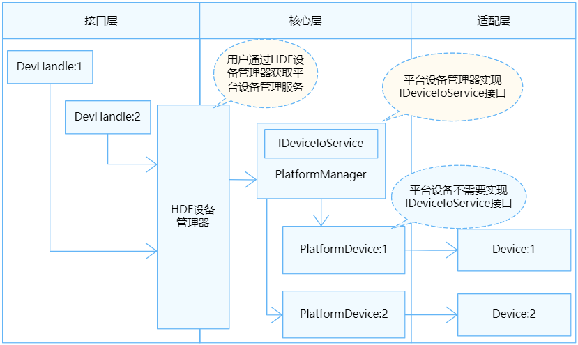

# Regulator


## 概述

### 功能简介

-   Regulator模块用于控制系统中某些设备的电压/电流供应。在嵌入式系统（尤其是手机）中，控制耗电量很重要，直接影响到电池的续航时间。所以，如果系统中某一个模块暂时不需要使用，就可以通过Regulator关闭其电源供应；或者降低提供给该模块的电压、电流大小。
-   Regulator接口定义了操作Regulator设备的通用方法集合，包括：
    - Regulator设备句柄获取和销毁。
    - Regulator设备电压、电流的设置。
    - Regulator设备使能和关闭。
    - Regulator设备电压、电流和状态的获取。


### 基本概念 

-  校准器 

   当输入电压和输出负载发生变化时可以通过软件调整，使其能够提供稳定的输出电压。 

- Consumer

   由Regulator供电的设备统称为Consumer， 其可分为静态和动态两类：

   * 静态：不需要改变电压电流，只需要开关电源，通常在bootloader、firmware、kernel board阶段被设置。
   * 动态：根据操作需求改变电压电流。

- PMI（Power Management Ic）

   电源管理芯片，内含多个电源甚至其他子系统。 


### 运作机制

在HDF框架中，Regulator模块接口适配模式采用统一服务模式，这需要一个设备服务来作为Regulator模块的管理器，统一处理外部访问，这会在配置文件中有所体现。统一服务模式适合于同类型设备对象较多的情况，如Regulator可能同时具备十几个控制器，采用独立服务模式需要配置更多的设备节点，且服务会占据内存资源。

Regulator模块各分层的作用为：接口层提供打开设备，写入数据，关闭设备接口的能力。核心层主要提供绑定设备、初始化设备以及释放设备的能力。适配层实现其他具体的功能。

 说明：核心层可以调用接口层的函数，也可以通过钩子函数调用适配层函数，从而使得适配层间接的可以调用接口层函数，但是不可逆转接口层调用适配层函数。

**图 1** 统一服务模式结构图



### 约束与限制

Regulator模块当前仅支持轻量和小型系统内核（LiteOS） 。

## 使用指导

### 场景介绍

Regulator主要用于：

1. 用于控制系统中某些设备的电压/电流供应。
2. 用于稳压电源的管理。

### 接口说明

**表1**  Regulator设备API功能介绍

| 接口名                | 描述                      |
| --------------------- | ------------------------- |
| RegulatorOpen         | 获取Regulator设备驱动句柄 |
| RegulatorClose        | 销毁Regulator设备驱动句柄 |
| RegulatorEnable       | 使能Regulator             |
| RegulatorDisable      | 禁用Regulator             |
| RegulatorForceDisable | 强制禁用Regulator         |
| RegulatorSetVoltage   | 设置Regulator输出电压     |
| RegulatorGetVoltage   | 获取Regulator输出电压     |
| RegulatorSetCurrent   | 设置Regulator输出电流     |
| RegulatorGetCurrent   | 获取Regulator输出电流     |
| RegulatorGetStatus    | 获取Regulator状态         |


### 开发步骤

在操作系统启动过程中，驱动管理模块根据配置文件加载Regulator驱动，Regulator驱动会检测Regulator器件并初始化驱动。

使用Regulator设备的一般流程如图2所示。

**图 2**  Regulator设备使用流程图  


#### 获取Regulator设备句柄

在操作Regulator设备时，首先要调用RegulatorOpen获取Regulator设备句柄，该函数会返回指定设备名称的Regulator设备句柄。

```
DevHandle RegulatorOpen(const char *name);
```

**表2**  RegulatorOpen参数和返回值描述

| 参数       | 参数描述                      |
| ---------- | ----------------------------- |
| name       | Regulator设备名称             |
| **返回值** | **返回值描述**                |
| handle     | 获取成功返回Regulator设备句柄 |
| NULL       | 获取失败                      |


```
/* Regulator设备名称 */
const char *name = "regulator_virtual_1";
DevHandle handle = NULL;

/* 获取Regulator设备句柄 */
handle = RegulatorOpen(name);
if (handle  == NULL) {
    /* 错误处理 */
}
```

#### 销毁Regulator设备句柄

关闭Regulator设备，系统释放对应的资源。

```
void RegulatorClose(DevHandle handle);
```

**表3**  RegulatorClose参数描述

| 参数   | 参数描述          |
| ------ | ----------------- |
| handle | Regulator设备句柄 |

```
/* 销毁Regulator设备句柄 */
RegulatorClose(handle);
```

#### 使能

启用Regulator设备。

```
int32_t RegulatorEnable(DevHandle handle);
```

**表4** RegulatorEnable参数描述

| 参数       | 参数描述          |
| ---------- | ----------------- |
| handle     | Regulator设备句柄 |
| **返回值** | **返回值描述**    |
| 0          | 使能成功          |
| 负数       | 使能失败          |


```
int32_t ret;

/*启用Regulator设备*/
ret = RegulatorEnable(handle);
if (ret != 0) {
	/*错误处理*/
}
```

#### 禁用

禁用Regulator设备。如果Regulator设备状态为常开，或存在Regulator设备子节点未禁用，则禁用失败。

```
int32_t RegulatorDisable(DevHandle handle);
```

**表5** RegulatorDisable参数描述

| 参数       | 参数描述          |
| ---------- | ----------------- |
| handle     | Regulator设备句柄 |
| **返回值** | **返回值描述**    |
| 0          | 禁用成功          |
| 负数       | 禁用失败          |

```
int32_t ret;

/*禁用Regulator设备*/
ret = RegulatorDisable(handle);
if (ret != 0) {
	/*错误处理*/
}
```

#### 强制禁用

强制禁用Regulator设备。无论Regulator设备的状态是常开还是子节点已使能，Regulator设备都会被禁用。

```
int32_t RegulatorForceDisable(DevHandle handle);
```

**表6** RegulatorForceDisable参数描述


| 参数       | 参数描述          |
| ---------- | ----------------- |
| handle     | Regulator设备句柄 |
| **返回值** | **返回值描述**    |
| 0          | 禁用成功          |
| 负数       | 禁用失败          |

```
int32_t ret;

/*强制禁用Regulator设备*/
ret = RegulatorForceDisable(handle);
if (ret != 0) {
	/*错误处理*/
}
```

#### 设置Regulator输出电压范围

设置Regulator电压输出电压范围。

```
int32_t RegulatorSetVoltage(DevHandle handle, uint32_t minUv, uint32_t maxUv);
```

**表7** RegulatorSetVoltage参数描述

| 参数       | 参数描述          |
| ---------- | ----------------- |
| handle     | Regulator设备句柄 |
| minUv      | 最小电压          |
| maxUv      | 最大电压          |
| **返回值** | **返回值描述**    |
| 0          | 设置成功          |
| 负数       | 设置失败          |

```
int32_t ret;
int32_t minUv = 0;        //最小电压为0µV
int32_t maxUv = 20000;    //最大电压为20000µV

/*设置Regulator电压输出电压范围*/
ret = RegulatorSetVoltage(handle, minUv, maxUv);
if (ret != 0) {
	/*错误处理*/
}
```

#### 获取Regulator电压

获取Regulator电压。

```
int32_t RegulatorGetVoltage(DevHandle handle, uint32_t *voltage);
```

**表8** RegulatorGetVoltage参数描述


| 参数       | 参数描述          |
| ---------- | ----------------- |
| handle     | Regulator设备句柄 |
| *voltage   | 参数指针          |
| **返回值** | **返回值描述**    |
| 0          | 获取成功          |
| 负数       | 获取失败          |

```
int32_t ret;
uint32_t voltage;

/*获取Regulator电压*/
ret = RegulatorGetVoltage(handle, &voltage);
if (ret != 0) {
	/*错误处理*/
}
```

#### 设置Regulator输出电流范围

设置Regulator输出电流范围。

```
int32_t RegulatorSetCurrent(DevHandle handle, uint32_t minUa, uint32_t maxUa);
```

**表9** RegulatorSetCurrent参数描述

| 参数       | 参数描述          |
| ---------- | ----------------- |
| handle     | Regulator设备句柄 |
| minUa      | 最小电流          |
| maxUa      | 最大电流          |
| **返回值** | **返回值描述**    |
| 0          | 设置成功          |
| 负数       | 设置失败          |

```
int32_t ret;
int32_t minUa = 0;	//最小电流为0μA
int32_t maxUa = 200;    //最大电流为200μA

/*设置Regulator输出电流范围*/
ret = RegulatorSetCurrent(handle, minUa, maxUa);
if (ret != 0) {
	/*错误处理*/
}
```

#### 获取Regulator电流

获取Regulator电流。

```
int32_t RegulatorGetCurrent(DevHandle handle, uint32_t *regCurrent);
```

**表10** RegulatorGetCurrent参数描述

| 参数        | 参数描述          |
| ----------- | ----------------- |
| handle      | Regulator设备句柄 |
| *regCurrent | 参数指针          |
| **返回值**  | **返回值描述**    |
| 0           | 获取成功          |
| 负数        | 获取失败          |

```
int32_t ret;
uint32_t regCurrent;

/*获取Regulator电流*/
ret = RegulatorGetCurrent(handle, &regCurrent);
if (ret != 0) {
	/*错误处理*/
}
```

#### 获取Regulator状态

获取Regulator状态。

```
int32_t RegulatorGetStatus(DevHandle handle, uint32_t *status);
```

**表11** RegulatorGetStatus参数描述

| 参数       | 参数描述          |
| ---------- | ----------------- |
| handle     | Regulator设备句柄 |
| *status    | 参数指针          |
| **返回值** | **返回值描述**    |
| 0          | 获取成功          |
| 负数       | 获取失败          |

```
int32_t ret;
uint32_t status;

/*获取Regulator状态*/
ret = RegulatorGetStatus(handle, &status);
if (ret != 0) {
	/*错误处理*/
}
```


## 使用实例

Regulator设备完整的使用示例如下所示，首先获取Regulator设备句柄，然后使能，设置电压，获取电压、状态，禁用，最后销毁Regulator设备句柄。

```
void RegulatorTestSample(void)
{
    int32_t ret;
     
    /* Regulator设备名称 */
	const char *name = "regulator_virtual_1";
	DevHandle handle = NULL;

	/* 获取Regulator设备句柄 */
	handle = RegulatorOpen(name);
	if (handle  == NULL) {
    	HDF_LOGE("RegulatorOpen: failed!\n");
        return;
	}

	/*启用Regulator设备*/
	ret = RegulatorEnable(handle);
	if (ret != 0) {
		HDF_LOGE("RegulatorEnable: failed, ret %d\n", ret);
        goto _ERR;
	}
    
    int32_t minUv = 0;		//最小电压为0µV
	int32_t maxUv = 20000;  //最大电压为20000µV

	/*设置Regulator输出电压范围*/
	ret = RegulatorSetVoltage(handle, minUv, maxUv);
	if (ret != 0) {
		HDF_LOGE("RegulatorSetVoltage: failed, ret %d\n", ret);
        goto _ERR;
	}
    
    uint32_t voltage;

    /*获取Regulator电压*/
    ret = RegulatorGetVoltage(handle, &voltage);
    if (ret != 0) {
        HDF_LOGE("RegulatorGetVoltage: failed, ret %d\n", ret);
        goto _ERR;
    }
    
    uint32_t status;

    /*获取Regulator状态*/
    ret = RegulatorGetStatus(handle, &status);
    if (ret != 0) {
        HDF_LOGE("RegulatorGetStatus: failed, ret %d\n", ret);
        goto _ERR;
    }

   /*禁用Regulator设备*/
    ret = RegulatorDisable(handle);
    if (ret != 0) {
        HDF_LOGE("RegulatorDisable: failed, ret %d\n", ret);
        goto _ERR;
    }
    
_ERR:
    /* 销毁Regulator设备句柄 */
    RegulatorClose(handle); 
}
```
