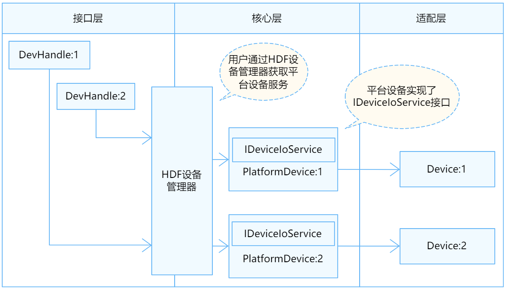

# RTC


## 概述

RTC(real-time clock)为操作系统中的实时时钟设备，在HDF框架中，RTC的接口适配模式采用独立服务模式，在这种模式下，每一个设备对象会独立发布一个设备服务来处理外部访问，设备管理器收到API的访问请求之后，通过提取该请求的参数，达到调用实际设备对象的相应内部方法的目的。独立服务模式可以直接借助HDFDeviceManager的服务管理能力，但需要为每个设备单独配置设备节点，增加内存占用。

  **图1** RTC独立服务模式结构图

  


## 接口说明

RtcMethod定义：

  
```
struct RtcMethod {
    int32_t (*ReadTime)(struct RtcHost *host, struct RtcTime *time);
    int32_t (*WriteTime)(struct RtcHost *host, const struct RtcTime *time);
    int32_t (*ReadAlarm)(struct RtcHost *host, enum RtcAlarmIndex alarmIndex, struct RtcTime *time);
    int32_t (*WriteAlarm)(struct RtcHost *host, enum RtcAlarmIndex alarmIndex, const struct RtcTime *time);
    int32_t (*RegisterAlarmCallback)(struct RtcHost *host, enum RtcAlarmIndex alarmIndex, RtcAlarmCallback cb);
    int32_t (*AlarmInterruptEnable)(struct RtcHost *host, enum RtcAlarmIndex alarmIndex, uint8_t enable);
    int32_t (*GetFreq)(struct RtcHost *host, uint32_t *freq);
    int32_t (*SetFreq)(struct RtcHost *host, uint32_t freq);
    int32_t (*Reset)(struct RtcHost *host);
    int32_t (*ReadReg)(struct RtcHost *host, uint8_t usrDefIndex, uint8_t *value);
    int32_t (*WriteReg)(struct RtcHost *host, uint8_t usrDefIndex, uint8_t value);
};
```

  **表1** RtcMethod结构体成员的回调函数功能说明

| 函数 | 入参 | 出参 | 返回值 | 功能 | 
| -------- | -------- | -------- | -------- | -------- |
| ReadTime | host:&nbsp;结构体指针,核心层RTC控制器&nbsp;; | time:&nbsp;结构体指针,传出的时间值; | HDF_STATUS相关状态 | 读RTC时间信息 | 
| WriteTime | host:&nbsp;结构体指针,核心层RTC控制器&nbsp;;time:&nbsp;结构体指针,时间传入值; | 无 | HDF_STATUS相关状态 | 写RTC时间信息（包括毫秒~年） | 
| ReadAlarm | host:&nbsp;结构体指针,核心层RTC控制器&nbsp;;alarmIndex:&nbsp;枚举值，闹钟报警索引&nbsp;; | time:&nbsp;结构体指针,传出的时间值; | HDF_STATUS相关状态 | 读RTC报警时间信息 | 
| WriteAlarm | host:&nbsp;结构体指针,核心层RTC控制器&nbsp;;alarmIndex:&nbsp;枚举值，闹钟报警索引&nbsp;;time:&nbsp;结构体指针,时间传入值; | 无 | HDF_STATUS相关状态 | 写RTC报警时间信息 | 
| RegisterAlarmCallback | host:&nbsp;结构体指针,核心层RTC控制器&nbsp;;alarmIndex:&nbsp;枚举值，闹钟报警索引&nbsp;;cb：函数指针,回调函数; | 无 | HDF_STATUS相关状态 | 注册报警超时回调函数 | 
| AlarmInterruptEnable | host:&nbsp;结构体指针,核心层RTC控制器&nbsp;;alarmIndex:&nbsp;枚举值，闹钟报警索引&nbsp;;enable:&nbsp;布尔值，控制报警; | 无 | HDF_STATUS相关状态 | 使能/去使能RTC报警中断 | 
| GetFreq | host:&nbsp;结构体指针,核心层RTC控制器&nbsp;; | freq:&nbsp;uint32_t指针,传出的频率值; | HDF_STATUS相关状态 | 读RTC外接晶振频率 | 
| SetFreq | host:&nbsp;结构体指针,核心层RTC控制器&nbsp;;freq:&nbsp;uint32_t，频率传入值; | 无 | HDF_STATUS相关状态 | 配置RTC外接晶振频率 | 
| Reset | host:&nbsp;结构体指针,核心层RTC控制器&nbsp;; | 无 | HDF_STATUS相关状态 | RTC复位 | 
| ReadReg | host:&nbsp;结构体指针,核心层RTC控制器&nbsp;;usrDefIndex:&nbsp;结构体,用户自定义寄存器索引; | value:&nbsp;uint8_t指针,传出的寄存器值; | HDF_STATUS相关状态 | 按照用户定义的寄存器索引，读取对应的寄存器配置，一个索引对应一字节的配置值 | 
| WriteReg | host:&nbsp;结构体指针,核心层RTC控制器&nbsp;;usrDefIndex:&nbsp;结构体,用户自定义寄存器索引;value:&nbsp;uint8_t,寄存器传入值; | 无 | HDF_STATUS相关状态 | 按照用户定义的寄存器索引，设置对应的寄存器配置，一个索引对应一字节的配置值 | 


## 开发步骤

RTC模块适配HDF框架的三个环节是配置属性文件，实例化驱动入口，以及填充核心层接口函数。

1. **实例化驱动入口：**
   - 实例化HdfDriverEntry结构体成员。
   - 调用HDF_INIT将HdfDriverEntry实例化对象注册到HDF框架中。

2. **配置属性文件：**
   - 在device_info.hcs文件中添加deviceNode描述。
   - 【可选】添加rtc_config.hcs器件属性文件。

3. **实例化RTC控制器对象：**
   - 初始化RtcHost成员。
   - 实例化RtcHost成员RtcMethod。
      >  **说明：**
      > 实例化RtcHost成员RtcMethod，其定义和成员说明见[接口说明](#接口说明)。

4. **驱动调试：**
   【可选】针对新增驱动程序，建议验证驱动基本功能，例如RTC控制状态，中断响应情况等。


## 开发实例

下方将以rtc_hi35xx.c为示例，展示需要厂商提供哪些内容来完整实现设备功能。

1. 驱动开发首先需要实例化驱动入口，驱动入口必须为HdfDriverEntry（在 hdf_device_desc.h 中定义）类型的全局变量，且moduleName要和device_info.hcs中保持一致。HDF框架会将所有加载的驱动的HdfDriverEntry对象首地址汇总，形成一个类似数组的段地址空间，方便上层调用。
   一般在加载驱动时HDF会先调用Bind函数，再调用Init函数加载该驱动。当Init调用异常时，HDF框架会调用Release释放驱动资源并退出。

     RTC驱动入口参考：
     
   ```
   struct HdfDriverEntry g_rtcDriverEntry = {
     .moduleVersion = 1,
     .Bind = HiRtcBind,               //见Bind参考
     .Init = HiRtcInit,               //见Init参考
     .Release = HiRtcRelease,         //见Release参考
     .moduleName = "HDF_PLATFORM_RTC",//【必要】且与 HCS 里面的名字匹配
   };
   //调用HDF_INIT将驱动入口注册到HDF框架中
   HDF_INIT(g_rtcDriverEntry);
   ```

2. 完成驱动入口注册之后，下一步请在device_info.hcs文件中添加deviceNode信息，并在 rtc_config.hcs 中配置器件属性。deviceNode信息与驱动入口注册相关，器件属性值与核心层RtcHost成员的默认值或限制范围有密切关系。
     本例只有一个RTC控制器，如有多个器件信息，则需要在device_info文件增加deviceNode信息，以及在rtc_config文件中增加对应的器件属性。
   - device_info.hcs 配置参考。
   
       
     ```
     root {
       device_info {
         platform :: host {
           device_rtc :: device {
             device0 :: deviceNode {
               policy = 1;                              //2:用户态可见,1:内核态可见,0:不需要发布服务
               priority = 30;                           //优先级越大，值越小
               permission = 0644;                       //驱动创建设备节点权限
               moduleName = "HDF_PLATFORM_RTC";         //【必要】用于指定驱动名称，需要与驱动Entry中的moduleName一致
               serviceName = "HDF_PLATFORM_RTC";        //【必要】驱动对外发布服务的名称，必须唯一
               deviceMatchAttr = "hisilicon_hi35xx_rtc";//【必要】需要与设备hcs文件中的 match_attr 匹配
             }
           }
         }
       }
     }
     ```
   
   - rtc_config.hcs 配置参考。
   
       
     ```
     root {
       platform {
         rtc_config {
           controller_0x12080000 {
             match_attr = "hisilicon_hi35xx_rtc";//【必要】需要和device_info.hcs中的deviceMatchAttr值一致
             rtcSpiBaseAddr = 0x12080000;        //地址映射相关
             regAddrLength = 0x100;              //地址映射相关
             irq = 37;                           //中断号
             supportAnaCtrl = false;
             supportLock = false;
             anaCtrlAddr = 0xff;
             lock0Addr = 0xff;
             lock1Addr = 0xff;
             lock2Addr = 0xff;
             lock3Addr = 0xff;
           }
         }
       }
     }
     ```

3. 完成驱动入口注册之后，最后一步就是以核心层RtcHost对象的初始化为核心，包括厂商自定义结构体（传递参数和数据），实例化RtcHost成员RtcMethod（让用户可以通过接口来调用驱动底层函数），实现HdfDriverEntry成员函数（Bind，Init，Release）。
   - 自定义结构体参考。

      从驱动的角度看，自定义结构体是参数和数据的载体，而且rtc_config.hcs文件中的数值会被HDF读入通过DeviceResourceIface来初始化结构体成员。

        
      ```
      struct RtcConfigInfo {
        uint32_t           spiBaseAddr;    //地址映射相关
        volatile void      *remapBaseAddr; //地址映射相关
        uint16_t           regAddrLength;  //地址映射相关
        uint8_t            supportAnaCtrl; //是否支持anactrl
        uint8_t            supportLock;    //是否支持锁
        uint8_t            irq;            //中断号
        uint8_t            alarmIndex;     //闹钟索引
        uint8_t            anaCtrlAddr;    //anactrl地址
        struct RtcLockAddr lockAddr;       //锁地址
        RtcAlarmCallback   cb;             //回调函数
        struct OsalMutex   mutex;          //互斥锁
      };
      
      // RtcHost是核心层控制器结构体，其中的成员在Init函数中会被赋值
      struct RtcHost {
          struct IDeviceIoService service;
          struct HdfDeviceObject *device;
          struct RtcMethod *method;
          void *data;
      };
      ```
   - RtcHost成员回调函数结构体RtcMethod的实例化，其他成员在Init函数中初始化。

        
      ```
      // rtc_hi35xx.c 中的示例：钩子函数的填充
      static struct RtcMethod g_method = {
          .ReadTime   = HiRtcReadTime,
          .WriteTime  = HiRtcWriteTime,
          .ReadAlarm  = HiReadAlarm,
          .WriteAlarm = HiWriteAlarm,
          .RegisterAlarmCallback  = HiRegisterAlarmCallback,
          .AlarmInterruptEnable   = HiAlarmInterruptEnable,
          .GetFreq  = HiGetFreq,
          .SetFreq  = HiSetFreq,
          .Reset       = HiReset,
          .ReadReg  = HiReadReg,
          .WriteReg = HiWriteReg,
      };
      ```

   - Bind 函数参考

      入参：

      HdfDeviceObject 是整个驱动对外暴露的接口参数，具备 HCS 配置文件的信息。

      返回值：

      HDF_STATUS相关状态  （下表为部分展示，如需使用其他状态，可见//drivers/framework/include/utils/hdf_base.h中HDF_STATUS 定义）。

        **表2** Bind 函数入参及返回值对照表
      
      | 状态(值) | 问题描述 | 
      | -------- | -------- |
      | HDF_ERR_INVALID_OBJECT | 控制器对象非法 | 
      | HDF_ERR_MALLOC_FAIL | 内存分配失败 | 
      | HDF_ERR_INVALID_PARAM | 参数非法 | 
      | HDF_ERR_IO | I/O&nbsp;错误 | 
      | HDF_SUCCESS | 初始化成功 | 
      | HDF_FAILURE | 初始化失败 | 

      函数说明：

      关联HdfDeviceObject对象和RtcHost。

        
      ```
      static int32_t HiRtcBind(struct HdfDeviceObject *device)
      {
        struct RtcHost *host = NULL;  
        host = RtcHostCreate(device);    //实际是申请内存并挂接device: host->device = device;
                                         //使HdfDeviceObject与RtcHost可以相互转化的前提
        ...
        device->service = &host->service;//使HdfDeviceObject与RtcHost可以相互转化的前提
                                         //方便后续通过调用RtcHostFromDevice 实现全局性质的host 使用
        return HDF_SUCCESS;
      }
      ```

   - Init函数参考

      入参：

      HdfDeviceObject 是整个驱动对外暴露的接口参数，具备 HCS 配置文件的信息。

      返回值：

      HDF_STATUS相关状态。

      函数说明：

      初始化自定义结构体对象，初始化RtcHost成员。

        
      ```
      static int32_t HiRtcInit(struct HdfDeviceObject *device)
      {
        struct RtcHost *host = NULL;
        struct RtcConfigInfo *rtcInfo = NULL;
        ...
        host = RtcHostFromDevice(device);//这里有HdfDeviceObject到RtcHost的强制转化
        rtcInfo = OsalMemCalloc(sizeof(*rtcInfo));
        ...
        //HiRtcConfigData 会从设备配置树中读取属性填充rtcInfo 的supportAnaCtrl, supportLock, spiBaseAddr, regAddrLength, irq
        //为HiRtcSwInit 和HiRtcSwInit 提供参数，...函数内部处理失败后内存释放等操作
        if (HiRtcConfigData(rtcInfo, device->property) != 0) {
          ...
        }
        if (HiRtcSwInit(rtcInfo) != 0) {//地址映射以及中断注册相关
          ...
        }
        if (HiRtcHwInit(rtcInfo) != 0) {//初始化anaCtrl 和 lockAddr 相关内容
          ...
        }
      
        host->method = &g_method;//RtcMethod的实例化对象的挂载
        host->data = rtcInfo;    //使RtcConfigInfo与RtcHost可以相互转化的前提
        HDF_LOGI("Hdf dev service:%s init success!", HdfDeviceGetServiceName(device));
        return HDF_SUCCESS;
      }
      ```
   - Release 函数参考

      入参：

      HdfDeviceObject 是整个驱动对外暴露的接口参数，具备 HCS 配置文件的信息。

      返回值：

      无。

      函数说明：

      释放内存和删除控制器，该函数需要在驱动入口结构体中赋值给 Release 接口， 当HDF框架调用Init函数初始化驱动失败时，可以调用 Release 释放驱动资源。所有强制转换获取相应对象的操作前提是在Init或Bind函数中具备对应赋值的操作。

        
      ```
      static void HiRtcRelease(struct HdfDeviceObject *device)
      {
          struct RtcHost *host = NULL;
          struct RtcConfigInfo *rtcInfo = NULL;
          ...
          host = RtcHostFromDevice(device);            //这里有HdfDeviceObject到RtcHost的强制转化
          rtcInfo = (struct RtcConfigInfo *)host->data;//这里有RtcHost到RtcConfigInfo的强制转化
          if (rtcInfo != NULL) {
              HiRtcSwExit(rtcInfo);
              OsalMemFree(rtcInfo);                    //释放RtcConfigInfo
              host->data = NULL;
          }
          RtcHostDestroy(host);                        //释放RtcHost
      }
      ```
