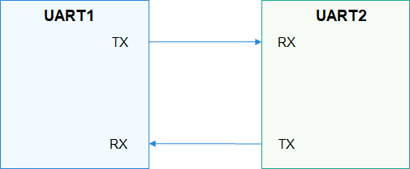

# UART


## 概述

- UART是通用异步收发传输器（Universal Asynchronous Receiver/Transmitter）的缩写，是通用串行数据总线，用于异步通信。该总线双向通信，可以实现全双工传输。

- UART应用比较广泛，常用于输出打印信息，也可以外接各种模块，如GPS、蓝牙等。

- 两个UART设备的连接示意图如下，UART与其他模块一般用2线（图1）或4线（图2）相连，它们分别是：
  - TX：发送数据端，和对端的RX相连；
  - RX：接收数据端，和对端的TX相连；
  - RTS：发送请求信号，用于指示本设备是否准备好，可接受数据，和对端CTS相连；
  - CTS：允许发送信号，用于判断是否可以向对端发送数据，和对端RTS相连；

       **图1** 2线UART设备连接示意图

       

       **图2** 4线UART设备连接示意图

       

- UART通信之前，收发双方需要约定好一些参数：波特率、数据格式（起始位、数据位、校验位、停止位）等。通信过程中，UART通过TX发送给对端数据，通过RX接收对端发送的数据。当UART接收缓存达到预定的门限值时，RTS变为不可发送数据，对端的CTS检测到不可发送数据，则停止发送数据。

- UART接口定义了操作UART端口的通用方法集合，包括获取、释放设备句柄、读写数据、获取和设置波特率、获取和设置设备属性。


## 接口说明

  **表1** UART驱动API接口功能介绍

| 功能分类 | 接口名 | 
| -------- | -------- |
| UART获取/释放设备句柄 | -&nbsp;UartOpen：UART获取设备句柄<br/>-&nbsp;UartClose：UART释放设备句柄 | 
| UART读写接口 | -&nbsp;UartRead：从UART设备中读取指定长度的数据<br/>-&nbsp;UartWrite：向UART设备中写入指定长度的数据 | 
| UART获取/设置波特率接口 | -&nbsp;UartGetBaud：UART获取波特率<br/>-&nbsp;UartSetBaud：UART设置波特率 | 
| UART获取/设置设备属性 | -&nbsp;UartGetAttribute：UART获取设备属性<br/>-&nbsp;UartSetAttribute：UART设置设备属性 | 
| UART设置传输模式 | UartSetTransMode：UART设置传输模式 | 

>  **说明：**
> 本文涉及的所有接口，仅限内核态使用，不支持在用户态使用。


## 使用指导


### 使用流程

使用UART的一般流程如下图所示。

  **图3** UART使用流程图

  


### 获取UART设备句柄

在使用UART进行通信时，首先要调用UartOpen获取UART设备句柄，该函数会返回指定端口号的UART设备句柄。

  
```
DevHandle UartOpen(uint32_t port);
```

  **表2** UartOpen参数和返回值描述

| 参数 | 参数描述 | 
| -------- | -------- |
| port | UART设备号 | 
| **返回值** | **返回值描述** | 
| NULL | 获取UART设备句柄失败 | 
| 设备句柄 | UART设备句柄 | 

  假设系统中的UART端口号为3，获取该UART设备句柄的示例如下：
  
```
DevHandle handle = NULL;    /* UART设备句柄  */
uint32_t port = 3;                  /* UART设备端口号 */
handle = UartOpen(port);
if (handle == NULL) {
    HDF_LOGE("UartOpen: failed!\n");
    return;
}
```


### UART设置波特率

在通信之前，需要设置UART的波特率，设置波特率的函数如下所示：

  
```
int32_t UartSetBaud(DevHandle handle, uint32_t baudRate);
```

  **表3** UartSetBaud参数和返回值描述

| 参数 | 参数描述 | 
| -------- | -------- |
| handle | UART设备句柄 | 
| baudRate | 待设置的波特率值 | 
| **返回值** | **返回值描述** | 
| 0 | UART设置波特率成功 | 
| 负数 | UART设置波特率失败 | 

假设需要设置的UART波特率为9600，设置波特率的实例如下：

  
```
int32_t ret;
/* 设置UART波特率 */
ret = UartSetBaud(handle, 9600);
if (ret != 0) {
    HDF_LOGE("UartSetBaud: failed, ret %d\n", ret);
}
```


### UART获取波特率

设置UART的波特率后，可以通过获取波特率接口来查看UART当前的波特率，获取波特率的函数如下所示：

  
```
int32_t UartGetBaud(DevHandle handle, uint32_t *baudRate);
```

  **表4** UartGetBaud参数和返回值描述

| 参数 | 参数描述 | 
| -------- | -------- |
| handle | UART设备句柄 | 
| baudRate | 接收波特率值的指针 | 
| **返回值** | **返回值描述** | 
| 0 | UART获取波特率成功 | 
| 负数 | UART获取波特率失败 | 

获取波特率的实例如下：

  
```
int32_t ret;
uint32_t baudRate;
/* 获取UART波特率 */
ret = UartGetBaud(handle, &baudRate);
if (ret != 0) {
    HDF_LOGE("UartGetBaud: failed, ret %d\n", ret);
}
```


### UART设置设备属性

在通信之前，需要设置UART的设备属性，设置设备属性的函数如下图所示：

  
```
int32_t UartSetAttribute(DevHandle handle, struct UartAttribute *attribute)；
```

  **表5** UartSetAttribute参数和返回值描述

| 参数 | 参数描述 | 
| -------- | -------- |
| handle | UART设备句柄 | 
| attribute | 待设置的设备属性 | 
| **返回值** | **返回值描述** | 
| 0 | UART设置设备属性成功 | 
| 负数 | UART设置设备属性失败 | 

设置UART的设备属性的实例如下：

  
```
int32_t ret;
struct UartAttribute attribute;
attribute.dataBits = UART_ATTR_DATABIT_7;   /* UART传输数据位宽，一次传输7个bit */
attribute.parity = UART_ATTR_PARITY_NONE;   /* UART传输数据无校检 */
attribute.stopBits = UART_ATTR_STOPBIT_1;   /* UART传输数据停止位为1位 */
attribute.rts = UART_ATTR_RTS_DIS;          /* UART禁用RTS */
attribute.cts = UART_ATTR_CTS_DIS;          /* UART禁用CTS */
attribute.fifoRxEn = UART_ATTR_RX_FIFO_EN;  /* UART使能RX FIFO */
attribute.fifoTxEn = UART_ATTR_TX_FIFO_EN;  /* UART使能TX FIFO */
/* 设置UART设备属性 */
ret = UartSetAttribute(handle, &attribute);
if (ret != 0) {
    HDF_LOGE("UartSetAttribute: failed, ret %d\n", ret);
}
```


### UART获取设备属性

设置UART的设备属性后，可以通过获取设备属性接口来查看UART当前的设备属性，获取设备属性的函数如下图所示：

  
```
int32_t UartGetAttribute(DevHandle handle, struct UartAttribute *attribute);
```

  **表6** UartGetAttribute参数和返回值描述

| 参数 | 参数描述 | 
| -------- | -------- |
| handle | UART设备句柄 | 
| attribute | 接收UART设备属性的指针 | 
| **返回值** | **返回值描述** | 
| 0 | UART获取设备属性成功 | 
| 负数 | UART获取设备属性失败 | 

获取UART的设备属性的实例如下：

  
```
int32_t ret;
struct UartAttribute attribute;
/* 获取UART设备属性 */
ret = UartGetAttribute(handle, &attribute);
if (ret != 0) {
    HDF_LOGE("UartGetAttribute: failed, ret %d\n", ret);
}
```


### 设置UART传输模式

在通信之前，需要设置UART的传输模式，设置传输模式的函数如下图所示：

  
```
int32_t UartSetTransMode(DevHandle handle, enum UartTransMode mode)；
```

  **表7** UartSetTransMode参数和返回值描述

| 参数 | 参数描述 | 
| -------- | -------- |
| handle | UART设备句柄 | 
| mode | 待设置的传输模式， | 
| **返回值** | **返回值描述** | 
| 0 | UART设置传输模式成功 | 
| 负数 | UART设置传输模式失败 | 

假设需要设置的UART传输模式为UART_MODE_RD_BLOCK，设置传输模式的实例如下：

  
```
int32_t ret;
/* 设置UART传输模式 */
ret = UartSetTransMode(handle, UART_MODE_RD_BLOCK);
if (ret != 0) {
    HDF_LOGE("UartSetTransMode: failed, ret %d\n", ret);
}
```


### 向UART设备写入指定长度的数据

对应的接口函数如下所示：

  
```
int32_t UartWrite(DevHandle handle, uint8_t *data, uint32_t size);
```

  **表8** UartWrite参数和返回值描述

| 参数 | 参数描述 | 
| -------- | -------- |
| handle | UART设备句柄 | 
| data | 待写入数据的指针 | 
| size | 待写入数据的长度 | 
| **返回值** | **返回值描述** | 
| 0 | UART写数据成功 | 
| 负数 | UART写数据失败 | 

写入指定长度数据的实例如下：

  
```
int32_t ret;
uint8_t wbuff[5] = {1, 2, 3, 4, 5};
/* 向UART设备写入指定长度的数据 */
ret = UartWrite(handle, wbuff, 5);
if (ret != 0) {
    HDF_LOGE("UartWrite: failed, ret %d\n", ret);
}
```


### 从UART设备中读取指定长度的数据

对应的接口函数如下所示：

  
```
int32_t UartRead(DevHandle handle, uint8_t *data, uint32_t size);
```

  **表9** UartRead参数和返回值描述

| 参数 | 参数描述 | 
| -------- | -------- |
| handle | UART设备句柄 | 
| data | 接收读取数据的指针 | 
| size | 待读取数据的长度 | 
| **返回值** | **返回值描述** | 
| 非负数 | UART读取到的数据长度 | 
| 负数 | UART读取数据失败 | 

读取指定长度数据的实例如下：

  
```
int32_t ret;
uint8_t rbuff[5] = {0};
/* 从UART设备读取指定长度的数据 */
ret = UartRead(handle, rbuff, 5);
if (ret < 0) {
    HDF_LOGE("UartRead: failed, ret %d\n", ret);
}
```

>  **注意：**
> UART返回值为非负值，表示UART读取成功。若返回值等于0，表示UART无有效数据可以读取。若返回值大于0，表示实际读取到的数据长度，该长度小于或等于传入的参数size的大小，并且不超过当前正在使用的UART控制器规定的最大单次读取数据长度的值。


### 销毁UART设备句柄

UART通信完成之后，需要销毁UART设备句柄，函数如下所示：

  
```
void UartClose(DevHandle handle);
```

该函数会释放申请的资源。

  **表10** UartClose参数和返回值描述

| 参数 | 参数描述 | 
| -------- | -------- |
| handle | UART设备句柄 | 

销毁UART设备句柄的实例如下：

  
```
UartClose(handle); /* 销毁UART设备句柄 *
```


## 使用实例

  UART设备完整的使用示例如下所示，首先获取UART设备句柄，接着设置波特率、设备属性和传输模式，之后进行UART通信，最后销毁UART设备句柄。
  
```
#include "hdf_log.h"
#include "uart_if.h"

void UartTestSample(void)
{
    int32_t ret;
    uint32_t port;  
    DevHandle handle = NULL;
    uint8_t wbuff[5] = { 1, 2, 3, 4, 5 };
    uint8_t rbuff[5] = { 0 };
    struct UartAttribute attribute;
    attribute.dataBits = UART_ATTR_DATABIT_7;   /* UART传输数据位宽，一次传输7个bit */
    attribute.parity = UART_ATTR_PARITY_NONE;   /* UART传输数据无校检 */
    attribute.stopBits = UART_ATTR_STOPBIT_1;   /* UART传输数据停止位为1位 */
    attribute.rts = UART_ATTR_RTS_DIS;          /* UART禁用RTS */
    attribute.cts = UART_ATTR_CTS_DIS;          /* UART禁用CTS */
    attribute.fifoRxEn = UART_ATTR_RX_FIFO_EN;  /* UART使能RX FIFO */
    attribute.fifoTxEn = UART_ATTR_TX_FIFO_EN;  /* UART使能TX FIFO */
    /* UART设备端口号，要填写实际平台上的端口号 */
    port = 1; 
    /* 获取UART设备句柄 */
    handle = UartOpen(port);
    if (handle == NULL) {
        HDF_LOGE("UartOpen: failed!\n");
        return;
    }
    /* 设置UART波特率为9600 */
    ret = UartSetBaud(handle, 9600);
    if (ret != 0) {
        HDF_LOGE("UartSetBaud: failed, ret %d\n", ret);
        goto _ERR;
    }
    /* 设置UART设备属性 */
    ret = UartSetAttribute(handle, &attribute);
    if (ret != 0) {
        HDF_LOGE("UartSetAttribute: failed, ret %d\n", ret);
        goto _ERR;
    }
    /* 设置UART传输模式为非阻塞模式 */
    ret = UartSetTransMode(handle, UART_MODE_RD_NONBLOCK);
    if (ret != 0) {
        HDF_LOGE("UartSetTransMode: failed, ret %d\n", ret);
        goto _ERR;
    }
    /* 向UART设备写入5字节的数据 */
    ret = UartWrite(handle, wbuff, 5);
    if (ret != 0) {
        HDF_LOGE("UartWrite: failed, ret %d\n", ret);
        goto _ERR;
    }
    /* 从UART设备读取5字节的数据 */
    ret = UartRead(handle, rbuff, 5);
    if (ret < 0) {
        HDF_LOGE("UartRead: failed, ret %d\n", ret);
        goto _ERR;
    }
_ERR:
    /* 销毁UART设备句柄 */
    UartClose(handle); 
}
```
