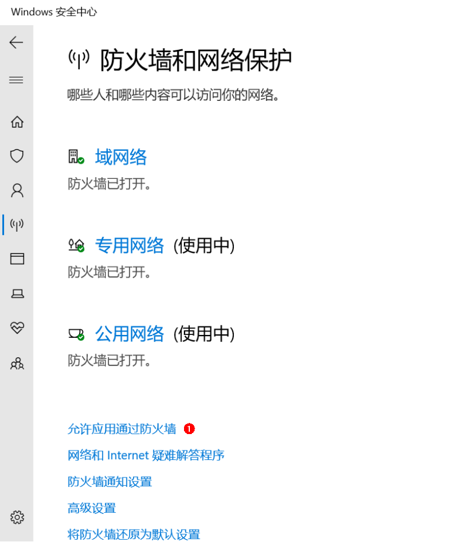

# 烧录常见问题

-   [轻量和小型系统](#section278314413530)
    -   [烧写选择串口后，提示“Error: Opening COMxx: Access denied”](#section18988185615914)
    -   [烧写失败](#section1370982513317)
    -   [串口无回显](#section183421944953)
    -   [Windows电脑与单板网络连接失败](#section1215410450215)

## 轻量和小型系统

### 烧写选择串口后，提示“Error: Opening COMxx: Access denied”

-   **现象描述**

    点击烧写并选择串口后，出现“Error: Opening COMxx: Access denied”。

    

-   **可能原因**

    串口已经被占用。

-   解决方法

    检查主机中可能占用该端口的工具，关闭即可。若是当前工具占用，可按以下步骤排查并关闭：

    1.  排查终端窗口列表，检查是否被monitor或其他终端占用。

        

    2.  找到占用，点击垃圾桶图标，关闭占用。

### 烧写失败

-   **现象描述**

    点击烧写并选择串口后，出现无法烧写的情况。

-   **可能原因**

    安装IDE插件DevEco后未重启。

-   **解决方法**

    重启IDE。

### 串口无回显

-   **现象描述**

    串口显示已连接，重启单板后，回车无任何回显。

-   **可能原因1**

    串口连接错误。

-   **解决办法**

    修改串口号。

    请查看设备管理器，确认连接单板的串口与终端中连接串口是否一致，若不一致，请按镜像运行修改串口号。

-   **可能原因2**

    单板U-boot被损坏。

-   **解决办法**

    烧写U-boot。

    若上述步骤依旧无法连接串口，可能由于单板U-boot损坏，按下述步骤烧写U-boot。

1.  获取引导文件U-boot。

    > **须知：** 
    >单板的U-boot文件请在开源包中获取：
    >Hi3516DV300：device\\hisilicon\\hispark\_taurus\\sdk\_liteos\\uboot\\out\\boot\\u-boot-hi3516dv300.bin
    >Hi3518EV300：device\\hisilicon\\hispark\_aries\\sdk\_liteos\\uboot\\out\\boot\\u-boot-hi3518ev300.bin

2.  根据USB烧写步骤烧写U-boot文件。

    按照[Hi3516系列USB烧写步骤](../quick-start/quickstart-lite-steps-hi3516-burn.md)/[Hi3518系列USB烧写步骤](../quick-start/quickstart-lite-steps-hi3518-burn.md)中描述的USB烧写方法，选择对应单板的U-boot文件进行烧写。

3.  烧写完成后，登录串口如下图所示。

    **图 1**  U-boot烧写完成串口显示图  
    

### Windows电脑与单板网络连接失败

-   **现象描述**

    点击烧写并选择串口后，无法获取文件。

    **图 2**  网络不通，Hi3516单板无法获取文件  
    

-   **可能原因**

    单板网络与Windows电脑不联通。

    Windows电脑防火墙未允许Visual Studio Code联网。

-   **解决方法**

1.  检查网线是否连接。
2.  点击Windows防火墙。

    

3.  点击“允许应用通过防火墙”。

    

4.  查找Visual Studio Code应用。

    

5.  勾选Visual Studio Code的专用和公用网络的访问权限。

    

