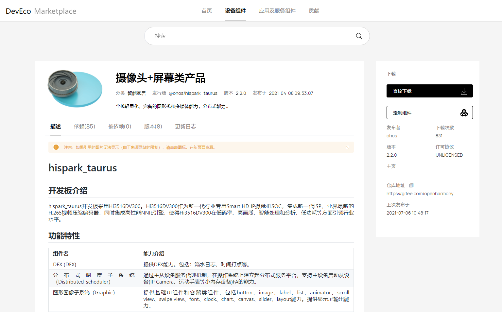
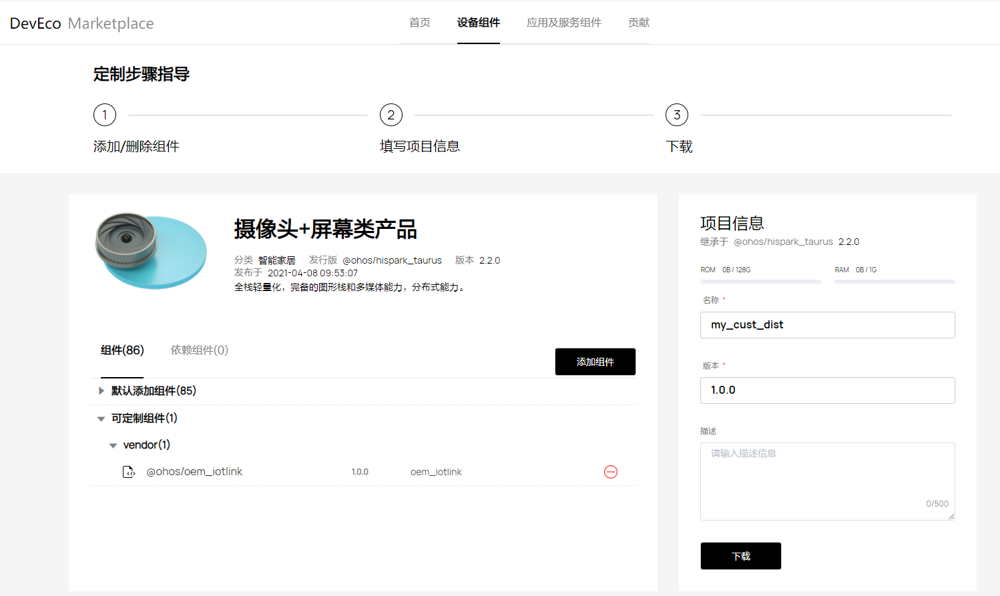

# 获取源码<a name="ZH-CN_TOPIC_0000001150448437"></a>

## OpenHarmony介绍<a name="section6370143622110"></a>

OpenHarmony是由开放原子开源基金会（OpenAtom Foundation）孵化及运营的开源项目，目标是面向全场景、全连接、全智能时代，搭建一个智能终端设备操作系统的框架和平台，促进万物互联产业的繁荣发展。

开源代码仓库地址：[https://openharmony.gitee.com](https://openharmony.gitee.com)。

## 获取源码概述<a name="section12763342204"></a>

OpenHarmony当前为开发者提供了以下4种获取源码的方式，开发者可根据业务诉求选用合适的方式获取源码：

-   **获取方式1**：从码云代码仓库获取。通过repo或git工具从代码仓库中下载，此方式可获取最新代码。
-   **获取方式2**：通过[DevEco Marketplace](https://repo.harmonyos.com/#/cn/home)网站获取。访问[DevEco Marketplace](https://repo.harmonyos.com/#/cn/home)网站，查找满足需求的开源发行版，直接下载（或者定制后下载），再通过hpm-cli命令工具将所需的组件及工具链下载、安装到本地。
-   **获取方式3**：从镜像站点下载归档后的发行版压缩文件。如果要获取旧版本的源码，也可通过此方式获取，此方式下载速度较快。
-   **获取方式4**：从github代码仓库获取。通过repo或git工具从代码仓库中下载，此方式可获取最新代码。

## 获取方式1：从码云仓库获取<a name="section537312010229"></a>

### 适用场景<a name="section10881513459"></a>

-   基于OpenHarmony的稳定分支建立自己的基线，分发下游客户。

-   已经完成自身软件与OpenHarmony的对接，需要进行OpenHarmony官方认证。

-   芯片/模组/app通过OpenHarmony官方认证后，贡献代码到OpenHarmony社区。

-   修复OpenHarmony的问题。

-   学习OpenHarmony的源码。


### 前提条件<a name="section102871547153314"></a>

1.  注册码云gitee帐号。
2.  注册码云SSH公钥，请参考[码云帮助中心](https://gitee.com/help/articles/4191)。
3.  安装[git客户端](https://git-scm.com/book/zh/v2/%E8%B5%B7%E6%AD%A5-%E5%AE%89%E8%A3%85-Git)和[git-lfs](https://gitee.com/vcs-all-in-one/git-lfs?_from=gitee_search#downloading)并配置用户信息。

    ```
    git config --global user.name "yourname"
    git config --global user.email "your-email-address"
    git config --global credential.helper store
    ```

4.  安装码云repo工具，可以执行如下命令。

    ```
    curl https://gitee.com/oschina/repo/raw/fork_flow/repo-py3 -o /usr/local/bin/repo  #如果没有权限，可下载至其他目录，并将其配置到环境变量中
    chmod a+x /usr/local/bin/repo
    pip3 install -i https://repo.huaweicloud.com/repository/pypi/simple requests
    ```


### 操作步骤<a name="section429012478331"></a>


> **说明：** 
>Master主干为开发分支，开发者可通过Master主干获取最新特性。发布版本代码相对比较稳定，开发者可基于发布版本代码进行商用功能开发。

-   **OpenHarmony主干代码获取**

    方式一（推荐）：通过repo + ssh下载（需注册公钥，请参考[码云帮助中心](https://gitee.com/help/articles/4191)）。

    ```
    repo init -u git@gitee.com:openharmony/manifest.git -b master --no-repo-verify
    repo sync -c
    repo forall -c 'git lfs pull'
    ```

    方式二：通过repo + https下载。

    ```
    repo init -u https://gitee.com/openharmony/manifest.git -b master --no-repo-verify
    repo sync -c
    repo forall -c 'git lfs pull'
    ```

-   **OpenHarmony发布版本代码获取**

    OpenHarmony发布版本获取源码方式请参考[Release-Notes](../../release-notes/Readme.md)。


## 获取方式2：从DevEco Marketplace获取<a name="section463013147412"></a>

### 适用场景<a name="section26661067443"></a>

对于刚接触OpenHarmony的新用户，希望能够参考一些示例解决方案从而进行快速开发。可以在[DevEco Marketplace](https://repo.harmonyos.com/#/cn/home)网站获取下载开源发行版，也可以在开源发行版的基础上定制（添加或删除组件）。然后通过包管理器命令行工具（hpm-cli）将需要的组件及相关的编译工具链全部下载、安装到本地。

### 前提条件<a name="section17544943123315"></a>

先要在本地安装Node.js和hpm命令行工具，安装步骤如下：

1.  安装Node.js。

    官网下载并在本地安装Node.js.

    [Node.js](https://nodejs.org/)  版本需不低于12.x \(包含npm 6.14.4\)，推荐安装LTS版本。

2.  通过Node.js自带的npm安装hpm命令行工具。

    打开CMD，执行以下命令：

    ```
    npm install -g @ohos/hpm-cli
    ```

3.  安装完成后执行如下命令，显示hpm版本，即安装成功。

    ```
    hpm -V 或 hpm --version
    ```

4.  如果升级hpm的版本，请执行如下命令：

    ```
    npm update -g @ohos/hpm-cli
    ```


### 操作步骤<a name="section954619433333"></a>

1.  查找发行版。
    1.  访问[DevEco Marketplace](https://repo.harmonyos.com/#/cn/home)，设定搜索的对象为“设备组件“，并在左侧边栏选择“开源发行版“，如下图所示。
    2.  在搜索框输入关键字搜索，如“摄像头”。
    3.  结果中显示与关键字匹配的发行版，可以进一步根据组件类别等过滤条件（如：适配的开发板，内核）精确筛选。
    4.  查找合适的发行版，点击查看发行版的详情介绍。

        **图 1**  包管理<a name="fig349416264520"></a>  
        

2.  了解发行版详情。

    1.  仔细阅读发行版的说明信息，以了解使用场景、特性、组件构成、使用方法以及如何进行定制化，如下图所示。
    2.  点击「直接下载」，将发行版下载到本地。
    3.  点击「定制组件」，将对发行版包含的组件进行定制（添加/删除）。

    **图 2**  发行版示例<a name="fig142484411121"></a>  
    

3.  定制组件。
    1.  进入发行版的定制页面，如下图所示。
    2.  通过关闭开关移除可选组件，或者通过“添加组件”增加新的组件。
    3.  在右边填写您的项目基本信息，包括名称、版本、描述等信息。
    4.  点击“下载“，系统会根据您的选择，生成相应的OpenHarmony代码结构文件\(如my\_cust\_dist.zip\)，保存至本地文件。

        **图 3**  组件定制<a name="fig1256020372197"></a>  
        

4.  安装组件。
    1.  解压下载的压缩文件，用命令行工具CMD（Linux下的Shell终端）。
    2.  在解压后的文件目录下执行hpm install指令，系统会自动下载并安装组件。安装窗口显示“Install sucessful”表示组件下载及安装成功。
    3.  下载的组件将保存在工程目录下的ohos\_bundles文件夹中（部分组件安装后会将源码复制到指定目录下）。


## 获取方式3：从镜像站点获取<a name="section1186691118430"></a>

为了获得更好的下载性能，您可以选择从以下站点的镜像库获取源码或者对应的解决方案。

本部分只提供OpenHarmony Master最新版本和LTS最新版本的获取源码方式， 其他版本获取源码方式以及具体版本信息请参考[Release-Notes](../../release-notes/Readme.md)。

**表 1**  获取源码路径

<a name="table17735923173912"></a>
<table><thead align="left"><tr id="row1073515237392"><th class="cellrowborder" valign="top" width="25%" id="mcps1.2.5.1.1"><p id="p5109183611392"><a name="p5109183611392"></a><a name="p5109183611392"></a><strong id="b31091936183918"><a name="b31091936183918"></a><a name="b31091936183918"></a>LTS版本源码</strong></p>
</th>
<th class="cellrowborder" valign="top" width="25%" id="mcps1.2.5.1.2"><p id="p13109436103916"><a name="p13109436103916"></a><a name="p13109436103916"></a><strong id="b191091936153912"><a name="b191091936153912"></a><a name="b191091936153912"></a>版本信息</strong></p>
</th>
<th class="cellrowborder" valign="top" width="25%" id="mcps1.2.5.1.3"><p id="p610923616398"><a name="p610923616398"></a><a name="p610923616398"></a><strong id="b1210920365393"><a name="b1210920365393"></a><a name="b1210920365393"></a>下载站点</strong></p>
</th>
<th class="cellrowborder" valign="top" width="25%" id="mcps1.2.5.1.4"><p id="p2109736133914"><a name="p2109736133914"></a><a name="p2109736133914"></a><strong id="b18109113613397"><a name="b18109113613397"></a><a name="b18109113613397"></a>SHA256校验码</strong></p>
</th>
</tr>
</thead>
<tbody><tr id="row17736152318398"><td class="cellrowborder" valign="top" width="25%" headers="mcps1.2.5.1.1 "><p id="p1110983610395"><a name="p1110983610395"></a><a name="p1110983610395"></a>全量代码（标准、轻量和小型系统）</p>
</td>
<td class="cellrowborder" valign="top" width="25%" headers="mcps1.2.5.1.2 "><p id="p151091536143915"><a name="p151091536143915"></a><a name="p151091536143915"></a>3.0</p>
</td>
<td class="cellrowborder" valign="top" width="25%" headers="mcps1.2.5.1.3 "><p id="p15931114016546"><a name="p15931114016546"></a><a name="p15931114016546"></a><a href="https://repo.huaweicloud.com/harmonyos/os/3.0/code-v3.0-LTS.tar.gz" target="_blank" rel="noopener noreferrer">站点</a></p>
</td>
<td class="cellrowborder" valign="top" width="25%" headers="mcps1.2.5.1.4 "><p id="p3770144281415"><a name="p3770144281415"></a><a name="p3770144281415"></a><a href="https://repo.huaweicloud.com/harmonyos/os/3.0/code-v3.0-LTS.tar.gz.sha256" target="_blank" rel="noopener noreferrer">SHA256校验码</a></p>
</td>
</tr>
<tr id="row14814218214"><td class="cellrowborder" valign="top" width="25%" headers="mcps1.2.5.1.1 "><p id="p2481132228"><a name="p2481132228"></a><a name="p2481132228"></a>标准系统解决方案（二进制）</p>
</td>
<td class="cellrowborder" valign="top" width="25%" headers="mcps1.2.5.1.2 "><p id="p94811121629"><a name="p94811121629"></a><a name="p94811121629"></a>3.0</p>
</td>
<td class="cellrowborder" valign="top" width="25%" headers="mcps1.2.5.1.3 "><p id="p1358555631"><a name="p1358555631"></a><a name="p1358555631"></a><a href="https://repo.huaweicloud.com/harmonyos/os/3.0/standard.tar.gz" target="_blank" rel="noopener noreferrer">站点</a></p>
</td>
<td class="cellrowborder" valign="top" width="25%" headers="mcps1.2.5.1.4 "><p id="p10581551639"><a name="p10581551639"></a><a name="p10581551639"></a><a href="https://repo.huaweicloud.com/harmonyos/os/3.0/standard.tar.gz.sha256" target="_blank" rel="noopener noreferrer">SHA256校验码</a></p>
</td>
</tr>
<tr id="row473612318396"><td class="cellrowborder" valign="top" width="25%" headers="mcps1.2.5.1.1 "><p id="p511014369394"><a name="p511014369394"></a><a name="p511014369394"></a>Hi3861解决方案（二进制）</p>
</td>
<td class="cellrowborder" valign="top" width="25%" headers="mcps1.2.5.1.2 "><p id="p0110036193911"><a name="p0110036193911"></a><a name="p0110036193911"></a>3.0</p>
</td>
<td class="cellrowborder" valign="top" width="25%" headers="mcps1.2.5.1.3 "><p id="p29291940175415"><a name="p29291940175415"></a><a name="p29291940175415"></a><a href="https://repo.huaweicloud.com/harmonyos/os/3.0/hispark_pegasus.tar.gz" target="_blank" rel="noopener noreferrer">站点</a></p>
</td>
<td class="cellrowborder" valign="top" width="25%" headers="mcps1.2.5.1.4 "><p id="p134864584147"><a name="p134864584147"></a><a name="p134864584147"></a><a href="https://repo.huaweicloud.com/harmonyos/os/3.0/hispark_pegasus.tar.gz.sha256" target="_blank" rel="noopener noreferrer">SHA256校验码</a></p>
</td>
</tr>
<tr id="row873614239395"><td class="cellrowborder" valign="top" width="25%" headers="mcps1.2.5.1.1 "><p id="p11110113633913"><a name="p11110113633913"></a><a name="p11110113633913"></a>Hi3518解决方案（二进制）</p>
</td>
<td class="cellrowborder" valign="top" width="25%" headers="mcps1.2.5.1.2 "><p id="p18110193613391"><a name="p18110193613391"></a><a name="p18110193613391"></a>3.0</p>
</td>
<td class="cellrowborder" valign="top" width="25%" headers="mcps1.2.5.1.3 "><p id="p125681045181518"><a name="p125681045181518"></a><a name="p125681045181518"></a><a href="https://repo.huaweicloud.com/harmonyos/os/3.0/hispark_aries.tar.gz" target="_blank" rel="noopener noreferrer">站点</a></p>
</td>
<td class="cellrowborder" valign="top" width="25%" headers="mcps1.2.5.1.4 "><p id="p4607175915149"><a name="p4607175915149"></a><a name="p4607175915149"></a><a href="https://repo.huaweicloud.com/harmonyos/os/3.0/hispark_aries.tar.gz.sha256" target="_blank" rel="noopener noreferrer">SHA256校验码</a></p>
</td>
</tr>
<tr id="row1273682343914"><td class="cellrowborder" valign="top" width="25%" headers="mcps1.2.5.1.1 "><p id="p15110123693919"><a name="p15110123693919"></a><a name="p15110123693919"></a>Hi3516解决方案-LiteOS（二进制）</p>
</td>
<td class="cellrowborder" valign="top" width="25%" headers="mcps1.2.5.1.2 "><p id="p1211012362396"><a name="p1211012362396"></a><a name="p1211012362396"></a>3.0</p>
</td>
<td class="cellrowborder" valign="top" width="25%" headers="mcps1.2.5.1.3 "><p id="p10455184661518"><a name="p10455184661518"></a><a name="p10455184661518"></a><a href="https://repo.huaweicloud.com/harmonyos/os/3.0/hispark_taurus.tar.gz" target="_blank" rel="noopener noreferrer">站点</a></p>
</td>
<td class="cellrowborder" valign="top" width="25%" headers="mcps1.2.5.1.4 "><p id="p84951102150"><a name="p84951102150"></a><a name="p84951102150"></a><a href="https://repo.huaweicloud.com/harmonyos/os/3.0/hispark_taurus.tar.gz.sha256" target="_blank" rel="noopener noreferrer">SHA256校验码</a></p>
</td>
</tr>
<tr id="row18945941460"><td class="cellrowborder" valign="top" width="25%" headers="mcps1.2.5.1.1 "><p id="p12945204118618"><a name="p12945204118618"></a><a name="p12945204118618"></a>Hi3516解决方案-Linux（二进制）</p>
</td>
<td class="cellrowborder" valign="top" width="25%" headers="mcps1.2.5.1.2 "><p id="p7686415384"><a name="p7686415384"></a><a name="p7686415384"></a>3.0</p>
</td>
<td class="cellrowborder" valign="top" width="25%" headers="mcps1.2.5.1.3 "><p id="p156861155812"><a name="p156861155812"></a><a name="p156861155812"></a><a href="https://repo.huaweicloud.com/harmonyos/os/3.0/hispark_taurus_linux.tar.gz" target="_blank" rel="noopener noreferrer">站点</a></p>
</td>
<td class="cellrowborder" valign="top" width="25%" headers="mcps1.2.5.1.4 "><p id="p16686201510815"><a name="p16686201510815"></a><a name="p16686201510815"></a><a href="https://repo.huaweicloud.com/harmonyos/os/3.0/hispark_taurus_linux.tar.gz.sha256" target="_blank" rel="noopener noreferrer">SHA256校验码</a></p>
</td>
</tr>
<tr id="row167371123163914"><td class="cellrowborder" valign="top" width="25%" headers="mcps1.2.5.1.1 "><p id="p10110143610393"><a name="p10110143610393"></a><a name="p10110143610393"></a>RELEASE-NOTES</p>
</td>
<td class="cellrowborder" valign="top" width="25%" headers="mcps1.2.5.1.2 "><p id="p141101436193911"><a name="p141101436193911"></a><a name="p141101436193911"></a>3.0</p>
</td>
<td class="cellrowborder" valign="top" width="25%" headers="mcps1.2.5.1.3 "><p id="p88931840195416"><a name="p88931840195416"></a><a name="p88931840195416"></a><a href="https://gitee.com/openharmony/docs/blob/OpenHarmony-3.0-LTS/zh-cn/release-notes/OpenHarmony-v3.0-LTS.md" target="_blank" rel="noopener noreferrer">站点</a></p>
</td>
<td class="cellrowborder" valign="top" width="25%" headers="mcps1.2.5.1.4 "><p id="p039662242117"><a name="p039662242117"></a><a name="p039662242117"></a>-</p>
</td>
</tr>
<tr id="row573719239393"><td class="cellrowborder" valign="top" width="25%" headers="mcps1.2.5.1.1 "><p id="p104146493390"><a name="p104146493390"></a><a name="p104146493390"></a><strong id="b12414104919398"><a name="b12414104919398"></a><a name="b12414104919398"></a>Master版本源码</strong></p>
</td>
<td class="cellrowborder" valign="top" width="25%" headers="mcps1.2.5.1.2 "><p id="p194141849163919"><a name="p194141849163919"></a><a name="p194141849163919"></a><strong id="b441494913918"><a name="b441494913918"></a><a name="b441494913918"></a>版本信息</strong></p>
</td>
<td class="cellrowborder" valign="top" width="25%" headers="mcps1.2.5.1.3 "><p id="p8414649193919"><a name="p8414649193919"></a><a name="p8414649193919"></a><strong id="b341584914393"><a name="b341584914393"></a><a name="b341584914393"></a>下载站点</strong></p>
</td>
<td class="cellrowborder" valign="top" width="25%" headers="mcps1.2.5.1.4 "><p id="p13415149133914"><a name="p13415149133914"></a><a name="p13415149133914"></a><strong id="b8415114953915"><a name="b8415114953915"></a><a name="b8415114953915"></a>SHA256校验码</strong></p>
</td>
</tr>
<tr id="row18518114121312"><td class="cellrowborder" valign="top" width="25%" headers="mcps1.2.5.1.1 "><p id="p4437184283419"><a name="p4437184283419"></a><a name="p4437184283419"></a>全量代码Release版本（标准、轻量和小型系统）</p>
</td>
<td class="cellrowborder" valign="top" width="25%" headers="mcps1.2.5.1.2 "><p id="p15437144213345"><a name="p15437144213345"></a><a name="p15437144213345"></a>3.1 Release</p>
</td>
<td class="cellrowborder" valign="top" width="25%" headers="mcps1.2.5.1.3 "><p id="p64379420343"><a name="p64379420343"></a><a name="p64379420343"></a><a href="https://repo.huaweicloud.com/harmonyos/os/3.1-Release/code-v3.1-Release.tar.gz" target="_blank" rel="noopener noreferrer">站点</a></p>
</td>
<td class="cellrowborder" valign="top" width="25%" headers="mcps1.2.5.1.4 "><p id="p13437842103414"><a name="p13437842103414"></a><a name="p13437842103414"></a><a href="https://repo.huaweicloud.com/harmonyos/os/3.1-Release/code-v3.1-Release.tar.gz.sha256" target="_blank" rel="noopener noreferrer">SHA256校验码</a></p>
</td>
</tr>
<tr id="row461814235717"><td class="cellrowborder" valign="top" width="25%" headers="mcps1.2.5.1.1 "><p id="p0618124216579"><a name="p0618124216579"></a><a name="p0618124216579"></a>Hi3516标准系统解决方案（二进制）</p>
</td>
<td class="cellrowborder" valign="top" width="25%" headers="mcps1.2.5.1.2 "><p id="p156181142145714"><a name="p156181142145714"></a><a name="p156181142145714"></a>3.1 Release</p>
</td>
<td class="cellrowborder" valign="top" width="25%" headers="mcps1.2.5.1.3 "><p id="p16619174275717"><a name="p16619174275717"></a><a name="p16619174275717"></a><a href="https://repo.huaweicloud.com/harmonyos/os/3.1-Release/standard_hi3516.tar.gz" target="_blank" rel="noopener noreferrer">站点</a></p>
</td>
<td class="cellrowborder" valign="top" width="25%" headers="mcps1.2.5.1.4 "><p id="p79771324121813"><a name="p79771324121813"></a><a name="p79771324121813"></a><a href="https://repo.huaweicloud.com/harmonyos/os/3.1-Release/standard_hi3516.tar.gz.sha256" target="_blank" rel="noopener noreferrer">SHA256校验码</a></p>
</td>
</tr>
<tr id="row162201392319"><td class="cellrowborder" valign="top" width="25%" headers="mcps1.2.5.1.1 "><p id="p2220191315"><a name="p2220191315"></a><a name="p2220191315"></a>RK3568标准系统解决方案（二进制）</p>
</td>
<td class="cellrowborder" valign="top" width="25%" headers="mcps1.2.5.1.2 "><p id="p6220191312"><a name="p6220191312"></a><a name="p6220191312"></a>3.1 Release</p>
</td>
<td class="cellrowborder" valign="top" width="25%" headers="mcps1.2.5.1.3 "><p id="p522019916317"><a name="p522019916317"></a><a name="p522019916317"></a><a href="https://repo.huaweicloud.com/harmonyos/os/3.1-Release/standard_rk3568.tar.gz" target="_blank" rel="noopener noreferrer">站点</a></p>
</td>
<td class="cellrowborder" valign="top" width="25%" headers="mcps1.2.5.1.4 "><p id="p18742268187"><a name="p18742268187"></a><a name="p18742268187"></a><a href="https://repo.huaweicloud.com/harmonyos/os/3.1-Release/standard_rk3568.tar.gz.sha256" target="_blank" rel="noopener noreferrer">SHA256校验码</a></p>
</td>
</tr>
<tr id="row148666201519"><td class="cellrowborder" valign="top" width="25%" headers="mcps1.2.5.1.1 "><p id="p18867820165113"><a name="p18867820165113"></a><a name="p18867820165113"></a>Hi3861解决方案（二进制）</p>
</td>
<td class="cellrowborder" valign="top" width="25%" headers="mcps1.2.5.1.2 "><p id="p108671520115118"><a name="p108671520115118"></a><a name="p108671520115118"></a>3.1 Release</p>
</td>
<td class="cellrowborder" valign="top" width="25%" headers="mcps1.2.5.1.3 "><p id="p19867202085113"><a name="p19867202085113"></a><a name="p19867202085113"></a><a href="https://repo.huaweicloud.com/harmonyos/os/3.1-Release/hispark_pegasus.tar.gz" target="_blank" rel="noopener noreferrer">站点</a></p>
</td>
<td class="cellrowborder" valign="top" width="25%" headers="mcps1.2.5.1.4 "><p id="p193613276183"><a name="p193613276183"></a><a name="p193613276183"></a><a href="https://repo.huaweicloud.com/harmonyos/os/3.1-Release/hispark_pegasus.tar.gz.sha256" target="_blank" rel="noopener noreferrer">SHA256校验码</a></p>
</td>
</tr>
<tr id="row6114461545"><td class="cellrowborder" valign="top" width="25%" headers="mcps1.2.5.1.1 "><p id="p630312351557"><a name="p630312351557"></a><a name="p630312351557"></a>Hi3516解决方案-LiteOS（二进制）</p>
</td>
<td class="cellrowborder" valign="top" width="25%" headers="mcps1.2.5.1.2 "><p id="p1612646125413"><a name="p1612646125413"></a><a name="p1612646125413"></a>3.1 Release</p>
</td>
<td class="cellrowborder" valign="top" width="25%" headers="mcps1.2.5.1.3 "><p id="p8123467546"><a name="p8123467546"></a><a name="p8123467546"></a><a href="https://repo.huaweicloud.com/harmonyos/os/3.1-Release/hispark_taurus.tar.gz" target="_blank" rel="noopener noreferrer">站点</a></p>
</td>
<td class="cellrowborder" valign="top" width="25%" headers="mcps1.2.5.1.4 "><p id="p197721270187"><a name="p197721270187"></a><a name="p197721270187"></a><a href="https://repo.huaweicloud.com/harmonyos/os/3.1-Release/hispark_taurus.tar.gz.sha256" target="_blank" rel="noopener noreferrer">SHA256校验码</a></p>
</td>
</tr>
<tr id="row152143765612"><td class="cellrowborder" valign="top" width="25%" headers="mcps1.2.5.1.1 "><p id="p530833917567"><a name="p530833917567"></a><a name="p530833917567"></a>Hi3516解决方案-Linux（二进制）</p>
</td>
<td class="cellrowborder" valign="top" width="25%" headers="mcps1.2.5.1.2 "><p id="p19213372563"><a name="p19213372563"></a><a name="p19213372563"></a>3.1 Release</p>
</td>
<td class="cellrowborder" valign="top" width="25%" headers="mcps1.2.5.1.3 "><p id="p1921337205612"><a name="p1921337205612"></a><a name="p1921337205612"></a><a href="https://repo.huaweicloud.com/harmonyos/os/3.1-Release/hispark_taurus_linux.tar.gz" target="_blank" rel="noopener noreferrer">站点</a></p>
</td>
<td class="cellrowborder" valign="top" width="25%" headers="mcps1.2.5.1.4 "><p id="p14441122810188"><a name="p14441122810188"></a><a name="p14441122810188"></a><a href="https://repo.huaweicloud.com/harmonyos/os/3.1-Release/hispark_taurus_linux.tar.gz.sha256" target="_blank" rel="noopener noreferrer">SHA256校验码</a></p>
</td>
</tr>
<tr id="row1663285502319"><td class="cellrowborder" valign="top" width="25%" headers="mcps1.2.5.1.1 "><p id="p1961810962416"><a name="p1961810962416"></a><a name="p1961810962416"></a>RELEASE-NOTES</p>
</td>
<td class="cellrowborder" valign="top" width="25%" headers="mcps1.2.5.1.2 "><p id="p146331255172318"><a name="p146331255172318"></a><a name="p146331255172318"></a>3.1 Release</p>
</td>
<td class="cellrowborder" valign="top" width="25%" headers="mcps1.2.5.1.3 "><p id="p18800131862419"><a name="p18800131862419"></a><a name="p18800131862419"></a><a href="https://gitee.com/openharmony/docs/tree/OpenHarmony-3.1-Release/zh-cn/release-notes/OpenHarmony-v3.1-Release.md" target="_blank" rel="noopener noreferrer">站点</a></p>
</td>
<td class="cellrowborder" valign="top" width="25%" headers="mcps1.2.5.1.4 "><p id="p8633855132314"><a name="p8633855132314"></a><a name="p8633855132314"></a>-</p>
</td>
</tr>
<tr id="row19937626418"><td class="cellrowborder" valign="top" width="25%" headers="mcps1.2.5.1.1 "><p id="p1938221842"><a name="p1938221842"></a><a name="p1938221842"></a><strong id="b1393619251243"><a name="b1393619251243"></a><a name="b1393619251243"></a>编译工具链</strong></p>
</td>
<td class="cellrowborder" valign="top" width="25%" headers="mcps1.2.5.1.2 "><p id="p1093810218417"><a name="p1093810218417"></a><a name="p1093810218417"></a><strong id="b1416114641015"><a name="b1416114641015"></a><a name="b1416114641015"></a>版本信息</strong></p>
</td>
<td class="cellrowborder" valign="top" width="25%" headers="mcps1.2.5.1.3 "><p id="p9938132648"><a name="p9938132648"></a><a name="p9938132648"></a><strong id="b14842143351015"><a name="b14842143351015"></a><a name="b14842143351015"></a>下载站点</strong></p>
</td>
<td class="cellrowborder" valign="top" width="25%" headers="mcps1.2.5.1.4 "><p id="p12520113711011"><a name="p12520113711011"></a><a name="p12520113711011"></a><strong id="b17520237181015"><a name="b17520237181015"></a><a name="b17520237181015"></a>SHA256校验码</strong></p>
</td>
</tr>
<tr id="row204197817410"><td class="cellrowborder" valign="top" width="25%" headers="mcps1.2.5.1.1 "><p id="p8419118242"><a name="p8419118242"></a><a name="p8419118242"></a>编译工具链获取清单</p>
</td>
<td class="cellrowborder" valign="top" width="25%" headers="mcps1.2.5.1.2 "><p id="p10876124517162"><a name="p10876124517162"></a><a name="p10876124517162"></a>-</p>
</td>
<td class="cellrowborder" valign="top" width="25%" headers="mcps1.2.5.1.3 "><p id="p1542078742"><a name="p1542078742"></a><a name="p1542078742"></a><a href="https://repo.huaweicloud.com/harmonyos/os/2.0/tool_chain/" target="_blank" rel="noopener noreferrer">站点</a></p>
</td>
<td class="cellrowborder" valign="top" width="25%" headers="mcps1.2.5.1.4 "><p id="p134201881147"><a name="p134201881147"></a><a name="p134201881147"></a>-</p>
</td>
</tr>
</tbody>
</table>

## 获取方式4：从github镜像仓库获取<a name="section23448418360"></a>

> **说明：** 
>镜像仓库每日23:00（UTC +8:00）同步。


方式一（推荐）：通过repo + ssh下载（需注册公钥，请参考[GitHub帮助中心](https://docs.github.com/en/github/authenticating-to-github/connecting-to-github-with-ssh/adding-a-new-ssh-key-to-your-github-account)）。

```
repo init -u git@github.com:openharmony/manifest.git -b master --no-repo-verify
repo sync -c
repo forall -c 'git lfs pull'
```

方式二：通过repo + https下载。

```
repo init -u https://github.com/openharmony/manifest.git -b master --no-repo-verify
repo sync -c
repo forall -c 'git lfs pull'
```

## 源码目录简介<a name="section1072115612811"></a>

下表是OpenHarmony源码目录：

**表 2**  源码目录

<a name="table3815144702820"></a>
<table><thead align="left"><tr id="row198162047192810"><th class="cellrowborder" valign="top" width="50%" id="mcps1.2.3.1.1"><p id="p690319291299"><a name="p690319291299"></a><a name="p690319291299"></a>目录名</p>
</th>
<th class="cellrowborder" valign="top" width="50%" id="mcps1.2.3.1.2"><p id="p5903122962918"><a name="p5903122962918"></a><a name="p5903122962918"></a>描述</p>
</th>
</tr>
</thead>
<tbody><tr id="row1981674719280"><td class="cellrowborder" valign="top" width="50%" headers="mcps1.2.3.1.1 "><p id="p69031429162912"><a name="p69031429162912"></a><a name="p69031429162912"></a>applications</p>
</td>
<td class="cellrowborder" valign="top" width="50%" headers="mcps1.2.3.1.2 "><p id="p090352912914"><a name="p090352912914"></a><a name="p090352912914"></a>应用程序样例，包括camera等</p>
</td>
</tr>
<tr id="row5816747132817"><td class="cellrowborder" valign="top" width="50%" headers="mcps1.2.3.1.1 "><p id="p99031129112918"><a name="p99031129112918"></a><a name="p99031129112918"></a>base</p>
</td>
<td class="cellrowborder" valign="top" width="50%" headers="mcps1.2.3.1.2 "><p id="p790472962914"><a name="p790472962914"></a><a name="p790472962914"></a>基础软件服务子系统集&amp;硬件服务子系统集</p>
</td>
</tr>
<tr id="row1134218692910"><td class="cellrowborder" valign="top" width="50%" headers="mcps1.2.3.1.1 "><p id="p4904112910295"><a name="p4904112910295"></a><a name="p4904112910295"></a>build</p>
</td>
<td class="cellrowborder" valign="top" width="50%" headers="mcps1.2.3.1.2 "><p id="p1090482942911"><a name="p1090482942911"></a><a name="p1090482942911"></a>组件化编译、构建和配置脚本</p>
</td>
</tr>
<tr id="row8166154261316"><td class="cellrowborder" valign="top" width="50%" headers="mcps1.2.3.1.1 "><p id="p1216719425130"><a name="p1216719425130"></a><a name="p1216719425130"></a>docs</p>
</td>
<td class="cellrowborder" valign="top" width="50%" headers="mcps1.2.3.1.2 "><p id="p17167134217134"><a name="p17167134217134"></a><a name="p17167134217134"></a>说明文档</p>
</td>
</tr>
<tr id="row1841618902919"><td class="cellrowborder" valign="top" width="50%" headers="mcps1.2.3.1.1 "><p id="p1390462902910"><a name="p1390462902910"></a><a name="p1390462902910"></a>domains</p>
</td>
<td class="cellrowborder" valign="top" width="50%" headers="mcps1.2.3.1.2 "><p id="p1390432914296"><a name="p1390432914296"></a><a name="p1390432914296"></a>增强软件服务子系统集</p>
</td>
</tr>
<tr id="row841620912298"><td class="cellrowborder" valign="top" width="50%" headers="mcps1.2.3.1.1 "><p id="p119041629182919"><a name="p119041629182919"></a><a name="p119041629182919"></a>drivers</p>
</td>
<td class="cellrowborder" valign="top" width="50%" headers="mcps1.2.3.1.2 "><p id="p9904629132911"><a name="p9904629132911"></a><a name="p9904629132911"></a>驱动子系统</p>
</td>
</tr>
<tr id="row164164992915"><td class="cellrowborder" valign="top" width="50%" headers="mcps1.2.3.1.1 "><p id="p79042298298"><a name="p79042298298"></a><a name="p79042298298"></a>foundation</p>
</td>
<td class="cellrowborder" valign="top" width="50%" headers="mcps1.2.3.1.2 "><p id="p18904132922915"><a name="p18904132922915"></a><a name="p18904132922915"></a>系统基础能力子系统集</p>
</td>
</tr>
<tr id="row1441610922915"><td class="cellrowborder" valign="top" width="50%" headers="mcps1.2.3.1.1 "><p id="p490402916299"><a name="p490402916299"></a><a name="p490402916299"></a>kernel</p>
</td>
<td class="cellrowborder" valign="top" width="50%" headers="mcps1.2.3.1.2 "><p id="p1904112932912"><a name="p1904112932912"></a><a name="p1904112932912"></a>内核子系统</p>
</td>
</tr>
<tr id="row194175972917"><td class="cellrowborder" valign="top" width="50%" headers="mcps1.2.3.1.1 "><p id="p1904132912910"><a name="p1904132912910"></a><a name="p1904132912910"></a>prebuilts</p>
</td>
<td class="cellrowborder" valign="top" width="50%" headers="mcps1.2.3.1.2 "><p id="p390492919296"><a name="p390492919296"></a><a name="p390492919296"></a>编译器及工具链子系统</p>
</td>
</tr>
<tr id="row841718942913"><td class="cellrowborder" valign="top" width="50%" headers="mcps1.2.3.1.1 "><p id="p12904929202919"><a name="p12904929202919"></a><a name="p12904929202919"></a>test</p>
</td>
<td class="cellrowborder" valign="top" width="50%" headers="mcps1.2.3.1.2 "><p id="p4904152912297"><a name="p4904152912297"></a><a name="p4904152912297"></a>测试子系统</p>
</td>
</tr>
<tr id="row24175915294"><td class="cellrowborder" valign="top" width="50%" headers="mcps1.2.3.1.1 "><p id="p13904162992916"><a name="p13904162992916"></a><a name="p13904162992916"></a>third_party</p>
</td>
<td class="cellrowborder" valign="top" width="50%" headers="mcps1.2.3.1.2 "><p id="p6904829112917"><a name="p6904829112917"></a><a name="p6904829112917"></a>开源第三方组件</p>
</td>
</tr>
<tr id="row334210652914"><td class="cellrowborder" valign="top" width="50%" headers="mcps1.2.3.1.1 "><p id="p1390442918299"><a name="p1390442918299"></a><a name="p1390442918299"></a>utils</p>
</td>
<td class="cellrowborder" valign="top" width="50%" headers="mcps1.2.3.1.2 "><p id="p690412296297"><a name="p690412296297"></a><a name="p690412296297"></a>常用的工具集</p>
</td>
</tr>
<tr id="row73421664298"><td class="cellrowborder" valign="top" width="50%" headers="mcps1.2.3.1.1 "><p id="p7905172920292"><a name="p7905172920292"></a><a name="p7905172920292"></a>vendor</p>
</td>
<td class="cellrowborder" valign="top" width="50%" headers="mcps1.2.3.1.2 "><p id="p290510290293"><a name="p290510290293"></a><a name="p290510290293"></a>厂商提供的软件</p>
</td>
</tr>
<tr id="row734319617292"><td class="cellrowborder" valign="top" width="50%" headers="mcps1.2.3.1.1 "><p id="p09056291290"><a name="p09056291290"></a><a name="p09056291290"></a>build.py</p>
</td>
<td class="cellrowborder" valign="top" width="50%" headers="mcps1.2.3.1.2 "><p id="p1790542912290"><a name="p1790542912290"></a><a name="p1790542912290"></a>编译脚本文件</p>
</td>
</tr>
</tbody>
</table>

