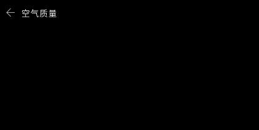
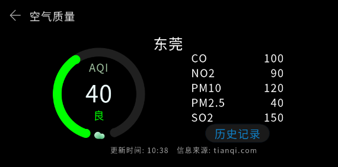
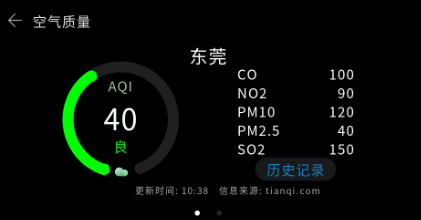

# 开发首页<a name="ZH-CN_TOPIC_0000001054927705"></a>

应用首页主要展示城市的空气质量概况。首页总共有两屏（可以根据需求设置多屏），每屏显示一个城市的空气质量信息：主要包括AQI指数、城市名称、污染物指数、更新时间和信息来源等数据。

从第一章节中的[显示效果图](device-camera-visual-overview.md#fig18250512195914)分析可知，首页由三部分组成：

-   标题栏：位于页面正上方，位置固定，包括应用退出按钮和页面标题。
-   信息栏：主要展示城市的空气信息指标等内容；该页面根据用户需求可设置多屏，且能循环滑动。
-   页面位置指示器：主要功能是标识当前页面，位置固定在页面底部的中间。

综上，我们可搭建一个纵向三行排列的弹性页面布局来实现首页的功能。

1.  在hml文件中添加一个根节点div，注意每个hml文件中有且只能有一个根节点，代码如下：

    ```
    <div class="container">
    </div>
    ```

    class="container"表示组件使用的样式，container是index.css文件中的一个样式类，代码如下：

    ```
    .container {    
        flex-direction: column;
        height: 480px;
        width: 960px;
    }
    ```

    在这个样式类中，我们分别设置了根组件div的高度和宽度（注意在应用的开发过程中，除部分组件（text）外必须显式指定组件的高度和宽度，否则可能无法显示）、并将flex-direction属性设置为column，该属性表示div的子组件是垂直方向从上到下排列；这样就可以实现本节开头所说的纵向三行排列的弹性页面布局。

2.  实现标题栏：标题栏包括一个退出按钮和一个标题，两个控件是横向排列；首先添加一个div，并设置flex-direction的属性为row，表示子组件是水平方向从左往右排列；然后依次添加一个image和text组件，代码如下：

    ```
    <div class="container">    
        <div class="header" onclick="exitApp">        
            <image class="back" src="common/ic_back.png"></image>        
            <text class="title">            
                空气质量        
             </text>    
        </div>
    </div>
    ```

    设置组件的高度、边距、颜色等属性。

    ```
    .header {    
        width: 960px;
        height: 72px;
    }
    .back {    
        width: 36px;
        height: 36px;
        margin-left: 39px;
        margin-top: 23px;
    }
    .title {    
        width: 296px;
        height: 40px;
        margin-top: 20px;
        margin-left: 21px;
        color: #e6e6e6;
    }
    ```

    onclick="exitApp" 设置了div组件的click事件，当在标题栏上触发点击事件时，就会执行函数exitApp，该函数位于index.js文件中，代码如下：

    ```
    exitApp() {  
        console.log('start exit');  
        app.terminate();  
        console.log('end exit');
    }
    ```

    app.terminate\(\)函数实现了程序退出功能；在使用该函数前，需要引入app模块，在js文件的最上方写如下代码：

    ```
    import app from '@system.app'
    ```

    代码编写完成后，在模拟器中运行项目，显示效果如下图所示：

    **图 1**  标题栏效果<a name="fig14273162465317"></a>  
    

3.  实现城市空气质量信息的多屏左右滑动，需要使用“swiper”组件。

    在根节点中添加一个子节点swiper，代码片段如下：

    ```
    <div class="container">    
        <div class="header" onclick="exitApp">        
            <image class="back" src="common/ic_back.png"></image>        
            <text class="title">            
                空气质量        
            </text>    
        </div>    
        <swiper class="swiper" index="{{swiperPage}}" duration="500" onchange="swiperChange">
        </swiper>
    </div>
    ```

    -   class="swiper"设置了组件的高度和宽度，代码如下：

        ```
        .swiper {
            height: 385px;
            width: 960px;
        }
        ```


    -   index="\{\{swiperPage\}\}" duration="500" onchange="swiperChange" 这些代码用来设置组件的属性和事件。其中，duration="500" 表示设置swiper的页面滑动的动画时长为500ms。
    -   index="\{\{swiperPage\}\}"设置了swiper子组件索引值，\{\{swiperPage\}\}这种写法表示index的值是和js代码中的swiperPage变量动态绑定的，index的值会随着swiperPage变动而改变。
    -   onchange="swiperChange" 设置了swiper组件的change事件和函数swiperChange绑定，对应的js代码如下：

        ```
        //引入router模块，用户页面跳转
        import router from'@system.router'
        import app from '@system.app'
        
        export default {
            //定义参数
            data: {
              //默认是第一页
              swiperPage: 0 
            },
            onInit () {
            },
            exitApp(){  
                console.log('start exit');  
                app.terminate();  
                console.log('end exit');
            },
            //swiper滑动回调事件，保存当前swiper的index值，每次滑动都会将index值保存在swiperPage变量中
            swiperChange (e) {
                this.swiperPage = e.index;
            }
        }
        ```


4.  设置一个城市的空气质量信息为一屏，在一屏内，要展示多种信息，分别使用不同的控件进行展示。

    在swiper中添加两个子组件stack（绝对布局），每个stack组件内分别添加text、image、progress等组件来显示对应的信息 ，页面结构如下：

    ```
     <swiper class="swiper" index="{{swiperPage}}" duration="500" onchange="swiperChange">
        <!--第一屏-->
        <stack class="swiper">
            <text></text>------空气质量
            <text></text>------城市名称
            <progress></progress>-----进度条
            <image></image>-------云朵图片
            <text></text>--------AQI数值
            <text>AQI</text>------AQI
            <div>--------空气指标详细信息
            </div>
            <div>--------更新时间和网站等信息
            </div>
        </stack>
        <!--第二屏-->
        <stack class="container">
            <text></text>
            <text></text>
            <progress></progress>
            <image></image>
            <text></text>
            <text></text>
            <div></div>    
        </stack>
    </swiper>
    ```

    代码编写完成后，模拟器运行效果如下：

    **图 2**  标题栏和信息栏效果<a name="fig177003454238"></a>  
    

5.  添加页面位置指示器：由于当前swiper不支持设置indicator，需要开发者自己来实现该效果。在根节点中添加一个子组件div，并设置相应样式；然后在该div中添加两个子组件div，设置两个div的border-radius，并在swiper滑动事件中动态改变对应div的背景色来实现该效果。

    ```
    <div class="images">    
        <div class="circle-div" style="background-color: {{iconcheckedColor}};"></div>    
        <div class="circle-div" style="background-color: {{iconUncheckedColor}};margin-left: 36px;"></div>
    </div>
    ```

    **图 3**  页面位置指示器效果图<a name="fig767374119496"></a>  
    

6.  所有组件设置样式、动画效果和数据动态绑定，完整代码如下所示：

    -   **index.hml文件**

    ```
    <div class="container">
        <div class="header" onclick="exitApp">
            <image class="back" src="common/ic_back.png"></image>
            <text class="title">
                空气质量
            </text>
        </div>
        <swiper class="swiper" index="{{swiperPage}}" duration="500" onchange="swiperChange">
            <stack class="swiper">
                <text class="airquality" style="color:{{textColor1}};">{{airData[0].airQuality}}
                </text>
                <text class="location-text">{{airData[0].location}}
                </text>
                <progress class="circle-progress" style="color: {{textColor1}};background-Color: {{bgColor1}};" type="arc"
                        percent="{{percent1}}"></progress>
                <image class="image" src="{{src1}}"></image>
                <text class="aqi-value">{{airData[0].detailData}}
                </text>
                <text class="aqi">
                    AQI
                </text>
                <div class="detail">
                    <div class="text-wrapper">
                        <text class="gas-name">
                            CO
                        </text>
                        <text class="gas-value">
                            100
                        </text>
                    </div>
                    <div class="text-wrapper">
                        <text class="gas-name">
                            NO2
                        </text>
                        <text class="gas-value">
                            90
                        </text>
                    </div>
                    <div class="text-wrapper">
                        <text class="gas-name">
                            PM10
                        </text>
                        <text class="gas-value">
                            120
                        </text>
                    </div>
                    <div class="text-wrapper">
                        <text class="gas-name">
                            PM2.5
                        </text>
                        <text class="gas-value">
                            40
                        </text>
                    </div>
                    <div class="text-wrapper">
                        <text class="gas-name">
                            SO2
                        </text>
                        <text class="gas-value">
                            150
                        </text>
                    </div>
                    <input class="btn" type="button" onclick="openDetail" value="历史记录"></input>
                </div>
                <div class="footer">
                    <text class="update-time">
                        更新时间: 10:38
                    </text>
                    <text class="info-source">
                        信息来源: tianqi.com
                    </text>
                </div>
            </stack>
            <stack class="swiper">
                <text class="airquality" style="color: {{textColor2}};">{{airData[1].airQuality}}
                </text>
                <text class="location-text">{{airData[1].location}}
                </text>
                <progress class="circle-progress" style="color: {{textColor2}};background-Color: {{bgColor2}};" type="arc"
                        percent="{{percent2}}"></progress>
                <image class="image" src="{{src2}}"></image>
                <text class="aqi-value">{{airData[1].detailData}}
                </text>
                <text class="aqi">
                    AQI
                </text>
                <div class="detail">
                    <div class="text-wrapper">
                        <text class="gas-name">
                            CO
                        </text>
                        <text class="gas-value">
                            10
                        </text>
                    </div>
                    <div class="text-wrapper">
                        <text class="gas-name">
                            NO2
                        </text>
                        <text class="gas-value">
                            50
                        </text>
                    </div>
                    <div class="text-wrapper">
                        <text class="gas-name">
                            PM10
                        </text>
                        <text class="gas-value">
                            60
                        </text>
                    </div>
                    <div class="text-wrapper">
                        <text class="gas-name">
                            PM2.5
                        </text>
                        <text class="gas-value">
                            40
                        </text>
                    </div>
                    <div class="text-wrapper">
                        <text class="gas-name">
                            SO2
                        </text>
                        <text class="gas-value">
                            150
                        </text>
                    </div>
                    <input class="btn" type="button" onclick="openDetail" value="历史记录"></input>
                </div>
                <div class="footer">
                    <text class="update-time">
                        更新时间: 10:38
                    </text>
                    <text class="info-source">
                        信息来源: tianqi.com
                    </text>
                </div>
            </stack>
        </swiper>
        <div class="images">
            <div class="circle-div" style="background-color: {{iconcheckedColor}};"></div>
            <div class="circle-div" style="background-color: {{iconUncheckedColor}};margin-left: 36px;"></div>
        </div>
    </div>
    ```

    -   **index.css文件**

    css文件中定义了许多class，每个class用于定义组件的位置、大小、字体、颜色、背景色等信息。同时，每一个子组件都叠加在父组件中，父组件的样式会影响子组件的呈现。

    ```
    .aqi-value {
        text-align: center;
        font-size: 65px;
        color: #f0ffff;
        width: 156px;
        height: 92px;
        top: 134px;
        left: 210px;
    }
    .aqi {
        text-align: center;
        color: #a2c4a2;
        width: 156px;
        height: 45px;
        top: 90px;
        left: 210px;
    }
    .airquality {
        top: 222px;
        text-align: center;
        width: 156px;
        height: 45px;
        left: 210px;
    }
    .image {
        top: 285px;
        left: 274px;
        width: 32px;
        height: 32px;
    }
    .location-text {
        text-align: center;
        color: #ffffff;
        width: 200px;
        height: 52px;
        font-size: 40px;
        left: 380px;
        top: 16px;
    }
    .container {
        flex-direction: column;
        height: 480px;
        width: 960px;
    }
    .circle-progress {
        center-x: 128px;
        center-y: 128px;
        radius: 128px;
        startAngle: 198;
        totalAngle: 320;
        strokeWidth: 24px;
        width: 256px;
        height: 256px;
        left: 160px;
        top: 58px;
    }
    .detail {
        width: 256px;
        height: 265px;
        left: 544px;
        top: 58px;
        flex-direction: column;
    }
    .text-wrapper {
        width: 256px;
        height: 35px;
        margin-top: 6px;
    }
    .gas-name {
        width: 128px;
        height: 35px;
        text-align: left;
    }
    .gas-value {
        width: 128px;
        height: 35px;
        text-align: right;
    }
    .btn {
        width: 180px;
        height: 50px;
        margin-top: 6px;
        margin-left: 38px;
        background-color: #1a1a1a;
        color: #1085CE;
    }
    .footer {
        top: 326px;
        width: 960px;
        height: 28px;
    }
    .header {
        width: 960px;
        height: 72px;
    }
    .back {
        width: 36px;
        height: 36px;
        margin-left: 39px;
        margin-top: 23px;
    }
    .title {
        width: 296px;
        height: 40px;
        margin-top: 20px;
        margin-left: 21px;
        color: #e6e6e6;
    }
    .swiper {
        height: 385px;
        width: 960px;
    }
    .images {
        width: 60px;
        height: 15px;
        margin-left: 450px;
    }
    .update-time {
        width: 480px;
        height: 28px;
        font-size: 20px;
        color: #A9A9A9;
        text-align: right;
    }
    .info-source {
        width: 450px;
        height: 28px;
        font-size: 20px;
        color: #A9A9A9;
        text-align: left;
        margin-left: 24px;
    }
    .circle-div {
        width: 12px;
        height: 12px;
        border-radius: 6px;
    }
    ```

    -   **index.js:**

    js文件主要用于实现App应用的逻辑交互。在本页面js文件中，需要实现如下功能：根据数值动态改变文字、进度条颜色、页面跳转。

    ```
    //导入router和app模块
    import router from '@system.router'
    import app from '@system.app'
    
    export default {
        data: {
          //页面绑定数据
          textColor1: '#00ff00',
          textColor2: '#00ff00',
          bgColor1: '#669966',
          bgColor2: '#669966',
          swiperPage: 0,
          percent1: 40,
          percent2: 90,
          iconUncheckedColor: '#262626',
          iconcheckedColor: '#ffffff',
          iconcheckedBR: '6px',
          src1: 'common/cloud_green.png',
          src2: 'common/cloud_green.png',
          airData: [{
            location: '东莞',
            airQuality: '良',
            detailData: 40
          }, {
            location: '深圳',
            airQuality: '差',
            detailData: 90
          }]
        },
        onInit () {
          //根据数值的不同，设置不同的字体、背景颜色和图片
          if(this.airData[0].detailData > 100){
            this.src1 = 'common/cloud_red.png';
            this.textColor1 = '#ff0000';
            this.bgColor1 = '#9d7462';
          } else if(50 < this.airData[0].detailData && this.airData[0].detailData <= 100){
            this.src1 = 'common/cloud_yellow.png';
            this.textColor1 = '#ecf19a';
            this.bgColor1 = '#9d9d62';
          }
          if(this.airData[1].detailData > 100){
            this.src2 = 'common/cloud_red.png';
            this.textColor2 = '#ff0000';
            this.bgColor2 = '#9d7462';
          } else if(50 < this.airData[1].detailData && this.airData[1].detailData <= 100){
            this.src2 = 'common/cloud_yellow.png';
            this.textColor2 = '#ecf19a';
            this.bgColor2 =  '#9d9d62';
          }
          if(this.selectedCityIndex){
            this.swiperPage = this.selectedCityIndex;
            if(this.swiperPage == 0){
              this.iconcheckedColor = '#ffffff';
              this.iconUncheckedColor = '#262626';
            }else{
              this.iconcheckedColor = '#262626';
              this.iconUncheckedColor = '#ffffff';
            }
          }
        },
        //跳转到详情页面
        openDetail () {
          router.replace({
            uri: 'pages/detail/detail',
            params: {selectedCityIndex:this.swiperPage}
          });
        },
        //退出应用
        exitApp(){
          console.log('start exit');
          app.terminate();
          console.log('end exit');
        },
        //页面滑动事件，滑动时改变最新的标识
        swiperChange (e) {
          this.swiperPage = e.index;
          if(e.index == 0){
            this.iconcheckedColor = '#ffffff';
            this.iconUncheckedColor = '#262626';
          }else{
            this.iconcheckedColor = '#262626';
            this.iconUncheckedColor = '#ffffff';
          }
        }
    }
    ```


