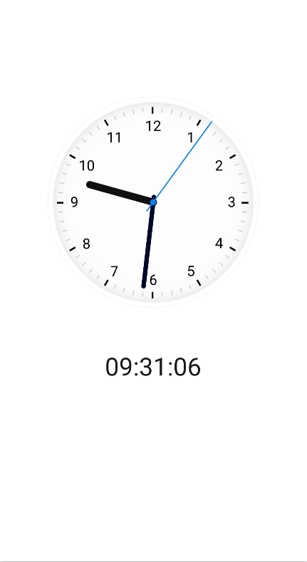

# 时钟应用开发指导<a name="ZH-CN_TOPIC_0000001115417926"></a>

-   [概述](#section11522349121115)
-   [开发准备](#section6592121861218)
-   [开发步骤](#section19901741111312)
-   [签名打包](#section10601181101516)
-   [真机运行](#section092721731511)
-   [常见问题](#section1122413460153)
    -   [hdc\_std连接不到设备](#section1922725151614)
    -   [hdc\_std运行不了](#section15657547131615)


## 概述<a name="section11522349121115"></a>

本文将介绍如何快速搭建基于OpenHarmony标准系统（Hi3516DV300开发板）的应用开发环境，并基于一个时钟APP示例逐步展示应用的创建、开发、调试和安装等流程。示例代码可以通过[本链接](https://gitee.com/openharmony/app_samples/tree/master/common/Clock)获取。

时钟App是一款显示实时时间的应用，显示效果如下图所示：

**图 1**  时钟应用显示效果图<a name="fig7763172132019"></a>  




## 开发准备<a name="section6592121861218"></a>

首先需要下载和配置DevEco Studio，具体操作请参考[DevEco Studio 使用指南](../../application-dev/quick-start/deveco-studio-user-guide-for-openharmony.md)。

## 开发步骤<a name="section19901741111312"></a>

应用的功能是通过表盘和数字显示实时时间。

从[显示效果图](device-clock-guide.md#fig7763172132019)分析可知，页面由两个部分组成：

-   表盘栏：主要展示一个动态的钟表，且钟表指针能准确转动。
-   数字时间栏：主要以数字形式显示当前时间。

综上，我们可搭建一个纵向两行排列的弹性页面布局来实现界面的功能。具体开发步骤如下：

1.  在hml文件中添加一个根节点div，注意每个hml文件中有且只能有一个根节点，代码如下：

    ```
    <div class="container">
    </div>
    ```

    class="container"表示组件使用的样式，container是index.css文件中的一个样式类，代码如下：

    ```
    .container {     
        flex-direction: column;
        justify-content: center;
        align-items: center;
        width: 100%;
        height: 100%;
    }
    ```

    在这个样式类中，我们分别设置了根组件div的高度和宽度（注意在应用的开发过程中，除部分组件（text）外必须显式指定组件的高度和宽度，否则可能无法显示）、并将flex-direction属性设置为column，该属性表示div的子组件是垂直方向从上到下排列；这样就可以实现本节开头所说的纵向两行排列的弹性页面布局。

2.  实现时钟转动，需要使用“stack”组件。“stack”组件的功能是堆叠容器，子组件按照顺序依次入栈，后一个子组件覆盖前一个子组件。

    在根组件下添加一个stack容器，代码片段如下：

    ```
    <div class="container">    
        <stack class="stack">
            <image src="/common/clock_bg.png" class="clock-bg"></image> <!--设置表盘图片-->
            <image src="/common/hour_hand.png" class="clock-hand"
                   style="transform : rotate({{ hour * 30 + minute / 2 }}deg);"></image> <!--设置时钟图片，(hour * 30)一小时旋转30度，(minute / 2)时钟每分钟旋转的角度-->
            <image src="/common/minute_hand.png" class="clock-hand"
                   style="transform : rotate({{ minute * 6 + second / 10 }}deg);"></image> <!--设置分钟图片，(minute * 6)一分钟旋转6度，(second / 10)分钟每秒钟旋转的角度-->
            <image src="/common/second_hand.png" class="clock-hand"
                   style="transform : rotate({{ second * 6 }}deg);"></image> <!--设置秒钟图片，(second * 6)一秒旋转6度-->
       </stack>
    </div>
    ```

    style="transform : rotate\(\{\{ second \* 6 \}\}deg\) 这类代码用来设置组件的旋转事件。其中transform是设置动画平移/旋转/缩放的属性，rotate是旋转动画属性，支持设置x轴和y轴两个维度的选中参数。

    在css文件中设置"stack"组件样式的高度、宽度、位置等属性，代码如下：

    ```
    .stack {
        flex-direction: column;
        justify-content: center;
        align-items: center;
        width: 100%;
        height: 50%;
    }
    ```

    在css文件中设置"clock-bg"组件样式的高度、宽度等属性，代码如下：

    ```
    .clock-bg {
        width: 80%;
        height: 80%;
        object-fit: scale-down;
    }
    ```

    在css文件中设置"clock-hand"组件为时针、分针和秒针的高度、宽度等属性，代码如下：

    ```
    .clock-hand {
        width: 25%;
        height: 65%;
        object-fit: contain;
    }
    ```

    index.js中会有一个定时器实时刷新时分秒变量，从而触发时间界面自动更新。对应的js代码如下：

    ```
    export default {
        timer: undefined,
        //定义参数
        data: {
          hour: 0,   //定义小时
          minute: 0, //定义分钟
          second: 0  //定义秒
        },
        onInit () {
            this.updateTime();
            this.timer = setInterval(this.updateTime, 1000)//设置1s的定时器
        },  
        updateTime: function () {       
            var nowTime = new Date()    
            this.hour = nowTime.getHours()    
            this.minute = nowTime.getMinutes()   
            this.second = nowTime.getSeconds()    
            if (this.hour < 10) {        
                this.hour = '0' + this.hour    
            }  
            if (this.minute < 10) {       
                this.minute = '0' + this.minute   
            }    
            if (this.second < 10) {      
                this.second = '0' + this.second   
            }
        },
    }
    ```

3.  显示数字时间，在钟表下面以数字形式显示当前时间。在根布局内末尾加上text组件，页面结构如下：

    ```
    <text class="digit-clock"> {{ hour }}:{{ minute }}:{{ second }}</text>
    ```

    class="digit-clock"设置了组件的高度和宽度以及字体大小，其代码如下：

    ```
    .digit-clock {    
        font-size: 58px;   
        width: 100%;
        margin-top: 0px;
        text-align: center;
    }
    ```

4.  所有组件设置样式、动画效果和数据动态绑定，完整代码如下所示：
    -   **index.hml文件**

        ```
        <div class="container">
            <stack class="stack">
                <image src="/common/clock_bg.png" class="clock-bg"></image>
                <image src="/common/hour_hand.png" class="clock-hand"
                       style="transform : rotate({{ hour * 30 + minute / 2 }}deg);"></image>
                <image src="/common/minute_hand.png" class="clock-hand"
                       style="transform : rotate({{ minute * 6 + second / 10 }}deg);"></image>
                <image src="/common/second_hand.png" class="clock-hand"
                       style="transform : rotate({{ second * 6 }}deg);"></image>
            </stack>
            <text class="digit-clock">{{ hour }}:{{ minute }}:{{ second }}</text>
        </div>
        ```

    -   **index.css文件**

        ```
        .container {
            flex-direction: column;
            justify-content: center;
            align-items: center;
            width: 100%;
            height: 100%;
        }
        
        .stack {
            flex-direction: column;
            justify-content: center;
            align-items: center;
            width: 100%;
            height: 50%;
        }
        
        .digit-clock {
            font-size: 58px;
            width: 100%;
            margin-top: 0px;
            text-align: center;
        }
        
        .clock-bg {
            width: 80%;
            height: 80%;
            object-fit: scale-down;
        }
        
        .clock-hand {
            width: 25%;
            height: 65%;
            object-fit: contain;
        }
        ```

    -   **index.js:**

        js文件主要用于实现App应用的逻辑交互。在本页面js文件中，需要实现如下功能：定时获取系统时间。

        ```
        export default {
            timer: undefined,
            data: {
                hour: 0,
                minute: 0,
                second: 0
            },
            onInit() {
                this.updateTime()
                this.timer = setInterval(this.updateTime, 1000)
            },
            updateTime: function () {
                var nowTime = new Date()
                this.hour = nowTime.getHours()
                this.minute = nowTime.getMinutes()
                this.second = nowTime.getSeconds()
                if (this.hour < 10) {
                    this.hour = '0' + this.hour
                }
                if (this.minute < 10) {
                    this.minute = '0' + this.minute
                }
                if (this.second < 10) {
                    this.second = '0' + this.second
                }
            },
            onDestroy() {
                clearInterval(this.timer);
            }
        }
        ```


## 签名打包<a name="section10601181101516"></a>

代码编写完成后，在真机设备上运行应用，需要先对应用进行签名，然后再进行打包，具体操作请参考[签名打包指导](../../application-dev/quick-start/configuring-openharmony-app-signature.md)。

## 真机运行<a name="section092721731511"></a>

应用签名打包后即可安装到开发板。安装应用前需要先完成[DevEco Device Tool的安装配置](https://device.harmonyos.com/cn/docs/ide/user-guides/service_introduction-0000001050166905)，然后将OpenHarmony系统烧录到开发板并运行。编译烧录、运行镜像的基本操作请参考快速入门手册：[标准系统Hi3516快速入门](../quick-start/quickstart-standard-overview.md)。完成镜像运行，系统正常启动后，执行如下步骤安装或卸载应用。

1.  从开发者工具代码仓路径中获取hdc客户端。

    ```
    developtools/hdc_standard/prebuilt/windows/hdc_std.exe
    ```

    修改名称为hdc.exe，并将工具路径加入系统环境path变量中。

2.  启动cmd命令窗口，执行以下命令，推送hap应用包到设备目录下并安装。

    ```
    hdc smode
    hdc target mount
    hdc file send clock.hap /data/clock.hap
    hdc shell chmod 666 /data/clock.hap
    hdc shell bm install -p /data/clock.hap
    ```

3.  启动应用。执行以下命令，其中ohos.samples.clock为应用包名，MainAbility为应用启动的Ability。

    ```
    hdc shell aa start -d 123 -a ohos.samples.clock.MainAbility -b ohos.samples.clock
    ```

4.  卸载应用（可选）。执行以下命令，其中ohos.samples.clock为应用包名。

    ```
    hdc shell bm uninstall -n ohos.samples.clock
    ```


## 常见问题<a name="section1122413460153"></a>

### hdc\_std连接不到设备<a name="section1922725151614"></a>

-   **现象描述**

    执行 "hdc\_std list targets"命令后结果为：\[Empty\]

-   **可能原因和解决方法**
    1.  设备没有被识别：

        在设备管理器中查看是否有hdc设备，在通用串行总线设备中会有“HDC Device”信息。如果没有，hdc无法连接。此时需要插拔设备，或者烧写最新的镜像。

    2.  hdc\_std工作异常：

        可以执行"hdc kill"或者"hdc start -r"杀掉hdc服务或者重启hdc服务，然后再执行hdc list targets查看是否已经可以获取设备信息。

    3.  hdc\_std与设备不匹配：

        如果设备烧写的是最新镜像，hdc\_std也需要使用最新版本。由于hdc\_std会持续更新，请从开源仓developtools\_hdc\_standard中获取，具体位置在该开源仓的prebuilt目录。


### hdc\_std运行不了<a name="section15657547131615"></a>

-   **现象描述**

    点击hdc\_std.exe文件无法运行。

-   **可能原因和解决方法**

    hdc\_std.exe不需要安装，直接放到磁盘上就能使用，也可以添加到环境变量中。通过打开cmd执行hdc\_std命令直接使用。


