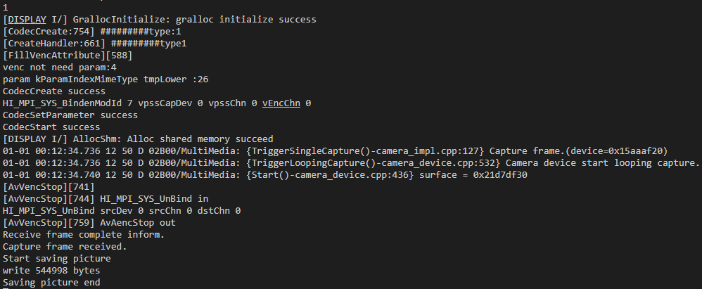

# 应用实例

-   开发板介绍、编译烧录、运行镜像等操作请参考[Hi3518快速入门](../quick-start/quickstart-lite-introduction-hi3518.md#section14815247616)，编译结果包含示例，结果文件为out/ipcamera\_hi3518ev300/dev\_tools/bin/camera\_sample，可将文件通过读卡器复制至TF卡中，或者修改camera\_sample的编译脚本将结果文件复制至rootfs.img中。

    修改applications/sample/camera/media/BUILD.gn中的output\_dir。

    -   修改前：output\_dir = "$root\_out\_dir/dev\_tools"
    -   修改后：output\_dir = "$root\_out\_dir/"

    重新执行源码仓编译并烧写入单板后，可在单板bin目录下找到camera\_sample文件。

-   相机示例代码为applications/sample/camera/media/camera\_sample.cpp。

    > **须知：** 
    >实例运行拍照和录像功能需要插入TF卡\(最大容量支持128GB\)，系统启动后时自动将TF卡挂载至/sdcard目录，如果在启动后插入则需要手动挂载。查看拍照和录像内容可将TF卡中内容复制到电脑中进行查看，预览功能无需TF卡。

1.  通过cd命令进入可执行程序的末端路径，启动camera\_sample，执行命令如下图。

    **图 1**  启动示例  
    

    运行后的控制命令如串口打印所示，按s键停止当前操作（包括录像和预览），按q键退出示例程序。

2.  按1进行拍照，拍照的文件格式为jpg，存储在/sdcard，文件名Capture\*

    **图 2**  输入拍照指令后串口打印日志  
    

    若想查看保存文件，可在退出程序后进入文件系统查看，退出后重新进入请回到步骤1。

    **图 3**  查看文件图  
    

3.  按2进行录像，录像的文件格式为mp4，存储在/sdcard，文件名Record\*，按s键停止

    **图 4**  输入录像指令后串口打印日志  
    

4.  按q键退出

    **图 5**  输出退出指令后串口打印日志  
    

