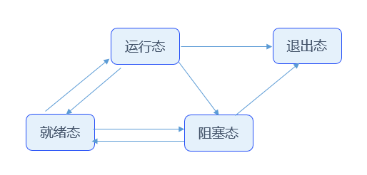

# 基本概念

-   [任务相关概念](#section673132352511)
-   [任务运行机制](#section176294469251)

从系统角度看，任务是竞争系统资源的最小运行单元。任务可以使用或等待CPU、使用内存空间等系统资源，并独立于其它任务运行。

OpenHarmony LiteOS-M的任务模块可以给用户提供多个任务，实现任务间的切换，帮助用户管理业务程序流程。任务模块具有如下特性：

-   支持多任务。
-   一个任务表示一个线程。
-   抢占式调度机制，高优先级的任务可打断低优先级任务，低优先级任务必须在高优先级任务阻塞或结束后才能得到调度。
-   相同优先级任务支持时间片轮转调度方式。
-   共有32个优先级\[0-31\]，最高优先级为0，最低优先级为31。

## 任务相关概念

**任务状态**

任务有多种运行状态。系统初始化完成后，创建的任务就可以在系统中竞争一定的资源，由内核进行调度。

任务状态通常分为以下四种：

-   就绪（Ready）：该任务在就绪队列中，只等待CPU。
-   运行（Running）：该任务正在执行。
-   阻塞（Blocked）：该任务不在就绪队列中。包含任务被挂起（suspend状态）、任务被延时（delay状态）、任务正在等待信号量、读写队列或者等待事件等。
-   退出态（Dead）：该任务运行结束，等待系统回收资源。

**任务状态迁移**

**图 1**  任务状态示意图  

**任务状态迁移说明：**

-   就绪态→运行态

    任务创建后进入就绪态，发生任务切换时，就绪队列中最高优先级的任务被执行，从而进入运行态，同时该任务从就绪队列中移出。

-   运行态→阻塞态

    正在运行的任务发生阻塞（挂起、延时、读信号量等）时，该任务会从就绪队列中删除，任务状态由运行态变成阻塞态，然后发生任务切换，运行就绪队列中最高优先级任务。

-   阻塞态→就绪态（阻塞态→运行态）

    阻塞的任务被恢复后（任务恢复、延时时间超时、读信号量超时或读到信号量等），此时被恢复的任务会被加入就绪队列，从而由阻塞态变成就绪态；此时如果被恢复任务的优先级高于正在运行任务的优先级，则会发生任务切换，该任务由就绪态变成运行态。

-   就绪态→阻塞态

    任务也有可能在就绪态时被阻塞（挂起），此时任务状态由就绪态变为阻塞态，该任务从就绪队列中删除，不会参与任务调度，直到该任务被恢复。

-   运行态→就绪态

    有更高优先级任务创建或者恢复后，会发生任务调度，此刻就绪队列中最高优先级任务变为运行态，那么原先运行的任务由运行态变为就绪态，依然在就绪队列中。

-   运行态→退出态

    运行中的任务运行结束，任务状态由运行态变为退出态。退出态包含任务运行结束的正常退出状态以及Invalid状态。例如，任务运行结束但是没有自删除，对外呈现的就是Invalid状态，即退出态。

-   阻塞态→退出态

    阻塞的任务调用删除接口，任务状态由阻塞态变为退出态。

**任务ID**

任务ID，在任务创建时通过参数返回给用户，是任务的重要标识。系统中的ID号是唯一的。用户可以通过任务ID对指定任务进行任务挂起、任务恢复、查询任务名等操作。

**任务优先级**

优先级表示任务执行的优先顺序。任务的优先级决定了在发生任务切换时即将要执行的任务，就绪队列中最高优先级的任务将得到执行。

**任务入口函数**

新任务得到调度后将执行的函数。该函数由用户实现，在任务创建时，通过任务创建结构体设置。

**任务栈**

每个任务都拥有一个独立的栈空间，我们称为任务栈。栈空间里保存的信息包含局部变量、寄存器、函数参数、函数返回地址等。

**任务上下文**

任务在运行过程中使用的一些资源，如寄存器等，称为任务上下文。当这个任务挂起时，其他任务继续执行，可能会修改寄存器等资源中的值。如果任务切换时没有保存任务上下文，可能会导致任务恢复后出现未知错误。因此在任务切换时会将切出任务的任务上下文信息，保存在自身的任务栈中，以便任务恢复后，从栈空间中恢复挂起时的上下文信息，从而继续执行挂起时被打断的代码。

**任务控制块TCB**

每个任务都含有一个任务控制块\(TCB\)。TCB包含了任务上下文栈指针（stack pointer）、任务状态、任务优先级、任务ID、任务名、任务栈大小等信息。TCB可以反映出每个任务运行情况。

**任务切换**

任务切换包含获取就绪队列中最高优先级任务、切出任务上下文保存、切入任务上下文恢复等动作。

## 任务运行机制

用户创建任务时，系统会初始化任务栈，预置上下文。此外，系统还会将“任务入口函数”地址放在相应位置。这样在任务第一次启动进入运行态时，将会执行“任务入口函数”。

