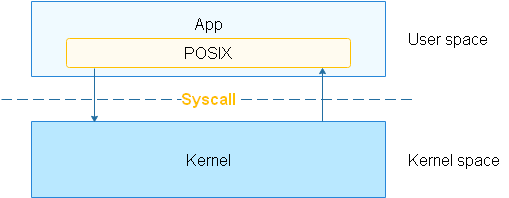

# 标准库<a name="ZH-CN_TOPIC_0000001051690267"></a>

-   [框架流程](#section1247343413257)
-   [操作实例](#section4807125622614)
-   [常见问题](#section1219455217277)

OpenHarmony内核使用**musl libc**库，支持标准POSIX接口，开发者可基于POSIX标准接口开发内核之上的组件及应用。

## 框架流程<a name="section1247343413257"></a>

**图 1**  POSIX接口框架<a name="fig279734632911"></a>  


**musl libc**库支持POSIX标准，涉及的系统调用相关接口由OpenHarmony内核适配支持 ，以满足接口对外描述的功能要求。

标准库支持接口的详细情况请参考C库的API文档，其中也涵盖了与POSIX标准之间的差异说明。

## 操作实例<a name="section4807125622614"></a>

在本示例中，主线程创建了THREAD\_NUM个子线程，每个子线程启动后等待被主线程唤醒，主线程成功唤醒所有子线程后，子线程继续执行直至生命周期结束，同时主线程通过pthread\_join方法等待所有线程执行结束。

```
#include <stdio.h>
#include <unistd.h>
#include <pthread.h>

#ifdef __cplusplus
#if __cplusplus
extern "C" {
#endif /* __cplusplus */
#endif /* __cplusplus */

#define THREAD_NUM 3
int g_startNum = 0; /* 启动的线程数 */
int g_wakenNum = 0; /* 唤醒的线程数 */

struct testdata {
    pthread_mutex_t mutex;
    pthread_cond_t cond;
} g_td;

/*
 * 子线程入口函数
 */
static void *ChildThreadFunc(void *arg)
{
    int rc;
    pthread_t self = pthread_self();

    /* 获取mutex锁 */
    rc = pthread_mutex_lock(&g_td.mutex);
    if (rc != 0) {
        printf("ERROR:take mutex lock failed, error code is %d!\n", rc);
        goto EXIT;
    }

    /* g_startNum计数加一，用于统计已经获得mutex锁的子线程个数 */
    g_startNum++;

    /* 等待cond条件变量 */
    rc = pthread_cond_wait(&g_td.cond, &g_td.mutex);
    if (rc != 0) {
        printf("ERROR: pthread condition wait failed, error code is %d!\n", rc);
        (void)pthread_mutex_unlock(&g_td.mutex);
        goto EXIT;
    }

    /* 尝试获取mutex锁，正常场景，此处无法获取锁 */
    rc = pthread_mutex_trylock(&g_td.mutex);
    if (rc == 0) {
        printf("ERROR: mutex gets an abnormal lock!\n");
        goto EXIT;
    }

    /* g_wakenNum计数加一，用于统计已经被cond条件变量唤醒的子线程个数 */
    g_wakenNum++;

    /* 释放mutex锁 */
    rc = pthread_mutex_unlock(&g_td.mutex);
    if (rc != 0) {
        printf("ERROR: mutex release failed, error code is %d!\n", rc);
        goto EXIT;
    }
EXIT:
    return NULL;
}

static int testcase(void)
{
    int i, rc;
    pthread_t thread[THREAD_NUM];

    /* 初始化mutex锁 */
    rc = pthread_mutex_init(&g_td.mutex, NULL);
    if (rc != 0) {
        printf("ERROR: mutex init failed, error code is %d!\n", rc);
        goto ERROROUT;
    }

    /* 初始化cond条件变量 */
    rc = pthread_cond_init(&g_td.cond, NULL);
    if (rc != 0) {
        printf("ERROR: pthread condition init failed, error code is %d!\n", rc);
        goto ERROROUT;
    }

    /* 批量创建THREAD_NUM个子线程 */
    for (i = 0; i < THREAD_NUM; i++) {
        rc = pthread_create(&thread[i], NULL, ChildThreadFunc, NULL);
        if (rc != 0) {
            printf("ERROR: pthread create failed, error code is %d!\n", rc);
            goto ERROROUT;
        }
    }

    /* 等待所有子线程都完成mutex锁的获取 */
    while (g_startNum < THREAD_NUM) {
        usleep(100);
    }

    /* 获取mutex锁，确保所有子线程都阻塞在pthread_cond_wait上 */
    rc = pthread_mutex_lock(&g_td.mutex);
    if (rc != 0) {
        printf("ERROR: mutex lock failed, error code is %d\n", rc);
        goto ERROROUT;
    }

    /* 释放mutex锁 */
    rc = pthread_mutex_unlock(&g_td.mutex);
    if (rc != 0) {
        printf("ERROR: mutex unlock failed, error code is %d!\n", rc);
        goto ERROROUT;
    }

    for (int j = 0; j < THREAD_NUM; j++) {
        /* 在cond条件变量上广播信号 */
        rc = pthread_cond_signal(&g_td.cond);
        if (rc != 0) {
            printf("ERROR: pthread condition failed, error code is %d!\n", rc);
            goto ERROROUT;
        }
    }

    sleep(1);

    /* 检查是否所有子线程都已被唤醒 */
    if (g_wakenNum != THREAD_NUM) {
        printf("ERROR: not all threads awaken, only %d thread(s) awaken!\n", g_wakenNum);
        goto ERROROUT;
    }

    /* join所有子线程，即等待其结束 */
    for (i = 0; i < THREAD_NUM; i++) {
        rc = pthread_join(thread[i], NULL);
        if (rc != 0) {
            printf("ERROR: pthread join failed, error code is %d!\n", rc);
            goto ERROROUT;
        }
    }

    /* 销毁cond条件变量 */
    rc = pthread_cond_destroy(&g_td.cond);
    if (rc != 0) {
        printf("ERROR: pthread condition destroy failed, error code is %d!\n", rc);
        goto ERROROUT;
    }
    return 0;
ERROROUT:
    return -1;
}

/*
 * 示例代码主函数
 */
int main(int argc, char *argv[])
{
    int rc;

    /* 启动测试函数 */
    rc = testcase();
    if (rc != 0) {
        printf("ERROR: testcase failed!\n");
    }

    return 0;
}
#ifdef __cplusplus
#if __cplusplus
}
#endif /* __cplusplus */
#endif /* __cplusplus */
```

## 常见问题<a name="section1219455217277"></a>

无。

