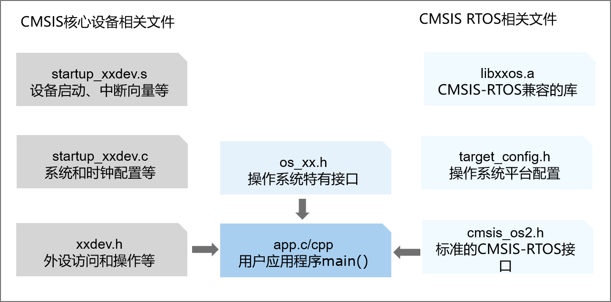

# CMSIS支持

- [基本概念](#基本概念)
- [开发指导](#开发指导)
  - [接口说明](#接口说明)
  - [开发流程](#开发流程)
  - [编程实例](#编程实例)

## 基本概念

[CMSIS](https://developer.arm.com/tools-and-software/embedded/cmsis)是Cortex Microcontroller Software Interface Standard（Cortex微控制器软件接口标准）的缩写，是对于那些基于ARM Cortex处理器的微控制器独立于供应商的硬件抽象层。它包含多个组件层，其中之一是RTOS层，该层定义了一套通用及标准化的RTOS API接口，减少了应用开发者对特定RTOS的依赖，方便用户软件的移植重用。该套API有2个版本，分别为版本1（CMSIS-RTOS v1）和版本2（CMSIS-RTOS v2），OpenHarmony LiteOS-M仅提供其版本2的实现。


## 开发指导


### 接口说明

CMSIS-RTOS v2提供下面几种功能，接口详细信息可以查看API参考。

**表1** CMSIS-RTOS v2接口

| 功能分类 | 接口名 | 描述 | 
| -------- | -------- | -------- |
| 内核信息与控制 | osKernelGetInfo | 获取RTOS内核信息。 | 
| osKernelGetState | 获取当前的RTOS内核状态。 | 
| osKernelGetSysTimerCount | 获取RTOS内核系统计时器计数。 | 
| osKernelGetSysTimerFreq | 获取RTOS内核系统计时器频率。 | 
| osKernelInitialize | 初始化RTOS内核。 | 
| osKernelLock | 锁定RTOS内核调度程序。 | 
| osKernelUnlock | 解锁RTOS内核调度程序。 | 
| osKernelRestoreLock | 恢复RTOS内核调度程序锁定状态。 | 
| osKernelResume | 恢复RTOS内核调度程序。（暂未实现） | 
| osKernelStart | 启动RTOS内核调度程序。 | 
| osKernelSuspend | 挂起RTOS内核调度程序。（暂未实现） | 
| osKernelGetTickCount | 获取RTOS内核滴答计数。 | 
| osKernelGetTickFreq | 获取RTOS内核滴答频率。 | 
| 线程管理 | osThreadDetach | 分离线程（线程终止时可以回收线程存储）。（暂未实现） | 
| osThreadEnumerate | 枚举活动线程。（暂未实现） | 
| osThreadExit | 终止当前正在运行的线程的执行。 | 
| osThreadGetCount | 获取活动线程的数量。 | 
| osThreadGetId | 返回当前正在运行的线程的线程ID。 | 
| osThreadGetName | 获取线程的名称。 | 
| osThreadGetPriority | 获取线程的当前优先级。 | 
| osThreadGetStackSize | 获取线程的堆栈大小。 | 
| osThreadGetStackSpace | 根据执行期间的堆栈水印记录获取线程的可用堆栈空间。 | 
| osThreadGetState | 获取线程的当前线程状态。 | 
| osThreadJoin | 等待指定线程终止。（暂未实现） | 
| osThreadNew | 创建一个线程并将其添加到活动线程中。 | 
| osThreadResume | 恢复线程的执行。 | 
| osThreadSetPriority | 更改线程的优先级。 | 
| osThreadSuspend | 暂停执行线程。 | 
| osThreadTerminate | 终止线程的执行。 | 
| osThreadYield | 将控制权传递给处于就绪状态的下一个线程。 | 
| 线程标志 | osThreadFlagsSet | 设置线程的指定线程标志。（暂未实现） | 
| osThreadFlagsClear | 清除当前正在运行的线程的指定线程标志。（暂未实现） | 
| osThreadFlagsGet | 获取当前正在运行的线程的当前线程标志。（暂未实现） | 
| osThreadFlagsWait | 等待当前正在运行的线程的一个或多个线程标志发出信号。（暂未实现） | 
| 事件标志 | osEventFlagsGetName | 获取事件标志对象的名称。（暂未实现） | 
| osEventFlagsNew | 创建并初始化事件标志对象。 | 
| osEventFlagsDelete | 删除事件标志对象。 | 
| osEventFlagsSet | 设置指定的事件标志。 | 
| osEventFlagsClear | 清除指定的事件标志。 | 
| osEventFlagsGet | 获取当前事件标志。 | 
| osEventFlagsWait | 等待一个或多个事件标志被发出信号。 | 
| 通用等待函数 | osDelay | 等待超时（时间延迟）。 | 
| osDelayUntil | 等到指定时间。 | 
| 计时器管理 | osTimerDelete | 删除计时器。 | 
| osTimerGetName | 获取计时器的名称。（暂未实现） | 
| osTimerIsRunning | 检查计时器是否正在运行。 | 
| osTimerNew | 创建和初始化计时器。 | 
| osTimerStart | 启动或重新启动计时器。 | 
| osTimerStop | 停止计时器。 | 
| 互斥管理 | osMutexAcquire | 获取互斥或超时（如果已锁定）。 | 
| osMutexDelete | 删除互斥对象。 | 
| osMutexGetName | 获取互斥对象的名称。（暂未实现） | 
| osMutexGetOwner | 获取拥有互斥对象的线程。 | 
| osMutexNew | 创建并初始化Mutex对象。 | 
| osMutexRelease | 释放由osMutexAcquire获取的Mutex。 | 
| 信号量 | osSemaphoreAcquire | 获取信号量令牌或超时（如果没有可用的令牌）。 | 
| osSemaphoreDelete | 删除一个信号量对象。 | 
| osSemaphoreGetCount | 获取当前信号量令牌计数。 | 
| osSemaphoreGetName | 获取信号量对象的名称。（暂未实现） | 
| osSemaphoreNew | 创建并初始化一个信号量对象。 | 
| osSemaphoreRelease | 释放信号量令牌，直到初始最大计数。 | 
| 内存池 | osMemoryPoolAlloc | 从内存池分配一个内存块。 | 
| osMemoryPoolDelete | 删除内存池对象。 | 
| osMemoryPoolFree | 将分配的内存块返回到内存池。 | 
| osMemoryPoolGetBlockSize | 获取内存池中的内存块大小。 | 
| osMemoryPoolGetCapacity | 获取内存池中最大的内存块数。 | 
| osMemoryPoolGetCount | 获取内存池中使用的内存块数。 | 
| osMemoryPoolGetName | 获取内存池对象的名称。 | 
| osMemoryPoolGetSpace | 获取内存池中可用的内存块数。 | 
| osMemoryPoolNew | 创建并初始化一个内存池对象。 | 
| 消息队列 | osMessageQueueDelete | 删除消息队列对象。 | 
| osMessageQueueGet | 从队列获取消息，或者如果队列为空，则从超时获取消息。 | 
| osMessageQueueGetCapacity | 获取消息队列中的最大消息数。 | 
| osMessageQueueGetCount | 获取消息队列中排队的消息数。 | 
| osMessageQueueGetMsgSize | 获取内存池中的最大消息大小。 | 
| osMessageQueueGetName | 获取消息队列对象的名称。（暂未实现） | 
| osMessageQueueGetSpace | 获取消息队列中消息的可用插槽数。 | 
| osMessageQueueNew | 创建和初始化消息队列对象。 | 
| osMessageQueuePut | 如果队列已满，则将消息放入队列或超时。 | 
| osMessageQueueReset | 将消息队列重置为初始空状态。（暂未实现） | 


### 开发流程

CMSIS-RTOS2组件可以作为库或源代码提供（下图显示了库）。通过添加CMSIS-RTOS2组件（通常是一些配置文件），可以将基于CMSIS的应用程序扩展为具有RTOS功能。只需包含cmsis_os2.h头文件就可以访问RTOS API函数，这使用户应用程序能够处理RTOS内核相关事件，而在更换内核时无需重新编译源代码。

静态对象分配需要访问RTOS对象控制块定义。特定于实现的头文件（下图中的os_xx .h）提供对此类控制块定义的访问。对于OpenHarmony LiteOS-M内核，由文件名以los_开头的头文件提供，这些文件包含OpenHarmony LiteOS-M内核的这些定义。




### 编程实例

```
#include ...
#include "cmsis_os2.h"

/*----------------------------------------------------------------------------
 * 应用程序主线程
 *---------------------------------------------------------------------------*/
void app_main (void *argument) {
  // ...
  for (;;) {}
}

int main (void) {
  // 系统初始化
  MySystemInit();
  // ...

  osKernelInitialize();                 // 初始化CMSIS-RTOS
  osThreadNew(app_main, NULL, NULL);    // 创建应用程序主线程
  osKernelStart();                      // 开始执行线程
  for (;;) {}
}
```
