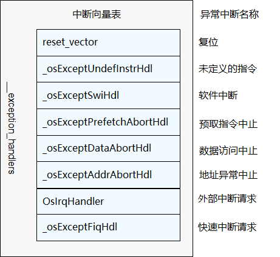

# 中断及异常处理

- [基本概念](#基本概念)
- [运行机制](#运行机制)
- [开发指导](#开发指导)
  - [接口说明](#接口说明)
  - [开发流程](#开发流程)
  - [编程实例](#编程实例)
  - [结果验证](#结果验证)

## 基本概念

中断是指出现需要时，CPU暂停执行当前程序，转而执行新程序的过程。即在程序运行过程中，出现了一个必须由CPU立即处理的事务。此时，CPU暂时中止当前程序的执行转而处理这个事务，这个过程就叫做中断。通过中断机制，可以使CPU避免把大量时间耗费在等待、查询外设状态的操作上，大大提高系统实时性以及执行效率。

异常处理是操作系统对运行期间发生的异常情况（芯片硬件异常）进行处理的一系列动作，例如虚拟内存缺页异常、打印异常发生时函数的调用栈信息、CPU现场信息、任务的堆栈情况等。


## 运行机制

外设可以在没有CPU介入的情况下完成一定的工作，但某些情况下也需要CPU为其执行一定的工作。通过中断机制，在外设不需要CPU介入时，CPU可以执行其它任务，而当外设需要CPU时，产生一个中断信号，该信号连接至中断控制器。中断控制器是一方面接收其它外设中断引脚的输入，另一方面它会发出中断信号给CPU。可以通过对中断控制器编程来打开和关闭中断源、设置中断源的优先级和触发方式。常用的中断控制器有VIC（Vector Interrupt Controller）和GIC（General Interrupt Controller）。在ARM Cortex-A7中使用的中断控制器是GIC。CPU收到中断控制器发送的中断信号后，中断当前任务来响应中断请求。

异常处理就是可以打断CPU正常运行流程的一些事情，如未定义指令异常、试图修改只读的数据异常、不对齐的地址访问异常等。当异常发生时，CPU暂停当前的程序，先处理异常事件，然后再继续执行被异常打断的程序。

以ARMv7-a架构为例，中断和异常处理的入口为中断向量表，中断向量表包含各个中断和异常处理的入口函数。

**图1** 中断向量表




## 开发指导


### 接口说明

异常处理为内部机制，不对外提供接口，中断模块提供对外接口如下：

| 功能分类 | **接口名称** | **描述** |
| -------- | -------- | -------- |
| 创建和删除中断 | LOS_HwiCreate | 中断创建，注册中断号、中断触发模式、中断优先级、中断处理程序。中断被触发时，会调用该中断处理程序 |
|  | LOS_HwiDelete |删除中断|
| 打开和关闭所有中断 | LOS_IntUnLock | 打开当前处理器所有中断响应 |
|  | LOS_IntLock |关闭当前处理器所有中断响应|
|  | LOS_IntRestore |恢复到使用LOS_IntLock关闭所有中断之前的状态|
| 获取系统支持的最大中断数 | LOS_GetSystemHwiMaximum | 获取系统支持的最大中断数 |


### 开发流程

1. 调用中断创建接口LOS_HwiCreate创建中断。

2. 调用LOS_HwiDelete接口删除指定中断，此接口根据实际情况使用，判断是否需要删除中断。


### 编程实例


本实例实现如下功能：


1. 创建中断。

2. 删除中断。


代码实现如下，演示如何创建中断和删除中断，当指定的中断号HWI_NUM_TEST产生中断时，会调用中断处理函数：


```
#include "los_hwi.h"
/*中断处理函数*/
STATIC VOID HwiUsrIrq(VOID)
{
    printf("in the func HwiUsrIrq \n"); 
}

static UINT32 Example_Interrupt(VOID)
{
    UINT32 ret;
    HWI_HANDLE_T hwiNum = 7;
    HWI_PRIOR_T hwiPrio = 3;
    HWI_MODE_T mode = 0;
    HWI_ARG_T arg = 0;

    /*创建中断*/
    ret = LOS_HwiCreate(hwiNum, hwiPrio, mode, (HWI_PROC_FUNC)HwiUsrIrq, (HwiIrqParam *)arg);
    if(ret == LOS_OK){
        printf("Hwi create success!\n");
    } else {
        printf("Hwi create failed!\n");
        return LOS_NOK;
    }

    /* 延时50个Ticks， 当有硬件中断发生时，会调用函数HwiUsrIrq*/
    LOS_TaskDelay(50);

    /*删除中断*/
    ret = LOS_HwiDelete(hwiNum, (HwiIrqParam *)arg);    
    if(ret == LOS_OK){
        printf("Hwi delete success!\n");
    } else {
        printf("Hwi delete failed!\n");
        return LOS_NOK;
    }
    return LOS_OK;
}
```


### 结果验证

编译运行得到的结果为：

```
Hwi create success!
Hwi delete success!
```
