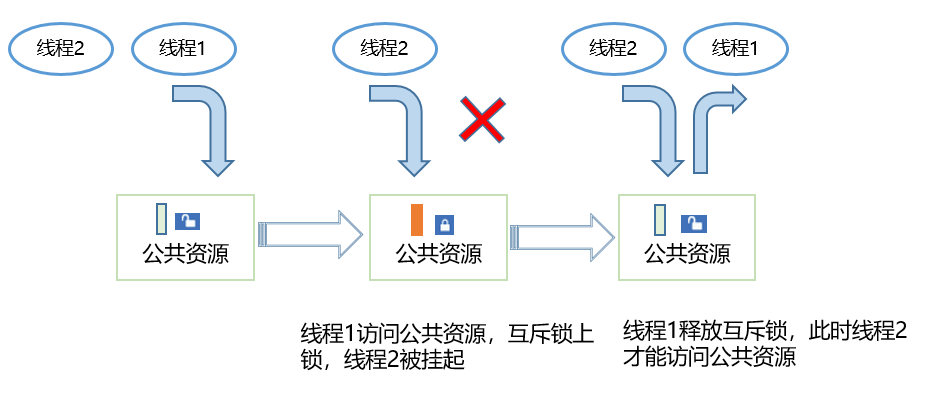

# 互斥锁

- [基本概念](#基本概念)
- [运行机制](#运行机制)
- [开发指导](#开发指导)
  - [接口说明](#接口说明)
  - [开发流程](#开发流程)
  - [编程实例](#编程实例)

## 基本概念

互斥锁又称互斥型信号量，用于实现对共享资源的独占式处理。当有任务持有时，这个任务获得该互斥锁的所有权。当该任务释放它时，任务失去该互斥锁的所有权。当一个任务持有互斥锁时，其他任务将不能再持有该互斥锁。多任务环境下往往存在多个任务竞争同一共享资源的应用场景，互斥锁可被用于对共享资源的保护从而实现独占式访问。

互斥锁属性包含3个属性：协议属性、优先级上限属性和类型属性。协议属性用于处理不同优先级的任务申请互斥锁，协议属性包含如下三种：

- LOS_MUX_PRIO_NONE
  不对申请互斥锁的任务的优先级进行继承或保护操作。

- LOS_MUX_PRIO_INHERIT
  优先级继承属性，默认设置为该属性，对申请互斥锁的任务的优先级进行继承。在互斥锁设置为本协议属性情况下，申请互斥锁时，如果高优先级任务阻塞于互斥锁，则把持有互斥锁任务的优先级备份到任务控制块的优先级位图中，然后把任务优先级设置为和高优先级任务相同的优先级；持有互斥锁的任务释放互斥锁时，从任务控制块的优先级位图恢复任务优先级。

- LOS_MUX_PRIO_PROTECT
  优先级保护属性，对申请互斥锁的任务的优先级进行保护。在互斥锁设置为本协议属性情况下，申请互斥锁时，如果任务优先级小于互斥锁优先级上限，则把任务优先级备份到任务控制块的优先级位图中，然后把任务优先级设置为互斥锁优先级上限属性值；释放互斥锁时，从任务控制块的优先级位图恢复任务优先级。

互斥锁的类型属性用于标记是否检测死锁，是否支持递归持有，类型属性包含如下三种：

- LOS_MUX_NORMAL
  普通互斥锁，不会检测死锁。如果任务试图对一个互斥锁重复持有，将会引起这个线程的死锁。如果试图释放一个由别的任务持有的互斥锁，或者如果一个任务试图重复释放互斥锁都会引发不可预料的结果。

- LOS_MUX_RECURSIVE
  递归互斥锁，默认设置为该属性。在互斥锁设置为本类型属性情况下，允许同一个任务对互斥锁进行多次持有锁，持有锁次数和释放锁次数相同，其他任务才能持有该互斥锁。如果试图持有已经被其他任务持有的互斥锁，或者如果试图释放已经被释放的互斥锁，会返回错误码。

- LOS_MUX_ERRORCHECK
  错误检测互斥锁，会自动检测死锁。在互斥锁设置为本类型属性情况下，如果任务试图对一个互斥锁重复持有，或者试图释放一个由别的任务持有的互斥锁，或者如果一个任务试图释放已经被释放的互斥锁，都会返回错误码。


## 运行机制

多任务环境下会存在多个任务访问同一公共资源的场景，而有些公共资源是非共享的，需要任务进行独占式处理。互斥锁怎样来避免这种冲突呢？

用互斥锁处理非共享资源的同步访问时，如果有任务访问该资源，则互斥锁为加锁状态。此时其他任务如果想访问这个公共资源则会被阻塞，直到互斥锁被持有该锁的任务释放后，其他任务才能重新访问该公共资源，此时互斥锁再次上锁，如此确保同一时刻只有一个任务正在访问这个公共资源，保证了公共资源操作的完整性。

**图1** 小型系统互斥锁运作示意图




## 开发指导


### 接口说明

**表1** 互斥锁模块接口

| 功能分类 | 接口**名称** | 描述 |
| -------- | -------- | -------- |
| 初始化和销毁互斥锁 | LOS_MuxInit | 互斥锁初始化 |
|  | LOS_MuxDestroy |销毁指定的互斥锁|
| 互斥锁的申请和释放 | LOS_MuxLock | 申请指定的互斥锁 |
|  | LOS_MuxTrylock |尝试申请指定的互斥锁，不阻塞|
|  | LOS_MuxUnlock |释放指定的互斥锁|
| 校验互斥锁 | LOS_MuxIsValid | 判断互斥锁释放有效 |
| 初始化和销毁互斥锁属性 | LOS_MuxAttrInit | 互斥锁属性初始化 |
|  | LOS_MuxAttrDestroy |销毁指定的互斥锁属性|
| 设置和获取互斥锁属性 | LOS_MuxAttrGetType | 获取指定互斥锁属性的类型属性 |
|  | LOS_MuxAttrSetType |设置指定互斥锁属性的类型属性|
|  | LOS_MuxAttrGetProtocol |获取指定互斥锁属性的协议属性|
|  | LOS_MuxAttrSetProtocol |设置指定互斥锁属性的协议属性|
|  | LOS_MuxAttrGetPrioceiling |获取指定互斥锁属性的优先级上限属性|
|  | LOS_MuxAttrSetPrioceiling |设置指定互斥锁属性的优先级上限属性|
|  | LOS_MuxGetPrioceiling |获取互斥锁优先级上限属性|
|  | LOS_MuxSetPrioceiling |设置互斥锁优先级上限属性|


### 开发流程

互斥锁典型场景的开发流程：

1. 初始化互斥锁LOS_MuxInit。

2. 申请互斥锁LOS_MuxLock。

申请模式有三种：无阻塞模式、永久阻塞模式、定时阻塞模式。

- 无阻塞模式：任务需要申请互斥锁，若该互斥锁当前没有任务持有，或者持有该互斥锁的任务和申请该互斥锁的任务为同一个任务，则申请成功；

- 永久阻塞模式：任务需要申请互斥锁，若该互斥锁当前没有被占用，则申请成功。否则，该任务进入阻塞态，系统切换到就绪任务中优先级高者继续执行。任务进入阻塞态后，直到有其他任务释放该互斥锁，阻塞任务才会重新得以执行；

- 定时阻塞模式：任务需要申请互斥锁，若该互斥锁当前没有被占用，则申请成功。否则该任务进入阻塞态，系统切换到就绪任务中优先级高者继续执行。任务进入阻塞态后，指定时间超时前有其他任务释放该互斥锁，或者用 户指定时间超时后，阻塞任务才会重新得以执行。

3. 释放互斥锁LOS_MuxUnlock。

- 如果有任务阻塞于指定互斥锁，则唤醒被阻塞任务中优先级高的，该任务进入就绪态，并进行任务调度；

- 如果没有任务阻塞于指定互斥锁，则互斥锁释放成功。

4. 销毁互斥锁LOS_MuxDestroy。

>  **说明：**
> - 两个任务不能对同一把互斥锁加锁。如果某任务对已被持有的互斥锁加锁，则该任务会被挂起，直到持有该锁的任务对互斥锁解锁，才能执行对这把互斥锁的加锁操作。
> 
> - 互斥锁不能在中断服务程序中使用。
> 
> - LiteOS-A内核作为实时操作系统需要保证任务调度的实时性，尽量避免任务的长时间阻塞，因此在获得互斥锁之后，应该尽快释放互斥锁。


### 编程实例

**实例描述**

本实例实现如下流程：

1. 任务Example_TaskEntry创建一个互斥锁，锁任务调度，创建两个任务Example_MutexTask1、Example_MutexTask2。Example_MutexTask2优先级高于Example_MutexTask1，解锁任务调度。

2. Example_MutexTask2被调度，以永久阻塞模式申请互斥锁，并成功获取到该互斥锁，然后任务休眠100Tick，Example_MutexTask2挂起，Example_MutexTask1被唤醒。

3. Example_MutexTask1以定时阻塞模式申请互斥锁，等待时间为10Tick，因互斥锁仍被Example_MutexTask2持有，Example_MutexTask1挂起。10Tick超时时间到达后，Example_MutexTask1被唤醒，以永久阻塞模式申请互斥锁，因互斥锁仍被Example_MutexTask2持有，Example_MutexTask1挂起。

4. 100Tick休眠时间到达后，Example_MutexTask2被唤醒， 释放互斥锁，唤醒Example_MutexTask1。Example_MutexTask1成功获取到互斥锁后，释放，删除互斥锁。

**示例代码**

示例代码如下：

```
#include <string.h>
#include "los_mux.h"

/* 互斥锁 */
LosMux g_testMux;
/* 任务ID */
UINT32 g_testTaskId01;
UINT32 g_testTaskId02;

VOID Example_MutexTask1(VOID)
{
    UINT32 ret;

    printf("task1 try to get mutex, wait 10 ticks.\n");
    /* 申请互斥锁 */
    ret = LOS_MuxLock(&g_testMux, 10);

    if (ret == LOS_OK) {
        printf("task1 get mutex g_testMux.\n");
        /* 释放互斥锁 */
        LOS_MuxUnlock(&g_testMux);
        return;
    } 
    if (ret == LOS_ETIMEDOUT ) {
            printf("task1 timeout and try to get mutex, wait forever.\n");
            /* 申请互斥锁 */
            ret = LOS_MuxLock(&g_testMux, LOS_WAIT_FOREVER);
            if (ret == LOS_OK) {
                printf("task1 wait forever, get mutex g_testMux.\n");
                /* 释放互斥锁 */
                LOS_MuxUnlock(&g_testMux);
                /* 删除互斥锁 */
                LOS_MuxDestroy(&g_testMux);
                printf("task1 post and delete mutex g_testMux.\n");
                return;
            }
    }
    return;
}

VOID Example_MutexTask2(VOID)
{
    printf("task2 try to get mutex, wait forever.\n");
    /* 申请互斥锁 */
    (VOID)LOS_MuxLock(&g_testMux, LOS_WAIT_FOREVER);

    printf("task2 get mutex g_testMux and suspend 100 ticks.\n");

    /* 任务休眠100Ticks */
    LOS_TaskDelay(100);

    printf("task2 resumed and post the g_testMux\n");
    /* 释放互斥锁 */
    LOS_MuxUnlock(&g_testMux);
    return;
}

UINT32 Example_MutexEntry(VOID)
{
    UINT32 ret;
    TSK_INIT_PARAM_S task1;
    TSK_INIT_PARAM_S task2;

    /* 初始化互斥锁 */
    LOS_MuxInit(&g_testMux, NULL);

    /* 锁任务调度 */
    LOS_TaskLock();

    /* 创建任务1 */
    memset(&task1, 0, sizeof(TSK_INIT_PARAM_S));
    task1.pfnTaskEntry = (TSK_ENTRY_FUNC)Example_MutexTask1;
    task1.pcName       = "MutexTsk1";
    task1.uwStackSize  = LOSCFG_BASE_CORE_TSK_DEFAULT_STACK_SIZE;
    task1.usTaskPrio   = 5;
    ret = LOS_TaskCreate(&g_testTaskId01, &task1);
    if (ret != LOS_OK) {
        printf("task1 create failed.\n");
        return LOS_NOK;
    }

    /* 创建任务2 */
    memset(&task2, 0, sizeof(TSK_INIT_PARAM_S));
    task2.pfnTaskEntry = (TSK_ENTRY_FUNC)Example_MutexTask2;
    task2.pcName       = "MutexTsk2";
    task2.uwStackSize  = LOSCFG_BASE_CORE_TSK_DEFAULT_STACK_SIZE;
    task2.usTaskPrio   = 4;
    ret = LOS_TaskCreate(&g_testTaskId02, &task2);
    if (ret != LOS_OK) {
        printf("task2 create failed.\n");
        return LOS_NOK;
    }

    /* 解锁任务调度 */
    LOS_TaskUnlock();

    return LOS_OK;
}
```

**结果验证**

编译运行得到的结果为：

```
task1 try to get mutex, wait 10 ticks.
task2 try to get mutex, wait forever.
task2 get mutex g_testMux and suspend 100 ticks.
task1 timeout and try to get mutex, wait forever.
task2 resumed and post the g_testMux
task1 wait forever, get mutex g_testMux.
task1 post and delete mutex g_testMux.
```
