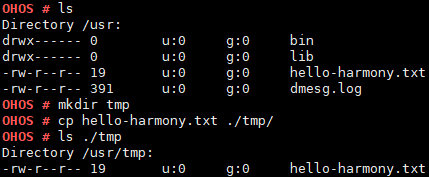

# cp

-   [命令功能](#section6841203041513)
-   [命令格式](#section24286359150)
-   [参数说明](#section558617385152)
-   [使用指南](#section16128156162)
-   [使用实例](#section19354171211618)
-   [输出说明](#section16754183195914)

## 命令功能

拷贝文件，创建一份副本。

## 命令格式

cp \[_SOURCEFILE_\] \[_DESTFILE_\]

## 参数说明

**表 1**  参数说明

<table><thead align="left"><tr id="row1136mcpsimp"><th class="cellrowborder" valign="top" width="21%" id="mcps1.2.4.1.1">
参数

</th>
<th class="cellrowborder" valign="top" width="52%" id="mcps1.2.4.1.2">
参数说明

</th>
<th class="cellrowborder" valign="top" width="27%" id="mcps1.2.4.1.3">
取值范围

</th>
</tr>
</thead>
<tbody><tr id="row1143mcpsimp"><td class="cellrowborder" valign="top" width="21%" headers="mcps1.2.4.1.1 ">
SOURCEFILE

</td>
<td class="cellrowborder" valign="top" width="52%" headers="mcps1.2.4.1.2 ">
源文件路径。

</td>
<td class="cellrowborder" valign="top" width="27%" headers="mcps1.2.4.1.3 ">
目前只支持文件,不支持目录。

</td>
</tr>
<tr id="row1150mcpsimp"><td class="cellrowborder" valign="top" width="21%" headers="mcps1.2.4.1.1 ">
DESTFILE

</td>
<td class="cellrowborder" valign="top" width="52%" headers="mcps1.2.4.1.2 ">
目的文件路径。

</td>
<td class="cellrowborder" valign="top" width="27%" headers="mcps1.2.4.1.3 ">
支持目录以及文件。

</td>
</tr>
</tbody>
</table>

## 使用指南

-   同一路径下，源文件与目的文件不能重名。
-   源文件必须存在，且不为目录。
-   源文件路径支持“\*”和“？”通配符，“\*”代表任意多个字符，“？”代表任意单个字符。目的路径不支持通配符。当源路径可匹配多个文件时，目的路径必须为目录。
-   目的路径为目录时，该目录必须存在。此时目的文件以源文件命名。
-   目的路径为文件时，所在目录必须存在。此时拷贝文件的同时为副本重命名。
-   目前不支持多文件拷贝。参数大于2个时，只对前2个参数进行操作。
-   目的文件不存在时创建新文件，已存在则覆盖。

拷贝系统重要资源时，会对系统造成死机等重大未知影响，如用于拷贝/dev/uartdev-0 文件时，会产生系统卡死现象。

## 使用实例

举例：cp hello-harmony.txt ./tmp/

## 输出说明

**图 1**  显示结果如下  

