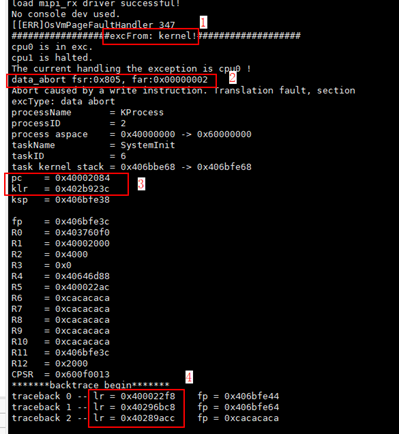

# 常见问题定位方法

- [通过异常信息定位问题](#通过异常信息定位问题)
- [内存池完整性验证](#内存池完整性验证)
- [全局变量踩内存定位方法](#全局变量踩内存定位方法)

## 通过异常信息定位问题

系统异常被挂起后，会在串口看到一些关键寄存器的信息，如图1所示。可通过这些信息定位到异常所在函数和其调用栈关系，为原因分析提供第一手资料。

**图1** 异常信息

上图中的异常信息主要解释4个标签：

**标签1**：标识异常在内核态；

**标签2**：标识了异常类型（数据异常时，far后的值是系统异常时CPU访问的地址）；

**标签3**：pc的值标识系统异常时执行指令的位置，klr的值一般标识pc所在函数执行完后下一条要执行的命令。（**注：标签4处 traceback 0  lr有值时不用关注klr**）。

**标签4**：lr 的值依次标识正常情况下PC要依次执行的指令的位置。

对于内核异常打印信息，确定PC和LR的具体位置的指令需要结合out目录下OHOS_Image.asm（跟烧写的系统镜像OHOS_Image.bin对应的汇编文件）查看，根据指令所在的位置可确认使用该指令的函数，依次确定LR位置所在的函数，即得到异常发生时的函数调用关系。

## 内存池完整性验证

仅凭上节异常信息定位的基本方法，常常无法直接定位问题所在。并且常常会因为异常的寄存器值而无法对问题进行定位。若怀疑是堆内存越界导致的问题，可以调用内存池完整性检测函数LOS_MemIntegrityCheck进行检查。函数LOS_MemIntegrityCheck将会对系统动态内存池所有的节点进行遍历，如果所有节点正常则函数返回0，不会有任何打印，否则将打印相关的错误信息。该函数的入参使用(VOID \*)OS_SYS_MEM_ADDR。

定位堆内存越界踩的问题，一般是在可能存在问题的业务逻辑代码前后使用LOS_MemIntegrityCheck，如果该业务代码不存在问题，则前后两次LOS_MemIntegrityCheck调用不会失败，按前述方式逐步缩小问题定位范围。

## 全局变量踩内存定位方法

如果已知一个全局变量内存域被踩，可在OHOS_Image.map文件中找到该全局变量所在的地址，并且特别注意该地址之前最近被使用的变量，有极大概率是前面的变量（尤其数组类型的或会被强转成其他类型的变量）在使用的过程中内存越界，破坏了这个全局变量。
