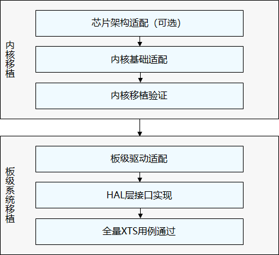

# 移植须知

-   [移植目录](#section284217487490)
-   [移植流程](#section639315306506)
-   [移植规范](#section187870185219)

本文为OpenHarmony平台系统开发人员和芯片（或模组）制造商提供基础的开发移植指导，典型的芯片架构例如cortex-m系列、risc-v系列等都可以按照本文进行移植，暂时不支持蓝牙服务。OpenHarmony是个持续演进的复杂项目，随着版本和API的改变，本文将会不断更新。

本文要求读者具有一定的嵌入式系统开发经验，因此它的重点未放在基本的OS基础介绍，而更多地描述OpenHarmony平台移植过程中主要操作和所需要关注的方面。

## 移植目录

OpenHarmony整体工程较为复杂，目录及实现为系统本身功能，如果不涉及复杂的特性增强，不需要关注每一层实现，移植过程中重点关注如下目录即可：

**表 1**  移植过程中的重点目录

<table><thead align="left"><tr id="row207334298172"><th class="cellrowborder" valign="top" width="27.71%" id="mcps1.2.3.1.1">
目录名称

</th>
<th class="cellrowborder" valign="top" width="72.28999999999999%" id="mcps1.2.3.1.2">
描述

</th>
</tr>
</thead>
<tbody><tr id="row17331029181714"><td class="cellrowborder" valign="top" width="27.71%" headers="mcps1.2.3.1.1 ">
/build/lite

</td>
<td class="cellrowborder" valign="top" width="72.28999999999999%" headers="mcps1.2.3.1.2 ">
OpenHarmony基础编译构建框架

</td>
</tr>
<tr id="row427301117194"><td class="cellrowborder" valign="top" width="27.71%" headers="mcps1.2.3.1.1 ">
/kernel/liteos_m

</td>
<td class="cellrowborder" valign="top" width="72.28999999999999%" headers="mcps1.2.3.1.2 ">
基础内核，其中芯片架构相关实现在arch目录下

</td>
</tr>
<tr id="row44321715131917"><td class="cellrowborder" valign="top" width="27.71%" headers="mcps1.2.3.1.1 ">
/device

</td>
<td class="cellrowborder" valign="top" width="72.28999999999999%" headers="mcps1.2.3.1.2 ">
板级相关实现，各个三方厂商按照OpenHarmony规范适配实现，device下具体目录结构及移植过程参见<a href="移植概述-0.md">板级系统移植</a>

</td>
</tr>
<tr id="row19497111381917"><td class="cellrowborder" valign="top" width="27.71%" headers="mcps1.2.3.1.1 ">
/vendor

</td>
<td class="cellrowborder" valign="top" width="72.28999999999999%" headers="mcps1.2.3.1.2 ">
产品级相关实现，主要由华为或者产品厂商贡献

</td>
</tr>
</tbody>
</table>

## 移植流程

OpenHarmony的device目录是基础芯片的适配目录，如果在三方芯片应用过程中发现此目录下已经有完整的芯片适配，则不需要再额外移植，直接跳过移植过程进行系统应用开发即可，如果该目录下无对应的芯片移植实现，则根据本文完成移植过程。OpenHarmony三方芯片移植主要过程如下：

**图 1**  芯片移植关键步骤  

## 移植规范

-   满足OpenHarmony[开源贡献基本规范和准则](https://gitee.com/openharmony/docs/blob/master/zh-cn/contribute/%E5%8F%82%E4%B8%8E%E8%B4%A1%E7%8C%AE.md)。
-   三方芯片适配所需要贡献的代码主要在device、vendor和arch三个目录，参照[内核目录规范](移植概述.md#section18127744153119)和[板级目录规范](移植概述-0.md#section6204129143013)满足基本目录命名和使用规范。

