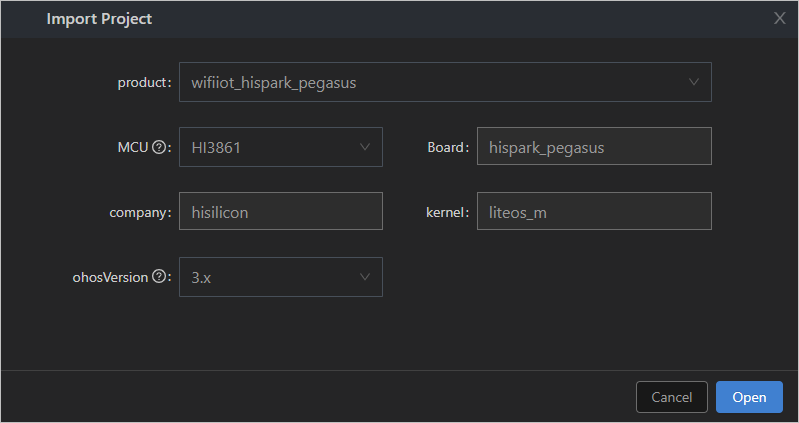

# 创建源码工程

1. 打开DevEco Device Tool，进入Home页，点击**Import Project**打开工程。
   

2. 选择待打开的工程目录，点击**Import**打开。
   >  **说明：**
   > 工程存储路径不能包含中文字符、空格。如果工程存储路径包含中文字符或空格，可能导致编译失败。

   

3. 如果您打开的目录不是DevEco Device Tool工程，则会出现如下提示框，点击**Import**。
   

4. 在Select Project type界面，选择**Import from OpenHarmony Source**。
   

5. 在Import Project界面，选择**Product**后，会自动填充对应的MCU、Board、company和kernel信息，然后**ohosVersion**选择对应的OpenHarmony源码版本。下图以导入wifiiot_hispark_pegasus为例进行说明。
   

6. 点击**Open**打开工程或源码。
