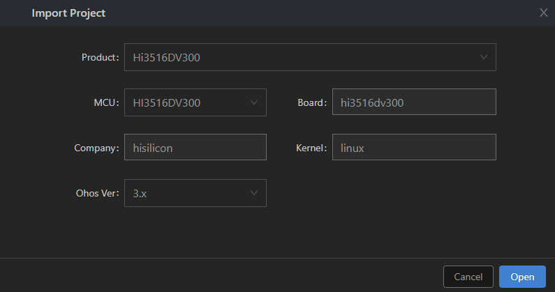

# 创建源码工程

在完成[搭建Windows+Ubuntu混合开发环境](../quick-start/quickstart-ide-standard-env-setup-win-ubuntu.md)和[获取源码](../quick-start/quickstart-ide-standard-sourcecode-acquire.md)后，您需要在Windows环境中按照如下步骤创建源码工程。

1. 打开DevEco Device Tool，进入Home页，点击**Import Project**打开工程。
   

2. 选择要导入的源码目录，点击**Import**打开。
   >  **说明：**
   > 工程存储路径不能包含中文字符、空格。如果工程存储路径包含中文字符或空格，可能导致编译失败。

   

3. 如果您打开的目录不是DevEco Device Tool工程，则会出现如下提示框，点击**Import**。
   

4. 在Select Project type界面，选择**Import from OpenHarmony Source**。
   

5. 在Import Project界面，选择**Product**后，会自动填充对应的MCU、Board、company和kernel信息，然后**ohosVersion**选择对应的OpenHarmony源码版本。下图以导入Hi3516DV300为例进行展示 。
   >  **说明：**
   > - Hi3516DV300开发板Product选择“Hi3516DV300”。
   > 
   > - RK3568开发板Product选择“rk3568”。

   

6. 点击**Open**打开工程或源码。
