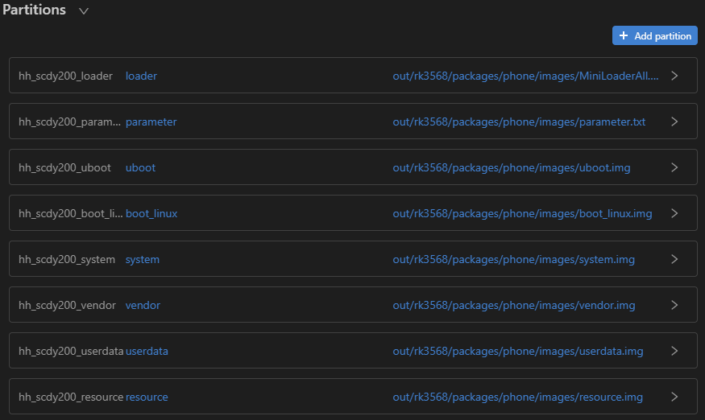

# 烧录

烧录是指将编译后的程序文件下载到芯片开发板上的动作，为后续的程序调试提供基础。DevEco Device Tool提供一键烧录功能，操作简单，能快捷、高效的完成程序烧录，提升烧录的效率。

>  **说明：**
> - 如您使用的是master分支2022年5月9日及之后的源码，请使用RKDevTool工具进行烧录，请参考《[HiHope-DAYU200烧录指导](https://gitee.com/hihope_iot/docs/tree/master/HiHope_DAYU200/%E7%83%A7%E5%86%99%E5%B7%A5%E5%85%B7%E5%8F%8A%E6%8C%87%E5%8D%97)》进行操作。
> 
> - 当前版本的DevEco Device Tool暂不支持上述日期后的源码烧录，将在下个版本中适配。

1. [下载](https://gitee.com/hihope_iot/docs/blob/master/HiHope_DAYU200/%E7%83%A7%E5%86%99%E5%B7%A5%E5%85%B7%E5%8F%8A%E6%8C%87%E5%8D%97/windows/DriverAssitant_v5.1.1.zip)并安装驱动DriverInstall.exe，双击DriverInstall.exe打开安装程序，点击“驱动安装”按钮，按提示安装USB驱动。

   >  **说明：**
   > 如果已经安装旧版本的烧写工具，请先点击"驱动卸载"按钮卸载驱动，然后再点击"驱动安装"按钮安装驱动。

2. 请连接好电脑和待烧录开发板，连接USB接口。

   >  **说明：**
   >
   > 如果采用远程开发模式（windows+本地虚拟机Ubuntu），为确保开发板连接的是主机的USB口，请先禁用虚拟机的usb控制。
   > 
   > - VMware：在首选项的USB选项中设置将设备连接到主机，在虚拟机设置中移除USB控制器。
   > 
   > - VirtualBox：在Ubuntu设置的USB设备选项中将启动USB控制器的勾去掉。

3. 在DevEco Device Tool中，选择REMOTE DEVELOPMENT &gt; Local PC，查看远程计算机（Ubuntu开发环境）与本地计算机（Windows开发环境）的连接状态。

   - 如果Local PC右边连接按钮为，则远程计算机与本地计算机为已连接状态，不需要执行其他操作。
   - 如果Local PC右边连接按钮为，则点击绿色按钮进行连接。

   

   >  **说明：**
   > 该操作仅在远程模式（Windows+Ubuntu混合开发环境）中需要设置，如果采用本地模式（Windows开发环境或Ubuntu开发环境），则请跳过该步骤。

4. 打开DevEco Device Tool，在QUICK ACCESS &gt; DevEco Home &gt; Projects中，点击**Settings**打开工程配置界面。

   

5. 在“hh_scdy200”页签，设置烧录选项，包括upload_partitions和upload_protocol。

   - upload_partitions：选择待烧录的文件。
   - upload_protocol：选择烧录协议，固定选择“upgrade”。

   

6. 在Partitions中，分别检查待烧录文件的烧录信息，包括起始地址、分区大小、待烧录文件地址等。DevEco Device Tool已预置默认的烧录文件信息，可根据实际情况进行调整。

   

   如需修改，请点击每个待烧录文件后的按钮进行修改。
   >  **说明：**
   >
   > 在设置烧录分区起始地址和分区长度时，应根据实际待烧录文件的大小进行设置，要求设置的烧录分区大小，要大于待烧录文件的大小；同时，各烧录文件的分区地址设置不能出现重叠。

   

7. 所有的配置都修改完成后，在工程配置页签的顶部，点击**Save**进行保存。

8. 在“PROJECT TASKS”中，点击hh_scdy200下的**Upload**按钮启动烧录。

   

9. 当屏幕提示“Operation paused，Please press Enter key to continue”，请按回车键继续。

   >  **说明：**
   >
   > 如果开发板未处于烧录模式，屏幕会提示“The boad is not in Loader mode.Please Hold on the VOL+key...”，此时，请长按音量+键，3秒后点击RESET键，然后再过3秒放开音量+键，使开发板进入烧录模式。

   等待开发板烧录完成，当屏幕提示如下信息时，表示烧录成功。

   
