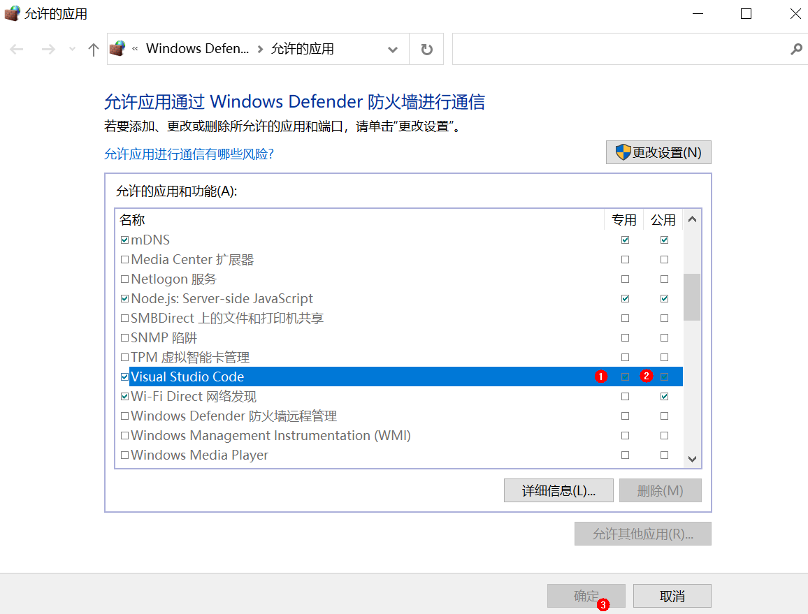

# 烧录异常

## 烧写选择串口后提示“Error: Opening COMxx: Access denied”

- **现象描述**

  点击烧写并选择串口后，出现Error: Opening COMxx: Access denied。

    **图1** 打开串口失败图

    

- **可能原因**

  串口已经被占用。

- **解决办法**

1. 按图依次选择下拉框，查找带有serial-xx的终端。

     **图2** 查找是否存在占用串口的终端

     

2. 点击标号中的垃圾桶图标，关闭串口。

     **图3** 关闭串口终端

     

3. 重新点击烧写，选择串口并开始烧写程序。

     **图4** 重新启动烧写任务

     

## Windows电脑与单板网络连接失败

- **现象描述**

  点击烧写并选择串口后，无法获取文件。

    **图5** 网络不通，单板无法获取文件图

    

- **可能原因**

  单板网络与Windows电脑不联通。

  Windows电脑防火墙未允许Visual Studio Code联网。

- **解决方法**

1. 检查网线是否连接。

2. 点击Windows防火墙。

     **图6** 网络防火墙设置图

     

3. 点击“允许应用通过防火墙”。

     **图7** 防火墙和网络保护界面图

     

4. 查找Visual Studio Code应用。

     **图8** 查找Visual Studio Code应用图

     

5. 勾选Visual Studio Code的专用和公用网络的访问权限。

     **图9** 允许Visual Studio Code应用访问网络

     

## 烧写失败

- **现象描述**

  点击烧写并选择串口后，出现无法烧写的情况。

- **可能原因**

  安装IDE插件DevEco后未重启。

- **解决方法**

  重启IDE。

## （Hi3516）串口无回显

- **现象描述**

  串口显示已连接，重启单板后，回车无任何回显。

- **可能原因1**

  串口连接错误。

- **解决办法**

  修改串口号。

  请查看设备管理器，确认连接单板的串口与终端中连接串口是否一致，若不一致，请按“烧写选择串口后提示“Error: Opening COMxx: Access denied””修改串口号。

- **可能原因2**

  单板U-boot被损坏。

- **解决办法**

  烧写U-boot。

  若上述步骤依旧无法连接串口，可能由于单板U-boot损坏，按下述步骤烧写U-boot。

1. 获取引导文件U-boot。

   >  **须知：**
   > 单板的U-boot文件请在开源包中获取：
   > 
   > Hi3516DV300：device\hisilicon\hispark_taurus\sdk_liteos\uboot\out\boot\u-boot-hi3516dv300.bin
   > 
   > Hi3518EV300：device\hisilicon\hispark_aries\sdk_liteos\uboot\out\boot\u-boot-hi3518ev300.bin

2. 根据USB烧写步骤烧写U-boot文件。

   按照[Hi3516系列USB烧写步骤](https://device.harmonyos.com/cn/docs/documentation/guide/ide-hi3516-upload-0000001052148681)/[Hi3518系列USB烧写步骤](https://device.harmonyos.com/cn/docs/documentation/guide/ide-hi3518-upload-0000001057313128#section93591711580)中描述的烧写方法，选择对应单板的U-boot文件进行烧写。

3. 烧写完成后，登录串口如下图所示。

     **图10** U-boot烧写完成串口显示图

     
