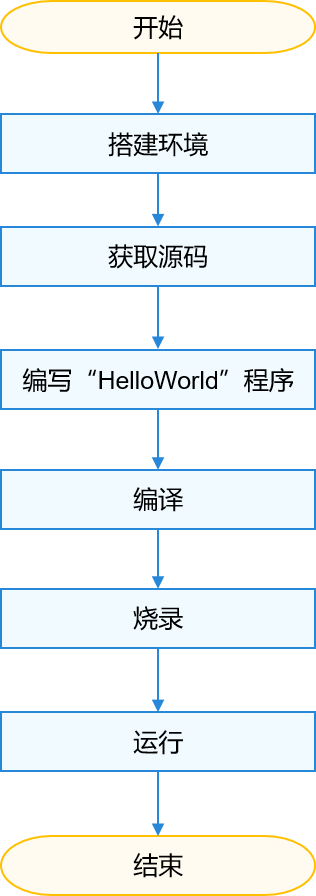

# 轻量与小型系统入门概述

## 简介

OpenHarmony轻量和小型系统适用于内存较小的IOT设备。本文通过运行一个“Hello World”，可以让开发者快速熟悉OpenHarmony轻量和小型系统的环境搭建、编译、烧录、调测以及运行等。

## 开发环境

因当前OpenHarmony不支持在Windows下进行编译，标准系统的开发有以下两种方法，开发者可根据使用习惯进行选择：

- 用Linux环境进行开发、编译和烧录。

- 用Windows环境进行开发和烧录，使用Linux环境进行编译。

本文将介绍第一种方法，相关操作均在Linux环境下进行。使用第二种方式的开发者可参考[Deveco Device Tool使用指导](https://device.harmonyos.com/cn/docs/documentation/guide/service_introduction-0000001050166905)。

## 开发板

本文基于以下两款典型开发板进行开发介绍 ：Hi3861 WLAN模组、Hi3516DV300。开发板的具体外观和规格可参见[本文附录](../quick-start/quickstart-lite-board-introduction.md)，开发者可根据需要自行购买开发板。

## 开发流程

轻量和小型系统快速入门流程如下图所示。

  **图1** 轻量和小型系统快速入门开发流程
  
