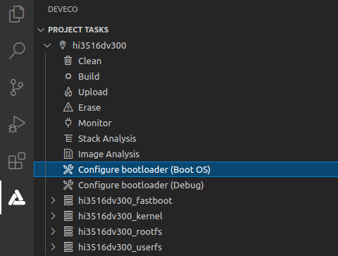

# 运行Hello OHOS（编译、烧录）<a name="ZH-CN_TOPIC_0000001174270695"></a>

-   [新建应用程序](#section204672145202)
-   [编译](#section1077671315253)
-   [烧录](#section1347011412201)
    -   [使用网口烧录](#section1935410617363)
    -   [镜像运行](#section24721014162010)

-   [执行应用程序](#section5276734182615)

本节指导开发者在单板上运行第一个应用程序，其中包括新建应用程序、编译、烧写、运行等步骤，最终输出“Hello OHOS！”。

## 新建应用程序<a name="section204672145202"></a>

1.  新建目录及源码

    新建**applications/sample/camera/apps/src/helloworld.c**目录及文件，代码如下所示，用户可以自定义修改打印内容（例如：修改OHOS为World）。当前应用程序可支持标准C及C++的代码开发。

    ```
    #include <stdio.h>
    
    int main(int argc, char **argv)
    {
        printf("\n************************************************\n");
        printf("\n\t\tHello OHOS!\n");
        printf("\n************************************************\n\n");
    
        return 0;
    }
    ```

2.  新建编译组织文件

    新建**applications/sample/camera/apps/BUILD.gn**文件，内容如下所示：

    ```
    import("//build/lite/config/component/lite_component.gni")
    lite_component("hello-OHOS") {
      features = [ ":helloworld" ]
    }
    executable("helloworld") {
      output_name = "helloworld"
      sources = [ "src/helloworld.c" ]
      include_dirs = []
      defines = []
      cflags_c = []
      ldflags = []
    }
    ```

3.  添加新组件

    修改文件**build/lite/components/applications.json**，添加组件hello\_world\_app的配置，如下所示为applications.json文件片段，"\#\#start\#\#"和"\#\#end\#\#"之间为新增配置（"\#\#start\#\#"和"\#\#end\#\#"仅用来标识位置，添加完配置后删除这两行）：

    ```
    {
      "components": [
        {
          "component": "camera_sample_communication",
          "description": "Communication related samples.",
          "optional": "true",
          "dirs": [
            "applications/sample/camera/communication"
          ],
          "targets": [
            "//applications/sample/camera/communication:sample"
          ],
          "rom": "",
          "ram": "",
          "output": [],
          "adapted_kernel": [ "liteos_a" ],
          "features": [],
          "deps": {
            "components": [],
            "third_party": []
          }
        },
    ##start##
        {
          "component": "hello_world_app",
          "description": "Communication related samples.",
          "optional": "true",
          "dirs": [
            "applications/sample/camera/apps"
          ],
          "targets": [
            "//applications/sample/camera/apps:hello-OHOS"
          ],
          "rom": "",
          "ram": "",
          "output": [],
          "adapted_kernel": [ "liteos_a" ],
          "features": [],
          "deps": {
            "components": [],
            "third_party": []
          }
        },
    ##end##
        {
          "component": "camera_sample_app",
          "description": "Camera related samples.",
          "optional": "true",
          "dirs": [
            "applications/sample/camera/launcher",
            "applications/sample/camera/cameraApp",
            "applications/sample/camera/setting",
            "applications/sample/camera/gallery",
            "applications/sample/camera/media"
          ],
    ```

4.  修改单板配置文件

    修改文件**vendor/hisilicon/hispark\_taurus/config.json**，新增hello\_world\_app组件的条目，如下所示代码片段为applications子系统配置，"\#\#start\#\#"和"\#\#end\#\#"之间为新增条目（"\#\#start\#\#"和"\#\#end\#\#"仅用来标识位置，添加完配置后删除这两行）：

    ```
          {
            "subsystem": "applications",
            "components": [
              { "component": "camera_sample_app", "features":[] },
              { "component": "camera_sample_ai", "features":[] },
    ##start##
              { "component": "hello_world_app", "features":[] },
    ##end##
              { "component": "camera_screensaver_app", "features":[] }
            ]
          },
    ```


## 编译<a name="section1077671315253"></a>

如果Linux编译环境通过Docker方式安装，具体编译过程请参见[Docker方式获取编译环境](../get-code/gettools-acquire.md#section107932281315)的编译操作。如果Linux编译环境通过软件包方式安装，请进入源码根目录，执行如下命令进行编译：

```
hb set(设置编译路径)
.（选择当前路径）
选择ipcamera_hispark_taurus@hisilicon并回车
hb build -f（执行编译）
```

**图 1**  Hi3516编译设置图例<a name="fig1458988766"></a>  


结果文件生成在out/hispark\_taurus/ipcamera\_hispark\_taurus目录下。

> **须知：** 
>Hi3516DV300单板的U-boot文件获取路径：device/hisilicon/hispark\_taurus/sdk\_liteos/uboot/out/boot/u-boot-hi3516dv300.bin

## 烧录<a name="section1347011412201"></a>

Hi3516开发板的代码烧录支持USB烧录、网口烧录和串口烧录三种方式。此处仅以网口烧录为例进行说明。

### 使用网口烧录<a name="section1935410617363"></a>

Hi3516DV300开发板使用网口烧录方式，支持Windows和Linux系统。

1.  请连接好电脑和待烧录开发板，需要同时连接串口、网口和电源，具体可参考[Hi3516DV300开发板介绍](https://device.harmonyos.com/cn/docs/start/introduce/oem_minitinier_des_3516-0000001152041033)。
2.  <a name="zh-cn_topic_0000001056443961_li142386399535"></a>打开电脑的设备管理器，查看并记录对应的串口号。

    > **说明：** 
    >如果对应的串口异常，请根据[Hi3516DV300/Hi3518EV300开发板串口驱动安装指导](https://device.harmonyos.com/cn/docs/ide/user-guides/hi3516_hi3518-drivers-0000001050743695)安装USB转串口的驱动程序。

    

3.  打开DevEco Device Tool，在QUICK ACCESS \> DevEco Home \> Projects中，点击**Settings**打开工程配置界面。

    

4.  在“Partition Configuration”页签，设置待烧录文件信息，默认情况下，DevEco Device Tool已针对Hi3516DV300开发板进行适配，无需单独修改。
5.  在“hi3516dv300”页签，设置烧录选项，包括upload\_port、upload\_partitions和upload\_protocol。

    -   upload\_port：选择步骤[2](#zh-cn_topic_0000001056443961_li142386399535)中查询的串口号。
    -   upload\_protocol：选择烧录协议，固定选择“hiburn-net”。
    -   upload\_partitions：选择待烧录的文件，默认情况下会同时烧录fastboot、kernel、rootfs和userfs。

    

6.  检查和设置连接开发板后的网络适配器的IP地址信息，设置方法请参考[设置Hi3516DV300网口烧录的IP地址信息](https://device.harmonyos.com/cn/docs/ide/user-guides/set_ipaddress-0000001141825075)。
7.  设置网口烧录的IP地址信息，设置如下选项：

    -   upload\_net\_server\_ip：选择步骤6中设置的IP地址信息。例如192.168.1.2
    -   upload\_net\_client\_mask：设置开发板的子网掩码，工具会自动根据选择的upload\_net\_server\_ip进行设置。例如255.255.255.0
    -   upload\_net\_client\_gw：设置开发板的网关，工具会自动根据选择的upload\_net\_server\_ip进行设置。例如192.168.1.1
    -   upload\_net\_client\_ip：设置开发板的IP地址，工具会自动根据选择的upload\_net\_server\_ip进行设置。例如192.168.1.3

    

8.  所有的配置都修改完成后，在工程配置页签的顶部，点击**Save**进行保存。
9.  打开工程文件，点击图标，打开DevEco Device Tool界面，在“PROJECT TASKS”中，点击hi3516dv300下的**Upload**按钮，启动烧录。

    

10. 启动烧录后，显示如下提示信息时，请重启开发板（下电再上电）。

    

11. 重新上电后，界面提示如下信息时，表示烧录成功。

    

12. 烧录成功后，请根据镜像运行章节进行操作，启动系统。

### 镜像运行<a name="section24721014162010"></a>

在完成Hi3516DV300的烧录后，还需要设置BootLoader引导程序，才能运行OpenHarmony系统。

1.  在Hi3516DV300任务中，点击**Configure bootloader（Boot OS）**进行配置即可。

    > **说明：** 
    >DevEco Device Tool针对Hi3516DV300开发板的BootLoader设置进行了适配，无需开发者手动修改。

    

2.  提示如下图中的重启开发板的提示信息时，重启开发板，然后在控制台输出“SUCCESS”表示设置成功。

    

3.  在任务栏点击**Monitor**按钮，启动串口工具。

    

4.  然后根据界面提示进行操作，直到在界面打印**OHOS \#**信息，表示系统启动成功。

    


## 执行应用程序<a name="section5276734182615"></a>

根目录下，在命令行输入指令“**./bin/helloworld**”执行写入的demo程序，显示成功结果如下图所示。

**图 2**  启动并成功执行应用程序图<a name="fig149821431194515"></a>  


