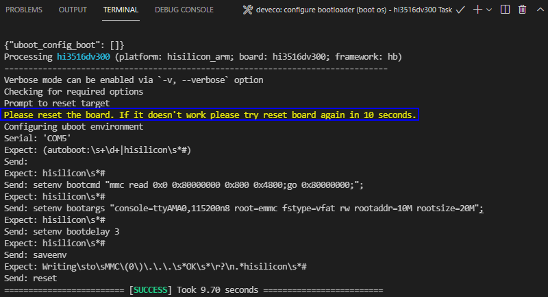
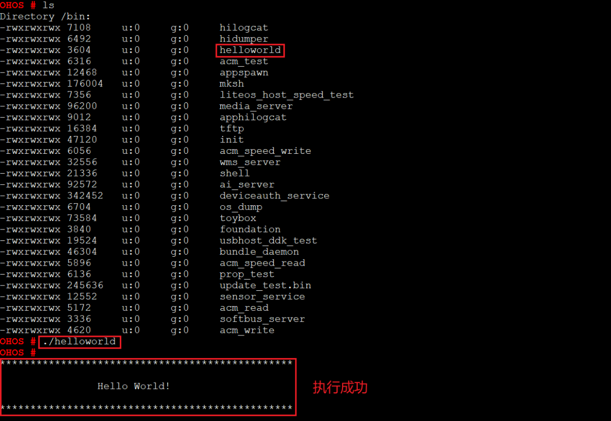

# 运行


## 启动系统

在完成Hi3516DV300的烧录后，还需要设置BootLoader引导程序，才能运行OpenHarmony系统。

1. 在Hi3516DV300任务中，点击Configure bootloader（Boot OS）进行配置即可。
   >  **说明：**
   > DevEco Device Tool针对Hi3516DV300开发板的BootLoader设置进行了适配，无需开发者手动修改。

   

2. 提示如下图中的重启开发板的提示信息时，重启开发板，然后在控制台输出“SUCCESS”表示设置成功。

   

3. 在任务栏点击**Monitor**按钮，启动串口工具。

   

4. 当界面打印回显信息，点击Enter按钮，直到界面显示OHOS \#信息，表示系统启动成功。

   


## 运行“Hello World”

系统启动成功后，取源码out目录下的helloworld可执行文件放入系统的bin目录，通过以下步骤运行“Hello World”。

1. 在启动界面进入bin目录。
     
   ```
   cd bin
   ```

2. 进入bin目录后可以看到helloworld文件，通过以下命令运行helloworld程序。
     
   ```
   ./helloworld
   ```

   界面打印“Hello World！”，程序运行成功。

   


## 下一步学习

恭喜您，已完成Hi3516DV300的快速上手！建议您下一步进入[带屏摄像头产品开发](https://gitee.com/openharmony/docs/blob/master/zh-cn/device-dev/guide/device-camera.md)的学习 。
