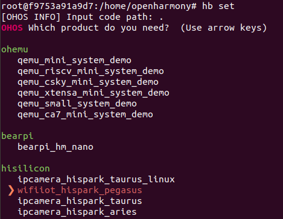

# 编译<a name="ZH-CN_TOPIC_0000001171455552"></a>

-   [编译（Docker方式搭建环境）](#section681942105819)
-   [编译（安装包方式搭建环境）](#section17726113335715)

本节描述如何进行Hi3861 开发板的编译，根据上方搭建Ubuntu环境方式的不同，编译方式也有所区别。

-   如果Ubuntu编译环境通过Docker方式安装，请参见下方[编译（Docker方式搭建环境）](#section681942105819)。
-   如果Ubuntu编译环境通过安装包方式安装，请参见下方[编译（安装包方式搭建环境）](#section17726113335715)。

## 编译（Docker方式搭建环境）<a name="section681942105819"></a>

1.  请在[获取Docker环境](quickstart-lite-docker-environment.md#section15666113905015)中进入的Docker构建环境中，执行如下命令进行编译：

    ```
    hb set(设置编译路径)
    .（选择当前路径）
    选择wifiiot_hispark_pegasus@hisilicon并回车
    hb build -f（执行编译）
    ```

    **图 1**  Hi3861编译设置图例-Docker方式<a name="fig129467368177"></a>  
    

2.  编译结束后，出现“wifiiot\_hispark\_pegasus build success”字样，则证明构建成功。

    > **须知：** 
    >烧录结果文件文件获取路径：out/hispark\_pegasus/wifiiot\_hispark\_pegasus。


## 编译（安装包方式搭建环境）<a name="section17726113335715"></a>

1.  打开DevEco Device Tool工具，点击“View \> Terminal”，进入终端界面。

    **图 2**  IDE终端工具打开方法<a name="fig1975813338510"></a>  
    

    

2.  进入代码根路径，并在终端窗口，执行脚本命令“hb set”、“.”，选择需要编译的版本“wifiiot\_hispark\_pegasus”。

    **图 3**  在终端界面选择目标构建版本示意图<a name="fig17727115215612"></a>  
    

    

3.  执行“hb build”启动版本构建。

    **图 4**  在终端界面执行编译命令示意图<a name="fig5493164414573"></a>  
    

    

4.  编译结束后，如果出现“wifiiot\_hispark\_pegasus build success”字样，则证明构建成功，如下图所示。

    **图 5**  编译成功示意图<a name="fig1262101218463"></a>  
    

    

5.  构建成功后，会在./out/wifiiot/路径中生成以下文件，使用如下命令可以查看，至此编译构建流程结束。

    ```
    ls -l out/hispark_pegasus/wifiiot_hispark_pegasus/
    ```

    **图 6**  编译文件存放目录示意图<a name="fig38521346164618"></a>  
    

    


