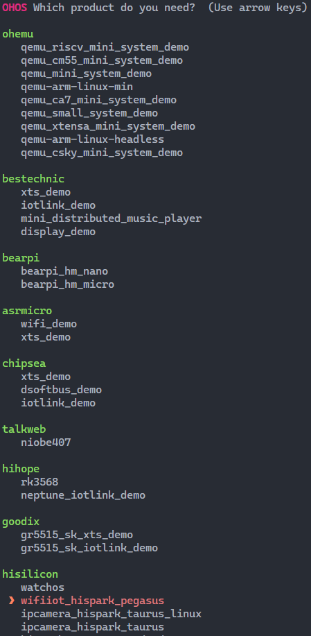

# 编译


OpenHarmony支持hb和build.sh两种编译方式。此处介绍hb方式，build.sh脚本编译方式请参考[使用build.sh脚本编译源码](../quick-start/quickstart-lite-reference.md#使用buildsh脚本编译源码)。


在Ubuntu环境下进入源码根目录，执行如下命令进行编译：


1. 设置编译路径。
     
   ```
   hb set
   ```

2. 选择当前路径。
     
   ```
   .
   ```

3. 在hisilicon下选择wifiiot_hispark_pegasus并回车。

4. 执行编译。
   >  **说明：**
   > - 单独编译一个部件（例如hello），可使用“hb build -T _目标名称_”进行编译。
   > 
   > - 增量编译整个产品，可使用“hb build”进行编译。
   > 
   > - 完整编译整个产品，可使用“hb build -f”进行编译。
   > 
   > 此处以完整编译整个产品为例进行说明。

     
   ```
   hb build -f
   ```

     **图1** Hi3861编译设置图例
     

5. 编译结束后，出现“build success”字样，则证明构建成功。
   >  **须知：**
   > 编译结果文件及编译日志获取路径：out/hispark_pegasus/wifiiot_hispark_pegasus。
