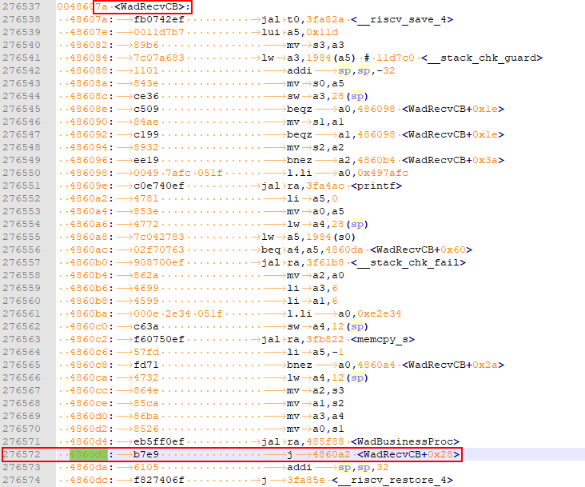

# 调试验证


完成烧录及联网之后，用户可根据需要进行调试验证。目前调试验证的方法有以下两种，开发者可以根据具体业务情况选择。


1. 通过printf打印日志

2. 通过asm文件定位panic问题


由于本示例业务简单，采用printf打印日志的调试方式即可。下方将介绍这两种调试手段的使用方法。


## printf打印

代码中增加printf维测，信息会直接打印到串口上。开发者可在业务关键路径或业务异常位置增加日志打印，如下所示：

  
```
void HelloWorld(void)
{
    printf("[DEMO] Hello world.\n");
}
```


## 根据asm文件进行问题定位

  系统异常退出时，会在串口上打印异常退出原因调用栈信息，如下文所示。通过解析异常栈信息可以定位异常位置。
  
```
=======KERNEL PANIC=======
**Call Stack*
Call Stack 0 -- 4860d8 addr:f784c
Call Stack 1 -- 47b2b2 addr:f788c
Call Stack 2 -- 3e562c addr:f789c
Call Stack 3 -- 4101de addr:f78ac
Call Stack 4 -- 3e5f32 addr:f78cc
Call Stack 5 -- 3f78c0 addr:f78ec
Call Stack 6 -- 3f5e24 addr:f78fc
Call Stack end***
```

为解析上述调用栈信息，需要使用到Hi3861_wifiiot_app.asm文件，该文件记录了代码中函数在Flash上的符号地址以及反汇编信息。asm文件会随版本打包一同构建输出，存放在./out/wifiiot/路径下。

1. 将调用栈CallStack信息保存到txt文档中，以便于编辑。（可选）

2. 打开asm文件，并搜索CallStack中的地址，列出对应的函数名信息。通常只需找出前几个栈信息对应的函数，就可明确异常代码方向。
     
   ```
   Call Stack 0 -- 4860d8 addr:f784c -- WadRecvCB
   Call Stack 1 -- 47b2b2 addr:f788c -- wal_sdp_process_rx_data
   Call Stack 2 -- 3e562c addr:f789c
   Call Stack 3 -- 4101de addr:f78ac
   Call Stack 4 -- 3e5f32 addr:f78cc
   Call Stack 5 -- 3f78c0 addr:f78ec
   Call Stack 6 -- 3f5e24 addr:f78fc
   ```

3. 根据以上调用栈信息，可以定位WadRecvCB函数中出现了异常。

   

4. 完成代码排查及修改。
