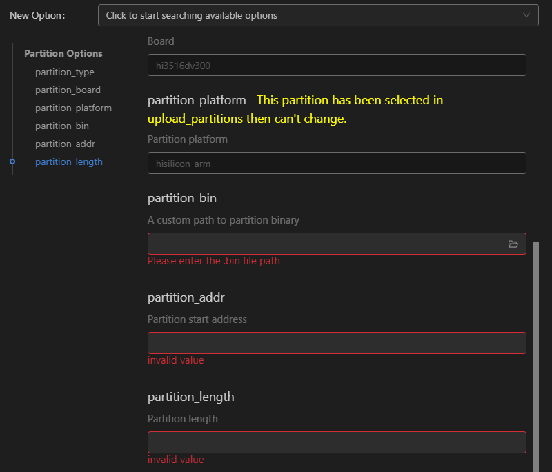

# 镜像烧录

-   [前提条件](#section1956213516576)
-   [使用网口烧录](#section14587120161217)

标准系统烧录，在DevEco Device Tool V2.2 Beta1及以上版本支持，下方烧录操作均在DevEco Device Tool中进行。

DevEco Device Tool以插件方式运行，基于Visual Studio Code进行扩展，用户可点击Visual Studio Code左侧栏的图标打开DevEco Device Tool。

Hi3516DV300支持烧录标准系统，其烧录方式包括USB烧录、网口烧录和串口烧录三种方式，其中：

-   **Windows系统：支持USB烧录、网口烧录和串口烧录**。
-   **Linux系统：支持串口烧录和网口烧录。**

同一种烧录方式（如网口烧录），在Windows和Linux环境下的烧录操作完全一致，区别仅在于DevEco Device Tool环境搭建不同。

下方以Linux系统下，网口烧录方式为例进行OpenHarmony标准系统烧录，其他两种烧录方式请参照[Hi3516DV300烧录指导](https://device.harmonyos.com/cn/docs/ide/user-guides/hi3516_upload-0000001052148681)。

## 前提条件

1.  在DevEco Device Tool工具中点击**Import Project**导入新建应用程序章节修改后的源码文件。

    

2.  选择源码导入时，系统会提示该工程不是DevEco Device Tool工程，点击**Import**。

    

3.  MCU选择**HiSilicon\_Arm\_Linux**下的Hi3516DV300，Board选择hi3516dv300，Framework选择“Ohos-sources”，然后点击**Import**完成导入。

    

## 使用网口烧录

1.  请连接好电脑和待烧录开发板，需要同时连接串口和USB口，具体可参考[Hi3516DV300开发板介绍](https://device.harmonyos.com/cn/docs/documentation/guide/quickstart-lite-introduction-hi3516-0000001152041033)[Hi3516DV300开发板介绍](https://gitee.com/openharmony/docs/blob/master/zh-cn/device-dev/quick-start/quickstart-lite-introduction-hi3516.md)。
2.  查看并记录对应的串口号。

    > **说明：** 
    >如果对应的串口异常，请根据[Hi3516DV300/Hi3518EV300开发板串口驱动安装指导](https://device.harmonyos.com/cn/docs/documentation/guide/hi3516_hi3518-drivers-0000001050743695)安装USB转串口的驱动程序。

    Windows系统，打开设备管理器查看并记录对应的串口号，或在DevEco Device Tool中，点击QUICK ACCESS \> DevEco Home \> Device，查看并记录对应的串口号。

    

    Linux系统，在DevEco Device Tool中，点击QUICK ACCESS \> DevEco Home \> Device，查看并记录对应的串口号。

    

3.  在QUICK ACCESS \> DevEco Home \> Projects中，点击**Settings**打开工程配置界面。

    

4.  在“hi3516dv300”页签，设置烧录选项，包括upload\_partitions、upload\_port和upload\_protocol。

    -   upload\_partitions：选择待烧录的文件，默认情况下会同时烧录fastboot、boot、updater、misc、system、vendor和userdata。
    -   upload\_port：选择已查询的串口号。
    -   upload\_protocol：选择烧录协议，固定选择“hiburn-usb”。

    

5.  分别检查待烧录文件的烧录信息，DevEco Device Tool已预置默认的烧录文件信息，可根据实际情况进行调整。待烧录文件包括：fastboot、boot、updater、misc、system、vendor和userdata。
    1.  在“hi3516dv300\_fastboot”页签，在New Option选项中选择需要修改的项，例如partition\_bin（烧录文件路径）、partition\_addr（烧录文件起始地址）、partition\_length（烧录文件分区长度）等。

        

    2.  然后在Partition Options中，分别修改上述步骤中选择的修改项。

        > **说明：** 
        >在设置烧录分区起始地址和分区长度时，应根据实际待烧录文件的大小进行设置，要求设置的烧录分区大小，要大于待烧录文件的大小；同时，各烧录文件的分区地址设置不能出现重叠。

        

    3.  按照相同的方法修改boot、updater和misc的烧录文件信息。

6.  所有的配置都修改完成后，在工程配置页签的顶部，点击**Save**进行保存。
7.  点击**Open**打开工程文件，然后在“PROJECT TASKS”中，点击fastboot下的**Erase**按钮，擦除U-Boot。

    

8.  执行**Erase**擦除操作后，显示如下提示信息时，请重启开发板（插拔USB连线）。

    

9.  重新上电后，显示如下信息时，表示擦除U-Boot成功。

    

10. 擦除完成后，点击hi3516dv300下的**Upload**按钮，启动烧录。

    > **说明：** 
    >如果您是第一次在工作台烧录Hi3516DV300/Hi3518EV300开发板，可能烧录失败，提示“not find the Devices”，请根据[Hi3516DV300/Hi3518EV300开发板USB驱动安装](https://device.harmonyos.com/cn/docs/documentation/guide/usb_driver-0000001058690393)进行处理后再重新烧录。

    

11. 启动烧录后，界面提示如下信息时，表示烧录成功。

    

12. 烧录完成后，请根据标准系统镜像运行进行下一步操作，完成系统启动。

