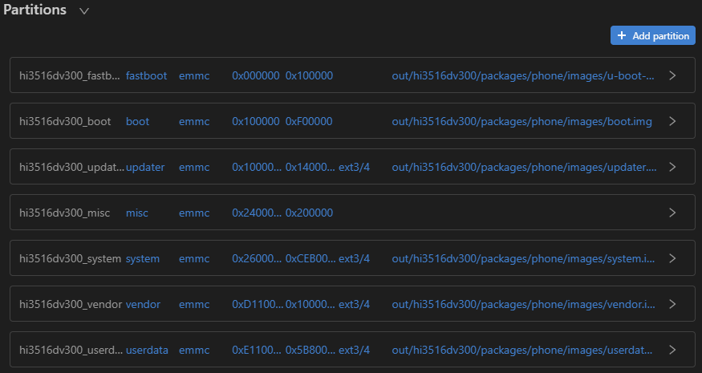
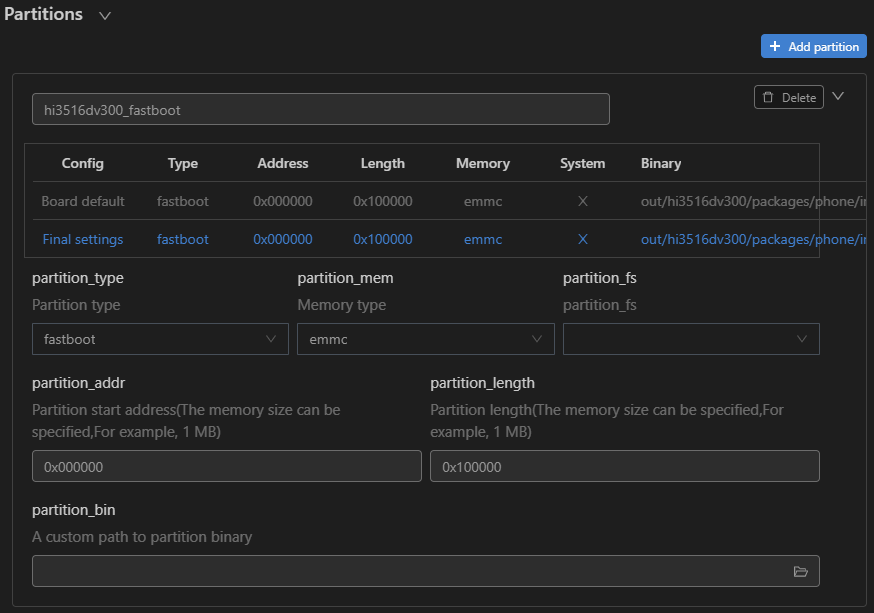
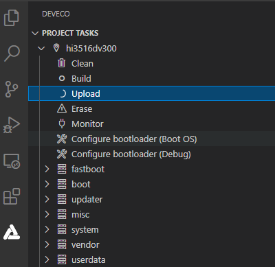

# 烧录

烧录是指将编译后的程序文件下载到芯片开发板上的动作，为后续的程序调试提供基础。DevEco Device Tool提供一键烧录功能，操作简单，能快捷、高效的完成程序烧录，提升烧录的效率。

>  **说明：**
> - 如您使用的是master分支2022年5月9日及之后的源码，请[使用HiTool工具进行烧录](../quick-start/quickstart-standard-hitool.md)。
> 
> - 当前版本的DevEco Device Tool暂不支持上述日期后的源码烧录，将在下个版本中适配。

在Windows下采用USB烧录方式进行Hi3516DV300的烧录，具体步骤如下：

## 导入源码

在编译完成后，[保证Windows系统可以远程访问Ubuntu环境](../quick-start/quickstart-standard-env-setup.md#安装deveco-device-tool)的情况下，您还需要通过以下步骤导入源码后，方可进行烧录。

1. 打开DevEco Device Tool，进入Home页，点击**Import Project**打开工程。

   

2. 选择要导入的源码目录（需要访问Ubuntu下的源码目录），点击**Import**打开。
   >  **说明：**
   > 工程存储路径不能包含中文字符、空格。

   

3. 首次导入时，会出现如下提示框，点击**Import**。

   

4. 在Select Project type界面，选择**Import from OpenHarmony Source**。

   

5. 在Import Project界面，选择**Product**后，会自动填充对应的MCU、Board、company和kernel信息，然后**ohosVersion**选择对应的OpenHarmony源码版本。此处选择Hi3516DV300。

   

6. 点击**Open**打开工程或源码。

## 烧录

完成源码导入后，通过以下步骤进行烧录：

>  **说明：**
> 使用USB烧录方式，在DevEco Device Tool 2.2 Beta2及更高版本中支持。

1. 请连接好电脑和待烧录开发板，需要连接USB口和串口，具体可参考[Hi3516DV300开发板介绍](https://gitee.com/openharmony/docs/blob/master/zh-cn/device-dev/quick-start/quickstart-lite-introduction-hi3516.md)。
   >  **说明：**
   > 如果采用远程开发模式（windows+本地虚拟机Ubuntu），为确保开发板连接的是主机的USB口，请先禁用虚拟机的usb控制。
   > 
   > - VMware：在首选项的USB选项中设置将设备连接到主机，在虚拟机设置中移除USB控制器。
   > 
   > - VirtualBox：在Ubuntu设置的USB设备选项中将启动USB控制器的勾去掉。

2. 根据[Hi3516DV300开发板串口驱动安装指导](https://gitee.com/link?target=https%3A%2F%2Fdevice.harmonyos.com%2Fcn%2Fdocs%2Fdocumentation%2Fguide%2Fhi3516_hi3518-drivers-0000001050743695)、[Hi3516DV300开发板USB驱动安装指导](https://device.harmonyos.com/cn/docs/documentation/guide/usb_driver-0000001058690393)安装USB驱动及USB转串口的驱动。若您的设备中已安装此驱动，请忽略该步骤。

3. 在DevEco Device Tool中，选择REMOTE DEVELOPMENT &gt; Local PC，查看远程计算机（Ubuntu开发环境）与本地计算机（Windows开发环境）的连接状态。
   - 如果Local PC右边连接按钮为，则远程计算机与本地计算机为已连接状态，不需要执行其他操作。
   - 如果Local PC右边连接按钮为，则点击绿色按钮进行连接。

   

   >  **说明：**
   > 该操作仅在远程模式（Windows+Ubuntu混合开发环境）中需要设置，如果采用本地模式（Windows开发环境或Ubuntu开发环境），则请跳过该步骤。

4. 在DevEco Device Tool中，点击QUICK ACCESS &gt; DevEco Home &gt; Device，查看并记录对应的串口号。

   

5. 在QUICK ACCESS &gt; DevEco Home &gt; Projects中，点击**Settings**打开工程配置界面。

   

6. 在“hi3516dv300”页签，设置烧录选项，包括upload_partitions、upload_port和upload_protocol。
   - upload_partitions：选择待烧录的文件，默认情况下会同时烧录fastboot、boot、updater、misc、system、vendor和userdata。
   - upload_port：选择已查询的串口号。
   - upload_protocol：选择烧录协议，固定选择“hiburn-usb”。

   

7. 在Partitions中，分别检查待烧录文件的烧录信息，包括起始地址、分区大小、待烧录文件地址等。DevEco Device Tool已预置默认的烧录文件信息，可根据实际情况进行调整。

   

     如需修改，请点击每个待烧录文件后的按钮进行修改。
   >  **说明：**
   > 在设置烧录分区起始地址和分区长度时，应根据实际待烧录文件的大小进行设置，要求设置的烧录分区大小，要大于待烧录文件的大小；同时，各烧录文件的分区地址设置不能出现重叠。

   

8. 所有的配置都修改完成后，在工程配置页签的顶部，点击**Save**进行保存。

9. 点击hi3516dv300下的**Upload**按钮，此时待烧录文件会从Ubuntu系统传输到Windows下，传输完成后界面显示“Operation paused, Please press Enter key to continue”时，请点击**Enter**键启动烧录。

   

10. 在终端窗口显示如下提示信息时，请在15秒内，按住复位键，插拔USB线，最后松开复位键启动烧录。

    

    启动烧录后，界面提示如下信息时，表示烧录成功。

    

11. 烧录成功后，请根据运行章节进行操作，启动系统。
