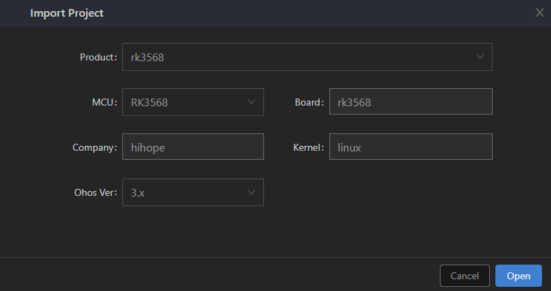

# 烧录

在Windows环境下通过以下步骤进行RK3568的烧录：

### 导入源码

在编译完成后，[保证Windows系统可以远程访问Ubuntu环境](../quick-start/quickstart-standard-env-setup.md)的情况下，您还需要通过以下步骤导入源码后，方可进行烧录。

1. 打开DevEco Device Tool，进入Home页，点击**Import Project**打开工程。

   

2. 选择要导入的源码目录（需要访问Ubuntu下的源码目录），点击**Import**打开。

   >  **说明：**
   > 工程存储路径不能包含中文字符、空格。如果工程存储路径包含中文字符或空格，可能导致编译失败。

   

3. 如果您打开的目录不是DevEco Device Tool工程，则会出现如下提示框，点击**Import**。

   

4. 在Select Project type界面，选择**Import from OpenHarmony Source**。

   

5. 在Import Project界面，选择**Product**后，会自动填充对应的MCU、Board、company和kernel信息，然后**ohosVersion**选择对应的OpenHarmony源码版本。此处选择rk3568。

   

6. 点击**Open**打开工程或源码。

### 烧录

完成源码导入后，通过以下步骤进行烧录：

1. [下载](https://gitee.com/hihope_iot/docs/blob/master/HiHope_DAYU200/%E7%83%A7%E5%86%99%E5%B7%A5%E5%85%B7%E5%8F%8A%E6%8C%87%E5%8D%97/windows/DriverAssitant_v5.1.1.zip)并安装驱动DriverInstall.exe，双击DriverInstall.exe打开安装程序，点击“驱动安装”按钮，按提示安装USB驱动。
   >  **说明：**
   > 如果已经安装旧版本的烧写工具，请先点击"驱动卸载"按钮卸载驱动，然后再点击"驱动安装"按钮安装驱动。

2. 请连接好电脑和待烧录开发板，连接USB接口。

3. 在DevEco Device Tool中，选择REMOTE DEVELOPMENT &gt; Local PC，查看远程计算机（Ubuntu开发环境）与本地计算机（Windows开发环境）的连接状态。

   - 如果Local PC右边连接按钮为，则远程计算机与本地计算机为已连接状态，不需要执行其他操作。
   - 如果Local PC右边连接按钮为，则点击绿色连接进行按钮。

   

   >  **说明：**
   > 该操作仅在远程模式（Windows+Ubuntu混合开发环境）中需要设置，如果采用本地模式（Windows开发环境或Ubuntu开发环境），则请跳过该步骤。

4. 打开DevEco Device Tool，在QUICK ACCESS &gt; DevEco Home &gt; Projects中，点击**Settings**打开工程配置界面。

   

5. 在“hh_scdy200”页签，设置烧录选项，包括upload_partitions和upload_protocol。

   - upload_partitions：选择待烧录的文件。
   - upload_protocol：选择烧录协议，固定选择“upgrade”。

   

6. 分别检查待烧录文件的烧录信息，DevEco Device Tool已预置默认的烧录文件信息，可根据实际情况进行调整。待烧录文件包括：loader、parameter、uboot、boot_linux、system、vendor和userdata。

   1. 在“hh_scdy200_loader”页签，在New Option选项中选择需要修改的项，例如partition_bin（烧录文件路径）、partition_addr（烧录文件起始地址）、partition_length（烧录文件分区长度）等。

       

   2. 然后在Partition Options中，分别修改上述步骤中选择的修改项。

       >  **说明：**
       > 在设置烧录分区起始地址和分区长度时，应根据实际待烧录文件的大小进行设置，要求设置的烧录分区大小，要大于待烧录文件的大小；同时，各烧录文件的分区地址设置不能出现重叠。

       

   3. 按照相同的方法修改parameter、uboot、boot_linux、system、vendor和userdata的烧录文件信息。

7. 所有的配置都修改完成后，在工程配置页签的顶部，点击**Save**进行保存。

8. 点击工程的Open按钮，打开工程文件，点击图标，打开DevEco Device Tool界面，在“PROJECT TASKS”中，点击hh_scdy200下的**Upload**按钮，启动烧录。

   

9. 等待开发板烧录完成，当屏幕提示如下信息时，表示烧录成功。

   
