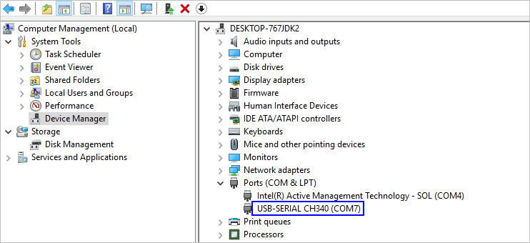

# 安装开发板环境<a name="ZH-CN_TOPIC_0000001105989316"></a>

-   [Hi3861工具要求](#section466851916410)
    -   [硬件要求](#section19202111020215)
    -   [软件要求](#section727451210318)

-   [安装Linux编译工具](#section497484245614)
    -   [安装编译依赖基础软件（仅Ubuntu 20+需要）](#section45512412251)
    -   [安装Scons](#section7438245172514)
    -   [安装python模块](#section88701892341)
    -   [安装gcc\_riscv32（WLAN模组类编译工具链）](#section34435451256)

-   [安装USB转串口驱动](#section1027732411513)

## Hi3861工具要求<a name="section466851916410"></a>

### 硬件要求<a name="section19202111020215"></a>

-   Linux服务器
-   Windows工作台（主机电脑）
-   Hi3861 WLAN模组
-   USB Type-C线（Windows工作台通过USB与Hi3861 WLAN模组连接）

各硬件连接关系如下图所示。

**图 1**  硬件连线图<a name="fig12122108211"></a>  


### 软件要求<a name="section727451210318"></a>

> **须知：** 
>本节描述采用安装包方式安装相关工具的操作步骤。如果是Docker方式安装，无需安装[表1](#table6299192712513)中的Linux服务器相关工具，只需安装Windows工作台工具即可。

Hi3861开发板需要的工具如下表所示。

**表 1**  Hi3861开发板需要的工具

<a name="table6299192712513"></a>
<table><thead align="left"><tr id="row122993276512"><th class="cellrowborder" valign="top" width="17.54%" id="mcps1.2.5.1.1"><p id="p162491657102110"><a name="p162491657102110"></a><a name="p162491657102110"></a>平台类型</p>
</th>
<th class="cellrowborder" valign="top" width="23.62%" id="mcps1.2.5.1.2"><p id="p1829914271858"><a name="p1829914271858"></a><a name="p1829914271858"></a>开发工具</p>
</th>
<th class="cellrowborder" valign="top" width="22.55%" id="mcps1.2.5.1.3"><p id="p429918274517"><a name="p429918274517"></a><a name="p429918274517"></a>用途</p>
</th>
<th class="cellrowborder" valign="top" width="36.29%" id="mcps1.2.5.1.4"><p id="p12997271757"><a name="p12997271757"></a><a name="p12997271757"></a>获取途径</p>
</th>
</tr>
</thead>
<tbody><tr id="row935218593572"><td class="cellrowborder" valign="top" width="17.54%" headers="mcps1.2.5.1.1 "><p id="p105554418586"><a name="p105554418586"></a><a name="p105554418586"></a>Linux服务器</p>
</td>
<td class="cellrowborder" valign="top" width="23.62%" headers="mcps1.2.5.1.2 "><p id="p45551740589"><a name="p45551740589"></a><a name="p45551740589"></a>编译基础软件包(仅ubuntu 20+需要)</p>
</td>
<td class="cellrowborder" valign="top" width="22.55%" headers="mcps1.2.5.1.3 "><p id="p655594115814"><a name="p655594115814"></a><a name="p655594115814"></a>编译依赖的基础软件包</p>
</td>
<td class="cellrowborder" valign="top" width="36.29%" headers="mcps1.2.5.1.4 "><p id="p165558415589"><a name="p165558415589"></a><a name="p165558415589"></a>通过互联网获取</p>
</td>
</tr>
<tr id="row1397335913612"><td class="cellrowborder" valign="top" width="17.54%" headers="mcps1.2.5.1.1 "><p id="p3711468218"><a name="p3711468218"></a><a name="p3711468218"></a>Linux服务器</p>
</td>
<td class="cellrowborder" valign="top" width="23.62%" headers="mcps1.2.5.1.2 "><p id="p097355911620"><a name="p097355911620"></a><a name="p097355911620"></a>SCons3.0.4+</p>
</td>
<td class="cellrowborder" valign="top" width="22.55%" headers="mcps1.2.5.1.3 "><p id="p1973195917619"><a name="p1973195917619"></a><a name="p1973195917619"></a>编译构建工具</p>
</td>
<td class="cellrowborder" valign="top" width="36.29%" headers="mcps1.2.5.1.4 "><p id="p1722663441514"><a name="p1722663441514"></a><a name="p1722663441514"></a>通过互联网获取</p>
</td>
</tr>
<tr id="row1968013216717"><td class="cellrowborder" valign="top" width="17.54%" headers="mcps1.2.5.1.1 "><p id="p2681632977"><a name="p2681632977"></a><a name="p2681632977"></a>Linux服务器</p>
</td>
<td class="cellrowborder" valign="top" width="23.62%" headers="mcps1.2.5.1.2 "><p id="p1991501391312"><a name="p1991501391312"></a><a name="p1991501391312"></a>python模块：setuptools、kconfiglib、pycryptodome、six、ecdsa</p>
</td>
<td class="cellrowborder" valign="top" width="22.55%" headers="mcps1.2.5.1.3 "><p id="p968120325715"><a name="p968120325715"></a><a name="p968120325715"></a>编译构建工具</p>
</td>
<td class="cellrowborder" valign="top" width="36.29%" headers="mcps1.2.5.1.4 "><p id="p268116326711"><a name="p268116326711"></a><a name="p268116326711"></a>通过互联网获取</p>
</td>
</tr>
<tr id="row020914491313"><td class="cellrowborder" valign="top" width="17.54%" headers="mcps1.2.5.1.1 "><p id="p20209749103116"><a name="p20209749103116"></a><a name="p20209749103116"></a>Linux服务器</p>
</td>
<td class="cellrowborder" valign="top" width="23.62%" headers="mcps1.2.5.1.2 "><p id="p7209104910317"><a name="p7209104910317"></a><a name="p7209104910317"></a>gcc riscv32</p>
</td>
<td class="cellrowborder" valign="top" width="22.55%" headers="mcps1.2.5.1.3 "><p id="p102093498311"><a name="p102093498311"></a><a name="p102093498311"></a>编译构建工具</p>
</td>
<td class="cellrowborder" valign="top" width="36.29%" headers="mcps1.2.5.1.4 "><p id="p321054953116"><a name="p321054953116"></a><a name="p321054953116"></a>通过互联网获取</p>
</td>
</tr>
<tr id="row1596703610215"><td class="cellrowborder" valign="top" width="17.54%" headers="mcps1.2.5.1.1 "><p id="p071946112113"><a name="p071946112113"></a><a name="p071946112113"></a>Windows工作台</p>
</td>
<td class="cellrowborder" valign="top" width="23.62%" headers="mcps1.2.5.1.2 "><p id="p1044974291416"><a name="p1044974291416"></a><a name="p1044974291416"></a>CH341SER.EXE</p>
</td>
<td class="cellrowborder" valign="top" width="22.55%" headers="mcps1.2.5.1.3 "><p id="p94491342131413"><a name="p94491342131413"></a><a name="p94491342131413"></a>USB转串口驱动</p>
</td>
<td class="cellrowborder" valign="top" width="36.29%" headers="mcps1.2.5.1.4 "><p id="p6449184214148"><a name="p6449184214148"></a><a name="p6449184214148"></a><a href="http://www.wch.cn/search?q=ch340g&amp;t=downloads" target="_blank" rel="noopener noreferrer">http://www.wch.cn/search?q=ch340g&amp;t=downloads</a></p>
</td>
</tr>
</tbody>
</table>

## 安装Linux编译工具<a name="section497484245614"></a>

> **须知：** 
>-   如果通过“HPM组件方式”或“HPM包管理器命令行工具方式”获取源码，不需要安装gcc\_riscv32编译工具。
>-   （推荐）如果通过“镜像站点方式”或“代码仓库方式”获取源码，需要安装gcc\_riscv32编译工具。安装gcc\_riscv32编译工具时，请确保编译工具的环境变量路径唯一。

### 安装编译依赖基础软件（仅Ubuntu 20+需要）<a name="section45512412251"></a>

执行以下命令进行安装：

```
sudo apt-get install build-essential gcc g++ make zlib* libffi-dev
```

### 安装Scons<a name="section7438245172514"></a>

1.  打开Linux编译服务器终端。
2.  运行如下命令，安装SCons安装包。

    ```
    python3 -m pip install scons
    ```

3.  运行如下命令，查看是否安装成功。如果安装成功，查询结果下图所示。

    ```
    scons -v
    ```

    **图 2**  SCons安装成功界面，版本要求3.0.4以上<a name="fig235815252492"></a>  
    


### 安装python模块<a name="section88701892341"></a>

1.  运行如下命令，安装python模块setuptools。

    ```
    pip3 install setuptools
    ```

2.  安装GUI menuconfig工具（Kconfiglib），建议安装Kconfiglib 13.2.0+版本，任选如下一种方式。
    -   **命令行方式：**

        ```
        sudo pip3 install kconfiglib
        ```


    -   **安装包方式：**
        1.  下载.whl文件（例如：kconfiglib-13.2.0-py2.py3-none-any.whl）。

            下载路径：“[https://pypi.org/project/kconfiglib\#files](https://pypi.org/project/kconfiglib#files)”


        1.  运行如下命令，安装.whl文件。

            ```
            sudo pip3 install kconfiglib-13.2.0-py2.py3-none-any.whl
            ```


3.  安装pycryptodome，任选如下一种方式。

    安装升级文件签名依赖的Python组件包，包括：pycryptodome、six、ecdsa。安装ecdsa依赖six，请先安装six，再安装ecdsa。

    -   **命令行方式：**

        ```
        sudo pip3 install pycryptodome
        ```

    -   **安装包方式：**
        1.  下载.whl文件（例如：pycryptodome-3.9.9-cp38-cp38-manylinux1\_x86\_64.whl）。

            下载路径：“[https://pypi.org/project/pycryptodome/\#files](https://pypi.org/project/pycryptodome/#files)”。


        1.  运行如下命令，安装.whl文件。

            ```
            sudo pip3 install pycryptodome-3.9.9-cp38-cp38-manylinux1_x86_64.whl
            ```


4.  安装six，任选如下一种方式。
    -   **命令行方式：**

        ```
        sudo pip3 install six --upgrade --ignore-installed six
        ```


    -   **安装包方式：**
        1.  下载.whl文件（例如：six-1.12.0-py2.py3-none-any.whl）。

            下载路径：“[https://pypi.org/project/six/\#files](https://pypi.org/project/six/#files)”


        1.  运行如下命令，安装.whl文件。

            ```
            sudo pip3 install six-1.12.0-py2.py3-none-any.whl
            ```


5.  安装ecdsa，任选如下一种方式。
    -   **命令行方式：**

        ```
        sudo pip3 install ecdsa
        ```

    -   **安装包方式：**
        1.  下载.whl文件（例如：ecdsa-0.14.1-py2.py3-none-any.whl）。

            下载路径：“[https://pypi.org/project/ecdsa/\#files](https://pypi.org/project/ecdsa/#files)”


        1.  运行如下命令，安装.whl文件。

            ```
            sudo pip3 install ecdsa-0.14.1-py2.py3-none-any.whl
            ```


### 安装gcc\_riscv32（WLAN模组类编译工具链）<a name="section34435451256"></a>

> **须知：** 
>-   Hi3861平台仅支持使用libgcc运行时库的静态链接，不建议开发者使用libgcc运行时库的动态链接，会导致商业分发时被GPL V3污染。
>-   通过下述步骤2-15，我们编译好了gcc\_riscv32 镜像，提供给开发者[直接下载](https://repo.huaweicloud.com/harmonyos/compiler/gcc_riscv32/7.3.0/linux/gcc_riscv32-linux-7.3.0.tar.gz)使用。直接下载 gcc\_riscv32 镜像的开发者可省略下述2-15步。

1.  打开Linux编译服务器终端。
2.  环境准备，请安装"gcc, g++, bison, flex, makeinfo"软件，确保工具链能正确编译。

    ```
    sudo apt-get install gcc && sudo apt-get install g++ && sudo apt-get install flex bison && sudo apt-get install texinfo
    ```

3.  下载riscv-gnu-toolchain交叉编译工具链。

    ```
    git clone --recursive https://gitee.com/mirrors/riscv-gnu-toolchain.git
    ```

4.  打开文件夹riscv-gnu-toolchain，先删除空文件夹，以防止下载newlib，binutils，gcc时冲突。

    ```
    cd riscv-gnu-toolchain && rm -rf riscv-newlib && rm -rf riscv-binutils && rm -rf riscv-gcc
    ```

5.  下载riscv-newlib-3.0.0。

    ```
    git clone -b riscv-newlib-3.0.0 https://github.com/riscv/riscv-newlib.git
    ```

6.  下载riscv-binutils-2.31.1。

    ```
    git clone -b riscv-binutils-2.31.1 https://github.com/riscv/riscv-binutils-gdb.git
    ```

7.  下载riscv-gcc-7.3.0。

    ```
    git clone -b riscv-gcc-7.3.0 https://github.com/riscv/riscv-gcc
    ```

8.  添加riscv-gcc-7.3.0补丁。

    访问gcc官方补丁链接[89411](https://gcc.gnu.org/git/?p=gcc.git;a=commitdiff;h=026216a753ef0a757a9e368a59fa667ea422cf09;hp=2a23a1c39fb33df0277abd4486a3da64ae5e62c2)，[86724](https://gcc.gnu.org/git/?p=gcc.git;a=blobdiff;f=gcc/graphite.h;h=be0a22b38942850d88feb159603bb846a8607539;hp=4e0e58c60ab83f1b8acf576e83330466775fac17;hb=b1761565882ed6a171136c2c89e597bc4dd5b6bf;hpb=fbd5f023a03f9f60c6ae36133703af5a711842a3)，按照补丁链接中要求的修改，手动将变更添加到对应的.c和.h文件中，注意由于patch版本与下载的gcc版本有所偏差，行数有可能对应不上，请自行查找patch中的关键字定位到对应行。

9.  下载[GMP 6.1.2](https://gmplib.org/download/gmp/gmp-6.1.2.tar.bz2)，并解压安装。

    ```
    tar -xvf gmp-6.1.2.tar.bz2 && mkdir build_gmp && cd build_gmp && ../gmp-6.1.2/configure --prefix=/usr/local/gmp-6.1.2 --disable-shared --enable-cxx && make && make install
    ```

10. 下载[mpfr-4.0.2 ](https://www.mpfr.org/mpfr-4.0.2/mpfr-4.0.2.tar.gz)，并解压安装。

    ```
    tar -xvf mpfr-4.0.2.tar.gz && mkdir build_mpfr && cd build_mpfr && ../mpfr-4.0.2/configure --prefix=/usr/local/mpfr-4.0.2 --with-gmp=/usr/local/gmp-6.1.2 --disable-shared && make && make install
    ```

11. 下载[mpc-1.1.0](https://ftp.gnu.org/gnu/mpc/mpc-1.1.0.tar.gz)  ，并解压安装。

    ```
    tar -xvf mpc-1.1.0.tar.gz && mkdir build_mpc && cd build_mpc && ../mpc-1.1.0/configure --prefix=/usr/local/mpc-1.1.0 --with-gmp=/usr/local/gmp-6.1.2 --with-mpfr=/usr/local/mpfr-4.0.2 --disable-shared && make && make install
    ```

12. 打开文件夹riscv-gnu-toolchain，新建工具链输出目录。

    ```
    cd /opt && mkdir gcc_riscv32
    ```

13. 编译binutils。

    ```
    mkdir build_binutils && cd build_binutils && ../riscv-binutils-gdb/configure --prefix=/opt/gcc_riscv32 --target=riscv32-unknown-elf --with-arch=rv32imc --with-abi=ilp32 --disable-__cxa_atexit --disable-libgomp --disable-libmudflap --enable-libssp --disable-libstdcxx-pch --disable-nls --disable-shared --disable-threads --disable-multilib --enable-poison-system-directories --enable-languages=c,c++ --with-gnu-as --with-gnu-ld --with-newlib --with-system-zlib CFLAGS="-fstack-protector-strong -O2 -D_FORTIFY_SOURCE=2 -Wl,-z,relro,-z,now,-z,noexecstack -fPIE" CXXFLAGS="-fstack-protector-strong -O2 -D_FORTIFY_SOURCE=2 -Wl,-z,relro,-z,now,-z,noexecstack -fPIE" CXXFLAGS_FOR_TARGET="-Os -mcmodel=medlow -Wall -fstack-protector-strong -Wl,-z,relro,-z,now,-z,noexecstack -Wtrampolines -fno-short-enums -fno-short-wchar" CFLAGS_FOR_TARGET="-Os -mcmodel=medlow -Wall -fstack-protector-strong -Wl,-z,relro,-z,now,-z,noexecstack -Wtrampolines -fno-short-enums -fno-short-wchar" --bindir=/opt/gcc_riscv32/bin --libexecdir=/opt/gcc_riscv32/riscv32 --libdir=/opt/gcc_riscv32 --includedir=/opt/gcc_riscv32 && make -j16 && make install && cd ..
    ```

14. 编译newlib。

    ```
    mkdir build_newlib && cd build_newlib && ../riscv-newlib/configure --prefix=/opt/gcc_riscv32 --target=riscv32-unknown-elf --with-arch=rv32imc --with-abi=ilp32 --disable-__cxa_atexit --disable-libgomp --disable-libmudflap --enable-libssp --disable-libstdcxx-pch --disable-nls --disable-shared --disable-threads --disable-multilib --enable-poison-system-directories --enable-languages=c,c++ --with-gnu-as --with-gnu-ld --with-newlib --with-system-zlib CFLAGS="-fstack-protector-strong -O2 -D_FORTIFY_SOURCE=2 -Wl,-z,relro,-z,now,-z,noexecstack -fPIE" CXXFLAGS="-fstack-protector-strong -O2 -D_FORTIFY_SOURCE=2 -Wl,-z,relro,-z,now,-z,noexecstack -fPIE" \CXXFLAGS_FOR_TARGET="-Os -mcmodel=medlow -Wall -fstack-protector-strong -Wl,-z,relro,-z,now,-z,noexecstack -Wtrampolines -fno-short-enums -fno-short-wchar" CFLAGS_FOR_TARGET="-Os -mcmodel=medlow -Wall -fstack-protector-strong -Wl,-z,relro,-z,now,-z,noexecstack -Wtrampolines -fno-short-enums -fno-short-wchar" --bindir=/opt/gcc_riscv32/bin --libexecdir=/opt/gcc_riscv32 --libdir=/opt/gcc_riscv32 --includedir=/opt/gcc_riscv32 && make -j16 && make install && cd ..
    ```

15. 编译gcc。

    ```
    mkdir build_gcc && cd build_gcc && ../riscv-gcc/configure --prefix=/opt/gcc_riscv32 --target=riscv32-unknown-elf --with-arch=rv32imc --with-abi=ilp32 --disable-__cxa_atexit --disable-libgomp --disable-libmudflap --enable-libssp --disable-libstdcxx-pch --disable-nls --disable-shared --disable-threads --disable-multilib --enable-poison-system-directories --enable-languages=c,c++ --with-gnu-as --with-gnu-ld --with-newlib --with-system-zlib CFLAGS="-fstack-protector-strong -O2 -D_FORTIFY_SOURCE=2 -Wl,-z,relro,-z,now,-z,noexecstack -fPIE" CXXFLAGS="-fstack-protector-strong -O2 -D_FORTIFY_SOURCE=2 -Wl,-z,relro,-z,now,-z,noexecstack -fPIE" LDFLAGS="-Wl,-z,relro,-z,now,-z,noexecstack" CXXFLAGS_FOR_TARGET="-Os -mcmodel=medlow -Wall -fstack-protector-strong -Wl,-z,relro,-z,now,-z,noexecstack -Wtrampolines -fno-short-enums -fno-short-wchar" CFLAGS_FOR_TARGET="-Os -mcmodel=medlow -Wall -fstack-protector-strong -Wl,-z,relro,-z,now,-z,noexecstack -Wtrampolines -fno-short-enums -fno-short-wchar" --with-headers="/opt/gcc-riscv32/riscv32-unknown-elf/include" --with-mpc=/usr/local/mpc-1.1.0 --with-gmp=/usr/local/gmp-6.1.2 --with-mpfr=/usr/local/mpfr-4.0.2 && make -j16 && make install
    ```

16. 设置环境变量。

    > **说明：** 
    >如果直接采用编译好的riscv32 gcc包，请参照如下步骤设置环境变量：
    >1.  将压缩包解压到根目录
    >    ```
    >    tar -xvf gcc_riscv32-linux-7.3.0.tar.gz -C ~
    >    ```
    >2.  设置环境变量。
    >    ```
    >    vim ~/.bashrc
    >    ```
    >3.  将以下命令拷贝到.bashrc文件的最后一行，保存并退出。
    >    ```
    >    export PATH=~/gcc_riscv32/bin:$PATH
    >    ```

    ```
    vim ~/.bashrc
    ```

    将以下命令拷贝到.bashrc文件的最后一行，保存并退出。

    ```
    export PATH=~/gcc_riscv32/bin:$PATH
    ```

17. 生效环境变量。

    ```
    source ~/.bashrc
    ```

18. Shell命令行中输入如下命令，如果能正确显示编译器版本号，表明编译器安装成功。

    ```
    riscv32-unknown-elf-gcc -v
    ```


## 安装USB转串口驱动<a name="section1027732411513"></a>

相关步骤在Windows工作台操作。

1.  点击链接[下载CH341SER USB转串口](http://www.hihope.org/download/download.aspx?mtt=8)驱动程序。
2.  点击安装包，安装驱动程序。
3.  驱动安装完成后，重新插拔USB接口，串口信息显示如下图所示。

    


