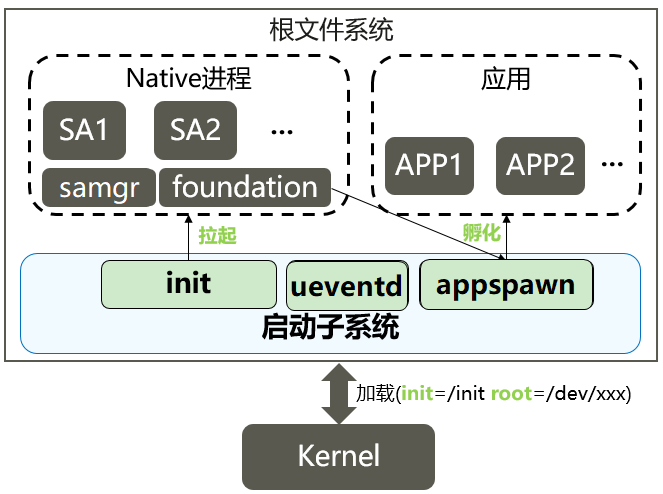

# 启动恢复子系统概述

## 启动恢复子系统上下文

启动子系统上下文结构如下图所示。

  **图1** 启动子系统上下文结构
 
  

系统上电加载内核后，按照以下流程完成系统各个服务和应用的启动：

1. 内核加载init进程，一般在bootloader启动内核时通过设置内核的cmdline来指定init的位置。

2. init进程启动后，会挂载tmpfs，procfs，创建基本的dev设备节点，提供最基本的根文件系统。

3. init也会启动ueventd监听内核热插拔设备事件，为这些设备创建dev设备节点；各个分区设备（包括block设备）都是通过此事件创建。

4. init进程挂载block设备各个分区（system，vendor）后，开始扫描各个系统服务的init启动脚本，并拉起各个SA服务。

5. samgr是各个SA的服务注册中心，每个SA启动时，都需要向samgr注册，每个SA会分配一个ID，应用可以通过该ID访问SA。

6. foundation是一个特殊的SA服务进程，提供了用户程序管理框架及基础服务；由该进程负责应用的生命周期管理。

7. 由于应用都需要加载JS的运行环境，涉及大量准备工作，因此appspawn作为应用的孵化器，在接收到foundation里的应用启动请求时，可以直接孵化出应用进程，减少应用启动时间。

启动子系统内部包含以下组件：

- init启动引导组件
  init启动引导组件对应的进程为init进程，是内核完成初始化后启动的第一个用户态进程。init进程启动之后，读取init.cfg配置文件，根据解析结果，执行相应命令（见[第2章表2](../subsystems/subsys-boot-init.md)）并依次启动各关键系统服务进程，在启动系统服务进程的同时设置其对应权限。

- ueventd启动引导组件
  ueventd负责监听内核设备驱动插拔的netlink事件，根据事件类型动态管理相应设备的dev节点。

- appspawn应用孵化组件
  负责接收**用户程序框架**的命令孵化应用进程，设置新进程的权限，并调用应用程序框架的入口函数。

- bootstrap服务启动组件
  提供了各服务和功能的启动入口标识。在samgr启动时，会调用bootstrap标识的入口函数，并启动系统服务。

- syspara系统属性组件
  系统属性组件，根据OpenHarmony产品兼容性规范提供获取设备信息的接口，如：产品名、品牌名、厂家名等，同时提供设置/读取系统属性的接口。

## 约束与限制

  下表为启动恢复子系统源代码目录和适配平台。

  **表1** 启动恢复子系统源代码目录和适配平台

| 名称 | 适配平台 | 
| -------- | -------- |
| base/startup/appspawn_lite | 小型系统设备（参考内存 ≥ 1 MiB），如Hi3516DV300&nbsp;、Hi3518EV300 | 
| base/startup/bootstrap_lite | 轻量系统设备（参考内存 ≥ 128 KiB），如Hi3861V100 | 
| base/startup/init_lite | 小型系统设备（参考内存 ≥ 1 MiB），如Hi3516DV300、Hi3518EV300 | 
| base/startup/syspara_lite | -&nbsp;轻量系统设备（参考内存 ≥ 128 KiB），如Hi3861V100 -&nbsp;小型系统设备（参考内存 ≥ 1 MiB），如Hi3516DV300、Hi3518EV300 | 

- init启动引导组件：
  - 每个系统服务启动时都需要编写各自的启动脚本文件init.cfg，定义各自的服务名、可执行文件路径、权限和其他信息。
  - 每个系统服务各自安装其启动脚本到/system/etc/init目录下，init进程统一扫描执行。

- 新芯片平台移植时，平台相关的初始化配置需要增加平台相关的初始化配置文件/vendor/etc/init/init.{hardware}.cfg。该文件完成平台相关的初始化设置，如安装ko驱动，设置平台相关的/proc节点信息。配置文件init.cfg仅支持json格式。

- bootstrap服务启动组件：需要在链接脚本中配置zInit代码段。
