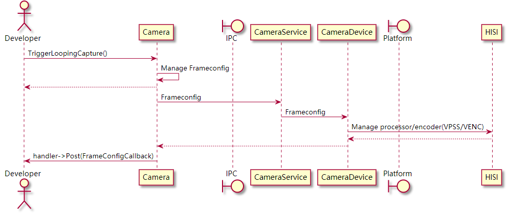

# 相机开发概述

-   [基本概念](#section175012297491)
-   [运作机制](#section193961322175011)

## 基本概念

相机是OpenHarmony多媒体进程提供的服务之一，提供了相机的录像、预览、拍照功能，支持多用户并发取流。

在进行应用的开发前，开发者应了解以下基本概念：

-   视频帧

    视频流指的是将一系列图片数据按照固定时间间隔排列形成的数据流，每一张图片数据成为一帧，这样的一帧称为视频帧。

-   帧速率\(FPS: Frames Per Second\)

    视频播放每秒钟刷新图片的速度，或是视频每秒的帧数，帧速率越高，视频的观感越流畅。

-   分辨率

    每一帧的图片信息都是由像素点组成的，分辨率描述了一张图片中像素点的个数。例如1920\*1080\(1080P\)，是指图片宽1920像素，高1080像素。

## 运作机制

-   多媒体服务进程

    多媒体服务作为系统服务，在系统启动时由Init进程拉起，并初始化和分配媒体硬件资源（内存/显示硬件/图像传感器/编解码器等）。初始化过程解析配置文件，确定了多媒体各个服务的能力和资源上限，通常由OEM厂商通过配置文件进行配置。相机服务在多媒体进程初始化时有以下配置项：

    -   内存池：所有媒体服务依赖于内存池中的内存轮转运行
    -   图像传感器：包括了传感器类型、分辨率、ISP等
    -   图像处理器：分辨率、码率、图像翻转等
    -   图像编码器：编码格式、码率、分辨率等

-   关键类的解释

    应用通过持有下面4个类，配置和使用Camera的功能，包括了Camera类和它的三个异步回调类，三类回调分别对应了不同类型的异步处理场景，详见[表1](#table486418149411)。

    **表 1**  关键类的解释

    
    <table><thead align="left"><tr id="row19864414104115"><th class="cellrowborder" valign="top" width="22.322232223222326%" id="mcps1.2.4.1.1">
对象

    </th>
    <th class="cellrowborder" valign="top" width="44.34443444344435%" id="mcps1.2.4.1.2">
用途

    </th>
    <th class="cellrowborder" valign="top" width="33.33333333333333%" id="mcps1.2.4.1.3">
举例

    </th>
    </tr>
    </thead>
    <tbody><tr id="row138651914104113"><td class="cellrowborder" valign="top" width="22.322232223222326%" headers="mcps1.2.4.1.1 ">
Camera

    </td>
    <td class="cellrowborder" valign="top" width="44.34443444344435%" headers="mcps1.2.4.1.2 ">
对相机进行静态配置（通过配置类），触发相机基本功能

    </td>
    <td class="cellrowborder" valign="top" width="33.33333333333333%" headers="mcps1.2.4.1.3 ">
拍照/录像/预览

    </td>
    </tr>
    <tr id="row98656144413"><td class="cellrowborder" valign="top" width="22.322232223222326%" headers="mcps1.2.4.1.1 ">
CameraDeviceCallback

    </td>
    <td class="cellrowborder" valign="top" width="44.34443444344435%" headers="mcps1.2.4.1.2 ">
处理相机硬件状态变化

    </td>
    <td class="cellrowborder" valign="top" width="33.33333333333333%" headers="mcps1.2.4.1.3 ">
可用/不可用

    </td>
    </tr>
    <tr id="row167872310411"><td class="cellrowborder" valign="top" width="22.322232223222326%" headers="mcps1.2.4.1.1 ">
CameraStateCallback

    </td>
    <td class="cellrowborder" valign="top" width="44.34443444344435%" headers="mcps1.2.4.1.2 ">
处理camera自身状态变化

    </td>
    <td class="cellrowborder" valign="top" width="33.33333333333333%" headers="mcps1.2.4.1.3 ">
创建/释放

    </td>
    </tr>
    <tr id="row886581414118"><td class="cellrowborder" valign="top" width="22.322232223222326%" headers="mcps1.2.4.1.1 ">
FrameStateCallback

    </td>
    <td class="cellrowborder" valign="top" width="44.34443444344435%" headers="mcps1.2.4.1.2 ">
处理帧状态的变化

    </td>
    <td class="cellrowborder" valign="top" width="33.33333333333333%" headers="mcps1.2.4.1.3 ">
拍照开始和结束/帧率发生变化

    </td>
    </tr>
    </tbody>
    </table>

-   流的传递

    Surface是多媒体传递音视频的基本数据结构，Camera一般作为Surface中数据的生产者，在不同的场景下有特定的消费者。

    相机的预览和录像输出均为视频流，拍照输出为图像帧，二者均通过Surface类进行传递。Surface类可以屏蔽进程内/跨进程的场景，进行多媒体信息流的传递。

    以录像为例，用户首先创建Recorder实例，并从Recorder中获取对应Surface，再将此Surface传递给Camera实例，此时Camera将作为生产者向Surface注入视频流，而Recorder作为消费者从Surface中取出视频流进行保存，用户的行为类似桥接，把二者通过Surface连接起来。

    类似的，用户也可以自行创建Surface传递给Camera实例，并实现消费者逻辑（例如通过网络传输视频流，或是将拍照的帧数据保存成图片文件）。

    图形图像模块也通过Surface从Camera获取流资源，具体步骤详见[图形图像开发指导](subsys-graphics-overview.md)。

-   相机运行流程
    1.  Camera创建流程

        本进程通过CameraManager创建Camera实例，并从服务端绑定camera设备，创建成功后异步通知developer。类之间的时序图如下：

        **图 1**  Camera创建时序图  
        

        

    1.  Camera录像/预览流程

        开发者首先通过CameraKit创建Camera，然后FrameConfig类对录像或者预览帧属性进行配置。录像/预览时序如下：

        **图 2**  Camera录像/预览时序图  
        

        

