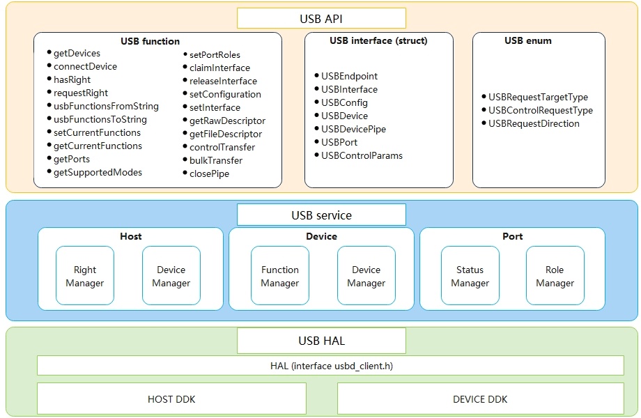

# USB服务概述

## 概述

USB设备分为Host设备（主机设备）和Device设备（从设备）。用户可通过Port Service来根据实际业务把运行OpenHarmony的设备切换为Host设备或者Device设备。目前在Host模式下，支持获取USB设备列表，USB设备权限管理，控制传输、批量传输的同异步数据传输等，在Device模式下，支持HDC（调试）、ACM（串口）、ECM（网口）等功能的切换。

  **图1** USB服务架构图
  

- USB API：基于USB Service服务，使用NAPI技术，向上提供JS接口。

- USB Service：使用C++代码实现，包含Host、Device、Port三个模块。基于HDI接口，主要实现USB设备列表管理、Function 管理、Port管理、USB设备权限管理等功能。

- USB HAL：使用C代码实现，基于Host DDK(Driver Develop Kit)和Device DDK，封装了对USB设备的基本操作，向上提供C++接口，同时通过HDF框架接收内核上报的信息。

## 接口说明

- Host部分

| 接口名称                                                     | 功能描述                                                     |
| ------------------------------------------------------------ | ------------------------------------------------------------ |
| int32_t OpenDevice(const UsbDevice &device, USBDevicePipe &pip); | 打开USB设备，建立连接                                        |
| bool HasRight(std::string deviceName);                       | 判断是否有权访问设备                                         |
| int32_t RequestRight(std::string deviceName);                | 请求给定软件包的临时权限以访问设备                           |
| int32_t GetDevices(std::vector &deviceList);                 | 获取USB设备列表                                              |
| int32_t ClaimInterface(USBDevicePipe &pip, const UsbInterface &interface, bool force); | 打开接口，并申明独占接口，必须在数据传输前执行               |
| int32_t ReleaseInterface(USBDevicePipe &pip, const UsbInterface &interface); | 关闭接口，释放接口的占用，在停止数据传输后执行               |
| int32_t BulkTransfer(USBDevicePipe &pip, const USBEndpoint &endpoint, std::vector &vdata, int32_t timeout); | 在给定端点上执行批量数据传输， 返回读取或发送的数据长度，通过端点方向确定读取或发送数据 |
| int32_t ControlTransfer(USBDevicePipe &pip, const UsbCtrlTransfer &ctrl, std::vector &vdata); | 对此设备执行端点零的控制事务，传输方向由请求类型决定         |
| int32_t SetConfiguration(USBDevicePipe &pip, const USBConfig &config); | 设置设备当前使用的配置，通过配置值进行指定                   |
| int32_t SetInterface(USBDevicePipe &pipe, const UsbInterface &interface); | 设置指定接口的备选设置，用于在具有相同ID但不同备用设置的两个接口之间进行选择 |
| int32_t GetRawDescriptors(std::vector &vdata);               | 获取原始的USB描述符                                          |
| int32_t GetFileDescriptor();                                 | 获取文件描述符                                               |
| bool Close(const USBDevicePipe &pip);                        | 关闭设备，释放与设备相关的所有系统资源                       |
| int32_t PipeRequestWait(USBDevicePipe &pip, int64_t timeout, UsbRequest &req); | 获取异步传输结果                                             |
| int32_t RequestInitialize(UsbRequest &request);              | 初始化异步数据传输request                                    |
| int32_t RequestFree(UsbRequest &request);                    | 释放异步数据传输request                                      |
| int32_t RequestAbort(UsbRequest &request);                   | 取消待处理的数据请求                                         |
| int32_t RequestQueue(UsbRequest &request);                   | 将指定的端点进行异步数据发送或者接收请求，数据传输方向由端点方向决定 |
| int32_t RegBulkCallback(USBDevicePipe &pip, const USBEndpoint &endpoint, const sptr<IRemoteObject> &cb); | 注册批量传输异步回调函数                                     |
| int32_t UnRegBulkCallback(USBDevicePipe &pip, const USBEndpoint &endpoint); | 注销批量传输异步回调函                                       |
| int32_t BulkRead(USBDevicePipe &pip, const USBEndpoint &endpoint, sptr<Ashmem> &ashmem); | 批量传输异步读数据                                           |
| int32_t BulkWrite(USBDevicePipe &pip, const USBEndpoint &endpoint, sptr<Ashmem> &ashmem); | 批量传输异步写                                               |
| int32_t BulkCancel(USBDevicePipe &pip, const USBEndpoint &endpoint); | 批量传输异步取消接口，用于取消当前接口的异步批量读写操作     |

- Device部分

| 接口名称                                           | 功能描述                                               |
| -------------------------------------------------- | ------------------------------------------------------ |
| int32_t GetCurrentFunctions(int32_t &funcs);       | 获取设备模式下的当前USB功能列表的数字组合掩码          |
| int32_t SetCurrentFunctions(int32_t funcs);        | 在设备模式下设置当前的USB功能列表                      |
| int32_t UsbFunctionsFromString(std::string funcs); | 将给定的功能列表描述字符串转换为功能列表的数字组合掩码 |
| std::string UsbFunctionsToString(int32_t funcs);   | 将给定的功能列表的数字组合掩码转换为功能列表描述字符串 |

- Port部分

| 接口名称                                                     | 功能描述                                                 |
| ------------------------------------------------------------ | -------------------------------------------------------- |
| int32_t GetSupportedModes(int32_t portId, int32_t &supportedModes); | 获取指定的端口支持的模式列表的组合掩码                   |
| int32_t SetPortRole(int32_t portId, int32_t powerRole, int32_t dataRole); | 设置指定的端口支持的角色模式，包含充电角色、数据传输角色 |
| int32_t GetPorts(std::vector &usbPorts);                     | 获取物理USB端口描述信息列表                              | 
